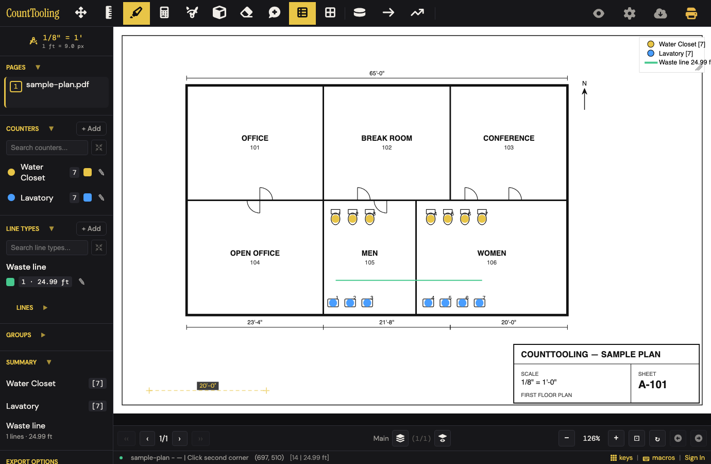
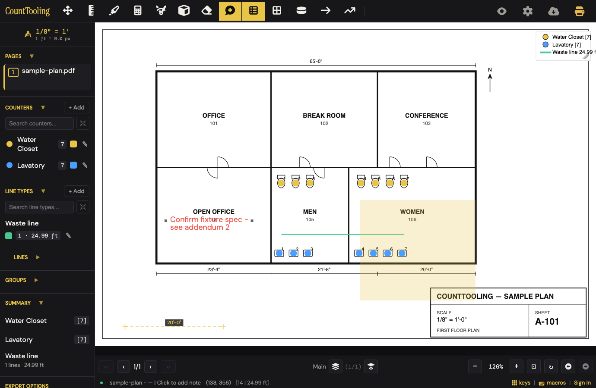
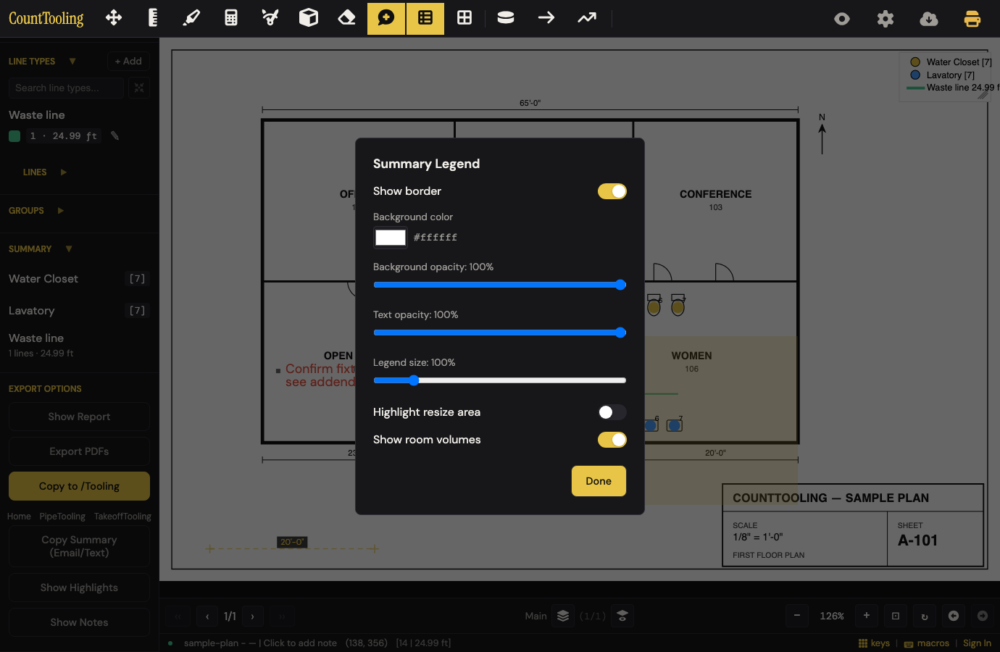
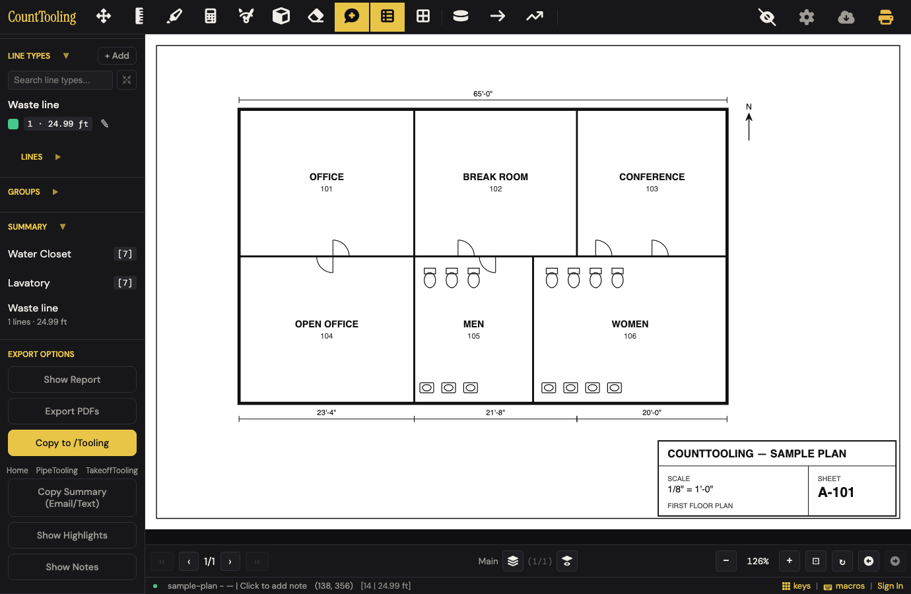
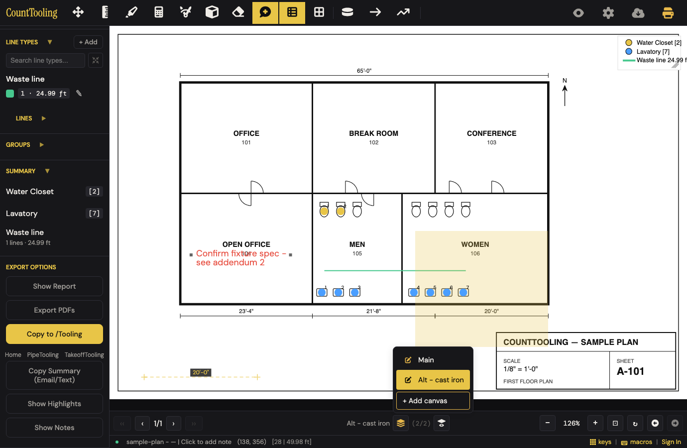
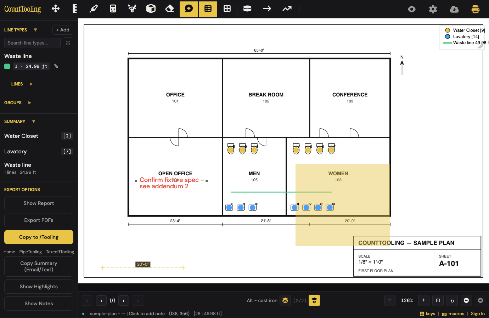
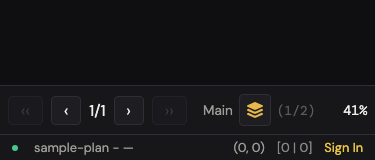

# J8 — Highlights, notes, legend, hide-marks, layers + peek

Personas: P T · Status: ● walked 2026-08-02, re-walked + re-verified 2026-08-09 (headless Chromium, 1380×900 + 375×812, samples/sample-plan.pdf, local static server on :4108 — no cloud)

> Seeded from the Phase-1 cross-index workflow (2026-08-02). Phase-2 walk done:
> route corrected below, friction/proposals/demo filled, screenshots in img/.
> 2026-08-09 re-walk: every friction claim re-tested against the live app. Two
> corrections (friction #1's mechanism, the empty-legend copy) and two new
> findings (#10 Escape vs Legend Settings, #11 "Show Highlights"/"Show Notes"
> are export buttons) folded in below; screenshots regenerated.

## Entry points

- **header** — #highlightBtn (title "Highlight") (click)
- **sidebar** — #highlightBtnSidebar (click)
- **hotkey** — H — Highlight mode (keypress)
- **header** — #noteBtn (title "Note") (click)
- **sidebar** — #noteBtnSidebar (click)
- **hotkey** — N — Note mode (keypress)
- **header** — placed note (edit) (double-click, or right-click > context menu Edit)
- **header** — #legendBtn (title "Summary legend (right-click for settings)") (click toggles overlay)
- **sidebar** — #legendBtnSidebar (click)
- **right-click** — #legendBtn > tool context menu item "Legend Settings…" (#toolContextMenu, features/tool-context-menu.js) (right-click)
- **sidebar** — #summarySectionTitle ("Summary" section heading) opens Legend Settings on click (legend-settings.js) — tooltip says "Click to collapse" (click)
- **header** — legend overlay on canvas — drag body to move, drag corner to resize (drag)
- **header** — #hideMarksBtn (eye, title "Hide marks", shown once a PDF is loaded; eye/eye-slash icon swap) (click)
- **burger** — burger-menu item "Show / Hide marks" (features/burger-menu.js mirrors #hideMarksBtn; #hideMarksBtn is .consolidated-mobile, hidden in mobile header) (tap)
- **status bar** — #canvasSwitcher: #canvasCurrentName, edit pen (opens #canvasDetailsModal via App.openCanvasDetailsModal), #canvasIndexDisplay, #canvasPills, #addCanvasBtn "+" (title "Add canvas") (click)
- **status bar** — #canvasLayersBtn (title "Canvases", .canvas-layers-mobile-only) opens #canvasMenu with #canvasMenuAdd "+ Add canvas" (click)
- **hotkey** — Up/Down arrows — "Switch canvas (when multiple canvases)" (bespoke row, hotkeys.js) (keypress)
- **status bar** — #showAllCanvasesBtn (title "Temporarily show all canvases at once — right-click to choose which"; desktop only, shown when page has 2+ canvases) (click toggles peek)
- **right-click** — #showAllCanvasesBtn > #canvasPeekMenu selective chooser (active layer pinned on; "All canvases" clears subset; partial class dots the button) (right-click)
- **modal** — #canvasDetailsModal ("Edit Layer": rename-on-close + Delete) > #deleteCanvasConfirmModal (click)

## Current route (walked 2026-08-02, re-verified 2026-08-09) — 21 steps, 2 decision points

1. Click the Highlight tool (header) or press H — works; header icon is findable ✓
2. Click one corner, then the opposite corner, to drop a translucent highlight rectangle — **two clicks only; a drag gesture stores nothing** (re-verified 2026-08-09: `highlights` stays empty after a drag) **but the release point silently becomes a pending first corner**, so the user's next click completes a large unintended rectangle from wherever they let go of the drag (see friction #1). Escape cancels a pending first corner ✓. Status bar coaches "Click first corner / Click second corner" in small footer text. 
3. Click the Note tool or press N ✓
4. Click the spot on the sheet where the question applies ✓
5. Type in the Add Note modal (textarea is pre-focused) and click Done — empty text is discarded, Escape backs out cleanly, tool stays armed for the next note ✓ 
6. Drag the note to reposition it — works from **any** tool (Move, Note, even Highlight active): the note grab wins over the tool ✓ (settles the annotating vs fixing-mistakes doc conflict — Move mode is NOT required)
7. Drag the note's handles: right edge = width (ew-resize cursor), left edge = text size (ns-resize; drag down shrinks, floor 8). Handles are invisible — cursor change is the only affordance
8. Double-click the note → "Edit Note" modal with the text; right-click → Edit / Delete ✓
9. Drag the legend overlay (anywhere on its body) to a clear spot ✓ — works from any tool (re-verified: dragged it with the Note tool armed; the grab wins, no note is placed) — **unless it overlaps a highlight, then the legend is completely inert** (friction #2, re-confirmed 2026-08-09)
10. Drag the legend's bottom-right corner (16-pt grip) to resize — works, sets `userResized`; "Highlight resize area" in Legend Settings makes the grip visible
11. Right-click the Legend button → "Legend Settings" ✓ (second entrance: clicking the sidebar "Summary" heading — whose tooltip says "Click to collapse")
12. Adjust border / background color+opacity / text opacity / legend size (live sliders), Done ✓ — **but Escape does not close this modal** (friction #10): the only exits are Done and the ✕, and an unnoticed still-open modal silently eats the next canvas interaction 
13. Click the header eye (Hide marks) — whole takeoff peels off to the bare drawing ✓ — but invisible marks still catch the mouse (friction #3) 
14. Click the eye again to bring everything back ✓ (title swaps Hide marks/Show marks, icon swaps)
15. ~~In the footer canvas switcher, click "+"~~ — **the "+" button and canvas pills are `display:none` at every width.** The real path on desktop AND mobile: click the stack icon (#canvasLayersBtn, title "Canvases") → menu → "+ Add canvas" 
16. In the Add Canvas modal choose "New empty layer" or "Duplicate current layer" (decision), type a name (placeholder "Layer N+1"), Create — duplicate deep-copies every mark/highlight/note and auto-switches you onto the new layer ✓
17. Press Up/Down arrows to switch the active layer ✓ (correctly swallowed while a modal is open)
18. Rename via the edit pen **on the layer's row inside the layers menu** (not "in the canvas switcher") → "Edit Layer" modal, renames on Close; Delete lives here too, confirm says "This cannot be undone" — **but Ctrl+Z restores the deleted layer with all its marks** (friction #5)
19. Click the show-all peek eye (appears left of zoom once the page has 2+ layers; desktop only) to draw every layer at once ✓ — on-sheet legend counts the merge, sidebar tally stays on the active layer (friction #4) 
20. Right-click the peek eye → checklist chooser: "All canvases" / per-layer checkboxes, active layer pinned "current" ✓
21. Click the peek eye again to return to the active layer only ✓ (auto-clears if layers drop to one)

## Evidence

- **Telemetry visibility:** None of the 7 events fire for any core action in this journey — placing highlights/notes, legend drag/resize/settings, hide-marks toggling, layer add/duplicate/rename/delete/switch, and peek are all telemetry-blind. project_save fires indirectly when autosave persists the edits; session_start and project_open fire before the journey starts. export_canvas fires only on the adjacent canvas-JSON export path (mentioned in canvas-layers.md but outside this journey's scope). line_added, counter_marker_added, and export_pdf do not fire on this route.
- **Guide coverage:** [annotating-and-reviewing.md](/guides/annotating-and-reviewing/) — Primary for annotations: Highlight (H) two-click rectangle; Note (N) place/type, move by drag, resize width+text via handles, edit by double-click or right-click menu; legend drag/resize + Legend Settings (right-click legend button) for bg opacity/color, border, text opacity, scale; hide-marks eye incl. per-page persistence and view-link memory; grid aside; [canvas-layers.md](/guides/canvas-layers/) — Primary for layers: Add Canvas (empty vs duplicate), switch with Up/Down or layers menu, per-page active-layer memory, rename via edit pen, delete-with-confirm, show-all peek + right-click selective chooser (dot indicator, temporary, clears at 1 layer), viewer browsing, export/import canvas JSON; [organizing-a-busy-sheet.md](/guides/organizing-a-busy-sheet/) — Legend section: drag/resize/style in Legend Settings; prints and exports with the sheet; [reports-and-exports.md](/guides/reports-and-exports/) — Legend as on-canvas report; bundle highlights/notes toggles in Export PDFs; hide-marks for handing over a clean plan; [fixing-mistakes.md](/guides/fixing-mistakes/) — Right-click context menu on highlights/notes (Delete; Notes: edit text); Move mode drags notes and the legend; Delete Area counts highlights/notes before deleting; right-click tool buttons incl. Legend for settings menu; [working-faster-with-the-keyboard.md](/guides/working-faster-with-the-keyboard/) — H and N in the hotkey table; right-click tool menus mention Legend and Grid; [how-to-do-a-pdf-takeoff.md](/guides/how-to-do-a-pdf-takeoff/) — Highlights/notes as a takeoff step; live legend; export bundles highlights/notes; [sharing-and-view-links.md](/guides/sharing-and-view-links/) — Viewers get the live legend, canvas layers to browse, and the hide-marks eye remembered per link; [takeoff-on-a-tablet.md](/guides/takeoff-on-a-tablet/) — View-link recipients on touch get layers and Hide marks
- **Specs:** note.spec.js, legend-settings.spec.js, hide-marks.spec.js, canvas-layers.spec.js, show-all-canvases.spec.js, tool-context-menu.spec.js, hotkeys.spec.js, view-only.spec.js, render-pixels.spec.js, mobile-burger-menu.spec.js, export-pdfs.spec.js (bundle highlights/notes toggles), pdf-bundle.spec.js
- **Modals:** `noteModal`, `legendSettingsModal`, `addCanvasModal`, `canvasDetailsModal`, `deleteCanvasConfirmModal`
- **Hotkeys:** H — Highlight mode, N — Note mode, Up/Down arrows — switch canvas (when multiple canvases; bespoke handler), Esc — close modal / cancel, Enter — exit edit mode, Ctrl+Z / Ctrl+Shift+Z — undo/redo (covers layer operations)
- **Features touched:** Highlights, Notes (movable, resizable), Legend overlay, Hide marks (eye toggle), Canvas layers (multiple canvases per page), Show-all-canvases peek

## Guide gaps (doc-derived)

- Legend Settings modal has "Highlight resize area" (#legendShowResizeHighlight) and "Show room volumes" (#legendShowRooms) toggles no guide describes (guides list only opacity/color/border/text/scale)
- Second entry to Legend Settings — clicking the sidebar "Summary" section heading — is undocumented (its tooltip even says "Click to collapse")
- Note color: #noteModalColorSwatch ("Note color") lets you pick a color, but guides only say notes "render in red"
- That clicking the Legend button toggles the overlay off/on is never stated explicitly in any guide
- Peek button is desktop-only (per ARCHITECTURE.md) — canvas-layers.md gives the 2+ layers condition but not desktop-only, and no mobile alternative is documented
- Mobile placement of hide-marks in the burger menu ("Show / Hide marks") is undocumented
- Footer canvas pills (#canvasPills) as a click-to-switch surface are never named in guides (only "the layers menu")
- Precondition that the hide-marks eye only appears once a PDF is loaded is undocumented
- Possible doc conflict: annotating-and-reviewing.md says move notes "by dragging" with no mode mentioned; fixing-mistakes.md says dragging notes/legend happens "in Move mode"

## Terminology on screen (recorded, not judged)

- "Summary legend (right-click for settings)" (legend button title) vs modal h2 "Summary Legend" vs sidebar section "Summary" vs guides' plain "legend"
- "Hide marks" (header eye title) vs burger item "Show / Hide marks"
- Canvas vs layer used interchangeably: footer button "Canvases", modal "Add Canvas", but its options say "New empty layer" / "Duplicate current layer", rename modal is "Edit Layer", delete copy says "This canvas and its annotations will be removed. This cannot be undone."
- Peek button title: "Temporarily show all canvases at once — right-click to choose which"; chooser item "All canvases"
- "Add Note" modal title with placeholder "Enter note text..." and swatch tooltip "Note color"
- Add Canvas name placeholder "Layer 2"
- "Click to collapse" tooltip on the Summary heading that actually opens Legend Settings
- "Highlight" is both a tool name and a Legend Settings toggle verb ("Highlight resize area")

## Open questions for the Phase-2 walk

- Is Move mode required to drag notes/legend, or does dragging work from any tool (annotating guide vs fixing-mistakes wording conflict)? -> **Any tool.** Dragged the note with the Note tool active and with the Highlight tool active — the note grab wins, no stray highlight/note is created. fixing-mistakes' "in Move mode" is over-strict.
- What exactly do the note resize handles look like, and can width and text size be resized on touch? -> They are **invisible hotspots** (~12 px hit radius): right edge of the text block = width (ew-resize cursor), left edge = font size (ns-resize; drag down shrinks, floor 8). Nothing is drawn — the cursor swap is the only affordance. Touch resize not exercised (walk-blocked: headless touch drag on handles not simulated).
- Where does the legend reappear after toggling off/on, and is its position per page, per canvas, or global? -> **Exactly where it was; per canvas.** `ann.legend` lives in each canvas's annotation set — Main and a second layer each kept independent positions/sizes. Toggling the Legend button only flips `showLegendOverlay` (global, in-memory).
- Does hide-marks persist across full reloads for signed-in editors, or only within a session? -> **Session-only for editors.** Only view-link sessions persist it (`localStorage 'view:hideMarks:' + token`, app.js toggleHideMarks). No editor persistence path exists.
- What does mobile show instead of the desktop-only peek button when a page has 2+ layers, and can mobile users compare layers at all? -> Mobile (375×812) shows only the stack icon + "(1/2)" — **no peek, no live compare.** Closest workaround is the burger's "Print All Canvases on Page". 
- Do Up/Down arrows do anything (or get swallowed) while a modal or text field has focus, and what happens on a 1-layer page? -> Swallowed while the Note modal is open (active layer unchanged) ✓. 1-layer page not explicitly pressed (nothing to switch to; no error observed in any 1-layer state).
- Does the peek subset dot indicator and selection survive page switches away and back before the page drops to one layer? -> **Walk-blocked:** sample-plan.pdf has one page. Code keeps `peekCanvasIdsByPage` per page and only prunes when layers < 2, so it should survive — unverified.
- Exact wording of the delete-layer confirmation's "tells you what it holds" contents summary -> There is **no contents summary.** Full text: "Delete Alt - cast iron? This canvas and its annotations will be removed. This cannot be undone. Cancel Delete" — and "cannot be undone" is false: Ctrl+Z restored the layer with all marks.
- Does the Highlight tool's right-click menu say "no settings", and is highlight color/opacity fixed? -> Right-clicking the Highlight tool button opens **no menu at all**; right-clicking a placed highlight offers only "Delete". Color/opacity are fixed (#e8c547 at 0.25).
- Empty-state behavior: legend contents on a project with zero marks; Add Canvas default name sequence after deletes -> Zero-mark project: legend overlay is ON by default and renders a small white 80×40 box top-right reading **"No items"** — and it keeps saying "No items" even after a highlight and note exist (annotations are not legend rows). Add Canvas placeholder is "Layer <count+1>" ("Layer 3" on a 2-layer page, including after a delete+undo cycle). Before any PDF is loaded, the annotation tools are still clickable (arming a tool with no sheet is a no-op); the hide-marks eye and the whole canvas switcher stay hidden until a PDF loads.
- Whether the legend can still be dragged while hide-marks is active -> **Yes — invisibly.** Hide-marks clears the paint but not the hit test: the unseen legend still drags, and an unseen note was dragged 12 pt without any visual feedback (friction #3).

New walk-blocked items:
- View-link leg (hide-marks memory per link, viewer layer browsing): needs a cloud session — not walked (NO CLOUD). No wall text encountered; the only cloud affordance on this route is the status-bar "Sign In".
- Multi-page behaviors: per-page active-layer memory, peek subset across page switches (single-page sample PDF).
- Fine-grained touch: note handle drags and legend corner resize on a real touchscreen.

## Naive attempt

(Re-run cold, 2026-08-09.) Hover titles made the Highlight pen and Note bubble findable in seconds. Wrong turn #1: **dragged** a highlight rectangle like in any PDF app — nothing appeared on release (nothing is stored either; the only hint is tiny footer text "Click second corner"); the two-click dance worked on the second attempt. Note: first try — click, type in the pre-focused box — though Enter just adds a newline (had to spot the Done button). Wrong turn #2: clicked the sidebar's "Show Highlights" expecting it to toggle my highlight's visibility — on screen, nothing changed (it actually opens an excerpt PDF in a new tab). Legend: the on-plan box said "No items" despite my highlight + note (it only tallies counts/lines); right-clicking the Legend *button* surfaced "Legend Settings…". Wrong turn #3: pressed Escape to leave that modal — it silently stayed open, so my next attempt to drag the legend died on the invisible overlay; after Done, the drag worked from any tool. Eye toggle: found and understood instantly. Layers: spotted the stack icon next to "Main (1/1)" in the footer → "+ Add canvas" → Create; highlighted on Layer 2, and the peek eye appeared on its own and worked first click. ~20 actions, 3 wrong turns, no dead ends.

## Friction findings

| # | severity | what happens | why it hurts | verdict |
|---|----------|--------------|--------------|---------|
| 1 | stumble | Dragging a highlight (mouse down–move–up, the gesture every other markup tool uses) shows nothing — and the **release point silently becomes the first corner**, so the user's recovery click completes a big rectangle from where they let go to wherever they clicked next (re-verified: drag → click left a 422×391-pt stray highlight, tool still saying "Click second corner") | First-time users conclude the tool is broken, then their next clicks paint wrong rectangles they have to notice and delete; only the small status-bar text explains ([img](img/annotate-and-review-01.png)) | CONFIRMED — re-driven independently on :4308: drag left `highlights` empty + `highlightStart` set at the release point; recovery click stored a 229×149-pt stray rect. Mechanism: the browser's `click` event fires at the mouseup point, feeding `handleCanvasClick` (app.js:4588) |
| 2 | stumble | A legend overlapping a highlight becomes **completely inert** — drag and corner-resize do nothing (hitTest gives highlights priority over the legend it visually sits under) | The legend gets "stuck"; the only escape is deleting the highlight or knowing to grab an un-overlapped sliver. Zero feedback | CONFIRMED — re-driven: legend under a highlight didn't move on drag; control drag after deleting the highlight moved it. One refinement: it's not *zero* feedback — with no tool armed the failed drag **pans the whole sheet** (pan 0,0 → 60,60 observed), which reads even more like "the legend is glued down". hitTest checks legend/legendDrag/legendResize *last* (app.js:1090), after highlights (:1046), so resize is equally shadowed |
| 3 | stumble | With hide-marks on, invisible notes/legend/marks **still catch the mouse**: dragging on the "bare" sheet silently moved an unseen note 12 pt | Reviewer skims the clean drawing, accidentally rearranges markup they can't see; the move persists after re-show | CONFIRMED — re-driven: with hideMarks on, a drag at the hidden note's position moved it (229,148)→(261,180) with nothing painted, and the move survived re-show. Mechanism: renderAnnotations returns early on hideMarks (app.js:1560) but the mousedown hitTest (app.js:5020) never consults it |
| 4 | papercut | During the peek, the on-sheet legend counts the merged layers ("Water Closet [9]") while the sidebar Summary and counter badges stay on the active layer ("[2]") | Two tallies disagree on one screen with no hint which one prices the job ([img](img/annotate-and-review-05.png)) | CONFIRMED — source-verified: during a peek renderAnnotations (and thus drawLegend) receives `getMergedAnnotationsForPage(...)` (app.js:1566, comment: "Purely visual") while the sidebar renderSummary stays on the active canvas; img 05 shows the two totals |
| 5 | papercut | Delete-layer confirm says "This cannot be undone." — but Ctrl+Z fully restores the layer with all its marks | False scare-copy makes a recoverable action feel dangerous; users keep dead layers around | CONFIRMED — re-driven through the real UI (Edit Layer → Delete → confirm): layer gone, then Ctrl+Z brought it back with its note intact. `performDeleteCanvas` calls `App.pushUndoSnapshot()` first (features/canvas-layers.js:116) |
| 6 | papercut | Sidebar "Summary" heading tooltip says "Click to collapse" but clicking it opens Legend Settings (only the ▼ icon collapses) | A lying tooltip on a row that does two different things depending on the pixel you hit | CONFIRMED — re-driven: `title="Click to collapse"` (app/index.html:344) and a click on the heading text opened `legendSettingsModal` (features/legend-settings.js:51 — only a click landing on `#summaryCollapseIcon` collapses) |
| 7 | papercut | Note resize handles are invisible; left-edge handle changes **font size** (drag down = smaller) — cursor change is the only affordance | Width/text-size resize is effectively a secret; accidental grabs shrink text with no obvious cause | CONFIRMED — source-verified: hitTest defines `noteFontSize` at local (−8,8) and `noteResize` at (w,8) (app.js:1075-1081); nothing draws them, and the single cursor-swap line (app.js:5152) is the only affordance |
| 8 | papercut | Brand-new sheet shows a small white "No items" box top-right (legend overlay defaults on with zero marks) — and it stays "No items" after highlights/notes are added, since only counts/lines/rooms are legend rows | A mystery rectangle on the plan before the user has done anything; annotators wonder why their marks "don't count" | CONFIRMED — source-verified: drawLegend builds rows from counters/lineTypes/rooms only and paints "No items" when all three are empty (canvas-draw.js:560-672); highlights/notes never enter `hasRows` |
| 9 | gap | Mobile has no peek and no other live way to see two layers together (desktop-only button) | Field users comparing base bid vs alternate must flip layers one at a time ([img](img/annotate-and-review-07.png)) | CONFIRMED — source-verified: `showAllBtn.style.display = (!isMobile && canvases.length > 1 ...)` (features/canvas-switcher.js:97); no mobile surface sets `state.showAllCanvases` |
| 10 | papercut | Escape does not close the Legend Settings modal (every other modal on this route closes; Done/✕ are the only exits) — verified: modal still `.visible` after Escape | The muscle-memory key fails silently; the still-open overlay then eats the next canvas click/drag, which reads as "the legend won't move" | CONFIRMED — re-driven with a control: Escape left `legendSettingsModal.visible` while the same key closed `addCanvasModal`. `legendSettingsModal` is simply absent from the ~40-modal Escape chain (app.js:5774-5860) |
| 11 | stumble | Sidebar buttons named **"Show Highlights" / "Show Notes"** don't show anything on the sheet — each silently builds an A4 excerpt PDF and opens it in a new tab (`bundleHighlights`/`bundleNotes`, jsPDF) | In a journey about showing/hiding marks, a button named "Show Highlights" reads as a visibility toggle; clicking it appears to do nothing (popup-blocked or unnoticed tab), so users re-click and hunt for the "broken" toggle ([img](img/annotate-and-review-08.png)) | CONFIRMED — re-driven with `window.open` stubbed: clicking "Show Highlights" (label verified) called `window.open(blob:…)` once and changed nothing on-canvas (`hideMarks` untouched). Handler at app.js:3527 builds a jsPDF A4 doc |

## Proposals

- **rework** — Let the Highlight tool complete on drag: mousedown–drag–mouseup beyond a few px drops the rectangle; keep the two-click path for precise corners. (1) Fewer steps: the first gesture a user tries just works, no status-bar reading. (2) No new words at all. (3) Removes the whole failure cascade — the phantom "first corner at the release point" and the wrong rectangle the recovery click paints. (4) It's what a plumber tries before reading anything. spiritPass: true [verified — failure cascade reproduced end-to-end; the two-click path must stay for touch (tap-tap is the existing mobile gesture, app.js:5443)]
- **polish** — Rename the sidebar export buttons "Show Highlights" / "Show Notes" to say what they make — e.g. "Highlight Pages (PDF)" / "Note Pages (PDF)". (1) Kills a wrong turn on the happy path of the *real* show/hide toggle. (2) "PDF" is how the trade already talks about deliverables; "Show" was the software-y part. (3) Removes a fake second visibility surface — the eye becomes the only "show/hide". (4) A button that names its output is self-explaining in the Export Options list where it lives. spiritPass: true [verified — the fallback alert text "Show Highlights requires jsPDF" (app.js:3530) should be renamed in the same pass]
- **polish** — Let Escape close the Legend Settings modal like every other modal on the route. (1) One less stuck state. (2) n/a — invisible fix. (3) Removes the "legend won't drag" mystery that an unnoticed open modal causes. (4) Muscle memory already expects it. spiritPass: true [verified — one else-if in the existing Escape chain (app.js:5774); reproduced both the failure and the contrast with addCanvasModal]
- **polish** — Legend wins the hit test over highlights (match hit order to draw order — the legend paints on top, so it should grab on top). (1) Removes a stuck state and a decision ("why won't it move?"). (2) n/a — invisible fix. (3) Removes an unexplainable dead zone. (4) Nothing to find; it just works. spiritPass: true [verified — move the legend block (app.js:1090) ahead of the highlight loop (:1046); reproduced. Note the failed drag currently pans the sheet, so the fix also kills an accidental-pan surprise]
- **polish** — While hide-marks is on, skip hidden marks in the hit test (the sheet is read-only-bare by definition). (1) Removes silent surprise edits. (2) n/a. (3) Removes an entire class of "who moved my note" mysteries. (4) Invisible fix. spiritPass: true [verified — reproduced the silent note move; an early `if (state.hideMarks) return null` in hitTest covers notes, legend, and context menus alike]
- **polish** — Delete-layer confirm: replace "This cannot be undone." with "Ctrl+Z brings it back." (it does — verified). (1) One less scary decision. (2) Plain words. (3) Removes a false warning. (4) Read in place. spiritPass: true [verified — restore reproduced through the real confirm flow; prefer "Undo brings it back": the footer Undo button (#undoBtn) is the path that also exists on touch, where Ctrl+Z means nothing]
- **polish** — Fix the Summary heading tooltip to say what the click does ("Legend settings — ▼ collapses"). (1) One less wrong turn. (2) "Legend" is already the trade word for the stamp box. (3) Removes a lying tooltip. (4) Hover is where they'll look. spiritPass: true [verified — lying title + settings-open-on-click reproduced]
- **polish** — Don't draw the legend until it has at least one row (zero-mark sheets currently show a white "No items" box). (1) Cleaner first-open. (2) n/a. (3) Removes a mystery rectangle. (4) Legend appears exactly when the first count exists — self-explaining. spiritPass: true [verified — one-line gate where drawLegend paints "No items" (canvas-draw.js:672); hitTest's legend block should honor the same gate or the invisible box still grabs the mouse]
- **hide** — Delete the dead `#canvasPills` / `#addCanvasBtn` DOM (both `display:none !important` at every viewport width) so specs/docs/muscle-memory stop pointing at ghost surfaces. (1) n/a runtime; fewer phantom entry points in docs. (2) n/a. (3) Removes two dead surfaces outright. (4) n/a. spiritPass: true [verified — display:none confirmed in both media branches (styles.css:215,228), but "dead" only visually: features/canvas-layers.js binds `#addCanvasBtn.onclick` and scripts/build-screenshots.js's add-canvas shot clicks it — retarget both in the same change or the screenshot build breaks]
- **gap** — Mobile layer compare: add a "Show all layers" row to the mobile layers menu (the same peek flag, one tap). (1) One tap for parity with desktop. (2) "Show all layers" — plain. (3) Removes the print-the-merge workaround. (4) It lives in the menu mobile users already open to switch layers. spiritPass: true [verified — desktop-only gating confirmed at features/canvas-switcher.js:97; the row only reuses the existing `state.showAllCanvases` flag, no new mode]
- **teach** — Peek vs sidebar tally disagreement: the design is coherent (tally = the layer you're editing; peek is explicitly "purely visual"), and syncing tallies to the peek would break the simple active-layer contract. One guide line: "During the peek the sidebar totals stay on your active layer — the on-sheet legend shows the merge." spiritPass: false (a software change here adds a mode; teaching is cheaper) [verified — the source comment at app.js:1563 says exactly this ("Purely visual — hit testing / editing / exports still target the active canvas only"); teach is the right verdict]
- **teach** — Note handles (right = width, left = text size): a single guide sentence + the existing cursor hints. Drawing always-on handles would clutter every note on a dense sheet. spiritPass: false (visible handles fail the simplicity budget on marked-up sheets) [verified — correctly downgraded to teach; always-on chrome on every note fails the budget]
- **keep** — The note flow: click, pre-focused textarea, Done; empty notes discarded; Escape backs out; tool stays armed for the next note. Nothing to remove. spiritPass: true [verified]
- **keep** — The hide-marks eye: one click to bare drawing, one back, icon/title swap, mirrored in the mobile burger as "Hide marks". spiritPass: true [verified — re-driven twice during F3 testing; toggle behaved exactly as described]
- **keep** — The peek + right-click chooser: appears only when it means something (2+ layers), one click in/out, chooser pins the working layer, auto-clears at one layer. Quietly excellent. spiritPass: true [verified — gating and auto-off logic confirmed at features/canvas-switcher.js:78-104]
- **keep** — Escape discipline across the journey: cancels a pending highlight corner, backs out of the note modal, closes the peek chooser without touching the app's global Escape. (One exception — Legend Settings, see the polish above.) spiritPass: true [verified — Escape cleared a pending highlight corner in the F1 cleanup and closed addCanvasModal in the F10 control]

## Guide actions

*(Phase 5)*

## Demo moment

Load the dense sheet and click the header eye: fourteen fixtures, the waste line, the note and the legend all peel off in one frame — bare drawing, sidebar tally still standing — click again and the whole takeoff snaps back. Then one click on the peek eye lays the cast-iron alternate over the base bid on the same sheet. Two eyes, three clicks, and you've answered "what's under my marks?" and "how do the two options compare?" — the two questions that eat an estimator's review time.

## Walk notes

**Not walked (and why):**
- View-link/viewer leg (per-link hide-marks memory, viewer layer browsing) — requires a cloud session; NO-CLOUD rule. No sign-in wall was hit on this route; the only cloud affordance encountered is the status-bar "Sign In" link. The localStorage mechanism (`view:hideMarks:<token>`) was verified in source only.
- Peek subset / active-layer memory across page switches — samples/sample-plan.pdf has a single page.
- Touch-precision drags (note width/font handles, legend corner grip) on mobile — tap-to-place-note and burger hide-marks were walked; pixel-level touch drags were not.
- Undo/redo depth across mixed layer operations (only delete-layer + Ctrl+Z was verified).
- Export/print outputs of highlights/notes/legend ("Print All Canvases on Page", Export PDFs bundle toggles) — adjacent journey (J-produce-deliverables).
- Contents of the "Show Highlights"/"Show Notes" excerpt PDFs — verified only that the button builds and opens a blob URL (window.open stubbed headlessly); the generated pages themselves belong to the deliverables journey.

**Duplicate-surface moments observed:**
- On-sheet legend vs sidebar Summary: same job (the tally), different scope — legend is per-page and peek-aware, sidebar is whole-project and active-layer-only; during a peek they display different numbers simultaneously (img 05).
- Two "eye" toggles doing opposite things: header eye hides everything, footer peek eye shows extra layers; both are eye/stack glyphs at opposite corners of the canvas.
- Three surfaces claim the "show" verb for marks: the header eye ("Hide marks"), the sidebar "Show Highlights"/"Show Notes" buttons (actually PDF exports — img 08), and the peek eye ("show all canvases") — only the first is a visibility toggle, and the naive walk tripped on exactly that.
- Legend Settings has two entrances (right-click Legend button; click sidebar "Summary" heading) — the second is mislabeled "Click to collapse".
- Layer switching has three surfaces: layers-menu rows, Up/Down arrows, and the footer canvas pills — the pills (and the footer "+" add button) are `display:none !important` at **all** widths; the Phase-1 entry-point list and the documented route step 15 pointed at dead DOM.
- "Legend size" slider (scales contents) vs corner-grip resize (sets box w/h) — two resize mechanisms with different semantics.
- Hide-marks lives as header eye (desktop) and burger row (mobile); the burger row's visible label is "Hide marks"/"Show marks" (dynamic), not the Phase-1 recorded "Show / Hide marks".

**Software-language terminology quoted on screen during the walk:**
- "Canvases" (footer button title), "Add Canvas" modal offering "New empty layer" / "Duplicate current layer", rename modal "Edit Layer", delete copy "This canvas and its annotations will be removed." — canvas/layer used interchangeably within one flow
- "Temporarily show all canvases at once — right-click to choose which" (peek title); active-state variants "Showing all canvases…" / "Showing N of M canvases…"
- "Summary Legend" (modal h2) vs "Summary" (sidebar) vs "Summary legend (right-click for settings)" (button title)
- "Highlight resize area" (Legend Settings toggle — "Highlight" as verb next to the Highlight tool)
- Placeholder "Layer 3"; index "(2/2)"; status hints "Click first corner", "Click second corner", "Click to add note"
- "Show Highlights" / "Show Notes" (sidebar Export Options) — "Show" here means "generate and open an A4 excerpt PDF in a new tab", not visibility; the fallback alert even says "Show Highlights requires jsPDF."

**Environment quirks:**
- Walked headlessly (Playwright Chromium) against a local static server on port 4108; marks seeded via `window.state`/`App` exactly like scripts/build-screenshots.js. All network traffic outside 127.0.0.1:4108 was blocked; the app runs fully offline on this route.
- The legend auto-fits its stored width on render (`w` 100 → 118 after first draw), so a freshly-toggled legend's stored geometry disagrees with the drawn box until the next render pass — cosmetic, but explains why automation aiming at stored coords can miss the corner grip.
- Re-walk verified in-state: drag-highlight stores nothing but leaves a pending corner at the release point; Ctrl+Z restored a deleted 2-mark layer intact; ArrowUp/Down flip `activeCanvasIdByPage` between Main and the alternate; the peek right-click chooser reads "✓ All canvases ✓ Main ✓ Alt - cast iron (current)"; `#canvasPills`/`#addCanvasBtn` compute `display:none` at 1380 px and 375 px alike.

**Screenshot index (regenerated 2026-08-09):**
- img/annotate-and-review-01.png — friction: after a drag-highlight attempt on the dense sheet, nothing visible; status bar says "Click second corner"
- img/annotate-and-review-02.png — note placed on the sheet (red), highlight over WOMEN, tool still armed
- img/annotate-and-review-03.png — Legend Settings ("Summary Legend") modal over the plan
- img/annotate-and-review-04.png — demo: hide-marks eye on — bare drawing, sidebar tally intact, slashed-eye icon in header
- img/annotate-and-review-05.png — friction/demo: peek on — on-sheet legend "Water Closet [9] / Lavatory [14]" vs sidebar "Water Closet [2] / Lavatory [7]"
- img/annotate-and-review-06.png — layers menu (Main / Alt - cast iron / + Add canvas) over the footer switcher
- img/annotate-and-review-07.png — mobile 375×812 footer: stack icon + "(1/2)", no peek eye
- img/annotate-and-review-08.png — friction: sidebar "Show Highlights" / "Show Notes" buttons that export PDFs rather than toggling visibility

## Verification (2026-08-09)

Adversarial re-check by a second agent, done to refute rather than confirm. Method: (a) traced every friction claim to its mechanism in source (app.js hitTest/click/Escape chain, canvas-draw.js drawLegend, features/canvas-layers.js, features/canvas-switcher.js, features/legend-settings.js, styles.css); (b) re-drove the real app headlessly — fresh Playwright Chromium, local static server on **:4308** (own port, all off-host traffic aborted, no cloud), samples/sample-plan.pdf loaded through `#pdfInput`, 1380×900 — using an independently written script, not the walker's.

**Reproduced live (7 findings):** #1 (drag → `highlights` stays empty, `highlightStart` = release point, recovery click stored a 229×149-pt stray rect), #2 (legend under a highlight refused to drag; control drag after removing the highlight moved it 47 pt), #3 (hidden note silently dragged 32 pt under hide-marks; move persisted after re-show), #5 (Edit Layer → Delete → confirm, then Ctrl+Z restored the layer + its note), #6 (heading click opened Legend Settings despite "Click to collapse"), #10 (Escape left Legend Settings `.visible`; control: same key closed Add Canvas), #11 ("Show Highlights" called `window.open(blob:…)` once, changed nothing on-canvas). **Source-confirmed (4 findings):** #4 (app.js:1566 merged-peek render vs active-layer sidebar), #7 (invisible hitTest handles, cursor-swap only at app.js:5152), #8 (drawLegend rows = counters/lines/rooms only), #9 (`!isMobile` peek gating). **Verdict: 11 CONFIRMED, 0 downgraded, 0 killed.**

Things the walker missed (all minor, folded into the annotations above):
- Friction #2 is slightly *worse* than written: the failed legend drag isn't feedback-free — with no tool armed it **pans the whole sheet** (observed pan 0,0 → 60,60), so the legend appears glued while the drawing slides.
- The delete-confirm copy proposal should say "Undo brings it back", not "Ctrl+Z…": the footer `#undoBtn` is the surface that also exists on touch.
- The "delete dead `#canvasPills`/`#addCanvasBtn` DOM" proposal is right that both are `display:none` at every width, but `#addCanvasBtn` is still programmatically live — features/canvas-layers.js binds its onclick and scripts/build-screenshots.js's add-canvas shot clicks it — so the deletion must retarget those or the screenshot build breaks.
- The empty-legend proposal needs its gate mirrored in hitTest's legend block, or the undrawn "No items" box keeps catching the mouse.
- Walker's stray-rect size (422×391 pt) is run-dependent (drag/click distance); mechanism, not magnitude, is the finding.

All 16 proposals kept their walker verdicts: 14 [verified], the two spiritPass:false teach entries [verified] as correctly downgraded. No proposal was rejected.
