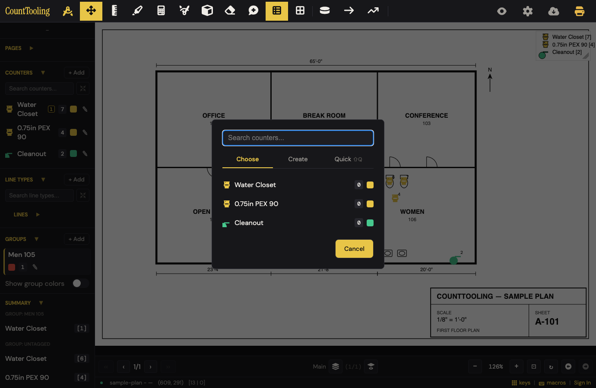
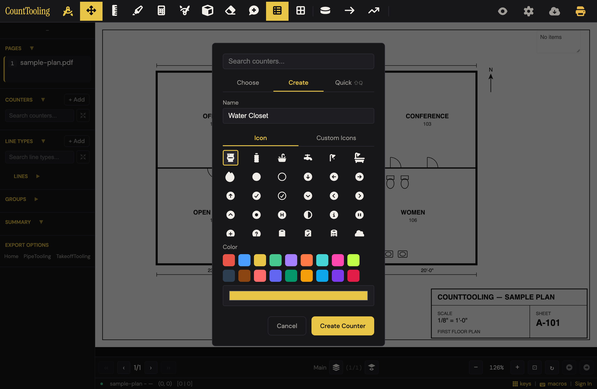
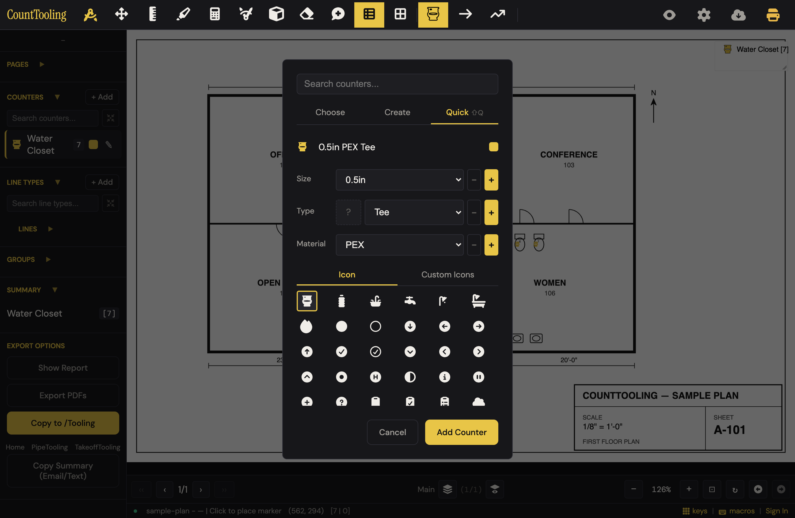
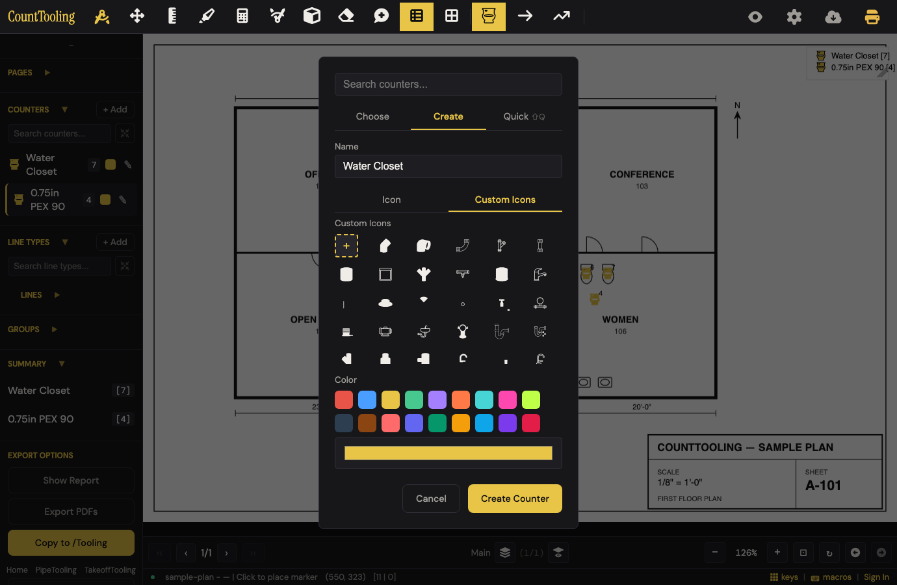
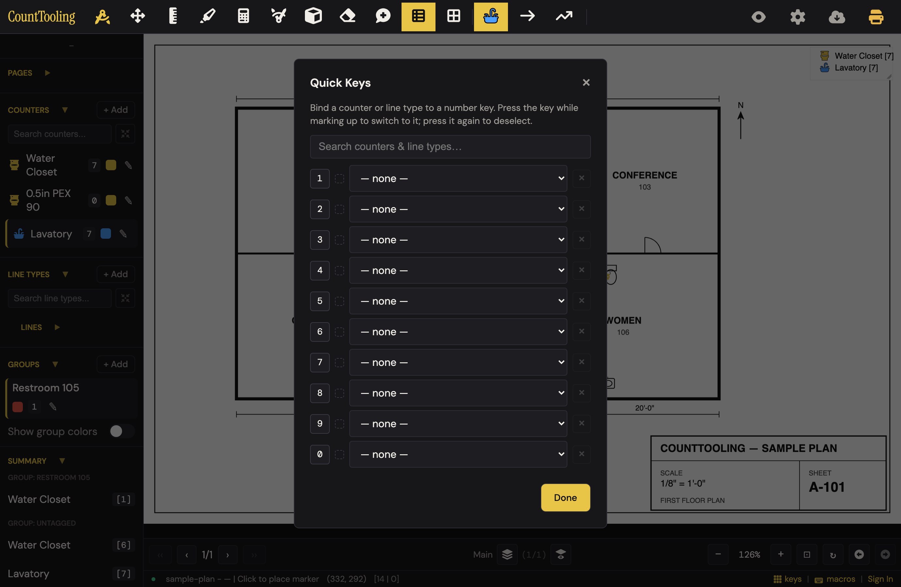
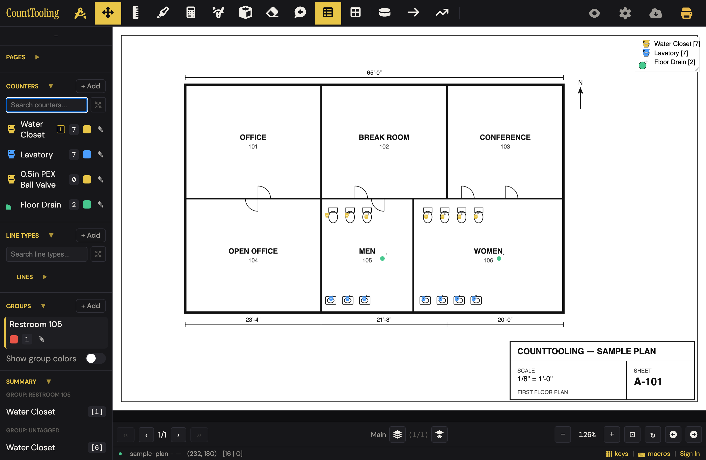
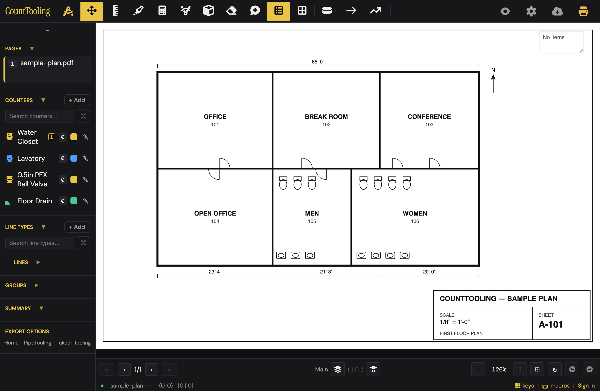
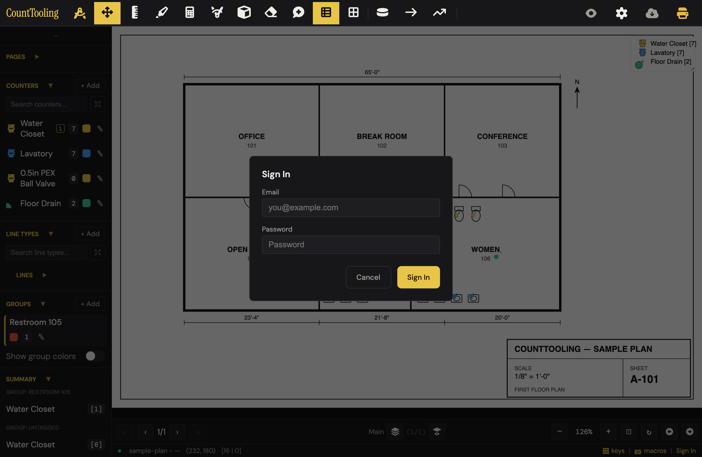
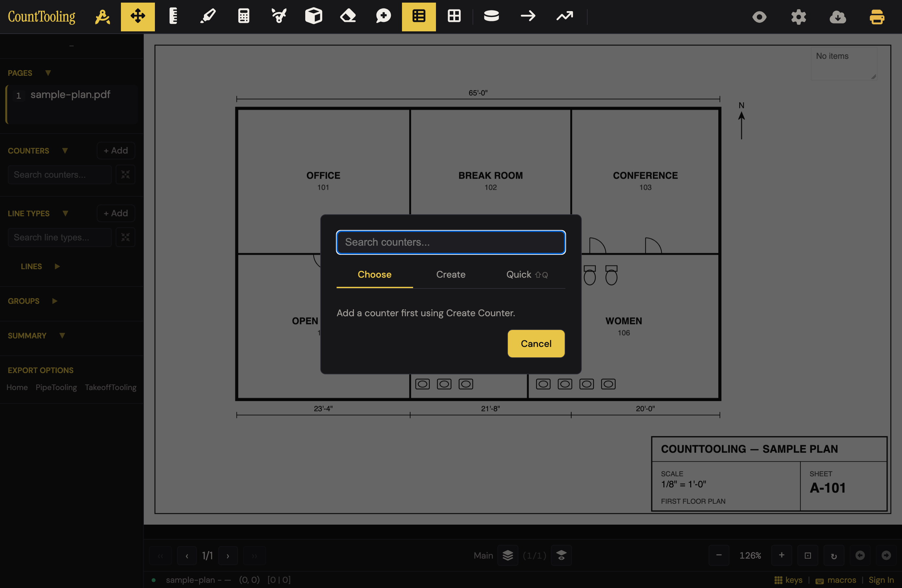

# J4 — Build the counter palette and count

Personas: P E · Status: ● walked (Phase 2, 2026-08-02 — desktop only; Mobile: no per plan) · re-walked 2026-08-09 (fresh naive attempt + every finding re-verified; 1 new bug, 2 new stumbles — see findings 11–13)

> Seeded from the Phase-1 cross-index workflow (2026-08-02). Phase-2 walk done
> 2026-08-02 against the real app (headless Chromium, local static server,
> samples/sample-plan.pdf, signed out — no cloud). Independent re-walk 2026-08-09
> under the same conditions confirmed every prior finding except one detail
> (Quick Keys search box — see step 9).

## Entry points

- **header** — #counterBtn — "Counter (right-click for settings)"; opens Counter modal / counter mode (click)
- **header** — #counterBtn tool context menu (Counter Settings + quick "Add…") (right-click)
- **hotkey** — C — Counter mode (HOTKEYS: btnId counterBtn) (keypress)
- **hotkey** — Shift+Q — "Quick tab (when Counter or Line Type modal open)" per HOTKEYS table (keypress)
- **sidebar** — #counterBtnSidebar — Counter tool button (mobile/sidebar tools row) (click)
- **sidebar** — #addCounter — "+ Add" in Counters section, opens Counter modal (click)
- **sidebar** — #plumBtn — button labeled "PLUM" (title "Quick add counter"), Quick Count creator (click) — **walked: unreachable; `.sidebar-plum-row` is `display:none` in styles.css and nothing ever shows it (its click handler in features/quick-modals.js is live but dead code)**
- **sidebar** — #countersSectionTitle — "Counters" heading (title "Counter settings") opens counterSettingsModal (click)
- **sidebar** — #counterSearchInput ("Search counters...") + #counterShowOnlyOnPageInlineBtn inline filter (type/click)
- **sidebar** — #addGroup — "+ Add" in Groups section, opens groupModal (click) — **walked: Groups section starts collapsed; +Add is hidden until you expand it**
- **sidebar** — counter row click → arms/disarms that counter (toggle); the row's ✎ pencil opens counterLineTypeDetailsModal (rename/recolor/icon)
- **right-click** — placed mark on canvas → "Assign to group" → groupAssignModal (right-click)
- **modal** — groupAssignModal #groupAssignAddGroup "+ Add group" → groupModal (modal-to-modal link) (click)
- **status bar** — #statusBarQuickKeys — "keys" link (title "Quick Keys — bind counters and line types to the number row"), desktop-only (click)
- **modal** — settingsModal #settingsQuickKeys "quick keys" link → quickKeysModal (click) — **walked: settings gear opens the Sign In modal when signed out, so this entry is signed-in only**
- **modal** — settingsAdvancedModal #advancedManageIcons "Manage Icons" button → manageIconsModal (click) — **walked: same sign-in gate**
- **modal** — icon grid "+ Upload" cell → #customIconUploadInput (accept .svg) file picker (click)
- **modal** — "Custom Icons" label (title "Click for tips") → customIconTipsModal — present in Create panel, Quick Count panel, and details modal (click)
- **hotkey** — number row 1–0 — activate the bound counter/line type; same key again deselects (keypress) — **walked: works exactly as billed**

## Current route (walked 2026-08-02; re-verified step-by-step 2026-08-09)

11 steps, 5 decision points (tab, icon, color, group, key slot). Verified per-entry-point defaults: C / #counterBtn land on **Choose**; sidebar "+ Add" and the right-click "Add counter…" land on **Create** with the name pre-filled from the selected icon. **Re-walk bug: the Choose tab's per-counter count badge always reads 0 — mid-count, with the sidebar showing 7/4/2, every Choose row says 0 (finding 11).** 

1. Load the plan (Open PDF / drag-drop). Pressing C before a PDF loads still opens the Counter modal — palette building works pre-PDF.
2. Sidebar Counters "+ Add" → Create tab. Name is pre-filled from the first icon ("Water Closet", toilet icon pre-selected); clicking any icon fills the name if the box is empty. **Re-walk caveat: the prefill is unconditional — reopening + Add after Water Closet exists prefills "Water Closet" again, and two bare clicks mint an identical twin counter (same name/icon/color, separate tallies; finding 13).** 
3. Pick a color from the swatch rows (or the custom color bar). Click "Create Counter" — created **and armed**; the modal closes and every click on the plan places a numbered mark.
4. Click each fixture; the tally climbs live in the sidebar badge and the on-sheet legend. Ctrl+Z retracts a misplaced mark (verified 8→7). Right-click a mark → Assign to group / Delete (only counter-relevant items show).
5. Quick Count route: open the modal, press Shift+Q (only works while the modal is open — see open questions) or click the "Quick ⇧Q" tab. Size/Type/Material pickers assemble the name ("0.75in PEX Ball Valve"). "Add Counter" = created + selected + modal closed, immediately counting. **Watch the icon**: the per-Type icon box starts as "?" and the new counter silently inherits the first library icon (the toilet) and the default yellow — its marks are indistinguishable from Water Closet marks. 
6. Custom icon route: Create tab → "Custom Icons" → "+" cell (title "Upload SVG") → file picker (.svg only). A rejected file (no path/rect/circle/ellipse/line) gets a native alert: "SVG must contain at least one path, rect, circle, ellipse, or line." (re-verified verbatim, nothing added). A good file uploads, lands in the grid, and is auto-selected — **but it's appended at the bottom of a scrolling grid and nothing scrolls to it: on a 47-cell grid the modal looks completely unchanged after a successful upload (finding 12).** 
7. Groups: expand the collapsed Groups section → "+ Add" → name → Done (the new group becomes active). Right-click a mark → "Assign to group" → tap the group chip → Done. The Summary section now splits subtotals: "Group: Restroom 105 / Water Closet [1]".
8. Click the "Counters" heading → Counter Settings (icon size, opacity, outline, number size, ring controls, "Reorder Artboard" link, "Show only counters on current page"). Same toggle also lives on the inline sidebar filter button.
9. Status-bar "keys" → Quick Keys. Bind counters/line types to 1–0 via per-row dropdowns. **Correction (re-walk): the "Search counters & line types…" box shows even on a 3-counter palette — it is always there, not just "on bigger palettes".** Done. 
10. Press 1 → armed with the bound counter (sidebar row shows a digit badge); press 1 again → deselected. Keep counting.
11. Demo state: three fixture types counted, one grouped subtotal, one Quick Key bound. 

## Naive attempt

Two independent naive attempts (2026-08-02 and 2026-08-09) landed the same way. 2026-08-09 run: loaded the plan, saw "+ Add" beside COUNTERS, clicked it — Create tab opened with "Water Closet" pre-typed and the toilet icon pre-selected; clicked Create Counter and had all 7 WCs counted in 10 actions total from boot. Quick tab was self-explanatory in trade terms (0.5in / Tee / PEX), but the "0.75in PEX 90" it produced dropped yellow toilet glyphs indistinguishable from the WC marks. Custom icon upload was the one real stall: after picking the .svg the modal looked untouched (the new icon lands selected but below the grid's fold) — only a DOM check proved it had worked. Groups cost one beat (collapsed section), then right-click → "Assign to group" was guessed first try; a misplaced mark (stale armed counter — clicked expecting WC, placed a Cleanout) was fixed with Ctrl+Z; "keys" in the status bar + its tooltip carried the Quick Key bind. Goal completed with zero documentation.

## Friction findings

| # | severity | what happens | why it hurts | verdict |
|---|----------|--------------|--------------|---------|
| 1 | blocker (signed-out) | Refresh = the day's count is gone. The engine writes a complete local backup (marks + PDF blob, verified in IndexedDB within ~5 s of a click), and on boot the palette/groups/bindings/custom icons come back — but the "restore last session" prompt is only wired inside the signed-in branch (app.js boot: `if (SUPABASE_ENABLED && … supabaseSession?.user)`), so an anonymous user re-opens the same PDF to zero marks with no offer.  | An estimator counting all day loses hours to an accidental F5; the cruelty is the data is sitting right there in the browser. | CONFIRMED (re-driven 2026-08-09, port 4304, supabase lib loaded + signed out: backup held 4 marks + 37 KB PDF blob; after F5 no prompt, palette restored, pages 0; same PDF re-opened → 0 marks, still no prompt. Mechanism: `applyTakeoffBackupToState` runs for everyone but `backup.pageCanvases` writes into `state.pages[i]` which are empty at boot, and nothing re-applies them on PDF re-open; the only prompt call sites sit inside the `supabaseSession?.user` branch at app.js ~6470) |
| 2 | stumble | Quick Count counters inherit the first library icon (toilet) + default yellow unless you spot the "?" type-icon box. "0.5in PEX Ball Valve" marks render identical to "Water Closet" marks (visible in img/count-fixtures-03.png: same yellow toilet in both sidebar rows). | Two different materials look like one on the sheet; the error surfaces at pricing time, not counting time. | CONFIRMED (re-driven: "?" icon box, and the "0.5in PEX Tee" counter came out with icon AND color strictly equal to Water Closet's) |
| 3 | stumble | Escape closes the Counter modal, Quick Keys, and the Sign In modal but NOT the ✎ details dialog, Add Group, Assign to group, Counter Settings, the delete-confirm ("Delete Cleanout?"), or icon tips (absent from app.js's Escape chain; backdrop clicks don't close them either — only their Cancel/Close/Done buttons). Re-verified 2026-08-09 on all five. | Esc is muscle memory mid-count; a dialog that ignores it feels frozen and costs a beat every single time. | DOWNGRADED to papercut (behavior reproduced — Esc left counterSettingsModal, groupModal, and the details dialog visible, and the app.js Escape chain confirms all five absences — but the per-event cost is one mouse click to a Cancel button that is right there, the same magnitude this dossier rates papercut in findings 6/7; no work is lost or mis-done) |
| 4 | stumble | The Create tab's icon search is permanently hidden (`#counterIconSearchGroup` ships `style="display:none"` and nothing toggles it; its input handler is live). Users scroll a ~250-cell grid; custom-icons.md promises "use the search box to filter by name". | Finding "floor drain" in a wall of glyphs is exactly when you want the search the guide says exists. | CONFIRMED (source: index.html:587 ships the inline `display:none`; zero references to `counterIconSearchGroup` in any JS; the `#counterIconSearch` input handler at features/counter.js:145 is live and unreachable) |
| 5 | stumble | Project Settings gear → Sign In wall when signed out ("Sign In / Email / Password / Cancel / Sign In"), which also gates the only documented path to Manage Icons and the settings "quick keys" link.  | Renaming/cleaning up icons looks like a account-only feature even though icons themselves work locally. | CONFIRMED (source: app.js:3820 — `settingsGearBtn.onclick` routes to `authBtn.click()` whenever `state.supabaseSession?.user` is falsy; note the wall itself is intended auth design — the genuine friction is that a locally-functional feature has no documented signed-out path, which is why the matching proposal is teach, not rework) |
| 6 | papercut | Pressing C on a fresh project lands on the empty Choose tab: "Add a counter first using Create Counter." One more read + click before the first counter.  | The app knows there are zero counters and could land on Create. | CONFIRMED (source: `#counterBtn` opener always calls `showCounterTab('choose')` and clears the name; empty text at features/counter.js:59) |
| 7 | papercut | "Create Counter" with an empty name silently creates a counter literally named "Counter" (the Choose→Create tab path doesn't prefill; only + Add does). | "Counter 3" in a legend means a re-open-and-rename later. | CONFIRMED (source: features/counter.js:164 — `value.trim() \|\| 'Counter'`; the Choose-path opener sets `counterName.value = ''`) |
| 8 | papercut | The modal-level "Search counters..." box stays visible on the Create and Quick tabs where it filters nothing (it only feeds the Choose list). | A visible search box that does nothing erodes trust in the one that does. | CONFIRMED (source: input sits above the tab strip at index.html:569–571, outside every tab panel; its handler only calls `populateCounterChooseList`) |
| 9 | papercut | Quick tab "−" buttons delete a size/type/material from the shared modifier list instantly — no confirm, no undo (guardrail: the last entry can't be removed). "−" beside a dropdown reads like a stepper. | One stray click quietly shreds a list that rides your profile across bids. | CONFIRMED (source: `removePlumbingModifier` in features/quick-modals.js:19 — immediate `splice` + save, no confirm, no undo hook; guardrail `arr.length <= 1` exactly as described) |
| 10 | papercut | Dead UI in the DOM: the "PLUM" quick-add buttons exist with live handlers but are permanently hidden; docs/dossiers list them as an entry point. | Ghost surface confuses documentation, tests, and anyone reading the sidebar HTML. | CONFIRMED (source: styles.css:266 `.sidebar-plum-row { display: none; }`, never toggled; live handler at features/quick-modals.js:14) |
| 11 | stumble (NEW 2026-08-09) | The Choose tab's per-counter count badge always reads 0. Bug: `populateCounterChooseList` (features/counter.js:64) sums `p.annotations.counterMarkers`, but since the canvas-layers refactor marks live in `p.canvases[].annotations` — `p.annotations` no longer exists (verified: sidebar 7/4/2, Choose rows 0/0/0, img/count-fixtures-10.png). | Mid-day the picker says you've counted nothing; an estimator who trusts it re-counts a sheet, one who doesn't stops trusting every number in the app. | CONFIRMED (re-driven: with 3 real marks, Choose badges read 0/0 while sidebar read 3/0 and a canvases-aware recount returned [3,0]; annotation-model.js deletes `page.annotations` in every migration path, so the reduce at counter.js:64 is structurally always 0) |
| 12 | stumble (NEW 2026-08-09) | A successful custom-SVG upload appends the icon at the bottom of the ~200px-tall Custom Icons grid, auto-selected but off-screen — no scroll-into-view, no toast. On a 47-cell grid the modal is pixel-identical before/after (img/count-fixtures-11.png vs post-scroll). | "Did that work?" → re-upload, or give up on custom icons; the only feedback is a selection ring you can't see. | CONFIRMED (re-driven on a fresh profile: grid clientHeight 200 / scrollHeight 344, cells 46→47, new selected cell sits 308 px below the grid top with scrollTop still 0 — selected-but-invisible; upload handler in features/custom-icon-upload.js has no scrollIntoView and no toast. The 47-cell grid is the FRESH state: 45 bundled icons + upload cell + the new upload) |
| 13 | stumble (NEW 2026-08-09) | "+ Add" prefills "Water Closet" unconditionally — even when Water Closet already exists. Two bare clicks (+ Add → Create Counter) mint a second counter with identical name, icon, and color; the summary then shows two "Water Closet" rows silently splitting the tally. | A twin counter made by accident divides one fixture count across two rows — the shortage only surfaces at pricing time. | CONFIRMED (re-driven: both + Add opens prefilled "Water Closet"; state.counters ended with two entries strictly identical in name, icon path, and color `#e8c547`; prefill at features/counter.js:113 is unconditional `getIconName(icons[0].value)`) |

## Proposals

- **rework** — Offer the last-session restore prompt to signed-out users (the local IndexedDB backup already holds marks + PDF; the prompt component already exists — the gate is one signed-in-only branch). (1) Fewer steps: removes an entire re-count. (2) Trade language: "Pick up where you left off — sample-plan, 16 marks?" (3) Removes: silent data loss and the fear of refreshing. (4) Findable: it appears on its own. **spiritPass: true** [verified — reproduced the loss end-to-end; the signed-in branch already builds the prompt from the very same 'local' IndexedDB record (`openLastSessionRestorePrompt({ proj, cachedBlob })`), and `takeoffBackupGet('local', null)` reads it fine anonymously, so the claim "the gate is one branch" is literally true]
- **polish** — Quick Count should never mint a twin: auto-pick a per-Type default icon (valve glyph for Ball Valve, elbow for 90) or at minimum rotate the color when the icon would duplicate an existing counter's icon+color. (1) Fewer steps: kills the manual "?"-box binding for the common case. (2) Trade language: the fitting just looks like a fitting. (3) Removes: identical-marks confusion and a settings detour. (4) Findable: automatic. **spiritPass: true** [verified — reproduced the duplicate icon+color; caveat: the Type list is user-editable, so a per-Type icon map only covers stock types — the color-rotate fallback is the part that must carry custom types]
- **polish** — Add the group/details/settings dialogs to the Escape chain (and backdrop-close), matching the Counter modal. (1) Fewer steps: yes, Esc replaces mouse travel. (2) No new words on screen. (3) Removes: an inconsistency users feel as "stuck". (4) Findable: Esc is already in everyone's hands. **spiritPass: true** [verified — repro'd the gap on three of the five dialogs; the fix is additive `else if` rows in an existing chain. Finding downgraded to papercut, but the proposal stands on consistency grounds]
- **polish** — Un-hide the icon search above the Create-tab grid (handler already wired; it's one display toggle) — and make the guide truthful for free. (1) Fewer steps: type "drain" beats scrolling 250 cells. (2) Trade language: search by fixture name. (3) Removes: grid-scrolling; also deletes a guide gap. (4) Findable: a search box atop a grid is self-evident. **spiritPass: true** [verified — the group id appears in zero JS files, the input handler at counter.js:145 is live; genuinely one attribute removal]
- **polish** — When the project has zero counters, land C/#counterBtn on the Create tab (pre-filled, like + Add) instead of the empty Choose tab; also prefill the name from the selected icon on the tab-switch path so a blank-name "Counter" can't happen. (1) Fewer steps: removes a read+click at the very first use. (2) Trade language: you start at "e.g. Water Closet". (3) Removes: an empty-state dead end and the anonymous "Counter" rows. (4) Findable: automatic. **spiritPass: true** [verified — both behaviors confirmed at source (choose-always + `|| 'Counter'` fallback); zero-counters branch is one condition in the opener]
- **hide** — Delete the dead PLUM rows (or actually ship them); hide the modal-level "Search counters..." box on tabs it doesn't filter. (1) Fewer decisions: fewer inert controls to wonder about. (2) Removes the one all-caps software word ("PLUM") from the sidebar DOM. (3) Simplicity budget: net-negative surface. (4) N/A — removal. **spiritPass: true** [verified — pure removal; both dead surfaces confirmed in source]
- **rework** — Fix the Choose-tab count badge (finding 11): sum marks across `p.canvases[].annotations` (the annotation-model helper already exists) instead of the dead `p.annotations` path. (1) Fewer steps: removes the "wait, zero?" re-check and the re-count it invites. (2) Trade language: the number is just the count again. (3) Removes: a lying number — the worst kind of surface. (4) Findable: automatic; the badge is already where users look. **spiritPass: true** [verified — reproduced the 0-vs-3 mismatch; a canvases-aware reduce over the same state returns the correct counts, so the fix is exactly the one-line resum described]
- **polish** — After a custom-icon upload, scroll the grid to the new icon and flash its selection ring (finding 12). (1) Fewer steps: kills the scroll-hunt/re-upload. (2) Trade language: none needed — it's pure feedback. (3) Removes: the "did that work?" dead moment. (4) Findable: automatic. **spiritPass: true** [verified — reproduced the invisible-selection state (selected cell 308 px below a 200 px viewport, scrollTop 0); `scrollIntoView` on the cell the handler already selects]
- **polish** — Stop the twin-counter trap (finding 13): when the prefilled name already exists in the palette, prefill the next unused library icon's name instead (the prefill logic already walks the icon list); as a fallback, creating an exact name-twin gets a numbered suffix and a rotated color. No dialog. (1) Fewer steps: no rename-and-merge cleanup later. (2) Trade language: you get "Lavatory" instead of a second "Water Closet". (3) Removes: silently split tallies. (4) Findable: automatic. **spiritPass: true** [verified — reproduced the identical twin in 4 clicks; deliberate same-name counters stay possible via the suffix, so no legit workflow is blocked]
- **keep** — Counter delete is guarded exactly right (verified 2026-08-09): deleting an unused counter is instant, deleting one with marks asks "Delete Cleanout? This will remove 2 markers from the project. Continue?" — count-aware, trade-plain, and no friction on the safe case. **spiritPass: true** [verified]
- **keep** — The core loop is the product's best 10 seconds and should not be touched: + Add pre-fills "Water Closet" with the toilet icon selected, Create arms you instantly, clicks tally live in sidebar + legend, right-click on a mark shows only Assign/Delete, Ctrl+Z retracts, and Quick Keys' press-again-deselect with sidebar digit badges works exactly as documented. **spiritPass: true** [verified — re-drove the prefill → create-armed → click-tally loop myself; it is as good as billed]
- **teach** — Manage Icons behind the sign-in gear, "Quick" tab = the guides' "Quick Count", and Shift+Q's real scope (modal-open only) are documentation fixes, not UI changes for a production tool: spell out Settings → Advanced → Manage Icons requires sign-in, and correct quick-creators.md's "while the Counter tool is active". **spiritPass: true** (teach — no UI change proposed) [verified — correct altitude: the gear wall is intended auth design (app.js:3820), so teach beats rework here]
- **teach** — The "−" modifier buttons: a one-line confirm ("Remove 1.5in from your sizes?") was considered, but the guardrail + profile persistence make this a guide note ("the − button edits your saved list") rather than another dialog on the happy path. **spiritPass: true** (teach; a confirm dialog would fail test 1) [verified — the walker correctly rejected its own dialog idea on spirit-test 1; guardrail confirmed at quick-modals.js:19]

## Demo moment

Press 1 — the toilet counter arms with a digit badge glowing in the sidebar. Click-click-click across the MEN and WOMEN rooms: seven numbered toilet glyphs drop onto the plan while the sidebar badge and the on-sheet legend tick 1…7 in real time, and the Summary splits "Group: Men 105 / Water Closet [1]" the moment a mark joins a group. Press 2, count the lavs in blue. Ten seconds, no menus, and the sheet already looks like a deliverable (img/count-fixtures-03.png; re-walk state img/count-fixtures-08.png — key badge, live legend, grouped subtotal all in one frame). Re-walk data point: a first-time user goes from empty app to 7 counted fixtures in 10 total actions including the PDF load.

## Evidence

- **Telemetry visibility:** Only counter_marker_added fires on this route (app.js:2768, one event per placed mark, with counterTypeId + pageIndex), plus project_save when the save engine persists the work. session_start and project_open precede the journey's given starting state. line_added, export_canvas, and export_pdf do not fire. Everything palette-side is blind: creating counters (Create or Quick Count), icon uploads, Manage Icons actions, group create/assign, Counter Settings changes, show-only toggles, sidebar search, and Quick Keys bindings emit no events.
- **Guide coverage:** [counting-with-counters.md](/guides/counting-with-counters/) — Core loop: make a counter type (name, color, built-in or uploaded icon), click to count, cross-sheet rollup; pointers to groups, show-only, counter settings, undo/move fixes, rename-from-details; [custom-icons.md](/guides/custom-icons/) — Built-in trade library + icon search, SVG upload requirements (path/rect/circle/ellipse/line, viewBox recommended, shapes merged), Custom Icons section, tips dialog, Manage Icons (rename, reorder, edit-mode delete of uploads), per-browser storage + Artboard sync; [quick-creators.md](/guides/quick-creators/) — Quick Count tab (Shift+Q): Size/Type/Material pickers, auto-assembled name, type-driven icon, Add = created+selected; editable modifier lists saved to profile/Artboard; pairing with Quick Keys; [organizing-a-busy-sheet.md](/guides/organizing-a-busy-sheet/) — Groups + subtotals, assign via right-click "Assign to Group" or while editing, create/recolor from sidebar + Add, Show group colors; show-only filter in Counter Settings + inline sidebar toggle; sidebar search boxes; collapse sections; full Counter Settings control list; drag-to-reorder sidebar rows; [working-faster-with-the-keyboard.md](/guides/working-faster-with-the-keyboard/) — C hotkey, Quick Keys flow (status-bar "keys", per-number dropdowns, live search filter, same-key deselect), sidebar digit badges, keyboard-map lighting, bindings saved with project + Artboard reuse, right-click tool menus with "Add…"; [artboard-and-palette-insights.md](/guides/artboard-and-palette-insights/) — Persistence claims: counters, modifier preferences, Quick Keys layout, and custom icons ride the saved Artboard across devices; stable identities keep number-row bindings working across bids; [plumbing-takeoff.md](/guides/plumbing-takeoff/) — Trade framing: a counter per fixture type with icon/color, groups for fixture families, cross-sheet totals (brief; electrical-takeoff.md and hvac-takeoff.md have parallel mentions)
- **Specs:** counter.spec.js, counter-settings.spec.js, quick-modals.spec.js, custom-icon-upload.spec.js, custom-icon-paths-indexeddb.spec.js, manage-icons.spec.js, groups.spec.js, quick-keys.spec.js, sidebar-lists.spec.js, hotkeys.spec.js, tool-context-menu.spec.js, item-details.spec.js, create-color-picker.spec.js, keyboard-map.spec.js
- **Modals:** `counterModal`, `counterSettingsModal`, `groupModal`, `groupAssignModal`, `quickKeysModal`, `manageIconsModal`, `customIconTipsModal`, `counterLineTypeDetailsModal`, `deleteCounterLineTypeConfirmModal`, `settingsModal`, `settingsAdvancedModal`, `keyboardMapModal`
- **Hotkeys:** C — Counter mode, Shift+Q — Quick tab (when Counter or Line Type modal open), 1–0 — Quick Keys: activate bound counter/line type (same key deselects), Esc — Close modal / Cancel, Ctrl+Z / Ctrl+Shift+Z — Undo / Redo misplaced marks, Space — Toggle sidebar (desktop; reaches the counter lists)
- **Features touched:** Counters (custom name, color, icon), Custom SVG icon upload + bundled trade icon library, Groups, Counter settings (size, opacity, rings, numbers, outline), Quick Count / Quick Plumbing / Quick Line creators, Show only on current page, Quick Keys (number row), Artboard (cloud palette)

## Guide gaps (doc-derived)

- The Counter modal's Choose tab (pick an existing counter) and the modal-level search box ("Search counters...") are never described in any guide — guides only show the Create dialog and the Quick Count tab
- The sidebar "PLUM" buttons (#plumBtn "Quick add counter", #plumLineBtn "Quick add line type") appear in no guide; the term "Quick Plumbing" exists only in FEATURES.md and code comments, never on-screen or in guides — **walked: they are also invisible in the app (CSS-hidden, never toggled)**
- Tab-name mismatch is undocumented: the UI tab is labeled "Quick" (⇧Q), quick-creators.md calls it the "Quick Count" tab, FEATURES.md calls the family "Quick Count / Quick Plumbing / Quick Line"
- The Quick Count panel's per-Type icon box (#counterQuickCountTypeIconBox, "Select an icon below, then click to set for this type") — binding an icon to a Type modifier — is not documented — **walked: and its absence is what produces the twin-toilet-icon stumble (finding 2)**
- Counter Settings' "Reorder Artboard" link (closes the modal to drag-reorder) is not mentioned; organizing-a-busy-sheet.md only describes dragging sidebar rows
- Creating a group from inside the Assign dialog ("+ Add group" in groupAssignModal) is not documented — the guide only gives the sidebar "+ Add" route
- Quick Keys empty state ("This project has no counters or line types yet — add some first, then come back to bind them.") and the settingsModal "quick keys" link as a second entry point are undocumented — **walked: the settings link is behind the sign-in gear anyway**
- The Manage Icons path is given only as "in the Advanced settings" — the actual click path (Settings → Advanced → Manage Icons) is not spelled out — **walked: and the whole path is sign-in-gated**
- No guide documents error handling for a rejected SVG upload — **walked: it's a native alert, "SVG must contain at least one path, rect, circle, ellipse, or line."**
- Counter modal icon search (#counterIconSearch, shown only on some tab states) vs the custom-icons.md claim "use the search box to filter by name" — **walked: the box is never shown in any state; the guide describes UI that does not appear**

## Terminology on screen (recorded, not judged)

- "PLUM" — sidebar quick-creator buttons (titles: "Quick add counter" / "Quick add line type") — hidden in current build
- "Quick" tab with shortcut chip "⇧Q" — vs docs' "Quick Count" and FEATURES.md's "Quick Plumbing"
- "Reorder Artboard" — Counter Settings link (title "Close and drag counters in the sidebar to reorder") — "Artboard" is pure software language on this route
- "Show only counters on current page" — Counter Settings toggle; inline sidebar button shares the title
- "Custom Icons" — label doubles as a button ("Click for tips") opening customIconTipsModal
- "keys" — status-bar Quick Keys opener (title "Quick Keys — bind counters and line types to the number row"); sits beside "macros"
- "Choose" / "Create" — Counter modal tab labels; empty Choose text: "Add a counter first using Create Counter."; search-miss text: "No counters match. Try Create Counter or Quick Count."
- "Assign to group" (canvas right-click, walked spelling) vs modal titles "Assign to group" / "Add Group"
- "Show ring around counters", "Solid ring", "Outline", "Number size" — Counter Settings control labels
- Quick Count name placeholder "e.g. 1/2\" Copper Pipe" — a pipe-like example inside the counter creator
- "Counter (right-click for settings)" — header/sidebar button tooltip
- "Edit mode" — Manage Icons term (per custom-icons.md) for select-and-delete of uploaded icons
- "SVG must contain at least one path, rect, circle, ellipse, or line." — rejected-upload alert (walked)
- "Group: Untagged" — Summary bucket for unassigned marks (walked)

## Open questions for the Phase-2 walk

- Does #plumBtn open the Counter modal directly on the Quick tab, and does #addCounter land on Choose or Create? → **#plumBtn is unreachable (row is `display:none`, never toggled). #addCounter lands on Create with the name pre-filled from the first icon; C/#counterBtn land on Choose; right-click "Add counter…" routes through #addCounter (Create).**
- Shift+Q scope conflict: HOTKEYS table says "when Counter or Line Type modal open"; quick-creators.md says "while the Counter tool is active" — which is true, and does it work with the modal closed? → **HOTKEYS is right. With the modal closed it does nothing, even with the Counter tool armed (tested tool=4). Guide is wrong.**
- Does Quick Count's "Add Counter" really leave you in counting mode immediately (created, selected, modal closed), as the guide claims? → **Yes — verified (modal closed, tool=COUNTER, new counter active).**
- Invalid SVG upload path: what error/message appears for a file with no path/rect/circle/ellipse/line? → **Native alert: "SVG must contain at least one path, rect, circle, ellipse, or line." Nothing is added; the modal stays put.**
- Empty states: what does the Quick Count panel show with empty modifier lists; when exactly does the Choose-tab empty text vs the Quick Keys empty text appear? → **Empty modifier lists are unreachable: "−" deletes instantly (no confirm) but disables at the last entry. Choose empty text shows only with zero counters (or the "No counters match…" variant when a search misses). Quick Keys empty message shows with zero counters AND zero line types — the 10 binding rows still render beneath it.**
- Mobile/burger variant: #statusBarQuickKeys is status-bar-desktop-only — where (if anywhere) do Quick Keys, Manage Icons, and Counter Settings live on mobile? → **Not walked (Mobile: no for this journey — left for the field-tablet walk).**
- Does the counter modal search input filter only the Choose list or also the icon grids/other tabs? → **Choose list only; the box stays visible but inert on Create/Quick. The separate icon search (#counterIconSearch) is permanently hidden (inline display:none, never toggled) despite a live input handler.**
- Does undoing a placed mark retract or duplicate-count counter_marker_added in activity views? → **From source: there is no counter_marker_removed event; undo (verified retracting the mark) leaves the add event standing, so activity views over-count vs the sheet.**
- Do Manage Icons renames/reorders of built-in icons persist per-browser only, or ride the Artboard like uploads? → **Per-browser at minimum: iconNames/iconOrder/customIconPaths all ride the anonymous IndexedDB takeoff backup (verified in the 'local' record). Artboard round-trip is signed-in only — walk-blocked (no cloud).**
- Where does the "Show group colors" toggle physically live (sidebar Groups section vs a settings modal), and do Groups/Lines sections really start collapsed? → **Sidebar Groups section, below the group rows. Yes — Groups and Lines start collapsed (the Groups "+ Add" is invisible until expanded).**
- Right-click tool context menu on #counterBtn: exact menu items and whether "Add…" opens Choose, Create, or Quick → **Two items: "Counter Settings…" and "Add counter…"; Add opens the Create tab (same path as + Add, prefilled).**
- NEW (walk-blocked): does the signed-in restore prompt actually round-trip the marks that the anonymous path abandons (finding 1)? Needs a cloud session.
- NEW (walk-blocked): does the Artboard reorder/rename sync match the local iconNames/iconOrder keys? Needs a cloud session.
- Re-verified 2026-08-09 (independent walk): Shift+Q scope (modal-open only — confirmed with tool armed, modal closed: nothing), rejected-SVG alert text (verbatim), "−" instant delete + last-entry disable (PEX→Brass→BI gone in 3 unconfirmed clicks; button disables at "Galv"), C→Choose / +Add→Create prefill, empty-name → "Counter", refresh loss (palette/groups/binding restored, marks+PDF gone, no prompt, IndexedDB backup verified present with marks first), sign-in wall text, Esc chain gaps. One correction: the Quick Keys search box is always visible, not only "on bigger palettes".

## Guide actions

*(Phase 5)*

## Walk notes

- **Not walked (cloud walls, exact on-screen text):**
  - Project Settings gear (#settingsGearBtn "Project Settings") while signed out → Sign In modal: "Sign In — Email [you@example.com] — Password — Cancel / Sign In" (+ local-dev-only "Sign in as test user"). This gates settingsModal, settingsAdvancedModal, and the documented Manage Icons path. img/count-fixtures-06.png
  - Artboard sync of counters / modifier lists / Quick Keys / custom icons across devices (artboard-and-palette-insights.md claims) — requires an account.
  - Signed-in last-session restore prompt (lastSessionRestoreModal) — boot only offers it with a Supabase session.
  - Mobile pass — out of scope for this journey (Mobile: no).
- **Environment quirks:**
  - manageIconsModal itself opens and works when invoked programmatically (App.openManageIconsModal) — the gate is purely the settings entry point.
  - Playwright note: `.modal-overlay` uses `position:fixed`, so `offsetParent`-based visibility checks lie; and `locator.click` on #contextMenu items can silently miss — raw `mouse.click` on the item's bounding box works.
  - The anonymous IndexedDB backup ('local' record via App.takeoffBackupGet) was verified to contain data.pageCanvases with the placed marks AND the PDF blob within ~5 s of placing marks — the refresh loss in finding 1 is a prompt-gating issue, not a save-engine issue.
  - A stray digit in the sidebar counter row is the Quick Key slot badge (`quick-key-slot-badge`), easy to misread as part of the count in text dumps.
- **Screenshot index:**
  - img/count-fixtures-01.png — Create tab on first open via + Add: name pre-filled "Water Closet", toilet icon selected (keep)
  - img/count-fixtures-02.png — Quick ⇧Q tab: Size/Type/Material pickers
  - img/count-fixtures-03.png — demo moment: 7 WC + 7 lav + 2 floor drains counted, live legend, grouped summary; note the twin yellow toilet icon on "0.5in PEX Ball Valve" (finding 2)
  - img/count-fixtures-04.png — Quick Keys modal over the counted plan
  - img/count-fixtures-05.png — friction: C on a fresh project lands on the empty Choose tab
  - img/count-fixtures-06.png — friction: settings gear → Sign In wall (gates Manage Icons)
  - img/count-fixtures-07.png — friction/blocker: after refresh the palette is back (badge intact) but every count reads 0 and no restore is offered

- **Re-walk 2026-08-09 (independent session, port 4104):**
  - Not walked (same cloud walls, re-confirmed): settings gear → Sign In modal, exact text "Sign In — Email — Password — Cancel / Sign In" plus local-dev-only "Sign in as test user" (authModal; Escape *does* close this one). Artboard sync, signed-in restore prompt, Manage Icons via Settings → Advanced — all still account-gated; no cloud calls made (driver aborted any supabase/functions request as a guard; none fired on this route). Mobile pass still out of scope (Mobile: no).
  - Environment quirks: headless upload works by building a `File` + `DataTransfer` in-page and dispatching `change` on #customIconUploadInput; Playwright auto-dismisses native alerts, so the rejected-SVG message was captured by wrapping `window.alert` before dispatch; `locator.click` on #contextMenu rows misses — read the item's boundingRect and raw `mouse.click` it; a plain `text=` locator can resolve to hidden templates (e.g. "Done" hit the hidden #doneEditing) — scope to `.modal-overlay.visible`.
  - Finding-11 evidence: `features/counter.js:64` `state.pages.reduce((n,p) => n + ((p.annotations?.counterMarkers?.[c.id])||[]).length, 0)` — `p.annotations` is absent post-canvas-layers (annotation-model.js migrates it away), so the reduce is always 0.
  - Screenshot index (re-walk additions):
  - img/count-fixtures-08.png — demo moment re-shot: 7 WC + 4 "90" + 2 Cleanout counted, quick-key "1" badge on the Water Closet row, live legend, Summary split "Group: Men 105" / "Group: Untagged" — also shows finding 2's twin yellow toilets in MEN
  - img/count-fixtures-09.png — blocker re-shot: same PDF re-opened after F5 — palette, group, and key badge restored, every count 0, legend "No items", no restore offer
  - img/count-fixtures-10.png — NEW finding 11: Choose tab rows read 0/0/0 while the sidebar reads 7/4/2 on the same screen
  - img/count-fixtures-11.png — NEW finding 12: the modal immediately after a successful SVG upload — pixel-identical to before it (new icon selected but below the grid fold)

## Verification (2026-08-09)

Adversarial pass, independent of both walks. Method: same recipe (throwaway node script, zero-dep static server on **port 4304**, headless Chromium via `@playwright/test`, `samples/sample-plan.pdf` into `#pdfInput` via DataTransfer), fresh browser profile, signed out, plus source reads of app.js / features/counter.js / features/quick-modals.js / features/custom-icon-upload.js / annotation-model.js / index.html / styles.css. Cloud guard: all non-127.0.0.1 requests aborted — **zero remote requests fired on this route**, confirming the walker's claim that counting makes no cloud calls.

**Re-driven and reproduced (6):**
- **Finding 1 (blocker)** — two runs, the second with the vendor supabase-js actually loaded (`SUPABASE_ENABLED` true, no session) to rule out driver artifacts. IndexedDB `'local'` backup verified holding the marks (3 then 4) and the PDF blob (37,971 bytes) within ~6 s; F5 → no `#lastSessionRestoreModal`, no visible modal at all, palette restored, `state.pages` 0; re-opening the same PDF → 0 marks, still no offer. Root cause is sharper than "prompt-gated": `applyTakeoffBackupToState` runs unconditionally, but its `pageCanvases` write targets `state.pages[i]` which don't exist before a PDF loads, and nothing re-applies them at PDF-open time — the prompt (whose signed-in variant is built from this exact record) is the only path that brings marks back.
- **Finding 11** — 3 marks placed: Choose badges 0/0, sidebar 3/0, canvases-aware recount [3, 0]. The `p.annotations` path at counter.js:64 is structurally dead (annotation-model deletes it in every migration branch).
- **Finding 13** — both `+ Add` opens prefilled "Water Closet"; two bare clicks produced two counters strictly identical in name, icon path, and color.
- **Finding 12** — fresh profile: Custom Icons grid 46 cells (45 bundled + upload cell), clientHeight 200 / scrollHeight 344; post-upload the auto-selected new cell sits 308 px below the grid top, scrollTop still 0 — selected but invisible, no toast. Notable: the "47-cell grid" needs no pre-existing uploads; it is the shipped state.
- **Finding 2** — Quick Count "Add Counter" with the "?" icon box untouched produced "0.5in PEX Tee" with icon and color strictly equal to Water Closet's.
- **Finding 3** — Esc left `counterSettingsModal`, `groupModal`, and `counterLineTypeDetailsModal` visible (3 of the 5 re-driven; the other two confirmed absent from the app.js Escape chain by reading it). **Downgraded to papercut**: per-event cost is one click to an adjacent Cancel — the same magnitude this dossier itself files as papercut (findings 6, 7) — and nothing is lost or mis-done. The fix proposal stands.

**Source-confirmed without live repro (6):** findings 4 (id referenced in zero JS files), 5 (app.js:3820 gear→auth branch; noted as intended design whose real cost is the undocumented Manage Icons detour), 6 (choose-always opener + empty text), 7 (`|| 'Counter'` at counter.js:164), 8 (search input above the tab strip, handler feeds Choose only), 9 (`removePlumbingModifier`: instant splice, `length <= 1` guardrail verbatim), 10 (styles.css:266 + live handler at quick-modals.js:14).

**Score: 12 CONFIRMED, 1 DOWNGRADED (finding 3 stumble→papercut), 0 KILLED.** All 13 proposals pass an independent spirit test — the two teach entries correctly refuse to add UI, and the two keeps are accurate. Nothing manufactured found; the dossier under-claims if anything (finding 1's mechanism is a two-part gap — prompt gating AND no mark re-application at PDF open — which the restore-prompt rework must address together).

**Missed by the walker (minor):** the app boots and counts cleanly even when the vendor supabase-js file fails to load (accidentally exercised by the round-1 cloud guard) — decent offline resilience, worth a line in the offline guide, not a finding.
