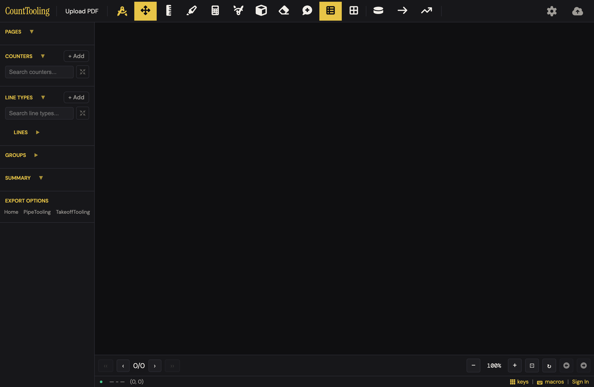
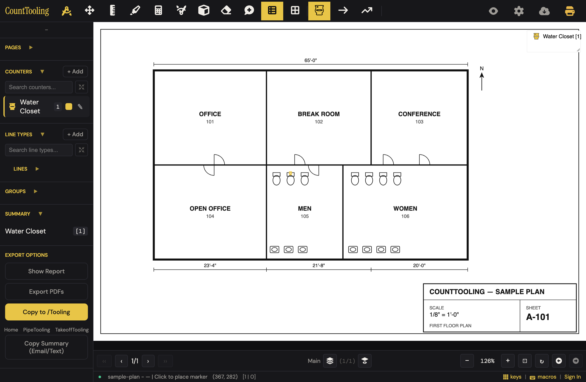
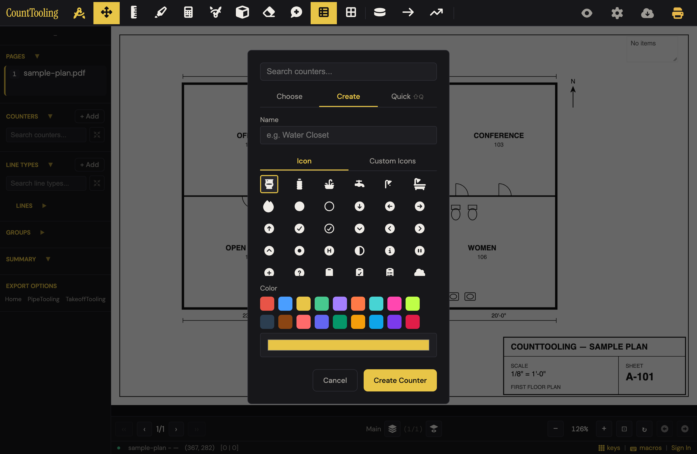
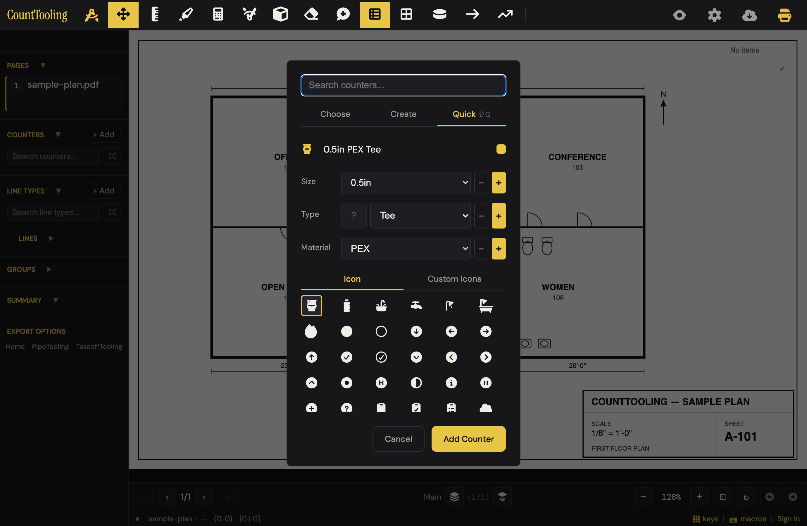

# J1 — Land in the app cold → PDF loaded → first counter placed

Personas: N · Status: ● walked (Phase 2, 2026-08-02 — real app, headless Chromium, signed out; cloud branches blocked, see Walk notes)

> Seeded from the Phase-1 cross-index workflow (2026-08-02). Phase-2 walk done
> 2026-08-02: naive attempt + documented route + variants + mobile (375×812).

## Entry points

- **landing** — "Open the app" CTA (hero, header "Open the app"/"App", cta-band, footer) -> /app/ (click)
- **landing** — "Already have access? Sign in" -> /app/?signin=1 (opens Sign In modal when signed out, app.js:6394) (click)
- **header** — #uploadPdf "Upload PDF" (visible only while state.pages is empty and not a viewer; hidden after load) (click)
- **sidebar** — #uploadPdfSidebar "Upload PDF" (same visibility rule) (click)
- **header** — #exportDropdownBtn cloud/export button — with no pages loaded a click opens the file picker directly instead of the export menu (app.js:3583) (click)
- **modal** — Project Settings > Advanced "Load Test PDF" (#advancedLoadTestPdf, IS_DEV_HOST/localhost only) (click)
- **header** — #counterBtn Counter tool — always opens #counterModal on the Choose tab (features/counter.js:80) (click)
- **hotkey** — C -> clicks #counterBtn (hotkeys.js) (keypress)
- **right-click** — #counterBtn / #counterBtnSidebar right-click -> Counter Settings menu (features/tool-context-menu.js) (right-click)
- **sidebar** — #counterBtnSidebar "Counter" (delegates to #counterBtn) (click)
- **sidebar** — #addCounter "+ Add" in the Counters section -> Counter modal opens straight on the Create tab with the first icon's name prefilled (click)
- **sidebar** — #plumBtn "PLUM" (title: "Quick add counter") -> Counter modal Quick Count tab (features/quick-modals.js:14) (click)
- **hotkey** — Shift+Q -> switches to the Quick tab while the Counter or Line Type modal is open (bespoke row in hotkeys.js) (keypress)
- **modal** — Counter modal internal tabs "Choose" / "Create" / "Quick ⇧Q" link the three creation paths (click)
- **header** — #authBtn "Sign In" (also sidebar #authBtnSidebar and status bar #statusBarAuth) -> #authModal (click)
- **burger** — #hamburger opens the sidebar on mobile (all sidebar entries above); #headerBurger "More actions" consolidates header controls when a PDF is loaded (tap)
- **modal** — Prepare PDF auto-open: fires from the upload pipeline itself, only when signed in, no project open, first upload (startPageIdx===0), and no cloud project matches the PDF hash (features/pdf-intake.js:246-275); a hash match opens #loadAnnotationsModal instead (automatic)

## Current route (walked 2026-08-02)

Signed out (the cold-start case this journey is about), the real route is **6 steps, 1 optional decision** — half the documented count, because Prepare PDF never appears signed out and the counter modal arrives pre-filled:

1. On the landing page (/), click "Open the app" — lands on /app/: black empty canvas, "Upload PDF" is the only worded button (header). 
2. Click "Upload PDF" and pick the plan PDF. **No Prepare PDF dialog signed out** (it is signed-in + first-upload + no-hash-match only, features/pdf-intake.js) — the plan opens straight to page 1, project named from the filename (footer shows "sample-plan").
3. Click "+ Add" next to COUNTERS in the sidebar (or press C / click the Counter toolbar button — those land on the Choose tab instead).
4. The modal opens **on the Create tab with "Water Closet" already filled in** and the toilet icon + a color preselected (sidebar +Add path only). Optional decision: rename / re-icon / re-color. 
5. Click "Create Counter" — the counter is created, selected, and the tool auto-arms (footer reads "Click to place marker").
6. Click the first fixture — the mark lands; the sidebar tally, on-plan legend, and SUMMARY section all tick live, and EXPORT OPTIONS (Show Report / Export PDFs / Copy Summary) appear in the sidebar. 

Divergences from the documented route:

- Steps 3–6 of the old route (Prepare PDF: rotate/delete/name/Save & Open) **do not exist signed out** — the walk went upload → open in one hop. The signed-in Prepare branch is cloud-gated and was not walked.
- Old steps 8–11 (switch to Create tab, name, icon, color) collapse to zero mandatory decisions on the +Add path: tab, name, icon, and color are all pre-chosen.
- The route via C / Counter button opens on **Choose**, and its Create tab does **not** prefill the name (placeholder "e.g. Water Closet" only) — same destination, different behavior (see Friction #2). 
- The "PLUM" quick-add button named in the old step 13 is unreachable: `.sidebar-plum-row { display: none; }` with no rule or JS ever showing it — dead markup, not an entry point. Quick Count is real but lives on the modal's "Quick ⇧Q" tab. 
- Undo (Cmd+Z), Escape-to-disarm, and right-click-a-mark → "Assign to group | Delete" all work as the fixing-mistakes guide implies.

## Evidence

- **Telemetry visibility:** All 7 events require a signed-in Supabase session (logUserEvent early-returns without state.supabaseSession.user, app.js:2732) — the no-account variant of this journey is completely blind. Signed in: session_start fires once per browser session at auth init (sessionStorage-deduped); project_save fires on the first cloud save (Save & Open -> performSaveProjectToCloud / autosave via save-engine.js:2651, deduped to one per 5 min per project); counter_marker_added fires on the first placed mark (app.js:4571, throttled to one per 60 s). project_open does NOT fire on this route — its only caller is Copy Project (features/copy-project.js:75); neither fresh-upload project creation nor cloud project load emits it. line_added, export_canvas, export_pdf are not on this route. Net: a signed-out first-timer's entire J1 is invisible, and even signed in, 'created a project from an upload' is only inferable from project_save.
- **Guide coverage:** [how-to-do-a-pdf-takeoff.md](/guides/how-to-do-a-pdf-takeoff/) — Steps 1 and 3 of the journey: upload + Prepare PDF (rotate, delete, Save & Open) and counter creation (name/icon/color) + clicking fixtures with live tally; interposes Set Scale between them; [preparing-a-plan-set.md](/guides/preparing-a-plan-set/) — All three upload entry points (header, cloud button, sidebar), 50 MB cap, multi-file merge in order, Prepare PDF controls (Delete, ‹ Prev / Next ›, Rotate, project/page rename, Save & Open, Download Trimmed PDF); [counting-with-counters.md](/guides/counting-with-counters/) — Making a counter type (name, color, built-in or custom SVG icon), selecting and clicking to place, cross-sheet live tally, undo/Move-tool fixes for misclicks; [quick-creators.md](/guides/quick-creators/) — Quick Count tab (Shift+Q or tab click), Size/Type/Material pickers, auto-assembled name, type-matched icon, Add creates-and-selects; editable modifier lists; [how-your-work-is-saved.md](/guides/how-your-work-is-saved/) — Auto-save 'to the cloud when you're signed in, locally otherwise', local backups, the restore prompt (Keep/Discard) on reopen; [working-faster-with-the-keyboard.md](/guides/working-faster-with-the-keyboard/) — C = Counter mode and the rest of the tool hotkey table; [takeoff-on-a-tablet.md](/guides/takeoff-on-a-tablet/) — Touch variant of first placement: aim loupe press-and-hold to set a counter precisely; [admin-handbook.md](/guides/admin-handbook/) — Accounts are admin-provisioned, no self-signup — the only doc explaining how a new user gets sign-in credentials
- **Specs:** prepare-pdf.spec.js, pdf-upload.spec.js, upload-then-save.spec.js (upload while signed out, then sign in, then save), counter.spec.js, quick-modals.spec.js (Quick Count panel; notes the legacy #plumModal was removed and #plumBtn now routes into the Counter modal), counter-settings.spec.js, restore-last-session.spec.js, hotkeys.spec.js, mobile-burger-menu.spec.js, user-activity.spec.js (telemetry events), add-pdf-pages-canvas-jump.spec.js (append-mode Prepare, adjacent)
- **Modals:** `preparePdfModal`, `counterModal`, `loadAnnotationsModal`, `authModal`, `lastSessionRestoreModal`
- **Hotkeys:** C — Counter mode (clicks #counterBtn), Shift+Q — Quick tab when Counter or Line Type modal open (bespoke), Esc — close modal / cancel, M — Move mode (moveReset), R — rotate page after load (Prepare modal uses its own button), S — Set Scale (docs' next step after this journey)
- **Features touched:** PDF upload (multi-file, up to 50 MB), Prepare PDF (keep/drop, reorder, rotate pages), Page renaming + title truncation, Counters (custom name, color, icon), Custom SVG icon upload + bundled trade icon library, Quick Count / Quick Plumbing / Quick Line creators, Hotkeys for every tool, Live footer totals, Auto-save every 5 seconds + local backups, Works without the cloud

## Guide gaps (doc-derived)

- Guides present the Prepare PDF dialog as unconditional on fresh upload ('When a fresh PDF comes in, the Prepare PDF dialog lets you shape the set'), but code only auto-opens it for a signed-in user with no project open, on a first upload, with no pdf_hash match (features/pdf-intake.js:246-275) — the signed-out cold path skips Prepare entirely
- The Load Annotations prompt (upload matches an existing cloud project's PDF hash -> offer to load that project's annotations, or Skip) is documented nowhere in the guides
- The signed-out/no-account empty state is undocumented: what the sidebar shows cold (Upload PDF, Set Scale, Sign In, Export/Import), that the project name comes from the PDF filename, and that 'Works without the cloud' (FEATURES.md) has no walkthrough
- Prepare PDF's plain "Open" button (commit without cloud save), "Cancel", the "Undo" button, and the async per-page size labels are not in any guide — only Save & Open and Download Trimmed PDF are described
- The "PLUM" sidebar button (title 'Quick add counter') and the sidebar "+ Add" counter entry point appear in no guide; quick-creators.md only documents the modal tab route
- The Counter modal's default Choose tab and its zero-counter empty state ('Add a counter first using Create Counter.') are undocumented
- The landing -> app handoff (/app/ vs /app/?signin=1) and what a brand-new visitor should do first (open vs sign in) is not covered by any guide
- The post-merge 50 MB rejection ('Total PDF size after merge would be N MB... No pages were added.') and that the per-file cap is only enforced when cloud is enabled are undocumented
- how-your-work-is-saved.md calls the restore buttons 'Keep'/'Discard'; the modal reads 'Keep and Open' / 'Discard'

## Terminology on screen (recorded, not judged)

- "Prepare PDF for Cloud" — modal title in project mode, shown even to users working without the cloud (index.html:2292)
- "Save & Open" vs "Open" vs "Download Trimmed PDF" — three commit buttons whose difference (cloud save or not) is unlabeled
- "Name your project and remove unnecessary pages before saving." — Prepare PDF description
- "Project name" / "> Page Name" — the Prepare dialog's dual-mode name field tabs
- "Counter" — the app's word for a count symbol; button title "Counter (right-click for settings)"
- "Choose" / "Create" / "Quick ⇧Q" — Counter modal tab labels ('Quick', not 'Quick Count', on the tab itself)
- "Add a counter first using Create Counter." — Choose-tab empty state
- "PLUM" — sidebar quick-add button label (title: "Quick add counter"); plumbing-specific label on a generic surface
- "+ Add" — Counters section add button
- "Name / Upload / Save Project to Cloud" — sidebar save button label (#saveProjectBtnSidebar)
- "Load Annotations" / "You have saved annotations for this PDF. Load them?" — 'annotations' meaning the whole takeoff
- "Keep and Open" / "Discard" — last-session restore buttons
- "e.g. 1/2\" Copper Pipe" — Quick Count name placeholder (a pipe example in a counter creator)
- "Sign in as test user" — dev bypass visible in the auth modal markup
- "Markup plans, generate takeoffs, right in your browser." — landing h1
- "Upload PDF" — consistent label across header, sidebar, and guides

## Open questions for the Phase-2 walk

- Signed-out cold walk: after picking a PDF, does the set really open straight to page 1 with no Prepare dialog and the filename as project name, and what exactly does the empty canvas area show before upload? **-> answer: yes on all three.** No Prepare dialog, page 1 renders immediately, footer shows "sample-plan" from the filename. The empty canvas is pure black with no text, hint, or drop target — the header "Upload PDF" button is the only affordance ([screenshot](img/first-plan-to-first-count-01.png)).
- FEATURES.md claims Prepare PDF supports 'reorder' pages … is reorder real or a feature-list error? **-> answer: feature-list error.** No reorder/drag/move code exists in features/prepare-pdf.js (grep for reorder/moveUp/drag: zero hits). (Sidebar page reordering exists separately — `#sidebarReorderFinish` "Finish reordering" — but that is not the Prepare dialog.)
- Interplay/ordering of first-run modals: /app/?signin=1 auth modal vs lastSessionRestoreModal vs Prepare PDF handoff — which wins when several apply? **-> partially answered:** signed out, /app/?signin=1 opens #authModal alone ("Sign In / Email / Password / Cancel / Sign In"). The three-way collision needs a signed-in session — walk-blocked (cloud gate).
- With zero counters, what does clicking the canvas in Counter mode do before any counter exists? **-> answer: you can never be in Counter mode with zero counters.** #counterBtn/C always opens the modal; Cancel drops the tool back to none, and a canvas click then does nothing, silently — no toast, no modal, no status-bar hint.
- Does the C hotkey work before any PDF is loaded, and are the tool buttons disabled or silently inert? **-> answer: C works pre-PDF** — opens the Counter modal on Choose with "Add a counter first using Create Counter." Tool buttons are not visibly disabled; they are silently inert (Esc closes the modal cleanly).
- Mobile (<769px) variant: where Upload PDF, Sign In, and counter creation actually live, and whether the aim loupe engages on the very first placement **-> answer:** pre-load, the mobile header keeps the worded "Upload PDF" button (plus burger, Move, Measure, cloud); Sign In sits in the footer status bar. Counter creation is burger → COUNTERS "+ Add" → same prefilled modal. A quick tap places the mark directly with no loupe; the loupe is press-and-hold only (not exercised). One quirk: the drawer stays open after Create Counter — first tap dismisses it, second tap places ([screenshot](img/first-plan-to-first-count-08.png)).
- Timing/feel of Prepare PDF on a large set **-> walk-blocked:** Prepare PDF only fires signed in (cloud gate) and the sample set is one page.
- What the Save Status bell and footer totals show during/after the first Save & Open **-> walk-blocked:** signed-in only. (Footer totals signed out: "[1 | 0]" marker/line counts tick immediately on placement.)
- Signed-in with a hash match: Load Annotations list **-> walk-blocked:** requires cloud projects.
- Whether ?signin=1 persists after sign-in and whether IS_DEV_HOST hides 'Load Test PDF' in production **-> partially answered:** post-sign-in persistence unverifiable signed out. IS_DEV_HOST could not be falsified from a 127.0.0.1 harness (it *is* a dev host); needs a production-origin check.

## Naive attempt

Persona: estimator with a login link, never saw the app. From "/": the hero says "Open a drawing and start marking up", one yellow CTA — no hesitation. In the app, "Upload PDF" is the only worded button, so the eye lands there despite 15 unlabeled tool icons. After upload, a naive click on a toilet (Move tool) silently did nothing — the one dead end. The sidebar's "COUNTERS + Add" was the next obvious target; the modal opened already saying "Water Closet" with a toilet icon, so it was two clicks (Create Counter → click fixture) to the first counted toilet. **6 actions, 1 wrong turn, no docs.** The goal is genuinely reachable cold.

## Friction findings

| # | severity | what happens | why it hurts | verdict |
|---|----------|-------------|--------------|---------|
| 1 | stumble | Dragging a PDF onto the app does browser-default navigation (no dragover/drop handler anywhere) — the app is replaced by the browser's PDF view | Drag-drop is many users' first instinct for "open a file"; they lose the app and must Back-button their way in | CONFIRMED — reproduced: dispatched `dragover`/`drop` with Files on #canvasWrapper and document; nothing default-prevents them (only sidebar reorder-mode rows have `ondragover`, features/sidebar-lists.js:61,127), so the browser default wins |
| 2 | stumble | The Create tab prefills the name only on the sidebar +Add path; via C / Counter button it's blank, and clicking "Create Counter" with a blank name silently creates a counter literally named "Counter" | "Counter 3" flows into the legend, summary, and report — a generic label the estimator has to notice and fix later | CONFIRMED — reproduced end-to-end: C-route `counterName` is `''` (counter.js:86 clears it; addCounter path prefills at :113), blank create hits the `\|\| 'Counter'` fallback (counter.js:164), and the mark + "Counter" row landed in the sidebar tally. One correction: there is **no numbering** — every blank create is literally "Counter", so duplicates collide under one identical name ("Counter 3" never happens; it's worse than the row implies, same severity) |
| 3 | stumble (mobile) | After "Create Counter" in the burger drawer, the drawer stays open covering the plan; the first tap only dismisses it ([screenshot](img/first-plan-to-first-count-07.png)) | The tool says armed but the plan is hidden; a first-timer doesn't know the dismissal tap is coming | CONFIRMED — reproduced at 375×812: after Create Counter, `body.sidebar-open` persists (counterCreate handler never removes it, counter.js:162-180); tap 1 on the visible plan strip only closed the drawer (0 marks), tap 2 placed. Worse: the 220px drawer covers most of the plan, and a tap landing **inside** the drawer silently switches tools (observed COUNTER→Move) |
| 4 | papercut | Empty canvas is pure black — no "drop a plan here / Upload PDF" affordance in the work area ([screenshot](img/first-plan-to-first-count-01.png)) | The header button carries the entire cold start; the biggest region of the screen says nothing | CONFIRMED — reproduced: `#canvasWrapper.innerText` is empty string on cold load |
| 5 | papercut | Choose-tab empty state reads "Add a counter first using Create Counter." but the thing to click is the **Create** tab — the "Create Counter" button only exists after switching ([screenshot](img/first-plan-to-first-count-05.png)) | Names a button the user can't see; one more beat of scanning | CONFIRMED — reproduced: with zero counters the empty state is visible with that exact text while `#counterCreate` has no offsetParent (hidden on the Choose tab) |
| 6 | papercut | Clicking the plan with no counter armed (Move/none) does nothing, silently | No nudge toward COUNTERS / + Add at the exact moment the user is showing intent to count | CONFIRMED — reproduced: click on #annCanvas with tool=Move → 0 markers, no modal, no toast |
| 7 | papercut | The header cloud-arrow button is two different things: with no PDF it opens the file picker; with a PDF it's a menu of "Export PDF \| Import Canvas" | Same icon, two jobs; and "Import Canvas" is software language on a first-session surface | CONFIRMED — reproduced both states: pre-load the click fires `#pdfInput.click()` and suppresses the menu (`shieldImportModeClick`, app.js:3588-3593); fresh-loaded with zero marks the visible menu is exactly "Export PDF" + "Import Canvas". Correction: that menu is **state-dependent**, not static — once any markup exists, Import Canvas hides and Export Canvas / Export Both appear (app.js:2360-2375), so the software-language item is only on screen during the exact zero-marks first-session window this journey covers |
| 8 | papercut | PLUM quick-add buttons exist in markup and Phase-1 docs but are permanently `display:none` | Dead UI that misleads doc-driven work (this dossier included) | CONFIRMED — reproduced in the live app: `.sidebar-plum-row` computed display is `none` (styles.css:266, unconditional) while `#plumBtn` still has a bound click handler (features/quick-modals.js:14) — dead UI with live wiring |

## Proposals

- **keep** — The sidebar "+ Add → prefilled Water Closet → Create Counter → auto-armed tool → click fixtures" path. Spirit: (1) already the minimum step count; (2) "Water Closet", toilet icon — pure trade language; (3) it removes the name/icon/color decisions entirely; (4) the naive walk found it unaided. spiritPass: yes. [verified — re-drove the path; "+Add" prefills "Water Closet" and Create Counter auto-arms (tool=COUNTER, counter active) with zero typing]
- **polish** — Make every route into the Create tab behave like +Add (prefill first-icon name), and block/auto-name "Create Counter" on a blank name with the selected icon's name instead of the literal string "Counter". Spirit: (1) removes a decision and a later rename; (2) reports say "Water Closet", not "Counter"; (3) deletes a behavioral fork between two surfaces; (4) invisible — nothing new to find. spiritPass: yes. [verified — fork reproduced (counter.js:86 vs :113); budget is real: it deletes the `\|\| 'Counter'` fallback path and the surface-dependent prefill difference. Note the C-route grid already *visually* preselects icon 0, so naming from it matches what the user sees]
- **polish** — Accept drag-and-drop of a PDF onto the window and put a quiet "Drop a plan here — or Upload PDF" hint in the empty canvas. Spirit: (1) one gesture replaces button + file dialog; (2) "plan", not "file/import"; (3) removes the need to spot the one worded button, and kills the lose-the-app drop accident (Friction #1); (4) drop targets are self-teaching. spiritPass: yes. [verified — Friction #1 and #4 both reproduced; the budget names a real removal (the lose-the-app failure mode and the button hunt). It is two changes bundled, but each also closes a confirmed finding, and the no-op alternative (preventDefault alone to stop the navigation) would be strictly less honest than accepting the drop]
- **polish** — Mobile: when "Create Counter" arms the tool, close the burger drawer in the same motion. Spirit: (1) one less tap; (2) n/a wording; (3) removes a dismissal step users don't know exists; (4) removes a findability problem rather than adding one. spiritPass: yes. [verified — reproduced the extra tap at 375×812; also removes the mis-tap-in-drawer hazard that silently switches tools]
- **polish** — Reword the Choose-tab empty state to point at what's on screen: "No counters yet — use the Create tab above." Spirit: (1) fewer scanning beats; (2) plain words; (3) removes a reference to an off-screen button; (4) it's the empty state itself, unmissable. spiritPass: yes. [verified — reproduced the off-screen reference; string-only change]
- **hide** — Delete the dead PLUM markup (`#plumBtn`, `#plumLineBtn`, `.sidebar-plum-row`) or actually show it; today it's a third counter-creation surface that exists only in code and docs. Spirit: (1) no user steps change; (2) removes "PLUM", a label nobody decodes; (3) pure removal; (4) n/a. spiritPass: yes. [verified — reproduced display:none + live handler; note viewerHideIds in app.js:2118 and quick-modals.js/quick-line.js bindings must go with the markup or they throw on missing elements]
- **teach** — The cloud-arrow's no-PDF behavior (opens the file picker) is actually a kindness — any plausible first click leads to upload — but its loaded-state menu item "Import Canvas" belongs to the canvas-layers journey's vocabulary problem, not this one. Document the pre-load behavior in preparing-a-plan-set.md; leave behavior alone. spiritPass: n/a (teach). [verified — behavior reproduced in both states; teach is the right verdict, no UI change needed]
- **keep** — Silent no-op on unarmed plan clicks (Friction #6) rather than a nagging toast: with 7 daily users and the +Add path this obvious, an unprompted hint would cost more than it saves. Revisit only if new-user onboarding scales. spiritPass: yes. [verified — no-op reproduced; keep is consistent with the naive walk reaching the goal in 6 actions with one dead click]

## Guide actions

*(Phase 5)*

## Demo moment

Click "+ Add" next to COUNTERS: the dialog is already filled in — **"Water Closet", toilet icon, color picked**. Click "Create Counter", then tap, tap, tap across the restroom: each toilet gets a gold dot and the sidebar tally, the on-plan legend, and the Summary all tick 1-2-3 in real time ([screenshot](img/first-plan-to-first-count-03.png)). From modal to counted fixtures is under ten seconds, and nobody typed a word. That's the sell: the app already knows you came to count water closets.

## Walk notes

**Walked 2026-08-02**, real app served from the repo by a local static server (port 4101), headless Chromium via @playwright/test, viewport 1380×900 (desktop) and 375×812 (mobile). All non-localhost requests were hard-blocked at the network layer; none were attempted by the signed-out app.

**Not walked (cloud gates), with the exact wall:**

- Sign-in and everything behind it. Wall: #authModal — "Sign In / Email / Password / Cancel / Sign In" (opened via /app/?signin=1; no self-signup surface exists, matching admin-handbook.md).
- Prepare PDF auto-open (signed-in + first upload + no hash match). Signed out, upload silently skips it — there is no wall text; the dialog simply never appears.
- Load Annotations hash-match prompt, Save Status bell, first Save & Open timing, telemetry events — all require a Supabase session.
- Aim-loupe press-and-hold placement on touch (quick-tap placement verified instead).
- Multi-page set behaviors (sample plan is one page).

**Environment quirks:**

- Every /app/ load logs one 404 for `/config.local.js` — dev-override probe, harmless but it is the first thing in a new user's console.
- `#uploadPdfSidebar` is inside `.sidebar-header-buttons` which is `display:none` at desktop width — the "sidebar Upload PDF" entry point is effectively mobile-drawer-only (and post-load it hides everywhere).
- PLUM buttons (`#plumBtn`, `#plumLineBtn`) are permanently hidden by `.sidebar-plum-row { display: none; }` — the Phase-1 entry-point list above should be read with that correction.
- Sidebar tool buttons (`#counterBtnSidebar` etc.) are mobile-drawer-only; on desktop the header toolbar is the single tool surface.

**Duplicate-surface moments observed:**

- Three upload surfaces: header "Upload PDF", mobile-drawer "Upload PDF", and the cloud-arrow button (pre-load it opens the file picker directly; post-load the same button becomes the "Export PDF | Import Canvas" menu).
- Two-and-a-half counter-creation surfaces: sidebar "+ Add" (Create tab, name prefilled) vs toolbar Counter/C (Choose tab, Create-tab name blank) vs PLUM (dead). Same modal, different tab and different prefill behavior per entry.
- Two export surfaces with different contents: sidebar EXPORT OPTIONS (Show Report / Export PDFs / Copy to /Tooling / Copy Summary (Email/Text)) vs header cloud dropdown (Export PDF / Import Canvas).
- Mobile shows the same tools twice: header icon toolbar and labeled buttons (Move / Counter / Line / Polyline / Note / Legend / Grid) inside the burger drawer.

**Software-language terminology quoted on screen this walk:** "Import Canvas" (cloud dropdown), "Copy to /Tooling" (sidebar), "No items" (empty on-plan legend), "keys | macros" (footer), "Add a counter first using Create Counter.", "Quick ⇧Q" (tab label), "Multiply Zone (right-click for settings)" (tooltip on a first-session toolbar).

**Screenshot index:**

| file | moment |
|------|--------|
| img/first-plan-to-first-count-01.png | Empty app, signed out — black canvas, lone "Upload PDF" (friction #4) |
| img/first-plan-to-first-count-02.png | +Add modal pre-filled "Water Closet" + toilet icon (demo ingredient) |
| img/first-plan-to-first-count-03.png | First mark placed — tally/legend/summary all live (demo moment) |
| img/first-plan-to-first-count-04.png | C-route Create tab: name is placeholder-only (friction #2) |
| img/first-plan-to-first-count-05.png | Choose-tab empty state wording (friction #5) |
| img/first-plan-to-first-count-06.png | Quick ⇧Q tab — Size/Type/Material, name auto-assembled ("0.5in PEX Tee") |
| img/first-plan-to-first-count-07.png | Mobile: drawer still covering the plan after Create Counter (friction #3) |
| img/first-plan-to-first-count-08.png | Mobile: first mark placed after dismissal tap |

## Verification (2026-08-02)

Adversarial re-drive by the J1 verifier: real app served from the repo root on 127.0.0.1:4301 (throwaway static server + headless Chromium via @playwright/test, the build-screenshots.js recipe), desktop 1380×900 and mobile 375×812 with touch, every non-localhost request aborted at the route layer (none needed — the signed-out app made no cloud calls), signed out throughout. Method: tried to refute each friction row, not confirm it; every claim below is from my own runtime probes plus source reads, not the walker's word.

**Reproduced (all 8 findings, runtime):**

- **#1** — dispatched cancelable `dragover`/`drop` carrying a `DataTransfer` with a PDF `File` on `#canvasWrapper`, `document.body`, and `document`; `defaultPrevented` stayed `false` on all six dispatches, and a codebase grep finds the only drag handlers on the sidebar reorder-mode rows (features/sidebar-lists.js:61,127), gated behind `sidebarReorderModeActive`. Browser-default navigation on a dropped PDF stands.
- **#2** — via `#counterBtn` → Create tab, `#counterName` is `''` (cleared at features/counter.js:86 vs the `#addCounter` prefill at :113); Create Counter hit the `|| 'Counter'` fallback (counter.js:164), tool auto-armed (state.tool=COUNTER), and after a canvas click the mark landed with a literal "Counter" row in the sidebar tally. Repeated the blank create: second counter is also exactly "Counter" — `counterNames: ["Counter","Counter"]` — no numbering, identical colliding labels.
- **#3** — after Create Counter from the drawer, `body.sidebar-open` persisted with the backdrop up (drawer 220px wide); tap 1 on the canvas area closed the drawer and placed nothing (0 markers), tap 2 at the same point placed the mark (1 marker). Also reproduced the in-drawer hazard: with the tool armed and the drawer open, a tap on a tool button inside the drawer silently switched COUNTER→Move with the drawer still open.
- **#4** — `#canvasWrapper.innerText` is `''` on cold load; header "Upload PDF" is the lone worded affordance.
- **#5** — with zero counters, `#counterChooseEmpty` is visible with exactly "Add a counter first using Create Counter." while `#counterCreate` has no offsetParent (Create tab hidden).
- **#6** — unarmed (Move) click on `#annCanvas`: 0 markers, no modal, no toast.
- **#7** — pre-load, clicking `#exportDropdownBtn` fired `#pdfInput.click()` and kept the menu closed; fresh-loaded with zero marks the visible menu is exactly "Export PDF | Import Canvas". Correction to the earlier note: the hidden Export Canvas / Export Both options are not statically hidden — the menu recomputes on markup presence (app.js:2360-2375), and after the first mark it reads "Export Canvas | Export PDF | Export Both" with Import Canvas gone. The two-jobs-one-icon papercut stands; the "Import Canvas" wording is confined to the zero-marks window.
- **#8** — `.sidebar-plum-row` computed `display: none` (unconditional, styles.css:266) while `#plumBtn` still has a live bound `onclick` (features/quick-modals.js:14).

**Corrections / additions:**

- Friction #2: the app never numbers blank creates — every one is literally "Counter", so repeat blanks collide under one identical name ("Counter 3" cannot happen; the failure mode is slightly worse than a numbered generic).
- Friction #3's in-drawer tool-switch hazard is real but positional — it needs the tap to land on a tool button in the drawer column; taps on the exposed canvas strip only dismiss. Both wrong outcomes (phantom dismissal, silent tool switch) are removed by the same close-drawer-on-create polish.
- Friction #7's menu is state-dependent (above) — anyone simplifying that menu should test both the zero-marks and has-marks states, not the markup alone.
- Control check for the keep verdicts: `#addCounter` prefilled "Water Closet" on both desktop and mobile in my runs, and the naive 6-action path is real — I drove upload → +Add → Create Counter → tap to a placed, tallied mark with no other interaction.

**Severity audit:** no downgrades, no kills, no upgrades. The three stumbles reproduce with real lost time or a wrong artifact (lost app / colliding "Counter" report rows / phantom tap + silent tool switch); the five papercuts are annoyances exactly as rated. The naive path to a placed mark remains 6 actions with zero documentation, which caps how much any of these can hurt.

**Proposals:** all 8 verified as marked ([verified] inline). None rejected. Spirit test re-applied independently: the two keeps are evidence-backed (prefill + auto-arm reproduced; unarmed no-op reproduced and genuinely harmless on this walk), the teach stays teach (doc-only, no UI invented), and each polish names a real removal — the `|| 'Counter'` fallback and the per-surface prefill fork, the lose-the-app drop accident, the phantom dismissal tap, the off-screen button reference, and the dead PLUM markup (whose removal must take quick-modals.js:14's `#plumBtn` binding, the quick-line sibling, and the `plumBtn`/`plumLineBtn` entries in viewerHideIds at app.js:2119 with it, or the boot code throws on a missing element).
