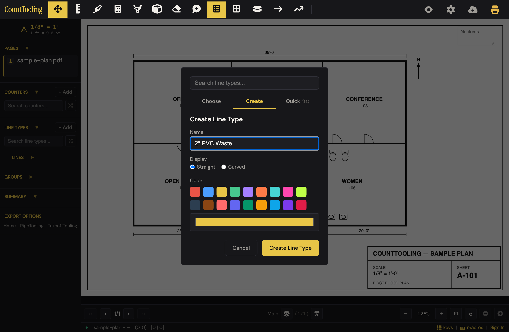
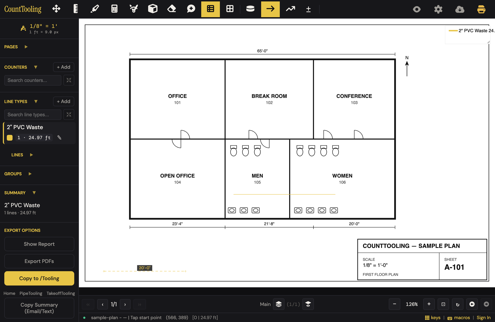
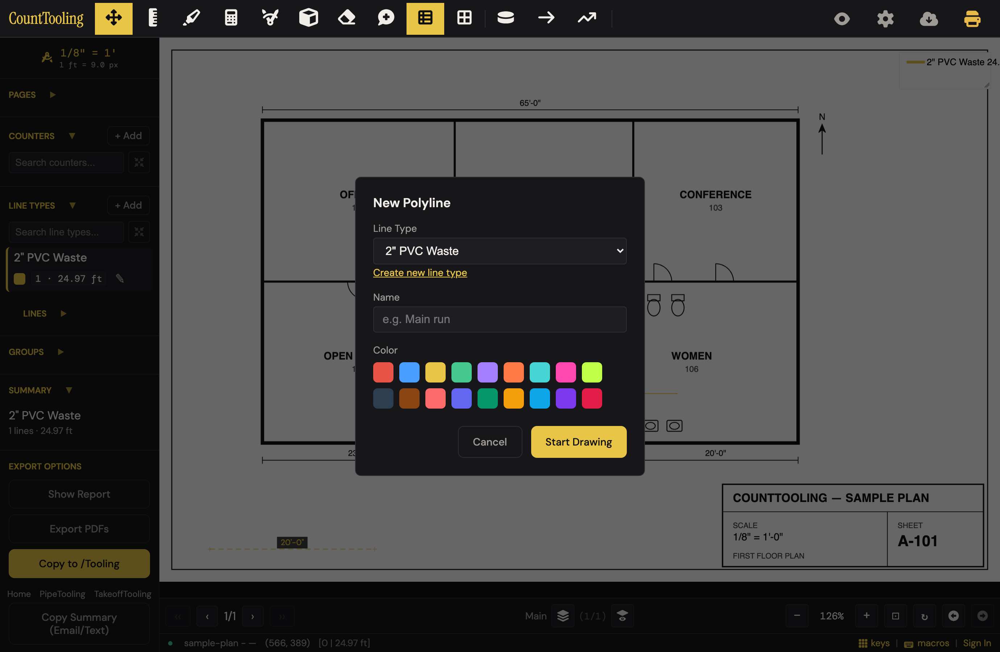
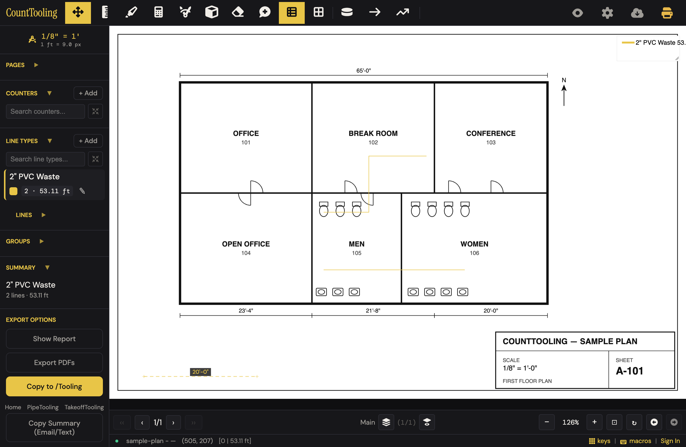
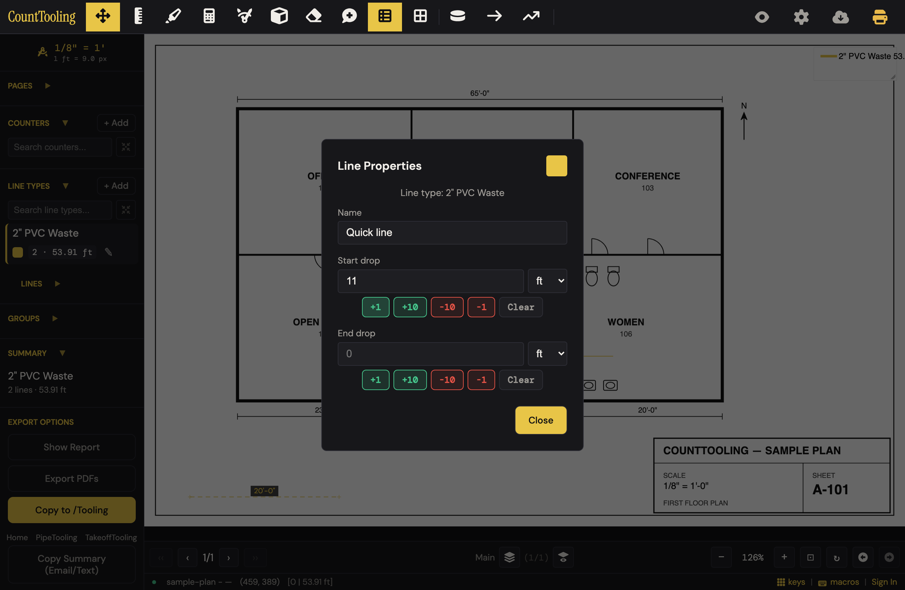
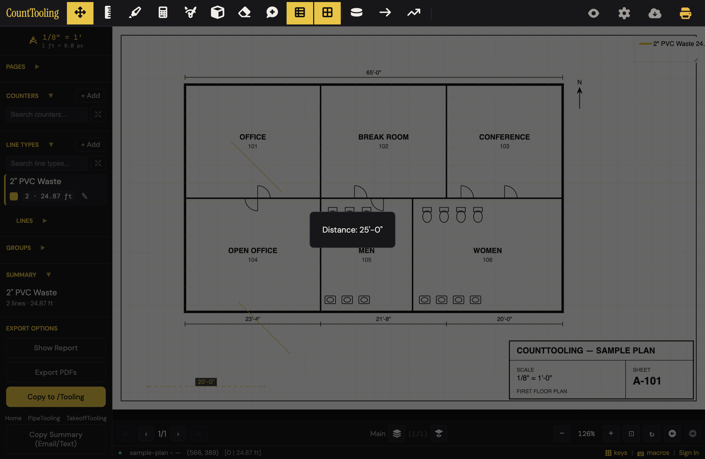

# J5 — Lines, polylines, arcs, drops, snap — LF that is right

Personas: P E · Status: ● walked (Phase 2, 2026-08-02 — headless Chromium on the sample plan, desktop 1380×900 + a bonus 375×812 touch pass)

> Seeded from the Phase-1 cross-index workflow (2026-08-02). Phase 2 walk done:
> route corrected below, friction/proposals/demo filled, open questions answered inline.

## Entry points

- **header** — #quickLine "Quick Line" toolbar button (click (right-click for Line Type settings))
- **header** — #polylineBtn "Polyline" toolbar button (click (right-click for Line Type settings))
- **header** — #measureBtn "Measure distance" toolbar button (click (right-click for Set / edit scale))
- **header** — #gridBtn "Grid overlay" toolbar button (click toggles grid; right-click opens gridSettingsModal)
- **header** — #lineTypeSnapToHVHeaderBtn snap icon (shown only when Line/Polyline tool active) (click toggles 45-degree snap)
- **sidebar** — #quickLineSidebar / #polylineBtnSidebar / #measureBtnSidebar / #gridBtnSidebar (mobile-menu duplicates) (click)
- **sidebar** — #lineTypesSectionTitle "Line Types" heading (click opens Line Type Settings modal)
- **sidebar** — #addLineType "+ Add" button (click opens lineTypeModal (Create Line Type))
- **sidebar** — #linesList rows (Lines section, starts minimized) + #lineTypeSearchInput / lines search (row click selects line and jumps to its page; second click deselects)
- **hotkey** — L (Quick Line), P (Polyline), D (Measure), J (snap toggle), Shift+Q (Quick tab when modal open), Enter (finish polyline / exit vertex edit), Esc (first press clears quick-line start point, second exits to Move), 1-0 Quick Keys bound to line types (keydown)
- **right-click** — placed line/polyline on canvas -> context menu -> Line Properties (drops, rename, recolor, Edit vertices) (right-click or long-press)
- **right-click** — tool buttons (Line, Polyline, Grid, Measure) -> settings menu (features/tool-context-menu.js) (right-click)
- **modal** — #polylineNewLineType "Create new line type" link inside New Polyline modal (click cross-links to line type creation)
- **modal** — #linePropertiesEditVertices "Edit vertices" button (polylines only) inside Line Properties (click enters vertex edit mode)
- **modal** — #linePropertiesSwatch color swatch in Line Properties (click opens lineColorModal)

## Current route (walked 2026-08-02) — 10 steps, 6 decision points

1. With the page scale already set, press L (or click the Quick Line toolbar icon) — the line-type picker opens, always on the **Choose** tab (Choose | Create | Quick). On an unscaled page the tool instead shows the "Set Scale first to use Quick Line." toast (see friction #3). 
2. On the Create tab: name it, Straight or Curved, color, "Create Line Type" — **the tool arms immediately** (footer flips to "Tap start point"). *Divergence:* the Quick tab's "Add Line Type" (Size + Material) creates the type but does **not** arm the tool, and neither does the sidebar "+ Add" — after those you are still in Move and clicks on the plan do nothing (friction #2).
3. Click the start point, click the end point — the length is read off the page scale and lands in the sidebar type total ("1 · 24.97 ft"), the footer tally ("[0 | 24.97 ft]"), the legend, and Summary. No length is shown *while* rubber-banding (friction #5), and no label appears on the line unless you right-click → "Show Length". 
4. The tool **stays armed** — keep clicking start/end pairs for the next runs. (*Doc was wrong:* no need to "tap the Line tool again"; chaining just works.) Esc once clears a pending start point; Esc again drops to Move.
5. For a bending run, press P (Polyline) → New Polyline dialog (line type select, optional name — placeholder "e.g. Main run", color) → "Start Drawing" → click each vertex; footer reads "Click to add points" and **Finish / Close Polygon buttons appear in the header**. 
6. Finish with Enter, double-click, or the on-screen Finish button — the total is the sum of every segment; the tool returns to Move, and the next polyline repeats the whole dialog (friction #7). One Esc mid-draw silently discards **all** clicked vertices (friction #6). 
7. Right-click a placed line (or expand the sidebar Lines list and hit a row's ✎) → "Line Properties" → Start/End drop with +1/+10/−10/−1 and a **per-drop unit select** (ft/in/m/cm/yd; changing the unit reinterprets the entered number, e.g. 11 ft → 11 in). The vertical footage joins the run's total and a drop marker is drawn on the line. 
8. Press J (or the header snap icon that appears while a line tool is armed, title "Snap to 45° angles") — segments lock to exact 0°/45°/90° (verified: dx == dy to the 14th decimal).
9. Grid overlay (grid button; right-click for settings) is **view-only for lines**: its one snapping option is literally "Snap counters to grid", and with grid snapping AND J both on, line endpoints obey J and ignore the grid. FEATURES.md's "lines follow a regular module" is not what ships.
10. For a one-off check, press D (Measure), click two points — toast: "Distance: 25'-0"" (feet-inches), nothing added to the takeoff. Right-click the Measure button → "Set / edit scale…". 

Curved ("arc") line types: two clicks like a straight line; the bow is fixed (control point offset 15% of chord length, geometry.js:80-87), not user-adjustable — and today the arc's measured length is **wrong** (friction #1).

## Naive attempt

Persona: plumbing estimator, no guide read, fresh plan loaded. Eye went to the sidebar — "LINE TYPES + Add" reads like trade language. Created "2" PVC Waste" there… then clicked the plan four times with nothing happening (the sidebar create leaves you in Move; clicking the type's row doesn't arm anything either). Hover-hunted the icon-only toolbar, found "Quick Line", clicked it — wall: toast "Set Scale **first** to use Quick Line." The bold "Set Scale" text looks tappable but isn't ([shot 01](img/measure-runs-01.png)); had to find the Set Scale toolbar icon myself. The scale panel opened on presets with a "This page isn't a standard sheet size" warning silently pre-correcting to "ANSI D (22×34)"; the title block says 1/8" = 1'-0", so I clicked the 1/8" preset — and my first 25-ft corridor line read **66.59 ft** (correction factor 0.375 baked in; toast "Scale set — verify it against a known dimension" was the only tell). Quick Line then routed through the "Choose a line type for Quick Line:" modal even though I had exactly one type. Net: goal reached in ~9 productive actions plus 4 dead clicks and one silently wrong scale that a real estimator might not catch until the bid.

## Evidence

- **Telemetry visibility:** line_added fires on every committed quick line and polyline (app.js:2771, payload kind + lineTypeId + pageIndex; counted alongside counter_marker_added at app.js:2734). project_save fires ambiently via autosave after the edits; session_start and project_open fired earlier as preconditions. Blind spots on this route: Measure tool usage, snap (J) and grid toggles, line type creation (any tab), drop edits and per-drop unit changes, Line Properties renames/recolors, vertex edits - none are instrumented. export_canvas/export_pdf are not on this journey.
- **Guide coverage:** [measuring-runs-lines-and-polylines.md](/guides/measuring-runs-lines-and-polylines/) — Primary guide: line types (name, straight-or-curved, color), Line tool two-click flow, polyline vertices, arcs measured along the sweep, drops via right-click Line Properties with +/-1 +/-10 buttons, J snap, grid with snapping, Measure tool incl. scale-zone awareness; [how-to-do-a-pdf-takeoff.md](/guides/how-to-do-a-pdf-takeoff/) — Step 4 'Measure the runs': create a line type per run kind, trace with Line/Polyline, arcs, drops, J snap, Measure tool; step 5 mentions grid with snapping for clean lines; [working-faster-with-the-keyboard.md](/guides/working-faster-with-the-keyboard/) — Hotkey table (M/L/P/D rows), Quick Keys binding line types to 1-0, dedicated '45° snap for straight runs' section (J or the snap button in Line Type Settings), right-click tool settings incl. Measure -> Set / edit scale, Enter in the workflow rhythm example; [quick-creators.md](/guides/quick-creators/) — The Line modal's Quick tab: pick Size and Material, Add creates the line type named, colored, active, and ready to trace; [fixing-mistakes.md](/guides/fixing-mistakes/) — Right-click/long-press context menu -> Line Properties to rename, recolor, adjust drops, or edit a polyline's vertices; right-click tool buttons for settings; details dialog rename/recolor from sidebar; [organizing-a-busy-sheet.md](/guides/organizing-a-busy-sheet/) — Line Type Settings contents (line size, opacity, drop-marker size and icon style, length-label size, label orientation), show-only-on-current-page filter, search boxes in Counters/Line Types/Lines sections; [annotating-and-reviewing.md](/guides/annotating-and-reviewing/) — Grid overlay: adjustable real-unit grid (spacing, origin, color, line style), optional snapping while drawing, view-only, requires page scale; [plumbing-takeoff.md](/guides/plumbing-takeoff/) — Trade application: trace supply/waste with Line and Polyline, add drops for vertical footage; [electrical-takeoff.md](/guides/electrical-takeoff/) — Trade application: drops for risers, Snap to 45° (J), line types per run type; Copy Summary totals always decimal feet; [hvac-takeoff.md](/guides/hvac-takeoff/) — Trade application: duct/pipe runs with Line and Polyline, drops for risers; totals always decimal feet; [takeoff-on-a-tablet.md](/guides/takeoff-on-a-tablet/) — Aim loupe for precise line endpoints on touch; Measure tool on site (two taps, real feet); [measuring-room-volumes.md](/guides/measuring-room-volumes/) — Restates always-decimal-feet totals convention (ft²/ft³)
- **Specs:** choose-create-line-type.spec.js, quick-line.spec.js, quick-modals.spec.js, snap-angles.spec.js, line-drop-units.spec.js, line-type-settings.spec.js, lines-list.spec.js, grid.spec.js, hotkeys.spec.js, keyboard-map.spec.js, quick-keys.spec.js, measure-loupe.spec.js, aim-loupe-desktop.spec.js, aim-loupe-phase2.spec.js, tool-context-menu.spec.js, copy-tooling-feet.spec.js, render-pixels.spec.js, geometry.test.js (pure snapLineToAngle math), canvas-draw.test.js (line/drop drawing core)
- **Modals:** `chooseLineTypeModal`, `lineTypeModal`, `polylineModal`, `lineTypeSettingsModal`, `gridSettingsModal`, `linePropertiesModal`, `lineColorModal`, `setScaleFirstModal`
- **Hotkeys:** L - Quick Line mode (opens Choose/Create Line Type modal), P - Polyline mode (opens New Polyline modal), D - Measure Distance (viewer-allowed), J - Toggle snap to 45° angles (viewer-allowed), Shift+Q - Quick tab when the Counter or Line Type modal is open, Enter - Finish polyline / Exit edit mode, Esc - cancel (Quick Line: first press removes first point, second exits to Move), M - Move mode (drop the current tool), 1-0 - Quick Keys slots bindable to line types, Ctrl+Z / Ctrl+Shift+Z - Undo / Redo of placed lines
- **Features touched:** Quick lines & polylines, Arc line types, Line drops, Measure tool (D), Snap to 45° angles (J), Grid overlay with snapping, Quick Count / Quick Plumbing / Quick Line creators, Always-feet totals, Right-click tool settings, Context menus (right-click / long-press), Quick Keys (number row), Show only on current page

## Guide gaps (doc-derived)

- Per-drop unit selector (ft/in/m/cm/yd on each of start/end drop, pinned by line-drop-units.spec.js) appears in no guide - the guide shows only the +/-1/+/-10 adjusters
- The New Polyline dialog itself (line type select, name field, color row, 'Start Drawing' button, 'Create new line type' link) is never described; guides jump straight to clicking vertices
- How to finish a polyline is vague: the guide says 'finish to close it out' without naming Enter (Enter appears only in the hotkey table as 'Finish polyline / Exit edit mode')
- Quick Line Escape behavior (first Esc removes the first point, second exits to Move - per ARCHITECTURE.md) is undocumented
- The 'Set scale first' toast blocking Quick Line / Polyline / Measure on unscaled pages is undocumented in guides
- The sidebar Lines list behavior (per-type grouping with run counts and always-feet totals, row click jumps to the line's page, deselect on second click, expand/collapse persistence) - only its search box is mentioned in organizing-a-busy-sheet
- Shift+Q to jump to the Quick tab appears only as the in-modal tab hint; no guide or hotkey-table row in the keyboard guide documents it
- Arc drawing mechanics are unexplained: guides say line types 'can be set to curve' but never how the curve is placed or controlled from two clicks (quadratic Bezier per ARCHITECTURE.md)
- The distinction that on-canvas per-line length labels and the Measure readout keep feet-inches notation while all tallies are decimal feet is never stated in a guide (trade guides only mention decimal-feet totals)
- Line Type Settings' 'Parallel ends' control and the drop icon style grid are named nowhere in guides (organizing-a-busy-sheet lists other settings at name level only)
- The header snap toggle icon that appears next to Polyline when a line tool is active is undocumented (keyboard guide points only to the button in Line Type Settings)
- Grid origin flow ('Set origin on page (optional)', 'Origin set, click to reset') and major-interval setting are below the summary level of annotating-and-reviewing
- Line selection highlight (selected line drawn thicker with glow) is undocumented

## Terminology on screen (recorded, not judged)

- "Quick Line" (button title) vs the guides' plain "Line tool" vs FEATURES.md "Quick lines & polylines"
- "Curved" radio label in all three create surfaces, while FEATURES.md says "Arc line types" and the stored value is 'arc'
- "Measure distance" (button title) vs "Measure Distance" (keyboard map row) vs guide's "Measure tool"
- "Snap to 45° angles" (header/hotkey wording) with settings-toggle tooltip "Constrain lines to horizontal, vertical, or 45° diagonals when placing"; persisted key is still snapToHorizontalVertical
- "Drop" is overloaded on screen: line "Start drop"/"End drop" (vertical footage), "Drop X size"/"Drop icon" (the X marker), electrical guide's "data drops" (a counter), Prepare PDF keep/drop
- "Line Drop Settings" section header inside Line Type Settings modal
- "Parallel ends" slider label in Line Type Settings (unexplained trade meaning)
- "Orient length" toggle, tooltip "Rotate length label to align with line"
- "New Polyline" modal with "Start Drawing" button and name placeholder "e.g. Main run"
- "Choose a line type for Quick Line:" modal copy; tabs "Choose | Create | Quick" with hint "Quick (Shift+Q)" / "⇧Q"
- "Add Line Type" (Quick tab button) vs "Create Line Type" (Create tab button) vs sidebar "+ Add" (title "Add line type")
- Grid snapping toggle tooltip reads "Snap counters to grid" while FEATURES.md sells grid snapping as "Lines follow a regular module"
- "reorder artboard" link in Line Type Settings ("Close and drag line types in the sidebar to reorder")
- "Origin set, click to reset" / "Set origin on page (optional)" in Grid settings
- Empty-state copy: "Add a line type first using Create or Quick."
- *(walk-observed additions)* Footer tally "[0 | 24.97 ft]" (unlabeled counters|feet pair); footer coaching "Tap start point" / "Tap end point" / "Click to add points" / "Edit polyline"; context-menu hint "[color, name, drops]"; "Close Polygon" (software word for closing a loop); Lines-list bucket "Unassigned" for type-less runs; Summary grammar "1 lines · 24.97 ft"; Measure toast "Distance: 25'-0""; scale toast "Scale set — verify it against a known dimension"; preset warning "This page isn't a standard sheet size … Correcting presets as if printed on: ANSI D (22×34)"

## Open questions for the Phase-2 walk

- Doc conflict: ARCHITECTURE.md ('Features Beyond Spec' Choose Line Type bullet) says 'Shift+L opens Quick tab', but hotkeys.js and app.js:5710 implement Shift+Q only - which works live? **-> Shift+Q switches to the Quick tab; Shift+L does nothing (tab unchanged). ARCHITECTURE.md is wrong.**
- How exactly is a polyline finished in practice: Enter only, double-click, tapping the tool again? And the mobile/touch variant? **-> Three verified ways: Enter, double-click (no duplicate-length inflation), and on-screen "Finish" / "Close Polygon" header buttons that appear while drawing (these are the touch path too). Tool re-tap not tested — walk-blocked leftover.**
- How is an arc's curvature determined from the two clicks of a curved line type - fixed bow or user-controllable, and how does it look during the rubber-band preview? **-> Fixed bow: control point perpendicular to the chord at 15% of its length (geometry.js:80-87), not user-adjustable. Preview rubber-bands as a dotted line. And: arc length is computed ~4-5% short (friction #1).**
- Empty state: pressing P with zero line types leaves #polylineLineType with a '—' placeholder option - can 'Start Drawing' proceed, and what happens? **-> Yes, it proceeds (tool arms). The committed run has lineTypeId null, shows in no Line Types tally, and lands under Lines → "Unassigned" (friction #8).**
- Which tab does the Choose/Create Line Type modal open on by default, and does it remember the last tab or the last active line type? **-> Opens on Choose every observed time (with and without existing types); no tab memory observed across opens. Last-active-type memory untested.**
- Interaction of grid snapping with 45° snap when both are on - which wins for line endpoints? **-> J wins outright: endpoints are exactly 45° and NOT on grid multiples — because grid snapping never applies to lines at all.**
- Does grid snapping actually snap line endpoints, or only counters (toggle tooltip says 'Snap counters to grid' while FEATURES.md promises line alignment)? **-> Counters only, verified (endpoints off-module with snapping on). The tooltip is honest; FEATURES.md oversells.**
- Measure readout: exact toast format (feet-inches?), duration, behavior on metric-scaled pages, and what shows if a scale zone covers only one of the two clicks **-> Format verified: toast "Distance: 25'-0"" (feet-inches), centered overlay. Duration not timed; metric pages and scale-zone edge cases not walked (multi-scale journey).**
- Vertex edit mode capabilities: move only, or add/remove vertices? Exit paths besides Enter? Undo granularity inside the mode? **-> Vertex drag works (footer: "Edit polyline", tool state 5). While editing, the run is lifted into state.editingPolyline, so sidebar totals drop by its footage until Enter recommits (friction #9). Add/remove vertices and in-mode undo not tested.**
- Can Line Properties be reached from the sidebar Lines list rows, or only via canvas right-click/long-press? **-> Yes: Lines list → expand the type group → row ✎ opens Line Properties directly. Row click selects the line (state.selectedLineId).**
- Mobile: long-press reliability for Line Properties and tool-settings menus, and aim-loupe behavior with snap active near screen edges **-> Not walked (journey's Mobile field is "no"); reconnaissance only — see Walk notes.**
- Does line_added fire once per finished polyline or per segment, and does undo of a line emit anything? **-> Once per finished polyline (app.js:3440, inside finishPolyline) and once per quick line (app.js:4471). Undo/redo emit nothing (no other call sites).**
- What the sidebar snap header button looks like when hidden vs shown (style display:none default) - does it appear for polyline vertex-edit mode too? **-> Appears (title "Snap to 45° angles") as soon as a line tool is armed and toggles an .active class with J. Vertex-edit-mode visibility not checked — walk-blocked leftover.**

## Friction findings

| # | severity | what happens | why it hurts | verdict |
|---|----------|--------------|--------------|---------|
| 1 | blocker | Curved ("arc") line types under-measure every run: identical clicks give Straight 15.30 ft but Arc **14.73 ft** — an arc shorter than its own straight chord. Root cause verified: `quadraticBezierLength` (geometry.js:91-99) walks `t += 0.05` and FP drift makes the final `t = 1.0` step fail `t <= 1`, so the last ~5% of every curve is never summed. | Silently wrong footage on every curved run, ~4–5% short. The estimator can't see it, the total looks authoritative, and the shortage compounds across a bid. | CONFIRMED — reproduced independently (identical clicks: Straight 15.30 ft, Arc 14.73 ft) and verified numerically: the loop's last summed t is 0.9500000000000003, app length 96.28 for a 100-unit chord (true arc 101.48, −5.1%). Call chain confirmed: line-metrics.js:25-28 → totals. |
| 2 | stumble | Three of the four line-type create surfaces (sidebar "+ Add", picker Quick tab "Add Line Type", polyline modal link) leave you in Move — clicks on the plan do nothing, no hint. Only the picker's Create tab arms the tool. | The naive path (sidebar + Add) dead-ends right after the user's very first success; 3–4 wasted clicks and a "is it broken?" moment on the app's heaviest daily activity. | CONFIRMED, one correction — sidebar "+ Add" reproduced live (tool stays 0/Move, two plan clicks commit nothing) and Quick tab confirmed in code (quick-line.js:110-131 never sets state.tool; choose-create-line-type.js:105 does). But the polyline-modal "Create new line type" link is worse than described: it has **no handler at all** (`#polylineNewLineType` appears only in index.html:712; live click does nothing — no modal, no type). Dead link, distinct defect. |
| 3 | stumble | The "Set Scale first to use Quick Line/Polyline/Measure." gate toast names the fix in bold but is not a link; the Set Scale control is an unlabeled toolbar icon. | User is told what to do but not where; hover-hunting icon tooltips is the only way. | CONFIRMED, detail corrected — reproduced: toast shows, clicking the text does not open Set Scale. But "Set Scale" is **not bold** (computed font-weight 400); the text is plain with an inline scale-tool SVG icon (app.js:2631-2639). The core hurt (fix named, no affordance, unlabeled icon hunt) stands; the "looks tappable" premise is overstated. |
| 4 | stumble | Preset scale on a non-standard sheet silently applies a sheet correction (dropdown pre-set to "ANSI D (22×34)"): the 1/8" preset matching the title block produced 66.59 ft for the labeled 25-ft corridor. Warnings exist ("Presets are an estimate", "verify" toast) but the resulting number looks exact. | Every length drawn afterwards is confidently wrong by 2.67×. (Owned by J-scale; recorded here because the trap sits directly on this journey's happy path.) | CONFIRMED — reproduced: on the unscaled sample plan the sheet warning shows, the 1/8" preset lands `pixelsPerUnit: 3.375, correctionFactor: 0.375` vs the sheet's true 9 px/ft = exactly 2.667× over-read. Rightly attributed to J-scale. |
| 5 | stumble | No live length during rubber-band or polyline drawing — footer shows only "Tap end point"; totals appear after commit; per-line labels are opt-in via right-click → Show Length. | Tracing to a target footage (or sanity-checking against a printed dimension) needs a second pass with the Measure tool or a label toggle per line. | CONFIRMED — reproduced: with a start point placed and the cursor moving, the footer reads only "Tap end point"; no length anywhere until commit. |
| 6 | stumble | One Esc mid-polyline discards **all** clicked vertices, no confirm, nothing recoverable (Quick Line, by contrast, stages Esc: first clears the start point, second exits). | A stray Esc fifteen vertices into a waste main erases the whole trace; inconsistent with the sibling tool's Esc model. | CONFIRMED — reproduced both halves: 4 clicked vertices + one Esc → 0 polylines committed, tool back to Move; Quick Line's staged Esc verified in the same session (Esc 1 keeps tool armed, Esc 2 exits). |
| 7 | papercut | Every polyline requires the New Polyline dialog round-trip (P → dialog → "Start Drawing"), and finishing drops you back to Move. | The bending-run rhythm is dialog-heavy vs Quick Line's chain-forever model. | CONFIRMED — reproduced: P opened the dialog on every invocation, and after Enter-finish `state.tool` is 0 (Move). |
| 8 | papercut | With zero line types, New Polyline shows a "—" type option and "Start Drawing" proceeds anyway; the committed run has `lineTypeId: null`, appears nowhere in the Line Types tally, and only surfaces under Lines → "Unassigned". | Footage seems to vanish; the Quick Line picker has proper empty-state copy ("Add a line type first using Create or Quick.") but Polyline lets you through. | CONFIRMED — reproduced end-to-end: sole option "—", Start Drawing proceeds, committed run has `lineTypeId: null`, Lines list shows "Unassigned — 1 lines · 16.79 ft". |
| 9 | papercut | During vertex edit the polyline is lifted out of the annotations (`state.editingPolyline`), so the sidebar/footer totals drop by that run's footage until Enter. | Totals visibly "lose" 20+ ft mid-edit; alarming if you're watching the tally. | CONFIRMED (code-level) — app.js:2544 literally `splice`s the polyline out of `annotations.polylines` into `state.editingPolyline`, and totals iterate annotations, so the dip is guaranteed by construction. Not re-driven visually. |
| 10 | papercut | Cosmetics on the tally surfaces: "1 lines · 24.97 ft"; the Create tab accepts an empty name and mints a type named "Line". | Small trust dings on the numbers users copy into bids. | CONFIRMED — the "1 lines" grammar reproduced incidentally in the verifier's own run ("Unassigned 1 lines · 16.79 ft"); the `|| 'Line'` empty-name fallback is at app.js:3218 (and quick-line.js:116). |

## Proposals

- **rework** — Fix `quadraticBezierLength` to include the final segment (iterate to t=1 inclusive, e.g. integer loop `for i=1..N; t=i/N`), and add a unit test asserting arc ≥ chord. (1) No step change — removes a silent error from every curved run. (2) N/A (math). (3) Removes the need to distrust/avoid Curved types. (4) N/A — invisible fix. spiritPass: **yes**. [verified — bug reproduced live and numerically; fix shape is right. `distToQuadraticBezier` (geometry.js:100-109) has the same loop but already closes the gap with its final `ptDist(pos, p2)` clamp, so the length function is the only wrong one.]
- **polish** — "Create = pen in hand": every surface that creates a line type (sidebar + Add, Quick tab, polyline-modal link) arms the drawing tool exactly like the picker's Create tab already does. (1) Removes 2–3 clicks and the "which icon now?" decision from the first-run path. (2) The user just named a pipe; handing them the pen is the trade-natural next beat. (3) Makes the L-hotkey knowledge unnecessary for getting started. (4) Yes — the naive path becomes the working path. spiritPass: **yes**. [verified — the asymmetry is real (Create tab sets `state.tool = TOOL.LINE`, choose-create-line-type.js:105; sidebar and Quick tab don't). Scope correction: the polyline-modal link isn't a mis-arming surface, it's a dead link with no handler — wire it or remove it as part of this item.]
- **polish** — Make the "Set Scale first" toast's bold "Set Scale" actually open Set Scale (it already looks like a link). (1) One tap replaces an icon hunt. (2) Keeps the existing plain wording. (3) Removes the need to know which toolbar glyph is Set Scale. (4) Yes — the toast is already where the user is looking. spiritPass: **yes**. [verified, premise corrected — the text is not bold today (font-weight 400, plain text + inline scale icon), so "already looks like a link" is wrong; the proposal survives anyway because the spirit-test answers don't depend on that premise.]
- **polish** — Live footage while tracing: show the running length at the cursor (or in the footer slot that already says "Tap end point") during rubber-band and polyline drawing, feet-inches like the Measure toast. (1) Removes the draw-then-check-then-adjust loop and most per-line Show Length toggling. (2) Reads like pulling a tape. (3) Makes the Measure-tool double-check unnecessary for most runs. (4) Yes — appears without being asked. spiritPass: **yes**. [verified — absence reproduced (footer stays "Tap end point" mid-drag); the footer-slot variant is the safer first cut since it adds zero new chrome.]
- **polish** — Stage Esc for polylines like Quick Line: first Esc removes the last vertex, held/second Esc exits (or confirm before discarding ≥3 vertices). (1) Removes catastrophic re-tracing. (2) N/A. (3) One Esc model across both line tools instead of two. (4) Yes — matches what the other tool taught them. spiritPass: **yes**. [verified for the staged-Esc form only — both behaviors reproduced (one Esc kills 4 vertices; Quick Line stages). Drop the parenthetical confirm-dialog variant: it adds a modal, which fails the simplicity budget the staged form passes.]
- **polish** — Polyline without the dialog for repeat runs: when a line type is active, P starts drawing immediately (auto-name like "Polyline 2", same color), with the dialog reachable for the cases that need it; and block "Start Drawing" when the type select shows "—", reusing the picker's existing empty-state copy. (1) Cuts a dialog from every bending run; kills the "Unassigned" footage trap. (2) N/A. (3) Removes a whole modal from the daily rhythm. (4) Yes — P behaves like L. spiritPass: **yes**. [verified — dialog-every-time and the "—"/Unassigned trap both reproduced; removal budget is real (a modal leaves the happy path).]
- **keep** — Quick Line chaining + footer coaching ("Tap start point" → "Tap end point"), staged Esc, instant sidebar/legend/footer tally on commit. This is the journey's core and it is genuinely fast — two clicks per run, sub-second feedback, exact 45° snap on J. spiritPass: **yes**. [verified — chaining, staged Esc, and instant tally all observed in the verification drive.]
- **keep** — Measure tool: D, two clicks, "Distance: 25'-0"" in feet-inches, adds nothing to the takeoff; right-click → "Set / edit scale…" is a good escape hatch. spiritPass: **yes**. [verified]
- **keep** — The Quick tab's Size + Material pickers (0.5in–4in; PEX, Brass, BI, Galv) are real trade language and the fastest honest naming scheme in the app (pair with the arming polish above). spiritPass: **yes**. [verified]
- **teach** — Grid snapping is counters-only (its own tooltip says so; verified line endpoints ignore the grid even with snapping on) — FEATURES.md "lines follow a regular module" and guide phrasing should stop promising line snapping, or the checkbox should say what it does. Doc fix, no UI change. spiritPass: **no** (teach). [verified — correctly held at teach; the tooltip is already honest.]
- **teach** — Guides should name the three ways to finish a polyline (Enter, double-click, on-screen Finish/Close Polygon buttons — the buttons exist and are the discoverable path) and that drop units reinterpret rather than convert. spiritPass: **no** (teach). [verified]

## Demo moment

Scale is set, "2" PVC Waste" exists. Press **L**, click one end of the men's-room wall, click the other — the sidebar ticks "1 · 24.97 ft", the legend and footer update in the same beat. Press **D**, click the same two points — toast: **"Distance: 25'-0""**, matching the printed 20'-0" + 5' of dimension math on the sheet. Two tools, four clicks, and the number agrees with the drawing in under ten seconds. ([shot 03](img/measure-runs-03.png), [shot 07](img/measure-runs-07.png))

## Walk notes

**Environment:** headless Chromium (Playwright) against a local static server on port 4105, `samples/sample-plan.pdf` loaded through `#pdfInput`; page scale preset to the sheet's true 9 px/ft (the documented route's precondition) except where the walk exercised the scale gate itself. Desktop 1380×900; bonus touch pass at 375×812 (the journey's Mobile field is "no" — treated as reconnaissance, not findings).

**Not walked:**
- Anything requiring sign-in or the cloud (Sign In, save/sync, share) — no cloud per house rules; this journey's route never hit a session wall, so there is no gate text to record.
- Measure with both points inside a scale zone, and Measure on a metric-scaled page (multi-scale journey's territory).
- Quick Keys (1-0) bound to line types; Grid "Set origin on page" flow; Line Type Settings contents (Parallel ends, drop icon grid, length-label size).
- Long-press context menus / aim loupe on touch (Mobile: no).
- Whether tapping the Polyline tool button mid-draw finishes the run; whether the picker remembers its tab across opens.
- Telemetry payload verification beyond code reading (no cloud): `line_added` fires once per finished polyline (app.js:3440) and once per quick line (app.js:4471); no event on undo, Measure, snap/grid toggles, or drop edits — matches the Phase-1 blind-spot list.

**Environment quirks:** a 404 console error fires on every boot (unrelated asset; also present in the guide-screenshot harness). At 900px viewport height the Set Scale panel is taller than the window and its tab row hides under the toolbar — presets show first, "Select two points" needs a scroll (may be headless-viewport specific). The sample plan itself is a non-standard sheet size, so the presets path always shows the ANSI-D correction trap described in friction #4.

**Mobile reconnaissance (out of field):** the top toolbar is a horizontal scroll strip; Quick Line/Polyline sit at x≈656 in a 375-px viewport with no scroll affordance, and the right-side burger menu holds only Hide marks / Print / Export PDF / Import Canvas / page nav / Canvases — not the drawing tools. Left hamburger toggles the sidebar (second burger-looking control). Once armed, two taps drew a clean 25.02 ft run ([shot 08](img/measure-runs-08.png)).

**Screenshot index:**
- [measure-runs-01.png](img/measure-runs-01.png) — friction: "Set Scale first to use Quick Line." gate toast (bold text looks tappable, isn't)
- [measure-runs-02.png](img/measure-runs-02.png) — line-type picker, Create tab filled in
- [measure-runs-03.png](img/measure-runs-03.png) — demo: first 25-ft run tallied in sidebar/legend/Summary/footer
- [measure-runs-04.png](img/measure-runs-04.png) — New Polyline dialog
- [measure-runs-05.png](img/measure-runs-05.png) — finished L-shaped polyline, totals updated
- [measure-runs-06.png](img/measure-runs-06.png) — Line Properties: drops +1/+10 and per-drop unit selects
- [measure-runs-07.png](img/measure-runs-07.png) — demo: Measure toast "Distance: 25'-0""
- [measure-runs-08.png](img/measure-runs-08.png) — mobile 375×812: run drawn after scrolling the toolbar

## Guide actions

*(Phase 5)*

## Verification (2026-08-02)

Adversarial re-drive: headless Chromium (Playwright) against a fresh static server on port 4305, `samples/sample-plan.pdf` through `#pdfInput`, desktop 1380×900, same recipe as the walk. Two throwaway scripts (not committed) exercised the real UI — mouse clicks on `#annCanvas`, real buttons/hotkeys — with state poked only to set the known 9 px/ft scale and to seed line types where the test wasn't about creation.

**Reproduced live (9 of 10 findings):**
- **#1 arc under-measure** — identical click pairs through the armed Line tool: Straight **15.30 ft**, Arc **14.73 ft** (arc < its own chord). Numeric check of the shipped algorithm: with `t += 0.05` the last summed t is `0.9500000000000003`, so a 100-unit-chord arc returns 96.28 vs true 101.48 (−5.1%). Call chain to totals confirmed (line-metrics.js:25-28 → app.js length helpers). Blocker stands.
- **#2 create-leaves-Move** — sidebar "+ Add" → "2 inch PVC Waste" → tool still `0` (Move), two plan clicks commit nothing. Quick tab confirmed in code (quick-line.js `quickLineAdd` never touches `state.tool`; Create tab sets `TOOL.LINE` at choose-create-line-type.js:105).
- **#3 gate toast** — Quick Line on an unscaled page shows the toast; clicking the "Set Scale" text does **not** open the scale panel (no handler). Correction: the text is font-weight 400, not bold — the tappable-looking-bold premise was wrong, the told-what-not-where hurt is right.
- **#4 preset correction** — sheet warning visible on the sample plan; 1/8" preset lands `pixelsPerUnit: 3.375, correctionFactor: 0.375` vs true 9 px/ft — exactly the 2.667× over-read the walker hit.
- **#5 no live length** — start point placed, cursor moving: footer stays "Tap end point", no running length anywhere.
- **#6 polyline Esc** — 4 clicked vertices, one Esc: zero polylines committed, tool back to Move. Same-session control: identical clicks + Enter commit a 16.79 ft run, so the vertices were real and Esc alone destroyed them. Quick Line's staged Esc reproduced (first Esc keeps the tool armed, second exits).
- **#7 dialog round-trip** — P opened the New Polyline dialog on every press; after Enter-finish, tool = Move.
- **#8 "—" polyline** — with zero types: sole option "—", Start Drawing proceeds, committed `lineTypeId: null`, surfaces only as Lines → "Unassigned 1 lines · 16.79 ft".
- **#10 cosmetics** — the "1 lines" grammar appeared in my own run's Lines list; empty-name → "Line" fallback read in code (app.js:3218, quick-line.js:116).

**Confirmed by code, not re-driven:** **#9** — app.js:2544 `splice`s the edited polyline out of `annotations.polylines` into `state.editingPolyline`; totals iterate annotations, so the mid-edit dip is guaranteed by construction.

**What the walker missed:**
- The New Polyline modal's "Create new line type" link (`#polylineNewLineType`, app/index.html:712) is a **dead link**: no JS references that id anywhere, and a live click does nothing — no modal, no type created. The dossier described it as "creates the type but leaves you in Move"; it actually does neither. Fold into the "pen in hand" polish (wire it) or delete the link.
- `distToQuadraticBezier` shares the buggy `t <= 1` loop but is saved by its final `min(…, ptDist(pos, p2))` clamp — worth a comment when fixing `quadraticBezierLength` so the pattern isn't re-propagated.

**Verdict counts:** 10 findings CONFIRMED (2 with detail corrections: #2 dead link, #3 not bold), 0 downgraded, 0 killed. All 11 proposals [verified]; two narrowed (staged-Esc form only for the Esc fix — the confirm-dialog variant adds a modal; scope note on "pen in hand" for the dead link). No severity changes: the blocker is real and silently corrupts bids; nothing here reads manufactured.
