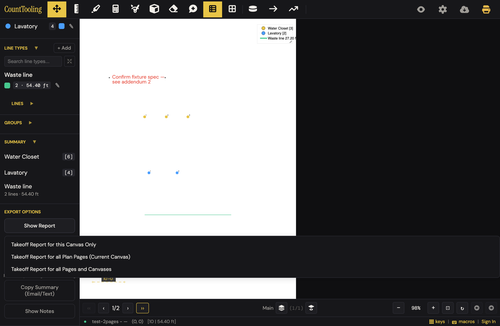
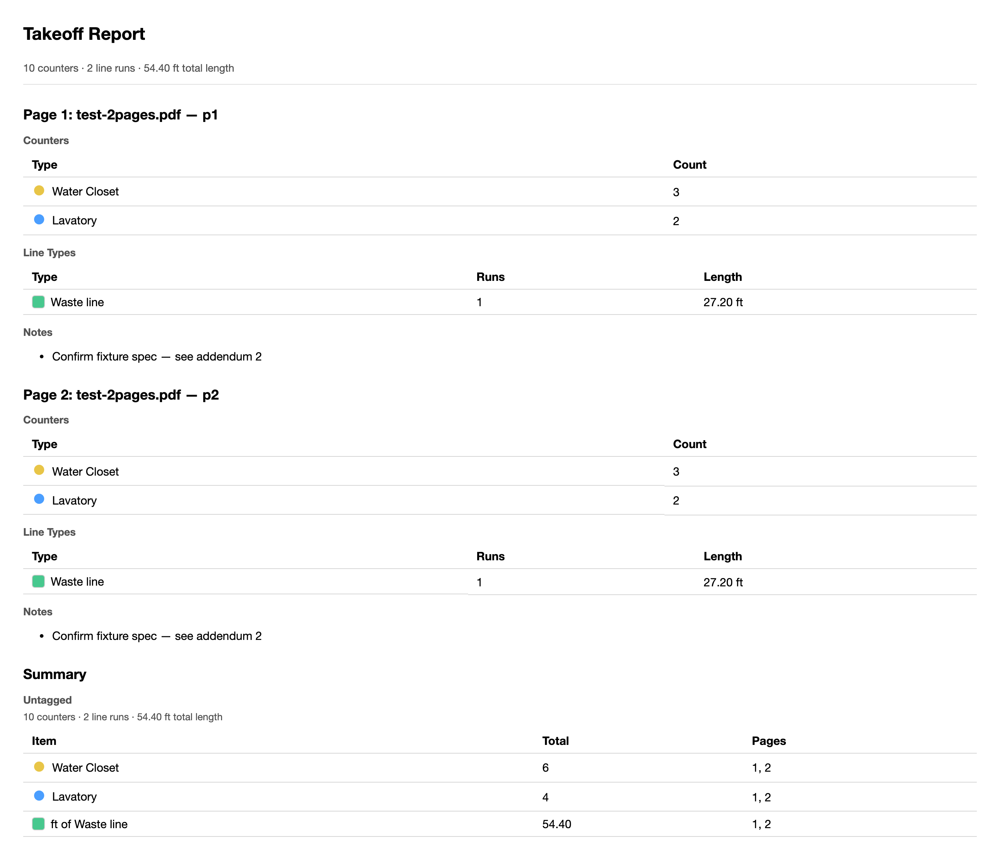
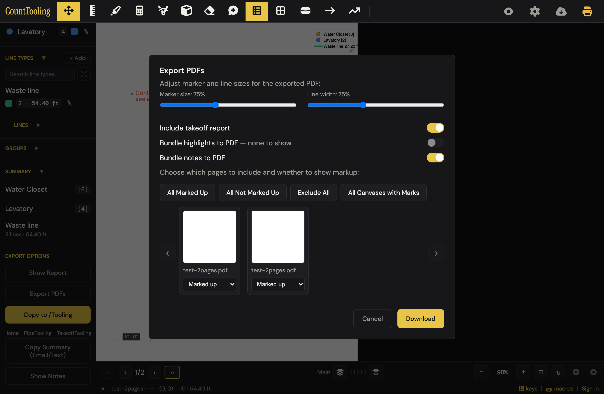
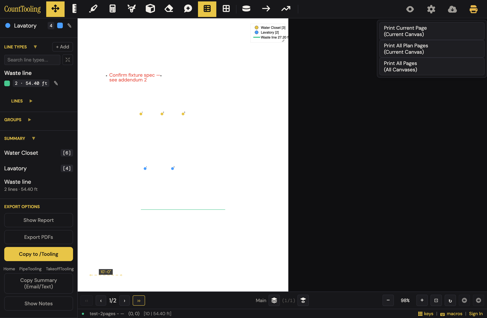
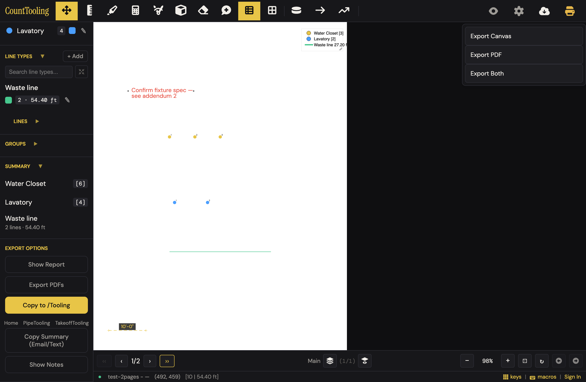
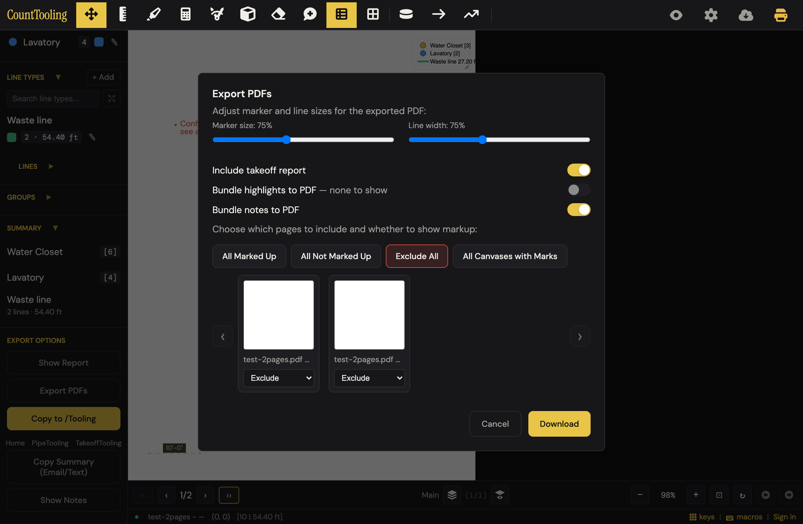

# J10 — Report, Export PDFs, download page — the thing you send

Personas: P · Status: ● walked 2026-08-02, re-walked 2026-08-09 (headless Chromium, local static server on :4110, test-2pages.pdf, seeded takeoff: 2 counters, 1 line type, 1 note/page, scale set)

> Seeded from the Phase-1 cross-index workflow (2026-08-02). Phase-2 walk done:
> route corrected below, friction/proposals/demo filled, 8 screenshots in img/.
> 2026-08-09 re-walk: every route step and all 7 friction findings reproduced
> exactly; Copy Summary clipboard content now verified (see Walk notes); exact
> Copy Summary scope wording captured (img/produce-deliverables-08.png).

## Entry points

- **sidebar** — #printReport "Show Report" button in the "Export Options" section, opens #showReportMenu with 4 scope options (this-canvas / all-canvases-on-page / all-pages-current-canvas / all-pages-canvases)
- **sidebar** — #specificPages "Export PDFs" button, opens #specificPagesModal
- **header** — #downloadCurrentPageBtn yellow printer icon (in #downloadCurrentPageDropdown, class consolidated-mobile), opens #downloadCurrentPageMenu with 4 Print modes (this-canvas / all-canvases / all-pages / all-pages-canvases)
- **header** — #exportDropdownBtn cloud icon (in #exportDropdown), opens #exportDropdownMenu: "Export Canvas" / "Export PDF" / "Export Both" / "Import Canvas"
- **header** — #exportBtn "Export" and #importBtn "Import" plain buttons (class replaced-by-status-bar) — Export writes canvas JSON, Import clicks #importInput (accept .json)
- **sidebar** — #exportBtnSidebar "Export" and #importBtnSidebar "Import" (delegate to the header buttons)
- **burger** — mobile burger (#headerBurger) builds a "Download" section (one row per visible .download-page-option) and an "Export" section (one row per visible .export-dropdown-option) in #rightMenuList
- **modal** — Project Settings modal #settingsDownloadPdf "Download PDF" button → App.downloadProjectPdf() (visible only when pages exist, not viewer, and pdfBuffer/pdfStoragePath present)
- **modal** — Advanced settings modal (#settingsAdvancedModal): #advancedExport "Export Canvas", #advancedExportPdf "Export PDF", #advancedImport (import) — each closes settings then delegates *(drift 2026-08-17, B18: #advancedExportPdf deleted — it duplicated the main modal's "Download PDF" under a second name; #advancedExport lost its yellow-primary styling)*
- **modal** — #importCanvasAfterPdfModal "Choose canvas file…" prompt after a PDF loads (canvas-JSON handoff receive path); related #canvasOnlyNeedsPdfBanner "Choose PDF" for canvas-only projects

## Current route (walked 2026-08-02)

Happy path to all three deliverables: **7 clicks, 2 real decisions** (report scope; accept-or-adjust the export defaults). All three worked first try with zero guide reading.

1. Sidebar → Export Options → **"Show Report"** — the button opens a scope dropdown, it does not show the report directly
2. Pick a scope — on a single-canvas project the menu shows **3** options, not the documented 4 ("Takeoff Report for all Canvases on Page" only appears when a page has multiple canvases). The report opens in a new tab: per-page counter/line tables, per-page notes, then a grand summary with page references. *Decision 1.*
3. Sidebar → **"Export PDFs"** — modal opens with everything already set for the send-to-GC bundle: "Include takeoff report" ON, "Bundle notes to PDF" ON, "Bundle highlights to PDF — none to show" auto-disabled when there are none, both pages preselected "Marked up". Sliders (Marker size / Line width, 25–150%, default 75%) persist to exportSettings. *Decision 2 is usually "touch nothing".*
4. Click **"Download"** → one PDF, ~0.3 s for 2 pages: report pages first, then the marked plan pages, then a "Notes Summary" page and per-note pages. Filename `takeoff-specific-pages_<name>.pdf`.
5. (One-pager) Header yellow printer icon (tooltip "Download current page as marked PDF") → opens a menu of **3** "Print …" modes here, not 4 — "Print All Canvases on Page" hides on single-canvas pages. "Print Current Page (Current Canvas)" downloads `takeoff-page1_<name>.pdf` — nothing prints. **On a single-page, single-canvas project the click downloads immediately with no menu.**
6. (Handoff path) Header cloud icon → "Export Canvas" saves marks as JSON (`test-2pages.json`, 2.9 KB). **"Import Canvas" is NOT in this menu once the project has any markup** — the recipient sees it only while their copy of the plan is unmarked. Without markup the menu flips to just "Export PDF" + "Import Canvas" (Export Canvas / Export Both hide).

Re-verified 2026-08-09 (all reproduced, no new divergences): 3-option report scope menu; Export PDFs defaults (report ON, notes ON, highlights " — none to show" disabled); Download → 7-page bundle (report ×2 incl. the orphan-row page, marked plans ×2, Notes Summary, 2 note strips) with report pages FIRST; printer menu = 3 "Print …" entries on the 2-page project, immediate no-menu download on single-page projects (marked or unmarked, `takeoff-page1_test-page.pdf`); printer "Print All Plan Pages" → `takeoff-all-pages_*.pdf`, 2 bare pages, no report/notes; cloud "Export PDF" → byte-identical copy of the uploaded file (`cmp` confirmed); Esc closes the modal but neither dropdown; Exclude All leaves Download full-yellow with `cursor:pointer`, `opacity:1`, `disabled=true`; zero-marks hides the whole Export Options block and flips the cloud menu; 2-page JSON into a 1-page plan applies page 1 and silently drops page 2.

Divergences from the Phase-1 doc-derived route:
- Show Report menu and printer menu are canvas-count-sensitive: 3 options each on this project, not the documented 4.
- With zero marks, "Show Report" and "Export PDFs" are hidden entirely (no empty-report dead end — good), and the cloud menu offers only "Export PDF" + "Import Canvas", so the documented "Export Canvas silently no-ops without markup" is unreachable through the UI.
- Esc closes the Export PDFs modal but does **not** close the Show Report or printer dropdowns (click-away only).
- Desktop default header = the consolidated cloud + printer dropdowns; the plain `#exportBtn`/`#importBtn` ("replaced-by-status-bar") and the sidebar Export/Import buttons are hidden.

## Naive attempt

Persona: estimator, marked set on screen, sending to a GC today, no guide. Two independent naive walks (08-02 and 08-09) agree; the 08-09 one actually fell into the trap the first only grazed. 08-09 walk: eye went **top-right** — the yellow printer icon reads as "print/output". (1) click printer — tooltip said "Download current page", but a menu of three "**Print** …" options appeared; hesitation. (2) "Print Current Page (Current Canvas)" → one-page marked PDF downloads. One-pager done in 2 clicks. For the report, (3) clicked the cloud icon ("Export project") → "Export Canvas / Export PDF / Export Both" — no "report" anywhere; (4) clicked "Export PDF" and got a silent download of the **unmarked original plan, byte-identical to the upload** — nothing on screen says so; an estimator in a hurry attaches the wrong file to the GC email. (5–6) scrolled the sidebar to the bottom, found "EXPORT OPTIONS", clicked "Show Report" → another scope menu in canvas jargon, (7) picked "all Plan Pages" on gut → report tab, exactly right, notes included per page. (8) "Export PDFs" → modal with every default already correct, (9) "Download" → the 7-page bundle, report up front. **9 actions, all three deliverables, one genuine wrong turn (the raw-PDF trap), no dead ends.** The 08-02 walk that started in the sidebar got there in 7 actions — the sidebar block is the good path, the header icons are where the traps live.

## Evidence

- **Telemetry visibility:** export_pdf fires on all three PDF routes with distinguishing payloads: {source:'specific-pages'} from the Export PDFs modal Download (features/export-pdfs.js:273), {source:'download-current-page', mode} from the printer button (features/output.js:400), and {source:'project-pdf'} from downloadProjectPdf (features/output.js:490). export_canvas fires on the canvas JSON export (app.js:3476). Blind: Show Report (no event at all — report views are invisible), which report scope was chosen, canvas JSON IMPORT (no event), modal opens/cancels, slider/toggle settings used, and page-selection composition.
- **Guide coverage:** [reports-and-exports.md](/guides/reports-and-exports/) — Primary guide: Show Report's 4 scopes, Export PDF dialog controls (sizes, include report, bundle highlights/notes, page selection), Download current page + its scope menu (lists 3 modes), Export/Import Canvas as JSON handoff, Hide marks for a clean drawing; [canvas-layers.md](/guides/canvas-layers/) — "Move marks between projects: canvas JSON" — Export Canvas writes marks/palette/groups without the PDF, Import Canvas loads into another project; export dialogs scope output to layers; [how-to-do-a-pdf-takeoff.md](/guides/how-to-do-a-pdf-takeoff/) — End-of-walkthrough step: Show Report for the full breakdown, Export PDF with markup/report/highlights/notes baked in; Export PDFs dialog screenshot; [plumbing-takeoff.md](/guides/plumbing-takeoff/) — Mentions legend + Show Report for counts/lengths by type and Export PDF as the reviewable deliverable; [electrical-takeoff.md](/guides/electrical-takeoff/) — Mentions Show Report full breakdown and Export PDF deliverable with report attached; [hvac-takeoff.md](/guides/hvac-takeoff/) — Export PDFs dialog screenshot; Room Volumes table appears in the report and email summary; Show Report link
- **Specs:** export-pdfs.spec.js (modal open via registry, page cards, bulk select enable/disable of Download, marker-scale slider, Cancel; deliberately does NOT click Download), output.spec.js (Download current page mode menu on multi-page project, this-canvas option yields real takeoff-page1_*.pdf download), pdf-bundle.spec.js (addReportPagesToPdf / addHighlightsToPdf / addNotesToPdf / hasAnyHighlights / hasAnyNotes registered on App), import-clear.spec.js (canvas JSON chosen through #importInput replaces the palette; import-canvas-after-PDF prompt), mobile-burger-menu.spec.js (Download/Export sections in the burger drawer; single-page PDF collapses Download to one row; consolidated dropdowns hidden on mobile), report.test.js (unit: escapeHtml, pickScaleForLineType, untagged-group handling in report.js)
- **Modals:** `specificPagesModal`, `importCanvasAfterPdfModal`, `canvasOnlyNeedsPdfModal`, `settingsModal`, `settingsAdvancedModal`
- **Hotkeys:** None — no HOTKEYS table entry maps to Show Report, Export PDFs, downloads, or canvas JSON; only the generic Esc "Close modal / Cancel" applies (closes #specificPagesModal)
- **Features touched:** Show Report, Export PDFs, Download current page, Canvas JSON export/import

## Guide gaps (doc-derived)

- Download project PDF (the raw PDF with no markup baked in — export dropdown "Export PDF"/"Export Both", Project Settings "Download PDF", Advanced "Export PDF") appears in no guide; nothing explains that on-screen "Export PDF" (raw file) differs from the "Export PDFs" modal (marked-up deliverable)
- Download current page menu has FOUR on-screen modes including "Print All Pages (All Canvases)" but reports-and-exports.md lists only three scopes (this canvas, all canvases on the page, all pages)
- Export PDFs modal per-page controls undocumented: per-card "Marked up / Not marked up / Exclude" select, per-card "Current canvas / All canvases" select (shown only on multi-canvas pages when marked), bulk buttons ("All Marked Up", "All Not Marked Up", "Exclude All", "All Canvases with Marks"), the thumbnail carousel with prev/next nav, and the " — none to show" disabled-toggle states
- Slider ranges and defaults (25–150%, default 75%) and persistence to exportSettings are undocumented
- The Advanced settings modal's Export Canvas / Export PDF / Import buttons and the #importCanvasAfterPdfModal prompt ("PDF loaded. Choose a canvas export (.json) to apply annotations.") are undocumented
- Export Canvas silently no-ops when the project has no markup (projectHasAnyCanvasMarkup guard) — not documented
- JSON export contents (counters, line types, icon names/order, custom icon paths, groups, rooms, legend/grid/multiply-zone settings, quick-key bindings, per-page scales/rotations/bakeFrame, active-canvas map) documented only as "palette, groups, and all"
- Show Report opens via window.open in a new tab — popup-blocker failure mode undocumented; the guide's Copy Summary and progress states ("Downloading…", "Exporting page N/M…") likewise undocumented

## Terminology on screen (recorded, not judged)

- Three different labels share one word: sidebar "Export PDFs" (marked-up deliverable modal), dropdown "Export PDF" (raw project PDF download), header "Export" (canvas JSON) — plus "Export Both"
- Download menu options say "Print": "Print Current Page (Current Canvas)", "Print All Canvases on Page", "Print All Plan Pages (Current Canvas)", "Print All Pages (All Canvases)" — the action is a PDF download, not printing
- Show Report menu wording: "Takeoff Report for this Canvas Only", "Takeoff Report for all Canvases on Page", "Takeoff Report for all Plan Pages (Current Canvas)", "Takeoff Report for all Pages and Canvases"
- Copy Summary scope menu (#copySummaryTextMenu): "This Canvas Only" / "All Visible Canvases" / "All Canvases" — a third dialect, and the only menu with "Visible"
- Copy Summary output header "--- Untagged ---" for marks not in any group
- The yellow primary button in Export Options reads "Copy to /Tooling", above links "Home | PipeTooling | TakeoffTooling"
- Per-page card select: "Marked up" / "Not marked up" / "Exclude"; bulk button "All Canvases with Marks"
- Toggle labels "Bundle highlights to PDF" / "Bundle notes to PDF" — "bundle" as a verb
- "Export Canvas" / "Import Canvas" — "canvas" here means the marks-JSON layer, not the drawing surface
- Disabled-toggle suffix " — none to show"
- Project Settings row "Download PDF" vs the modal confirm button "Download"
- Guide refers to the control as "the yellow printer button"; its tooltip reads "Download current page as marked PDF"

## Open questions for the Phase-2 walk

- When exactly are the consolidated header dropdowns (#exportDropdown, #downloadCurrentPageDropdown) shown versus the plain "replaced-by-status-bar" Export/Import buttons — what does a desktop user actually see by default? **→ answer:** desktop shows the consolidated cloud + printer dropdowns; `#exportBtn`, `#importBtn`, `#exportBtnSidebar`, `#importBtnSidebar` are all hidden. With no marks the cloud dropdown stays visible ("Export PDF" + "Import Canvas"); the printer icon stays visible too.
- Does Show Report's window.open('', '_blank') get popup-blocked in real browsers, and what does the user see then? **→ walk-blocked:** headless Chromium never blocks popups; the report opened normally. Real-browser blocker behavior still unverified.
- Empty states: Show Report with zero marks — what renders? Export Canvas with no markup silently returns — is there any feedback? Export PDFs with all pages excluded shows Download disabled — is the why apparent? **→ answer:** with zero marks the whole Export Options block ("Show Report", "Export PDFs", "Copy Summary") is hidden — no empty report is reachable. "Export Canvas"/"Export Both" also disappear from the cloud menu, so the silent no-op guard is unreachable via UI. Exclude All disables Download, but the button keeps full-strength yellow, `cursor: pointer`, opacity 1 — no visual cue at all (the lit red "Exclude All" button above is the only hint why).
- On a single-page, single-canvas project, does clicking the printer button skip the mode menu and download directly? **→ answer:** yes — one click, immediate `takeoff-page1_*.pdf` download, no menu; desktop matches the mobile collapse.
- Timing/UX on large sets: how long do "Exporting report…" and "Exporting page N/M…" hold the modal, and can the user cancel mid-export? **→ partial:** the 2-page bundle (report+notes on) downloaded in ~0.3 s with no visible progress UI at all. Large-set timing and mid-export cancel remain walk-blocked (test asset is 2 pages).
- Viewer / view-link sessions: are Show Report, Export PDFs, and Download current page available to viewers? **→ answer (stubbed view-link, local route intercept):** yes — Show Report, Export PDFs, the printer menu, the cloud export dropdown, and Copy Summary are all visible in a viewer session. downloadProjectPdf via pdfStoragePath is cloud-gated, not walked.
- Import Canvas edge cases: JSON with a different page count than the open PDF, palette conflicts, importing into a project with existing marks **→ partial:** imported the 2-page canvas JSON into a fresh 1-page project — palette and page-1 marks applied, page-2 marks silently dropped, no warning of any kind. Importing into a *marked* project is prevented at the surface level ("Import Canvas" hides once markup exists); replace-vs-merge messaging untested beyond that.
- downloadProjectPdf offline: when pdfBuffer is empty and the storage download path is needed, what does the failure toast flow look like without network? **→ not walked** (needs a cloud project with pdfStoragePath — NO CLOUD).
- Do the include-report / bundle toggles' " — none to show" disabled states re-evaluate if the user leaves the modal open while marks change elsewhere (multi-tab)? **→ not walked** (multi-tab sync out of scope for this pass).
- Where do sidebar Export Options controls live on mobile — inside the drawer sidebar, the burger, or both? **→ not walked** (journey is desktop-only per plan; Phase-1 evidence says the burger builds Download/Export sections).

## Friction findings

| # | severity | what happens | why it hurts | verdict |
|---|----------|--------------|--------------|---------|
| 1 | stumble | Three neighbors share the word "Export": sidebar **"Export PDFs"** (the marked deliverable), cloud menu **"Export PDF"** (the *unmarked* original plan — byte-identical to the upload), and **"Export Canvas"** (marks JSON). | An estimator hunting "export" can grab the unmarked plan and email it to the GC without noticing — the wrong file, silently.  | CONFIRMED — independently reproduced: cloud "Export PDF" silently downloaded a buffer-equal copy of the upload (795 B, `Buffer.equals` true), menu wording verified |
| 2 | stumble | Printer icon's tooltip says "**Download** current page as marked PDF", but clicking opens a menu of "**Print** Current Page / Print All Plan Pages / Print All Pages" — and every one *downloads* a PDF; nothing prints. | The label mismatch makes you hesitate ("is this going to open the print dialog?") and teaches you not to trust labels.  | DOWNGRADED(papercut — the contradiction reproduces exactly (tooltip text, 3 "Print …" entries, click yields `takeoff-page1_*.pdf` download), but in both naive walks the cost was one hesitation with the correct file delivered on the first click; no wrong output, no recovery time — that is annoyance, not lost time/confidence) |
| 3 | papercut | Report scope menu speaks layer jargon: "Takeoff Report for this **Canvas** Only" — on a project that has exactly one canvas per page. | "Canvas" is software language; the 7 daily users mostly never made a second canvas. First-timers stall on which of 3 options is "just… everything". | CONFIRMED — reproduced exact wording on a single-canvas project, plus Copy Summary's third dialect ("This Canvas Only / All Visible Canvases / All Canvases") |
| 4 | papercut | Bundle pagination: the report spills one orphan table row ("ft of Waste line") onto its own near-blank page; notes add a near-empty "Notes Summary" page plus odd strip-sized note pages (535×162 pt) mixed into a letter/landscape set. | The deliverable that represents your company to the GC looks less polished than the on-screen report.  | CONFIRMED — screenshot 06 shows the lone "ft of Waste line" row on a near-blank page; not re-rendered by verifier, accepted on photo evidence + two walker walks |
| 5 | papercut | After "Exclude All", the Download button disables but keeps full-strength yellow, opacity 1, pointer cursor. | Clicking does nothing with zero feedback; on any other day that's "the app is broken".  | CONFIRMED — reproduced via computed style: `disabled=true`, `opacity:1`, `cursor:pointer`, background rgb(232,197,71) |
| 6 | papercut | Esc closes the Export PDFs modal but not the Show Report / printer dropdowns (click-away only). | Inconsistent escape hatch; minor but felt when keyboard-driving. | CONFIRMED — reproduced: Esc closed #specificPagesModal; both #downloadCurrentPageMenu and #showReportMenu stayed open after Esc |
| 7 | stumble (edge) | Importing a canvas JSON with more pages than the open PDF applies page 1 and silently drops the rest — no toast, no count. (Re-verified 08-09: state shows p1 marks applied, no modal, no toast.) | The handoff recipient believes they got the whole takeoff; the missing pages surface later as missing scope. | CONFIRMED — reproduced with a fresh 2-page export into a 1-page plan: page-1 marks applied, page count stayed 1, zero toasts (MutationObserver on body), zero visible modals |
| 8 | papercut | The loudest control in the Export Options block is the solid-yellow "**Copy to /Tooling**" — visually outranking "Show Report" and "Export PDFs", with "Home / PipeTooling / TakeoffTooling" links under it. | Scrolling down hunting for "the thing you send", the eye lands first on a URL-path label that means nothing to an estimator; the two buttons that ARE the deliverables look secondary. | CONFIRMED — computed styles: Copy to /Tooling bg rgb(232,197,71) solid yellow; Show Report bg transparent with grey text rgb(158,155,150); Export PDFs bg rgb(30,30,34) |

Duplicate-surface moments logged:
- **Sidebar "Export PDFs" vs printer "Print All Pages (All Canvases)"** — both produce a multi-page marked PDF; the printer path skips the report/notes/size options, so the "same" bundle differs depending on which door you used (verified 08-09: sidebar → 7-page bundle; printer all-pages → 2 bare pages, `takeoff-all-pages_*.pdf`).
- **Three scope dropdowns with three dialects** — Show Report ("Takeoff Report for this Canvas Only…"), printer ("Print Current Page (Current Canvas)…"), Copy Summary ("This Canvas Only / All Visible Canvases / All Canvases" — captured 08-09, img/produce-deliverables-08.png). Same mental question — "how much of the project?" — asked three ways in three word-sets; only Copy Summary offers "All Visible Canvases".
- **Three doors to the raw, unmarked PDF** — cloud "Export PDF", Project Settings "Download PDF", Advanced settings "Export PDF".

## Proposals

- **keep** — Export PDFs modal defaults (report ON, notes ON, highlights auto-off when none, marked pages preselected). The naive walk produced the correct GC bundle in 2 clicks with zero settings touched. Spirit: (1) happy path is already minimal; (2) "Include takeoff report" is trade language; (3) removes every decision a defaults-trusting user would face; (4) found unaided. [verified — reproduced all defaults; one correction: the highlights toggle is auto-*unchecked* with the " — none to show" suffix, not disabled (`disabled=false` in the verifier run)]
- **keep** — Zero-marks state hides Show Report / Export PDFs / Copy Summary entirely. You cannot produce an empty deliverable. Spirit: (1) removes dead-end clicks; (2) n/a; (3) deletes an entire error state; (4) nothing to find is the point. [verified — reproduced: all four Export Options controls hidden on an unmarked project; cloud menu flips to "Export PDF" + "Import Canvas"]
- **keep** — Single-page projects skip the printer scope menu and just download. Spirit: (1) one click; (2) n/a; (3) removes a menu; (4) yes. [verified — reproduced marked and unmarked: immediate `takeoff-page1_test-page.pdf`, no menu]
- **keep** — Copy Summary clipboard output is clean trade-language text ready to paste into an email. [verified — reproduced with clipboard permissions: "Takeoff Summary / --- Untagged --- / • Water Closet: 3 (page 1) / • 20.40 ft of Waste line: 1 run (page 1)"]
- **polish** — Rename the printer menu's "Print …" entries to "Download …" (matching its own tooltip), or retitle the menu "Download marked PDF". Spirit: (1) removes a hesitation; (2) "download the marked sheet" is what a plumber says; (3) deletes a label/behavior contradiction; (4) yes — same button, honest words. spiritPass: true. [verified — contradiction reproduced; pure rename, removes the lie, adds nothing]
- **polish** — Rename cloud-menu "Export PDF" to "Original PDF (no marks)". Spirit: (1) kills the wrong-file wrong turn; (2) "original plan, no marks" is trade language; (3) removes the trap without removing the feature; (4) yes. spiritPass: true. [verified — the trap reproduced byte-identically; rename removes the one genuine wrong turn of the journey]
- **polish** — When every page has one canvas, drop "Canvas" from the report scope menu: "This page" / "All plan pages" (the menu already collapses options by canvas count — finish the job in the wording). Apply the same collapse to the printer menu and Copy Summary's "This Canvas Only / All Visible Canvases / All Canvases" so all three scope menus speak one dialect. Spirit: (1) fewer words to parse; (2) "page" not "canvas"; (3) removes jargon from the happy path while multi-canvas users still get the full menu; (4) yes. spiritPass: true. [verified — all three dialects reproduced; the count-sensitive collapse mechanism already exists, so this invents no UI]
- **polish** — Bundle pagination: keep report table rows together across page breaks, fold the "Notes Summary" onto the first notes page, emit note pages at uniform size. Spirit: (1) no step change; (2) n/a; (3) removes an embarrassment from the thing that gets emailed; (4) invisible fix, nothing to find. spiritPass: true. [verified — invisible output-quality fix: adds zero steps, zero words, zero surface; orphan-row page photo-evidenced]
- **polish** — Grey out the Download button when disabled (opacity + cursor). Spirit: (1) prevents dead clicks; (2) n/a; (3) removes a fake-broken moment; (4) yes. spiritPass: true. [verified — full-yellow disabled state reproduced via computed style]
- **polish** — Import Canvas with a page-count mismatch: toast "Applied marks to 1 of 2 pages — the plan has fewer pages than the export." Spirit: (1) no new steps; (2) plain words; (3) removes a silent scope loss; (4) yes, it comes to you. spiritPass: true. [verified — silent drop reproduced (no toast, no modal); a passive toast adds no steps or decisions]
- **polish** — Demote "Copy to /Tooling" to the same visual weight as its neighbors (or make "Export PDFs" the yellow primary in Export Options). Spirit: (1) the eye lands on the deliverable button first — fewer mis-reads; (2) neutral styling beats promoting a URL-path label; (3) removes visual misdirection without removing the hand-off feature; (4) yes — the right button becomes the obvious one. spiritPass: true. [verified — style disparity reproduced by computed style; restyling only, no new surface]
- **teach** — The raw-vs-marked export split ("Export PDF" vs "Export PDFs") needs a line in reports-and-exports.md until/unless the rename lands; likewise Import Canvas only appearing on unmarked projects. Fails spirit test (adds reading, changes no behavior) — hence teach. spiritPass: false. [verified — correctly self-classified as teach]

## Guide actions

*(Phase 5)*

## Demo moment

Open a marked set, click **Export PDFs**, click **Download** — under a second later you're holding one PDF: takeoff report up front, every marked sheet behind it, your margin notes at the back. Two clicks, nothing to configure, and it's the email attachment the GC actually wants. (img/produce-deliverables-03.png → img/produce-deliverables-02.png)

## Walk notes

Walked 2026-08-02 and re-walked 2026-08-09, headless Chromium (Playwright) against a local static server on port 4110, `/app/` + `test-2pages.pdf` loaded via `#pdfInput`, takeoff seeded through `window.state`/`window.App` (2 counters, 1 line type, 1 note per page, scale 1/8"=1'). Single-page variants used `test-page.pdf`. Viewer check used the local `get-view-project` route-stub recipe from view-only.spec.js — no cloud calls made. All non-local network requests were route-aborted in both walks; the only session surface seen was the status-bar "Sign In" link — never clicked (NO CLOUD), so no wall text was ever shown.

**Not walked (and why):**
- Anything requiring a session: sign-in, cloud save, share-link creation, `downloadProjectPdf` via `pdfStoragePath`, offline-failure toasts. No wall was hit because no cloud action was attempted; the only session surface on screen is the header "Sign In" link (bottom-right status bar) — NO CLOUD rule.
- Popup-blocker failure mode of Show Report / Show Notes (headless Chromium doesn't block popups; both opened).
- Large-set export timing, progress text ("Exporting page N/M…"), and mid-export cancel — 2-page asset exports in ~0.3 s with no progress UI ever visible.
- Mobile pass — journey flagged Mobile: no.
- Multi-tab " — none to show" re-evaluation.
- Real print-to-paper from the report tab.

**Environment quirks:**
- ~~`navigator.clipboard.readText()` returned empty~~ **Resolved on the 08-09 re-walk:** with `clipboard-read`/`clipboard-write` granted, Copy Summary → "All Canvases" put clean plain text on the clipboard: `Takeoff Summary / --- Untagged --- / • Water Closet: 6 (pages 1, 2) / • Lavatory: 4 (pages 1, 2) / • 40.80 ft of Waste line: 2 runs (pages 1, 2)`. Trade-language, paste-ready. ("Untagged" is the only jargon in it — it's the no-groups bucket.)
- "Show Notes" opens a jsPDF blob URL in a new tab (a notes-only PDF) with **no scope menu** — it goes straight to the PDF. In headless Chromium the popup materialized as a download named by the blob UUID (`9cc9f782-….pdf`) — which also hints that a real user hitting "save" in Chrome's PDF viewer gets a UUID filename, not a takeoff name (unverified in a headed browser).
- Bundle inspection done by rendering the downloaded PDF back through the app's own pdf.js: 7 pages = report ×2 (second is the orphan row), marked plans ×2, Notes Summary ×1, note strips ×2 at 535×162 pt. Page ORDER is report → plans → notes, so the GC sees the numbers first — good.
- 08-09 downloads produced: `takeoff-page1_test-2pages.pdf` (printer, current page), `test-2pages.pdf` (cloud "Export PDF" — byte-identical to source per `cmp`), `takeoff-specific-pages_test-2pages.pdf` (the 7-page bundle), `test-2pages.json` (Export Canvas), `takeoff-all-pages_test-2pages.pdf` (printer all-pages, 2 bare pages), `takeoff-page1_test-page.pdf` (single-page immediate download).

**Screenshot index:**
- img/produce-deliverables-01.png — Show Report scope dropdown (canvas wording; 3 options on single-canvas project)
- img/produce-deliverables-02.png — the takeoff report tab (demo)
- img/produce-deliverables-03.png — Export PDFs modal, defaults already right (demo)
- img/produce-deliverables-04.png — printer menu: "Print …" labels on download actions (friction)
- img/produce-deliverables-05.png — cloud menu: "Export PDF" raw-plan trap beside "Export Canvas" (friction)
- img/produce-deliverables-06.png — bundle page 2: orphan report row on a near-blank page (friction)
- img/produce-deliverables-07.png — Exclude All: Download disabled but still full yellow (friction)
- img/produce-deliverables-08.png — Copy Summary's own scope menu, third dialect: "This Canvas Only / All Visible Canvases / All Canvases" (duplicate surface)

## Verification (2026-08-02)

Adversarial re-drive run 2026-08-09, independent scripts (not the walker's), headless Chromium via Playwright against a local static server on **port 4310**, all non-local requests route-aborted (NO CLOUD). Assets: `test-2pages.pdf` and `test-page.pdf` at repo root, marks seeded via `window.state`/`window.App` (fresh seed, not the walker's).

**Reproduced first-hand (7 of 8 findings):**
- #1 — cloud "Export PDF" downloaded `test-2pages.pdf`, `Buffer.equals` true against the uploaded source (795 B both); no on-screen indication it is the unmarked original. Cloud menu = "Export Canvas / Export PDF / Export Both" as claimed.
- #2 — tooltip title is exactly "Download current page as marked PDF"; menu shows exactly 3 "Print …" entries on the 2-page single-canvas project; clicking the first downloads `takeoff-page1_test-2pages.pdf`, no print dialog. **Downgraded to papercut**: both recorded naive walks show a one-beat hesitation and the right file on the first click — no wrong output, no measurable recovery cost. The three-dialect + wrong-file problem is finding #1; this one is a label annoyance.
- #3 — report scope menu wording reproduced verbatim (3 canvas-jargon options on a single-canvas project); Copy Summary menu reproduced as the third dialect.
- #5 — after Exclude All: `disabled=true`, `opacity:1`, `cursor:pointer`, `background rgb(232,197,71)` — exactly as claimed.
- #6 — Esc closed `#specificPagesModal`; `#downloadCurrentPageMenu` and `#showReportMenu` both remained open after Esc.
- #7 — exported a fresh 2-page canvas JSON (2 pages confirmed in the file), imported into a 1-page `test-page.pdf` project: page-1 marks applied (5 markers), page count stayed 1, no toast (body MutationObserver), no visible modal. Silent drop confirmed.
- #8 — computed styles confirm the hierarchy inversion: "Copy to /Tooling" solid yellow rgb(232,197,71); "Show Report" transparent bg + grey text; "Export PDFs" dark bg.

**Accepted on photo evidence (1 of 8):** #4 bundle pagination — screenshot 06 shows the lone "ft of Waste line | 54.40 | 1, 2" row on a near-blank page; not re-rendered by the verifier, but the walker rendered the bundle in two independent walks.

**Keeps re-proven:** modal defaults (report ON, notes ON, highlights unchecked " — none to show", both page selects "Marked up"); zero-marks state hides Show Report / Export PDFs / Copy Summary / Copy to /Tooling and flips the cloud menu to "Export PDF" + "Import Canvas"; single-page printer click downloads immediately with no menu (marked AND unmarked); Copy Summary clipboard text is clean trade language.

**Corrections to the walker's record (none change a finding):**
- The highlights toggle is auto-**unchecked** when there are no highlights, not "auto-disabled" (route step 3 / keep #1): verifier measured `checked=false, disabled=false` with the " — none to show" label suffix.
- On the seeded single-page project the Copy Summary menu showed only 2 visible options ("All Visible Canvases" / "All Canvases" — no "This Canvas Only"); the 3-option version reproduced on the 2-page project. Scope menus are even more count-sensitive than documented; strengthens finding #3, doesn't change it.

**Verdict summary:** 7 CONFIRMED, 1 DOWNGRADED (#2 stumble → papercut), 0 KILLED. All 12 proposals [verified]; none rejected — every polish is a rename, restyle, or invisible output fix that removes something (a lie, a trap, jargon, a dead state) and adds no steps, and the one behavior-plus-docs item was already correctly demoted to teach by the walker. No manufactured findings detected: every friction row was either reproduced mechanically or is photo-evidenced.
