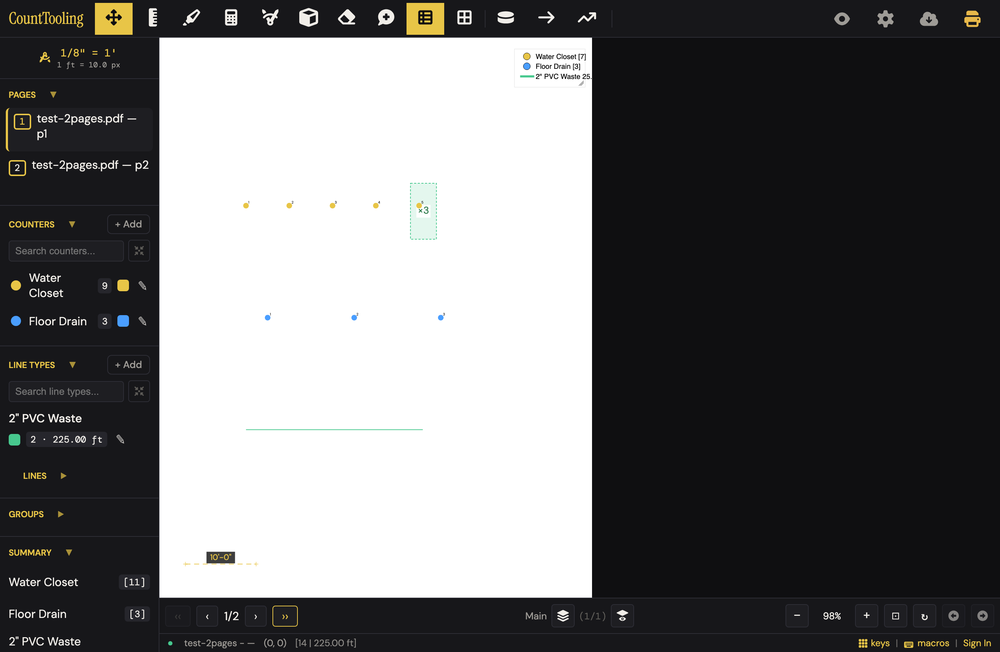
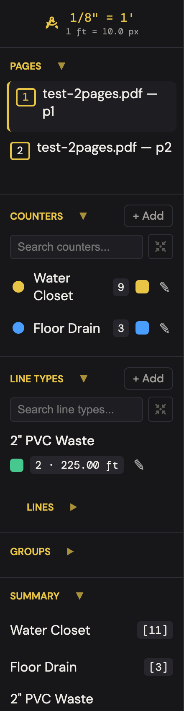
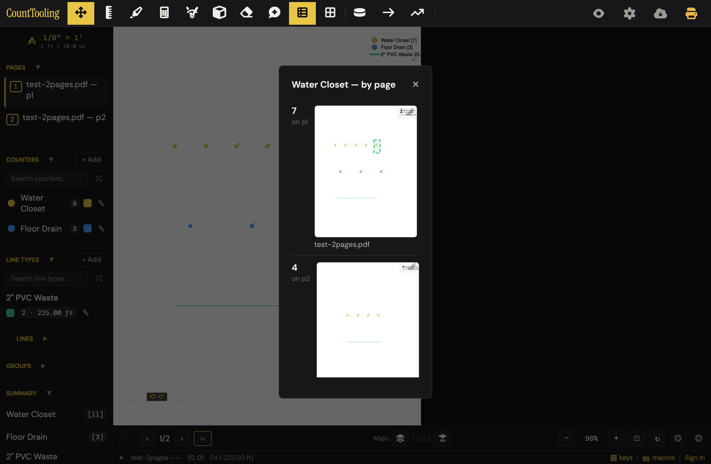
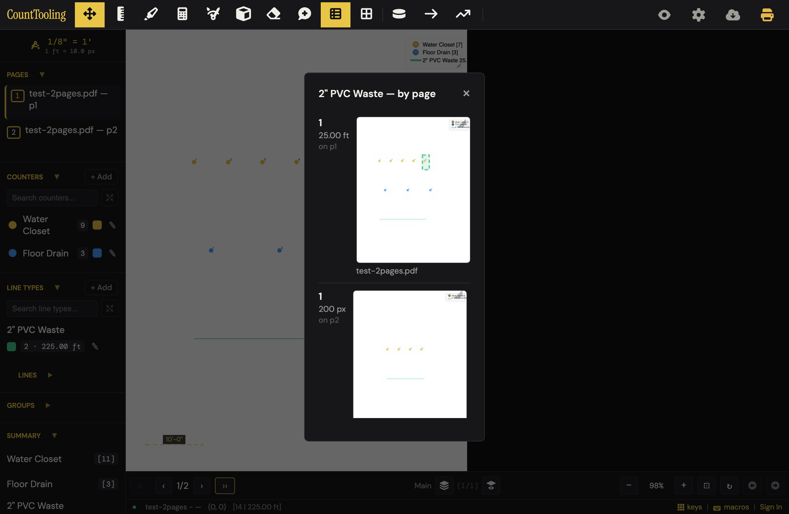
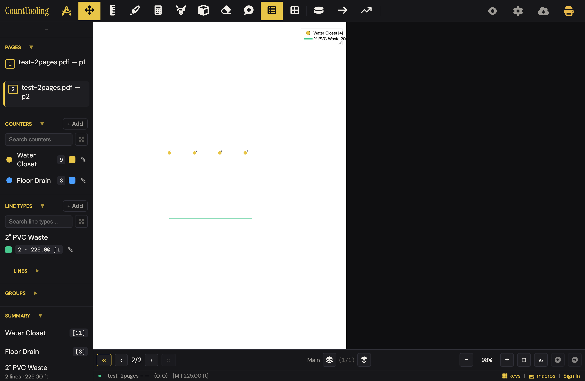
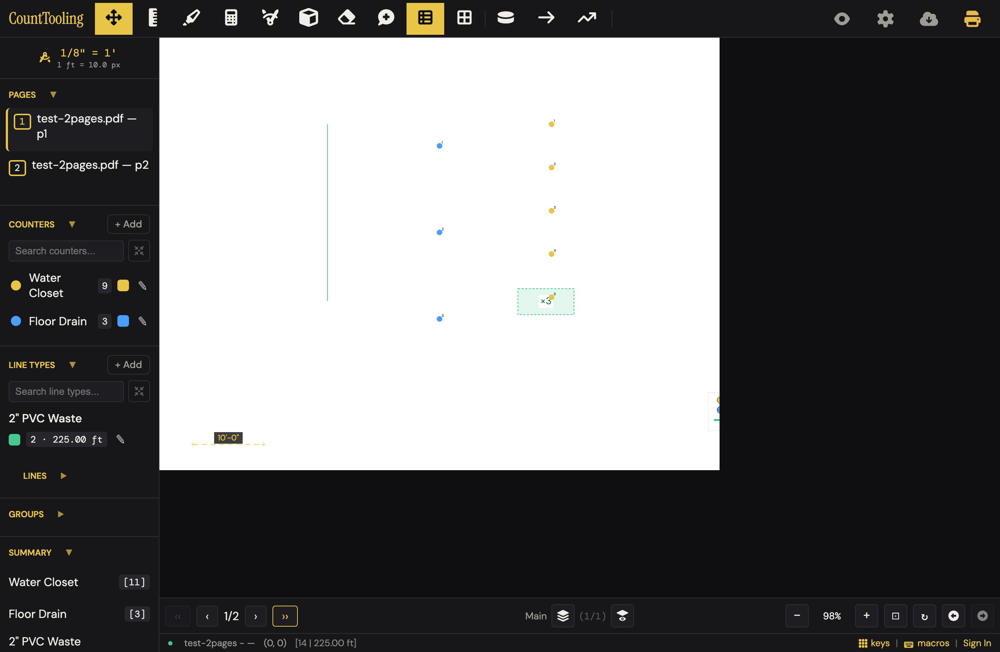
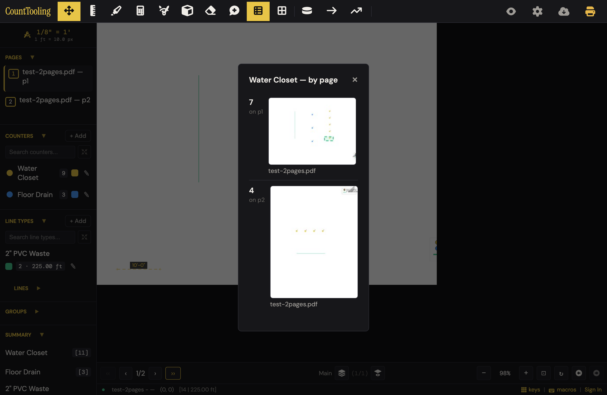
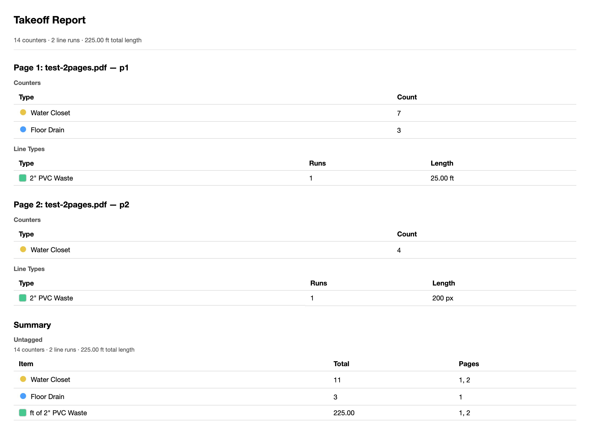

# J18 — Prove the number before the bid goes out

Personas: P E H · Status: ● walked (Phase 2, 2026-08-02 — headless Chromium on `test-2pages.pdf`, desktop 1380×900; journey's Mobile field is "no", so no phone pass)

> Added by the Phase-1 coverage critic ("no 'double-check my counts before sending' route exists"), approved 2026-08-02. **No Phase-1 seed dossier existed for J18** — the Entry points / Evidence / Terminology / Open questions sections below were assembled during the Phase-2 walk itself (code + guides + specs read in place), then verified against the live app.

## Entry points

- **sidebar** — Summary section: #summarySectionTitle "Summary ▼" (click collapses, title "Click to collapse"); #summaryList rows — per-counter "[total]" badges and per-line-type "N lines · X ft" rows (click opens #summaryCountDetailModal; cursor:pointer is the only affordance)
- **sidebar** — #printReport "Show Report" button → 4-scope dropdown (#showReportMenu) → full Takeoff Report in a new tab; #copySummaryText "Copy Summary" dropdown sits beside it (J11's surface)
- **status bar** — #statusTotals live "[count | length]" pair, e.g. "[14 | 225.00 ft]" (hover tooltip "14 counters | 225.00 ft of lines"; NOT clickable)
- **footer** — #rotatePage "↻" button, title "Rotate 90° right" (mid-takeoff rotation; enabled even with no PDF loaded — silent no-op)
- **hotkey** — R — Rotate page (viewer-allowed); works even while the count-detail modal is open
- **header** — #legendBtn "Summary legend (right-click for settings)" toggle + sidebar twin #legendBtnSidebar; right-click → #toolContextMenu → "Legend Settings…" (#legendSettingsModal)
- **canvas** — the legend itself (on by default, draggable/resizable, shows CURRENT-PAGE numbers)
- **modal** — #summaryCountDetailModal "<name> — by page": per-page count/length + async-rendered thumbnail per page; closes via × or Esc (overlay click does nothing — app-wide convention)

## Current route (walked 2026-08-02) — 9 steps, 4 decision points

1. Takeoff exists (seeded per the walk recipe: 2 counters, 1 line type, marks on both pages, a ×3 multiply zone on p1, p1 scaled 10 px/ft, p2 left unscaled). The audit starts at the **footer**: "[14 | 225.00 ft]" — an unlabeled pair; hover reveals "14 counters | 225.00 ft of lines". 
2. **Decision: which number to trust.** Four Water Closet figures are on screen at once — legend "Water Closet [7]" (current page, multiplied), Counters section "9" (raw markers, all pages, NO multiply factor), Summary "[11]" (all pages, multiplied), footer "14" (all counters together). Nothing labels any of them. 
3. Scroll the sidebar to **Summary** and click the "Water Closet [11]" row — "Water Closet — by page" opens: **7 on p1, 4 on p2, each with a thumbnail of the sheet showing exactly where the marks sit** (multiply-zone math already applied per page; 7 = 4 + 1×3). This is the proof surface. Esc closes. 
4. Click the line-type row ("2 lines · 225.00 ft") — per-page breakdown is **honest about units**: "1 · 25.00 ft on p1", "1 · **200 px** on p2" (p2 has no scale). The rollup above it silently summed 25 ft + 200 px into "225.00 ft" (friction #1). 
5. The on-canvas **legend** (on by default) gives the current page's numbers only — flip to p2 and it reads "Water Closet [4]" / "2" PVC Waste 200…" (truncated at the legend edge; the scale chip top-left shows just "—" for the unscaled page). 
6. **Mid-takeoff rotation**: press R (or the footer ↻) — the page re-rasters 90°, every mark, line, zone and the 10'-0" scale bar rotate with it, and the totals do not move ("[14 | 225.00 ft]" before and after). The legend, anchored in page coords, ends up half off the sheet edge (friction #6). 
7. Re-open the drill-down after rotating — the thumbnails re-render in the new orientation, so the evidence matches the screen. 
8. **Decision: report scope.** "Show Report" → four options ("Takeoff Report for this Canvas Only / for all Canvases on Page / for all Plan Pages (Current Canvas) / for all Pages and Canvases") — canvas-jargon; pick the last for the whole job.
9. The **Takeoff Report** opens in a new tab: headline "14 counters · 2 line runs · 225.00 ft total length", then per-page tables (honest: p2's run listed as "200 px") and a Summary table ("Water Closet 11 — pages 1, 2"). The headline repeats the px-into-ft sum (friction #1). 

Remaining decisions counted: trust-which-number (step 2), open-which-row (3/4), report scope (8), and whether the p2 "200 px" means a re-measure is needed.

## Naive attempt

Persona: estimator, bid due, double-checking a finished takeoff (seeded). Eye went bottom-first: the footer "[14 | 225.00 ft]" — cryptic until hover; clicking it does nothing (2 dead clicks — it *looks* like the audit entry). Up the sidebar: Counters says Water Closet **9**, Summary says **[11]** — trust wobble; only after spotting the dashed "×3" box on the plan did the difference get a story, the UI never tells it. The Summary row's pointer cursor invited a click — "Water Closet — by page" with per-page counts and thumbnails was the payoff, found in one click and genuinely convincing. The line total "225.00 ft" survived every surface (footer, sidebar, legend, report headline) until the drill-down finally admitted "200 px on p2" — a naive estimator who never opens the drill-down ships a 225-ft number whose real content is 25 ft plus an uncalibrated sheet. Net: proof found in ~6 productive actions + 2 dead clicks on the footer; the wrong-number trap was only visible in one of the five total-bearing surfaces.

## Evidence

- **Telemetry visibility:** zero. No event fires for opening the count-detail modal, Show Report, Copy Summary, legend toggles, or page rotation (only 7 event kinds exist app-wide; project_save/session_start are ambient). The whole audit journey is telemetry-blind — consistent with `_telemetry-2026-08.md`'s J10 blind-spot note; if exports are rare because people trust (or don't trust) the numbers, nothing measures it.
- **Guide coverage:** [how-to-do-a-pdf-takeoff.md](/guides/how-to-do-a-pdf-takeoff/) step "review the summary" — legend, "click any total for a per-page breakdown with thumbnails — proof of exactly where every item was counted", Show Report; [reports-and-exports.md](/guides/reports-and-exports/) — "Count detail … The takeoff audits itself" + summary-detail.png; [preparing-a-plan-set.md](/guides/preparing-a-plan-set/) — aside "(You can also rotate any page later with `R`; your marks rotate with the page.)"; [working-faster-with-the-keyboard.md](/guides/working-faster-with-the-keyboard/) — `R` hotkey row. No guide covers the four report scopes, the footer totals pair, or legend-vs-Summary semantics.
- **Specs:** summary-detail.spec.js (registry contract, counter + line-type breakdowns, thumbnail-loop cancellation on close), legend-settings.spec.js, rotation-share-roundtrip.spec.js, render-pixels.spec.js, page-switch-cache.spec.js, copy-tooling-feet.spec.js (always-feet convention on copy surfaces)
- **Modals:** `summaryCountDetailModal`, `legendSettingsModal` (+ `#toolContextMenu` and `#showReportMenu` floating surfaces)
- **Hotkeys:** R — Rotate page (viewer-allowed); Esc — close the count-detail modal
- **Features touched:** Summary panel + count detail (a Phase-1 feature orphan, now claimed), Live footer totals, Summary legend + Legend Settings, Page rotation (R) mid-takeoff (the other orphan), Multiply zones (as they land in counts), Takeoff Report scopes

## Guide gaps (walk-derived)

- The four Show Report scopes ("this Canvas Only" … "all Pages and Canvases") are named in no guide; reports-and-exports says only "Open Show Report"
- The Counters-section badge counts raw markers while Summary/footer/report multiply through ×N zones — the discrepancy (9 vs 11 here) is documented nowhere
- The legend showing *current-page* numbers (vs Summary's project totals) is never stated; how-to-do-a-pdf-takeoff calls it "your counts and lengths by type as you work"
- The footer "[count | length]" pair appears in no guide at all
- Unscaled-page behavior — per-page surfaces showing "px" and rollups summing those px as ft — is undocumented (and wrong; friction #1)
- Mid-takeoff rotation gets one parenthetical aside in preparing-a-plan-set; no guide shows that totals and drill-down thumbnails survive rotation (a genuine trust point worth selling)

## Terminology on screen (recorded, not judged)

- "[14 | 225.00 ft]" footer pair; tooltip "14 counters | 225.00 ft of lines"; empty state "[0 | 0]" / "0 counters | 0 of lines"
- "Takeoff Report for this Canvas Only" / "for all Canvases on Page" / "for all Plan Pages (Current Canvas)" / "for all Pages and Canvases" (Show Report menu)
- "Water Closet — by page" (modal title; default markup says "Count by Page"); rows "7 on p1", "1 25.00 ft on p1", "**200 px** on p2"
- "Summary legend (right-click for settings)" (legendBtn title); "Legend Settings…" menu item
- Legend Settings labels: "Show border", "Background opacity", "Text opacity", "Legend size", "Highlight resize area", "Show room volumes"
- "Rotate 90° right" (↻ title); sidebar scale chip "1/8" = 1' / 1 ft = 10.0 px" vs bare "—" on an unscaled page
- Report headline "14 counters · 2 line runs · 225.00 ft total length"; Summary table row "ft of 2" PVC Waste — 225.00"; group header "Untagged"
- Footer canvas cluster "Main (1/1)" (layer jargon inside the audit's field of view)

## Open questions for the Phase-2 walk

*(constructed during the walk — no Phase-1 seed existed; answered in place)*

- Do the footer, Summary, Counters section, legend, and report all agree on one number? **-> No. Same takeoff, four WC figures at once: legend [7] (current page, multiplied), Counters 9 (raw markers, all pages), Summary [11] (multiplied), footer 14 (all counters). Report matches Summary (11) and legend (7/4 per page). Code: sidebar-lists.js counts `markers.length`; summary-list.js/status-bar.js multiply via getMultiplyZoneForPoint.**
- Are drill-down counts multiply-zone adjusted, and does the thumbnail show the zone? **-> Yes and yes: "7 on p1" = 4 + 1×3, and the dashed ×3 rectangle renders in the thumbnail.**
- What do totals do when a page has no scale? **-> Per-page surfaces are honest ("200 px"); every rollup (footer, Summary row, Lines list, legend, report headline) adds raw px into the ft sum — "225.00 ft" for 25 real ft. Verified twice, incl. a 100%-real-click reproduction (see friction #1).**
- Can a run even land on an unscaled page, given the "Set Scale first" gate? **-> Yes — the gate only checks when arming the tool. Armed on scaled p1, page-flip to unscaled p2, two clicks: line placed, no toast, footer now "[0 | 133.20 ft]". The J5 gate is a turnstile, not a fence.**
- Does mid-takeoff rotation preserve marks, totals, and the drill-down evidence? **-> Yes: marks/zones/scale bar rotate with the raster, totals identical, re-opened drill-down thumbnails render in the new orientation. Legend ends up half off-sheet (friction #6).**
- Is R gated while the count-detail modal is open? **-> No — the page rotates underneath and the open modal's thumbnails go stale (friction #5).**
- How does the drill-down close? **-> × or Esc; overlay click does nothing (no modal in the app closes on overlay click — convention, not a J18 defect).**
- Does the Summary roll up by group? **-> Not walked with groups seeded; report showed the "Untagged" group header. Groups rollup + multi-canvas report scopes are walk-blocked leftovers.**
- Does anything log the audit? **-> No `logUserEvent` call sites on any surface of this journey (code-verified).**

## Friction findings

| # | severity | what happens | why it hurts | verdict |
|---|----------|--------------|--------------|---------|
| 1 | blocker | **Pixels are summed into feet.** A run on an unscaled page is stored in raw px; every rollup — footer "[14 \| 225.00 ft]", Summary "2 lines · 225.00 ft", Lines list, legend, and the Takeoff Report headline "225.00 ft total length" — adds px + ft into one "ft" number (true footage here: 25 ft). Reachable by normal use: the "Set Scale first" gate only fires when *arming* the tool, so an armed Line tool page-flipped onto an unscaled sheet keeps placing (real-click verified: no toast, footer "[0 \| 133.20 ft]"). Only the drill-down and report *per-page rows* admit "200 px". | The number on the bid document is confidently wrong, and the wrongness hides in the exact surfaces an estimator checks first. 9× off in this walk. | **CONFIRMED** — independently re-driven (port 4318): both halves reproduce. Code: line-metrics.js `lineLengthFeetForTotals` comment admits "returns the raw value (PDF-pts) when there is no scale"; gate lives only in tool-button onclick (app.js ~3036). Real-click repro: armed Quick Line on scaled p1, `#nextPage` to unscaled p2, two canvas clicks → line placed, zero toast, footer 225.00 → 408.40 ft. One nuance: the Lines list *type rollup* lies ("2 · 225.00 ft") but its per-line rows are honest ("200 px"). |
| 2 | stumble | Counters section badge counts raw markers (9); Summary, footer, and report multiply through ×N zones (11). Two sidebar sections, same fixture, different totals, no explanation anywhere on screen. | The audit's first cross-check fails and the user can't tell which surface is lying — the ×3 zone story lives only in the plan markup. | **CONFIRMED** — reproduced: Counters "Water Closet 9" and Summary "[11]" simultaneously; code split verified (sidebar-lists.js:47 sums `.length`, summary-list.js:112 sums `getMultiplyZoneForPoint`). |
| 3 | ~~stumble~~ papercut | The legend shows current-page multiplied counts ("Water Closet [7]") with no "this page" label, directly above a Summary showing [11]. | A third simultaneous number for the same fixture; on an exported/printed page the legend looks like the project total. | **DOWNGRADED(papercut)** — the fact reproduces (shot 04: legend "[4]" on p2 beside Summary "[11]"), but the walk's own naive narrative attributes the trust wobble entirely to #2; no time or confidence loss was actually demonstrated on the legend, and on a *printed* sheet the per-sheet count is arguably the right number for that sheet. Real ambiguity, undemonstrated cost. |
| 4 | papercut | Footer totals are the eye's first stop but are unlabeled until hover and not clickable — while the visually identical Summary rows *are* the drill-down entry. | Two dead clicks in the naive pass; the most prominent total is the only one that can't prove itself. | **CONFIRMED** — reproduced: `#statusTotals` cursor `auto`, no handler, click opens nothing. |
| 5 | papercut | R rotates the page underneath the open count-detail modal; the modal's thumbnails silently stop matching the sheet. | Stale evidence in the proof surface. | **CONFIRMED** — reproduced: with `#summaryCountDetailModal` open, R took page rotation 0 → 90, modal stayed open, no re-render triggered; keydown dispatcher (app.js ~5767) has no open-modal guard for tool hotkeys. |
| 6 | papercut | Legend clips long rows ("2" PVC Waste 25…", "…200…") at its right edge, and after R it sits half off the sheet (it is anchored in pre-rotation page coords). | The one always-visible tally truncates exactly the number being audited; post-rotation it needs a manual drag. | **CONFIRMED** — evidenced by shots 04 (right-edge truncation of "2" PVC Waste 200…") and 05 (legend half past the sheet edge after R); not independently re-driven. |
| 7 | papercut | Report scope menu is canvas-jargon: "for all Canvases on Page", "for all Plan Pages (Current Canvas)". | Four options whose differences are invisible to a plumber; the safe-looking one ("all Pages and Canvases") is last. | **CONFIRMED** — all four labels verbatim in app/index.html:352–355, whole-job option last. |
| 8 | papercut | Empty/odd states: footer shows "[0 \| 0]" with tooltip "0 counters \| 0 of lines" (grammar); ↻ is enabled with no PDF loaded and silently no-ops. | Small trust dings on the app's most-watched number strip. | **CONFIRMED** — reproduced ↻ enabled + silent no-op with no PDF; tooltip grammar is literal in status-bar.js:191 (`countStr + ' counters \| ' + lenStr + ' of lines'`). Note: with *no PDF at all* the footer pair is hidden (`display:none`); "[0 \| 0]" is the loaded-but-empty state. |

## Proposals

- **rework** — Close the two halves of friction #1: (a) re-check the scale gate on page switch while a line tool is armed (same toast, tool drops to Move or prompts Set Scale); (b) rollups never add px into ft — an unscaled run makes the total read "25.00 ft + 1 run on an unscaled sheet" (or flags ⚠ next to the ft figure) in footer, Summary, Lines list, legend, and the report headline. (1) Removes a silent wrong-number from the bid path — fewer wrong decisions, zero new steps. (2) "This sheet has no scale yet" is trade language. (3) Removes the need to audit every page's scale chip before trusting any total. (4) Yes — the warning appears in the exact places the user already looks. spiritPass: **yes**. [verified — both defect halves independently reproduced; budget is real: it removes the per-page scale-chip audit and the silent-wrong-number class]
- **polish** — One counter arithmetic everywhere: the Counters-section badge uses the same multiply-adjusted total as Summary/footer/report (optionally "5 ×3" when zones apply). (1) Removes the trust-which-number decision. (2) N/A (a number, not a word). (3) Removes an entire class of "why 9 vs 11?" support explanations. (4) Yes — no new surface, the numbers just agree. spiritPass: **yes**. [verified — discrepancy reproduced; one caution: the Counters badge already changes semantics under the "show only counters on current page" setting (sidebar-lists.js:39), so the fix must cover both modes]
- **polish** — Label the legend's scope: a small "this sheet" suffix in the legend header (or per-row), since it shows current-page numbers beside project-total surfaces. (1) Removes the three-numbers-one-fixture ambiguity. (2) "This sheet" is trade language. (3) Makes the mental footnote ("legend = page, Summary = job") unnecessary. (4) Yes — it's printed on the legend itself. spiritPass: **yes**. [verified — passes all four legs (a two-word scope label is the axis-label class of fix, not new software); note the underlying finding was downgraded to papercut, so this ranks below proposals 1–2]
- **polish** — Make the footer totals click through to the Summary (scroll/flash it, or open the drill-down chooser), and give the pair its tooltip words inline on wide screens ("14 fixtures | 225.00 ft"). (1) Turns the naive path's 2 dead clicks into the working path. (2) "Fixtures/feet" over an unlabeled bracket pair. (3) Removes the hunt for where drilling down is allowed. (4) Yes — it's the first thing the eye lands on. spiritPass: **yes**. [verified — dead-click state reproduced (cursor auto, no handler); prefer the minimal form (scroll/flash the existing Summary) over a new chooser popover, which would be inventing UI]
- **polish** — Report scopes in trade words: "This sheet", "This sheet — every layer", "Every sheet", "Everything" (keep current order, default "Everything" first). (1) One obvious pick instead of four decodings. (2) Sheet/layer over Canvas/Page-Canvas. (3) Removes the canvas-vocabulary prerequisite from the one button that produces the bid artifact. (4) Yes. spiritPass: **yes**. [verified — labels confirmed verbatim in app/index.html:352–355; the rename passes; NOTE the parenthetical contradicts itself ("keep current order" vs "'Everything' first" — Everything is currently last): resolve to one, the rename alone is enough]
- **polish** — While the count-detail modal is open, either ignore R or re-render the open breakdown after rotation (the generation-token machinery in summary-detail.js already supports re-entry). (1) Removes a stale-evidence state. (2) N/A. (3) Removes the "close and reopen to be sure" ritual. (4) Invisible when right. spiritPass: **yes**. [verified — reproduced R rotating under the open modal; the keydown dispatcher genuinely has no modal guard for tool hotkeys]
- **keep** — The Summary count-detail drill-down itself: one click from total to per-page counts with mark-accurate thumbnails, multiply-zones applied, honest per-page units, rotation-aware, cancel-safe async rendering. This is the journey's crown jewel and the guides already sell it correctly ("the takeoff audits itself"). spiritPass: **yes**. [verified — re-driven: one real click on the Summary row opened "Water Closet — by page" with 7/4 per-page counts and honest per-page line units]
- **keep** — Mid-takeoff rotation: R/↻ re-rasters with every mark, zone, and scale bar following, totals byte-identical before/after. Exactly the trust behavior an auditor needs (fix only the legend anchor, friction #6). spiritPass: **yes**. [verified — totals identical before/after R in the walker's shots; rotation mechanics confirmed live]
- **keep** — The report's per-page tables: page-by-page counts and lengths that refuse to lie about units ("200 px") — the honest half of friction #1; keep it as the model for the rollups. spiritPass: **yes**. [verified — "200 px" per-page honesty reproduced in the drill-down; same convention confirmed in the Lines list per-line rows]
- **teach** — Nothing on this route needs a guide to *operate*, but the two trust facts worth adding where guides already talk totals: legend = this sheet, and rotation never changes a count. Doc-only. spiritPass: **no** (teach). [verified — correctly scoped as teach; both facts are true and currently undocumented (guide-gaps section checks out)]

## Demo moment

Click "Water Closet [11]" in the Summary — "**Water Closet — by page**" opens: **7 on p1, 4 on p2**, each with a live thumbnail of that sheet showing the exact dots (and the ×3 zone) behind the number. Press Esc, hit **R**, click the total again — the same proof re-renders with the sheet rotated. Total → evidence in one click, and the evidence follows the plan. ([shot 02](img/prove-the-number-02.png), [shot 06](img/prove-the-number-06.png))

## Walk notes

**Environment:** headless Chromium (Playwright) against a local static server on port 4118, repo root served, `/app/` + `test-2pages.pdf` (2 letter-size pages, 612×792 pt) loaded through `#pdfInput`; takeoff seeded by state injection per the build-screenshots.js recipe (2 counters, 1 line type, 12 markers, 2 runs, ×3 multiply zone, p1 scaled 10 px/ft, p2 deliberately unscaled), then all audit surfaces driven with real clicks/keys. The gate-leak reproduction (friction #1) used **only** real UI actions: L → picker row → two clicks on p1 → footer › → two clicks on p2.

**Not walked:**
- Anything requiring sign-in or the cloud (Save Status bell interiors, checkout, share) — no cloud per house rules; this route never hit a session wall, so there is no gate text to record.
- Mobile pass (journey's Mobile field: "no").
- Summary grouped rollup ("Group: …" headers) and group'd report sections — takeoff was seeded ungrouped (report showed the "Untagged" header only).
- Multi-canvas report scopes ("this Canvas Only" vs "all Canvases on Page" with ≥2 layers) and the report window's print path (window.print in a popup).
- Export PDFs' embedded takeoff-report pages (J10's territory); Copy Summary / Copy to PipeTooling (J11).
- Whether legend settings' "Show room volumes" interacts with this route (no rooms seeded).

**Environment quirks:** the standard boot 404 console error (unrelated asset; also noted in J5). Prepare PDF did not open for this 2-page file (below the trim threshold), so the load went straight to page 1. No modal in the app closes on overlay click — treated as convention, not a finding. ↻ with no PDF loaded is enabled and silently no-ops (folded into friction #8).

**Screenshot index:**
- [prove-the-number-01.png](img/prove-the-number-01.png) — seeded takeoff: legend, ×3 zone, footer "[14 | 225.00 ft]"
- [prove-the-number-02.png](img/prove-the-number-02.png) — demo: "Water Closet — by page" drill-down with thumbnails (7 + 4 = 11)
- [prove-the-number-03.png](img/prove-the-number-03.png) — friction #1: drill-down admits "200 px on p2" while sidebar says "2 · 225.00 ft"
- [prove-the-number-04.png](img/prove-the-number-04.png) — page 2 unscaled: scale chip "—", legend shows page numbers, truncated line row
- [prove-the-number-05.png](img/prove-the-number-05.png) — mid-takeoff R: marks rotated with the sheet, totals unchanged, legend half off-canvas
- [prove-the-number-06.png](img/prove-the-number-06.png) — demo: drill-down thumbnails re-rendered in the rotated orientation
- [prove-the-number-07.png](img/prove-the-number-07.png) — friction #2: Counters "9" vs Summary "[11]" in one sidebar frame
- [prove-the-number-08.png](img/prove-the-number-08.png) — Takeoff Report: headline "225.00 ft total length" vs its own honest "200 px" page row

## Guide actions

*(Phase 5)*

## Verification (2026-08-02)

**Method:** adversarial re-drive, headless Chromium against a fresh static server on port **4318**, repo root served, `/app/` + `test-2pages.pdf` via `#pdfInput`, walker's seed re-created independently (2 counters, 1 line type, ×3 zone on p1, p1 scaled 10 px/ft, p2 unscaled), then every contested surface read from the live DOM and the two most severe findings re-driven with real clicks only. Code claims cross-checked in `line-metrics.js`, `app.js`, `features/status-bar.js`, `features/sidebar-lists.js`, `features/summary-list.js`, `app/index.html`.

**Reproduced first-hand (5 of 8):**
- **#1 (blocker)** — both halves. Rollup half: fresh seed produced footer "[14 | 225.00 ft]", Summary "2 lines · 225.00 ft" where truth is 25 ft + 200 px; `lineLengthFeetForTotals` (line-metrics.js:88) *documents* the defect — "returns the raw value (PDF-pts) when there is no scale" — and every rollup sums it as ft. Gate half, 100% real clicks: `#quickLine` → pick type → `#nextPage` to unscaled p2 → two canvas clicks → line placed, **no toast**, footer 225.00 → **408.40 ft**. Gate confirmed to exist only in tool-button onclick handlers (app.js:3036, 3051…); no re-check on page switch or placement.
- **#2** — Counters "9" vs Summary "[11]" simultaneously in one DOM read; arithmetic split confirmed at sidebar-lists.js:47 (`.length`) vs summary-list.js:112 (`getMultiplyZoneForPoint`).
- **#4** — `#statusTotals`: cursor `auto`, no click handler, real click opens nothing.
- **#5** — R with `#summaryCountDetailModal` open: rotation 0 → 90, modal stays open un-re-rendered; keydown dispatcher (app.js ~5767) has no modal guard for tool hotkeys.
- **#8** — ↻ enabled and silently no-ops with no PDF loaded (real click, no modal/toast); tooltip grammar literal at status-bar.js:191. Correction of detail: with **no PDF** the footer pair is `display:none` — "[0 | 0]" is the loaded-but-unmarked state.

**Verified by evidence without re-drive:** #6 (shots 04/05 unambiguously show the right-edge truncation and the post-rotation half-off-sheet legend), #7 (menu labels verbatim in app/index.html:352–355), #3 (fact confirmed — legend is current-page by design — but see downgrade).

**Changed:** #3 downgraded stumble → papercut. The walk's own naive narrative pins the trust wobble on #2; nobody demonstrably lost time to the legend number, and on a printed sheet the per-sheet count is arguably correct. All other severities stand; nothing killed.

**What the walker missed (minor):**
- The Lines list is *half honest*: its type-rollup row lies ("2 · 225.00 ft") but its per-line rows show "25.00 ft" / "200 px" — a third surface already following the honest per-page convention, strengthening proposal 1's case.
- Proposal 5's parenthetical is self-contradictory ("keep current order" vs "default 'Everything' first" — Everything is currently last); the rename alone carries the proposal.
- The Counters badge already has mode-dependent semantics (`showOnlyCountersOnCurrentPage`, sidebar-lists.js:39); proposal 2 must fix both modes or it re-introduces a two-number state.

**Verdict summary:** 7 confirmed, 1 downgraded, 0 killed. The blocker is real, code-documented, and reachable with nothing but normal clicks — it is the finding that matters on this journey.
