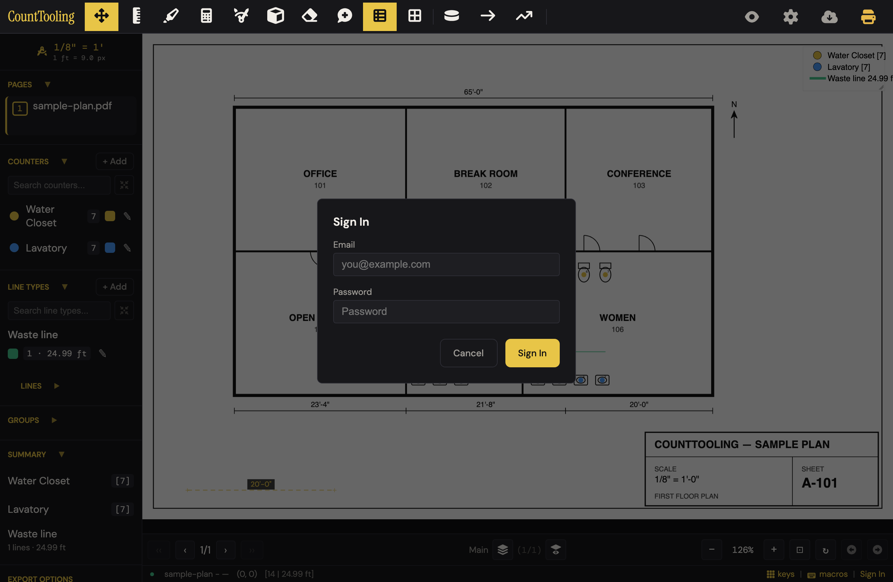
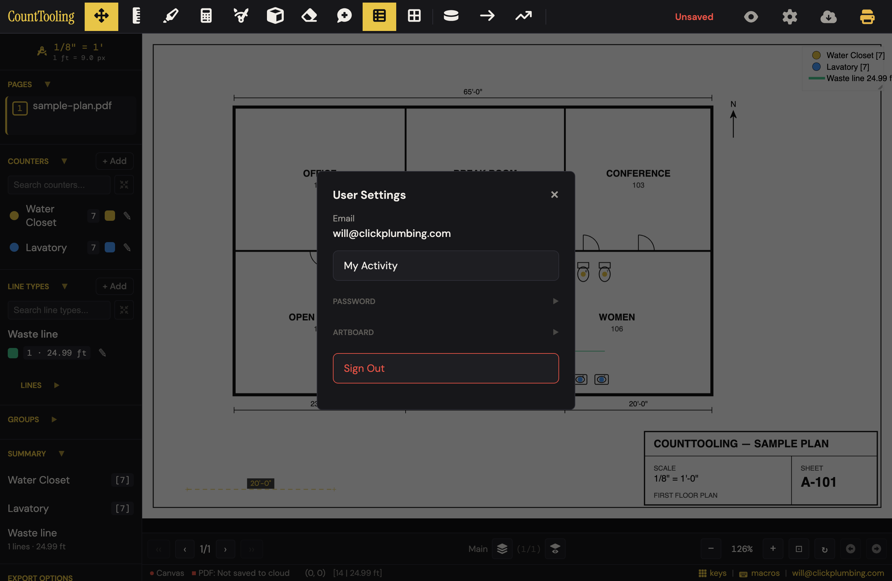
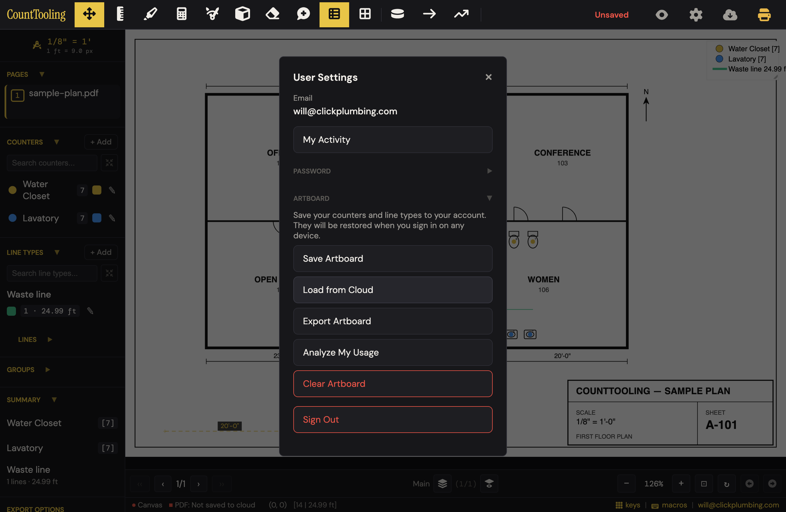
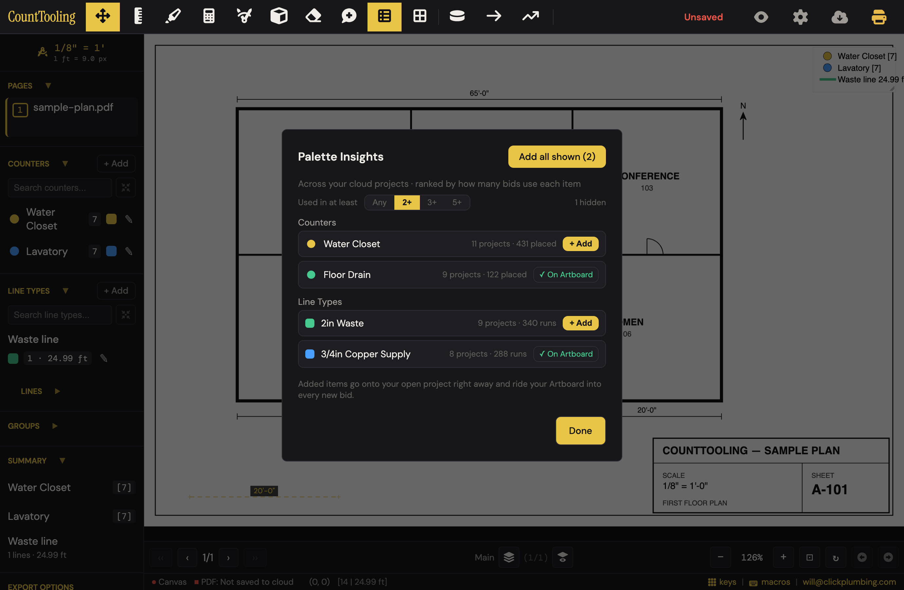
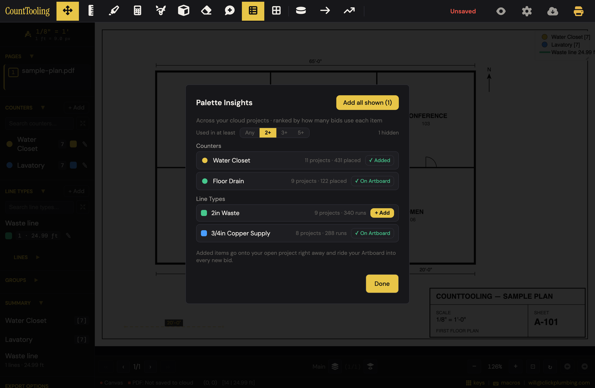
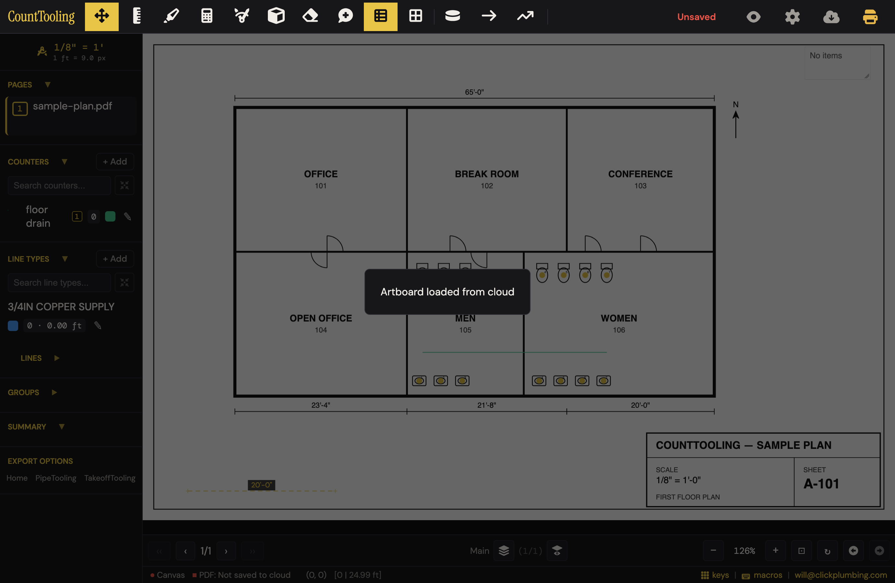
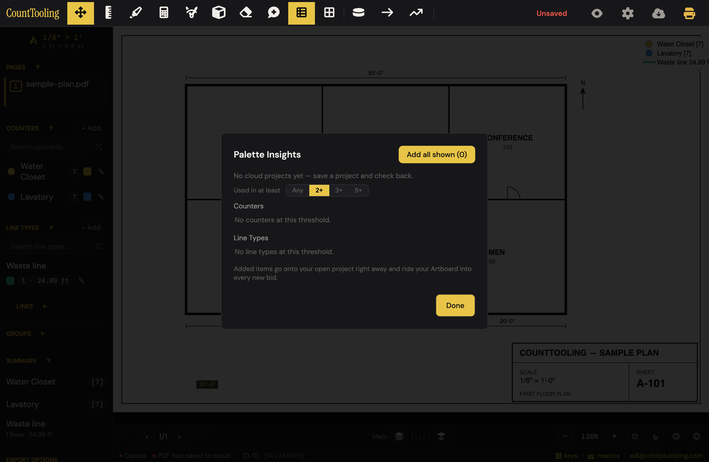
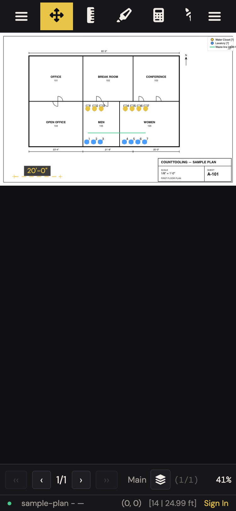

# J16 — Artboard, Palette Insights, standards that follow you

Personas: P E H · Status: ● walked (Phase 2, 2026-08-02 — signed-out for real; signed-in surfaces via local stubs of the cloud client, zero network)

> Seeded from the Phase-1 cross-index workflow (2026-08-02). Phase 2 walk done: route
> corrected, friction + proposals + demo moment below. Cloud-gated steps that could not
> be walked are listed in Walk notes with exact wall text.

## Entry points

- **status bar** — #statusBarAuth link — shows your email when signed in; opens User Settings (App.openMySettings) (click)
- **sidebar** — #sidebarLogoUser — user icon on the sidebar logo row (aria-label 'User'); opens User Settings and closes the mobile sidebar (click)
- **header** — #authBtn — header account button (class 'replaced-by-status-bar', display:none by default; label is your email when signed in); signed-in click opens My Settings, signed-out click opens #authModal (click)
- **burger** — #authBtnSidebar — 'User' button in the mobile sidebar; dispatches an #authBtn click (click)
- **modal** — #mySettingsAirboardHeader — the collapsed 'Artboard ▶' section header inside User Settings (supabase-only) (click to expand)
- **modal** — #mySettingsPaletteInsights — 'Analyze My Usage' button in the Artboard row; opens #paletteInsightsModal (click)
- **modal** — #authModal sign-in — a successful sign-in triggers the artboard auto-restore (fill-if-empty) plus custom-icon per-user reload (form submit)
- **walked, undocumented** — the header gear (#settingsGearBtn, tooltip 'Project Settings') is also sign-in-gated: signed out it opens the bare Sign In wall, which is where a naive settings hunt actually lands first

## Current route (walked 2026-08-02)

10 steps, 4 decision points. Steps 1–7 walked with a locally-stubbed cloud client (the
palette-insights.spec.js recipe — no network); step 8 is code-verified only.

1. Click your email in the status bar (bottom-right) — or the user icon on the sidebar logo row — to open **"User Settings"** (the modal's real title; docs call it My Settings). Signed out, both openers read "Sign In" and drop you on the sign-in wall instead — and after signing in the modal does NOT reopen; you re-click (extra step, code-verified).
2. Click the collapsed low-contrast **"ARTBOARD ▶"** header to expand it. It is collapsed on every open, and the whole section only exists signed-in with cloud enabled (`supabase-only`) — signed out there is no trace of it anywhere in the UI.
3. Click **"Analyze My Usage"** → the modal that opens is titled **"Palette Insights"**. User Settings closes underneath (walked: `mySettingsModal` loses `.visible`).
4. Decision: the **"Used in at least"** filter — segments Any / 2+ / 3+ / 5+, default 2+, "N hidden" chip, choice persists in localStorage (`paletteInsightsMinProjects`). Rows read e.g. "Water Closet · 11 projects · 431 placed · + Add"; items already on the artboard show "✓ On Artboard" (case-insensitive name match — 'floor drain' matched 'Floor Drain').
5. Decision: **"+ Add"** per row, or **"Add all shown (N)"** (the static "Add all frequently used" label is rewritten live). Adds land in the open project's sidebar instantly (unless a same-named item is already there — then no local duplicate is made) and merge ADDITIVELY into the cloud artboard with no Save needed. Toast: "Added 1 item to your Artboard and this project." markProjectDirty fires on a real local add → autosave.
6. Click **"Done"** → you are back on the plan, NOT in User Settings (the documented route hid this re-open).
7. Re-open User Settings → **"Save Artboard"** wholesale-replaces the cloud snapshot with the current project's palette. Success: toast "Artboard saved to your account" + status line "Last saved: just now" (code); failure (walked — the stubbed client rejects like an offline one): a native browser alert "Failed to save artboard. Please try again."
8. Next bid or device: sign in and the artboard auto-restores **fill-if-empty only** — guarded by `!state.currentProjectId && state.pages.length === 0` checked both before and after the fetch, so a restored session or open project suppresses it entirely (code-verified; cloud-gated, not walked).
9. Decision: **"Load from Cloud"** mid-bid asks "Replace your current artboard with the saved version from the cloud?" then wholesale-replaces the palette. Walked result: the 14 placed marks stayed drawn on the sheet but vanished from sidebar, Summary and legend (counts read 0); no undo snapshot is pushed on this path. **"Export Artboard"** downloads artboard-backup.json (works even signed out — walked). 
10. Decision: **"Clear Artboard"** confirms with "Clear all counters and line types? This cannot be undone." — walked: it empties the open project's palette + Quick prefs + number-row bindings, marks stay drawn but uncounted… and Ctrl+Z fully restores everything (the handler pushes an undo snapshot first — the warning is false). It never touches the cloud row.

**Signed-out reality (walked):** there is a second, invisible reuse mechanism. After a
full reload — even after explicitly discarding the restore prompt path — the last
session's counters and line types are silently pre-loaded into state and ride onto ANY
new PDF you open. Standards already follow you on the same machine with no sign-in and
no Artboard; nothing on screen or in the guides says so.

## Naive attempt

Persona: estimator with hard-won standards, wants them on the next bid. Booted with a
takeoff on sample-plan.pdf, signed out. Eye went to the header gear (tooltip "Project
Settings") → got a bare Sign In wall (Email/Password) with no explanation — Cancel.
Tried the export cloud icon → "Export Canvas / Export PDF / Export Both" (deliverables,
not standards). Scrolled the sidebar to "EXPORT OPTIONS" (reports again). Opened
"+ Add" counter → tabs Choose / Create / Quick — no "my library" anywhere. ~8 actions,
3 dead ends; gave up on finding a named standards surface — signed out it does not
exist. Then discovered by accident that reloading and opening a *different* PDF kept
Water Closet / Lavatory / Waste line in the sidebar at zero counts: the reuse the
persona wanted was already happening, silently.

## Friction findings

| # | severity | what happens | why it hurts | verdict |
|---|----------|--------------|--------------|---------|
| 1 | blocker | Mid-bid "Load from Cloud": after the generic confirm, the project palette is wholesale-replaced; the 14 placed marks stay drawn but drop out of sidebar/Summary/legend — every tally reads 0. No re-link (reconcileOrphanedCountersAndLineTypes is never called on this path), no undo snapshot pushed. | An estimator who taps it mid-takeoff silently loses the count they are being paid for; the marks still LOOK counted on the sheet. | CONFIRMED — re-driven independently (stubbed cloud, 14 marks): tallies 0/0, marker keys orphaned, undo button DISABLED after load, Ctrl+Z restored nothing. features/my-settings.js:65-87 has no reconcile and no pushUndoSnapshot; the helper is called on 6 other intake paths. |
| 2 | stumble | The reuse surface is buried: tiny status-bar email → "User Settings" → collapsed gray "ARTBOARD ▶" → "Analyze My Usage". Signed out there is zero trace. The naive walk never found it. | The journey's whole feature set is invisible exactly when a new user is deciding whether the tool respects their standards. | CONFIRMED — structural facts verified: section is `supabase-only`, collapse defaults closed (app.js ~4007), no signed-out trace; findability judgment is consistent with the narrative. |
| 3 | stumble | Header gear (tooltip "Project Settings") signed-out opens a bare Sign In modal — no line saying why or what's behind it; same for the status-bar link. After signing in, the surface you wanted does not reopen. | Feels broken ("I clicked settings and got a login"), and the post-sign-in dead end costs the click again. | CONFIRMED — re-driven: gear click signed-out → authModal (text is just "Sign In / Email / Password / Cancel / Sign In"), settingsModal never opens; authForm.onsubmit (app.js ~4083) only hides the modal + updateUI, no reopen. |
| 4 | stumble | "Clear Artboard" warns "This cannot be undone." but Ctrl+Z fully restores (walked); meanwhile the thing it actually clears is the OPEN PROJECT's palette — marks stay drawn but uncounted, sidebar and legend empty. | The warning is false in both directions: scares users off a recoverable action while under-explaining the real damage (a zeroed tally). | CONFIRMED with correction — re-driven: Ctrl+Z restores counters/line types AND their counts, but NOT Quick Key bindings or modifier prefs (undo-stack.js snapshots omit numberKeyBindings/modifiers; bindings stayed `{}` after undo). "Fully restores" overstated; warning still false both ways. |
| 5 | stumble | The silent same-machine palette carry-over (last session's counters ride onto any new PDF) is real, useful — and undocumented, unnamed, and invisible. It also duplicates the Artboard's job with different boundaries (this browser vs any device). | Users can't trust what they can't see: nobody knows whether standards will be there on the next machine, so they re-create them anyway. | CONFIRMED — re-driven: signed out, reload with no PDF → palette pre-loaded (app.js ~6457 applies the takeoff backup unconditionally; the restore prompt only exists signed-in), and it rode onto a different PDF at 0 counts. Extra harm reproduced: carried-over + re-created items stack DUPLICATE names in the sidebar ("Water Closet" twice). |
| 6 | papercut | Esc does not close Palette Insights — it is missing from the Esc chain (app.js ~5800) while every sibling modal closes; you must click "Done". | Breaks a reflex the rest of the app trains. | CONFIRMED — re-driven: Esc left paletteInsightsModal open while the same keypress closes mySettingsModal; `paletteInsightsModal` appears nowhere in app.js. |
| 7 | papercut | Brand-new-account empty state mixes messages: subtitle "No cloud projects yet — save a project and check back." while the lists read "No counters at this threshold." (the threshold is not the reason). | Two contradictory explanations for one empty screen. | CONFIRMED (code) — both strings verified at features/palette-insights.js:185 and :214; not re-driven (needs the RPC stub, no reason to doubt). |
| 8 | papercut | Save Artboard failure is a native browser alert ("Failed to save artboard. Please try again.") while success is a styled toast; signed-out "Analyze" is a toast; Load uses confirm(). | Feedback channel roulette; the alert looks like a crash. | CONFIRMED (code) — alert at features/my-settings.js:62, confirm() at :68/:99, toasts at :58/:86/:115 and palette-insights.js:194. |

## Proposals

- **rework** — Guard mid-bid "Load from Cloud": if placed marks reference current palette items, name-match/re-link them to the incoming set (the reconcile helper already exists for the sign-in path), warn in trade terms ("Your 14 placed marks would stop counting") for whatever can't be matched, and push an undo snapshot. Spirit: (1) fewer wrong turns on the happy path — the confirm today invites a silent zeroed tally; (2) "your placed marks / your counts", not "artboard versions"; (3) removes the need to ever understand palette-id internals; (4) it's the button a plumber will press mid-bid, so the guard must live on the button. spiritPass: true. **[verified — reproduced the zeroed tally; reconcileOrphanedCountersAndLineTypes already runs on 6 other intake paths, so the re-link reuses existing machinery]**
- **polish** — Rename the doorway to trade language and unify it: "Analyze My Usage" and "Palette Insights" become one name, e.g. "My Standards" with subtitle "your most-used counters and lines across bids". Spirit: (1) one fewer naming decision to decode; (2) "standards on my bids" beats "palette insights"; (3) removes the button-name/modal-name mismatch the guide already trips on; (4) a plumber scanning User Settings finds "My Standards" without a guide. spiritPass: true. **[verified — removes the button-name/modal-name mismatch; no new UI]**
- **polish** — Fix the Clear confirm copy to say what actually happens: "Empty this project's counters and line types? Placed marks stay on the sheet but stop counting. You can undo this." Spirit: (1) same steps, correct decision; (2) trade language ("stop counting"); (3) removes a false warning; (4) self-explaining at the moment of use. spiritPass: true. **[verified with amendment — undo restores counters/lines/counts but NOT Quick Key bindings or modifier prefs; either add those to the snapshot or soften "You can undo this" to "Undo brings your counters and lines back" so the new copy isn't false the same way the old one is]**
- **polish** — Give the signed-out wall one sentence of context ("Sign in to open your settings and saved standards") and reopen the intended surface after sign-in. Spirit: (1) removes the re-click step; (2) plain words; (3) removes the "is it broken?" moment; (4) the wall explains itself. spiritPass: true. **[verified — reproduced the bare wall and code-verified the missing reopen]**
- **teach** — Name the same-machine carry-over and the boundary, one line in the artboard guide and the Artboard blurb: "Your counters and lines already follow you onto the next plan on this computer — signing in carries them to any device." Behavior itself is right; verdict teach because the mechanism works and only the mental model is missing. Spirit: (1) zero new steps; (2) trade words; (3) removes the re-create-from-scratch habit; (4) it's where a signed-in user already looks. spiritPass: true. **[verified — mechanism reproduced end-to-end signed-out; doc-only, zero UI]**
- **polish** — Add `paletteInsightsModal` to the Esc chain. Spirit: (1) one keystroke replaces a mouse trip; (2) n/a wording; (3) removes an inconsistency; (4) Esc is already every user's reflex. spiritPass: true. **[verified — reproduced: Esc closes My Settings but not Palette Insights]**
- **polish** — Single empty-state message for a new account (drop the per-list "at this threshold" lines when the RPC returned zero rows). Spirit: (1) fewer things to read; (2) "save a bid first" is trade-shaped; (3) removes a contradiction; (4) self-evident. spiritPass: true. **[verified — both contradictory strings confirmed in palette-insights.js]**
- **gap** — artboard-backup.json has no import counterpart anywhere in the UI (walked the markup and code; Export only). Either add "Restore from file" beside Export or stop implying the file is a user-serviceable backup. Spirit: (1) closes a dead end; (2) "backup file" is fine; (3) removes a false affordance; (4) it would sit next to the Export button that made the file. spiritPass: true. **[verified — grep confirms Export is the only reference; no import handler or control exists]**
- **keep** — Palette Insights itself: ranked cross-bid usage with "11 projects · 431 placed", "✓ On Artboard" badges via case-insensitive name match, one-click "+ Add" that lands in the open project instantly (no duplicate when the name already exists) plus an additive cloud merge with no Save step, "Add all shown (N)" driven by the filter, threshold choice remembered. Walked end to end with stubs and it is the best moment in the journey. spiritPass: true. **[verified — keep]**
- **keep** — Export Artboard working signed-out, and Clear pushing a real undo snapshot despite its copy. The behaviors are right; only words need work (covered above). spiritPass: true. **[verified — keep; note the Clear-undo caveat above]**

## Guide actions

*(Phase 5)*

## Demo moment

Palette Insights, four seconds after "Analyze My Usage": a ranked list of your real
standards — "Water Closet — 11 projects · 431 placed [+ Add]". One click: the badge
flips to "✓ Added", the counter is already sitting in the sidebar of the open bid
behind the modal, and the toast says "Added 1 item to your Artboard and this project."
Your best-earned standards, pulled out of your own history and onto today's bid in one
click — no Save button, no setup. (Screenshots 04 → 05.)

## Evidence

- **Telemetry visibility:** Only session_start fires natively on this route (once per tab session, on sign-in — the same moment auto-restore runs), and project_save fires indirectly if Palette Insights adds dirty the open project and autosave runs. Save/Load/Export/Clear Artboard, opening User Settings, and opening/using Palette Insights emit none of the 7 events — the journey's core actions are blind. The only artboard signal in the 2026-08 baseline is a row count ('5 of 7 active users have a saved Artboard'), from the user_airboard table, not events. line_added, counter_marker_added, export_canvas, project_open, export_pdf do not fire here. *(Walk confirmed the markProjectDirty→autosave path on real adds.)*
- **Guide coverage:** [artboard-and-palette-insights.md](/guides/artboard-and-palette-insights/) — The whole journey: Save Artboard / Load from Cloud / Export / Clear rows, the five payloads that ride (counters, line types, modifier prefs, Quick Keys, custom icons), sign-in auto-restore, Palette Insights (min-projects filter, Add / Add all frequently used, name-matched identity), and the four-step 'rhythm'; [custom-icons.md](/guides/custom-icons/) — Custom icon library rides the saved Artboard to other devices (line 39, links to the artboard guide); [quick-creators.md](/guides/quick-creators/) — Size/Type/Material modifier preferences are 'part of your profile' and follow the account via Save Artboard (line 32); [working-faster-with-the-keyboard.md](/guides/working-faster-with-the-keyboard/) — Quick Key bindings 'work bid after bid' via a standard palette kept in the saved Artboard (line ~60); [how-your-work-is-saved.md](/guides/how-your-work-is-saved/) — The per-project cloud-save side of the per-project vs per-account boundary (auto-save, local backup, restore-last-session) — never mentions the Artboard by name
- **Specs:** my-settings.spec.js (openMySettings registration, signed-out fall-through to auth modal, Export yields real artboard-backup.json, Clear empties palette + resets tool state, close binding; cloud round-trip and password change cloud-gated), palette-insights.spec.js (regression for the modal, RPC path, filter, additive adds), quick-keys.spec.js (bindings riding artboard: stale-binding toast with retained id, seed-vs-replace via canvas-JSON import, keyboard-map lighting)
- **Modals:** `mySettingsModal`, `paletteInsightsModal`, `authModal`, `airboardToastModal`
- **Hotkeys:** None — no hotkey opens User Settings or Palette Insights (not in the hotkeys.js HOTKEYS table), 1–9, 0 — Quick Keys number row; the bindings are the payload that rides the Artboard (user_airboard.number_key_bindings), Esc — close modal / cancel (bespoke HOTKEYS row) *(walk: Esc closes My Settings but NOT Palette Insights — missing from the chain)*
- **Features touched:** Artboard (cloud palette), Palette Insights, Quick Keys (number row), Custom SVG icon upload + bundled trade icon library, Quick Count / Quick Plumbing / Quick Line creators, Works without the cloud

## Guide gaps (doc-derived)

- Button naming: the guide says open 'Palette Insights (in User Settings)' but the actual button reads 'Analyze My Usage' — the name 'Palette Insights' only appears once the modal is open
- 'Add all frequently used' is only the static HTML label; JS rewrites it live to 'Add all shown (N)' driven by the filter — the guide documents only the static wording
- Guide implies unconditional restore on sign-in ('Signing in on any device restores your artboard automatically'); code is fill-if-empty only — auto-restore is skipped when a project or pages are already loaded, and Quick Keys seed rather than replace
- Guide's rhythm says 'Save Artboard' after Palette Insights adds, but per ARCHITECTURE.md the adds are already an ADDITIVE fetch-merge-upsert straight to the cloud Artboard — the docs never say adds persist without Save (and that Save at that point wholesale-replaces with the current project's palette)
- The min-projects filter options (Any/2+/3+/5+), its 2+ default, and its localStorage persistence are undocumented
- The Artboard section being collapsed by default and supabase-only (invisible without cloud/sign-in) is undocumented
- In-app blurb says only 'Save your counters and line types to your account' while five payload kinds actually ride — neither doc reconciles the two lists
- No guide documents Palette Insights empty state ('No cloud projects yet — save a project and check back.'), error state ('Analysis failed. Try again.'), or per-threshold empty rows ('No counters at this threshold.')
- No guide documents what 'Load from Cloud' does to an open project's placed marks or that it replaces (not seeds) Quick Key bindings; no confirmation flow for 'Clear Artboard' is documented
- Export produces artboard-backup.json (per ARCHITECTURE/spec) but no import-from-file counterpart is documented or visible in the modal markup *(walk-confirmed: none exists)*
- working-faster-with-the-keyboard.md links the word 'Artboard' to /guides/counting-with-counters/ instead of /guides/artboard-and-palette-insights/
- The case-insensitive name matching ('Floor Drain' counts as one standard) is in the guide, but ranking (unadded-first, project breadth beats volume) is only in ARCHITECTURE.md
- *(walk-added)* The silent same-machine palette carry-over (last session's counters/lines pre-load on boot, signed out, and ride onto any new PDF) is documented nowhere

## Terminology on screen (recorded, not judged)

- 'User Settings' — the modal's on-screen h2, while the journey/scope, element ids (mySettings*), and ARCHITECTURE call it 'My Settings'
- 'Artboard' — section header; buttons 'Save Artboard', 'Export Artboard', 'Clear Artboard' (internals spell it 'airboard': user_airboard table, #mySettingsAirboard* ids)
- 'Load from Cloud' — the restore button; the guide glosses it as 'the start a new bid with my standards button'
- 'Analyze My Usage' — the button that opens the feature everywhere else called 'Palette Insights'
- 'Add all frequently used' (static header button) vs 'Add all shown (N)' (live JS label)
- 'Used in at least' + segments 'Any / 2+ / 3+ / 5+' — the min-projects filter row, with 'N hidden' counter
- '+ Add' → 'Adding…' → '✓ Added' — per-item add states
- 'Across your cloud projects · ranked by how many bids use each item' — modal subtitle
- 'Added items go onto your open project right away and ride your Artboard into every new bid.' — modal footer sentence
- 'Save your counters and line types to your account. They will be restored when you sign in on any device.' — Artboard section blurb (understates the payload)
- 'Reorder Artboard' / 'reorder artboard' — links in Counter Settings and Line Type Settings menus (inconsistent casing; here 'Artboard' means the sidebar palette, not the cloud object)
- 'My Activity' — adjacent button in the same modal (per-account activity, not part of this journey's rows)
- *(walk-added)* 'Sign in to analyze your palette usage.' — signed-out Analyze toast; 'Artboard cleared' / 'Artboard loaded from cloud' / 'Artboard saved to your account' — action toasts; 'Clear all counters and line types? This cannot be undone.' and 'Replace your current artboard with the saved version from the cloud?' — native confirms; 'Failed to save artboard. Please try again.' — native alert; 'Export Canvas' (header export dropdown) — an unrelated 'canvas' meaning a naive standards-hunter trips over

## Open questions for the Phase-2 walk

- Does a Palette Insights '+ Add' actually trigger the project autosave (and thus a project_save event), and how fast does the added item appear in the sidebar of the open project? → **Answered:** the item is in the sidebar the same instant the badge flips (walked); a genuinely-new add calls markProjectDirty → autosave → project_save on cloud builds. When a same-named item already exists in the project, nothing is added locally and the project is NOT dirtied — only the cloud merge happens.
- What confirmation, if any, does 'Clear Artboard' show, and does it clear the cloud user_airboard row or only the local palette (spec only asserts local palette empties)? → **Answered:** confirm 'Clear all counters and line types? This cannot be undone.' Local-only — the handler never touches the cloud row. And the warning is false: pushUndoSnapshot runs first, Ctrl+Z restores everything (walked).
- Signed-out click on an opener falls through to the auth modal — after signing in from there, does My Settings then open automatically or does the user re-click? → **Answered (code):** re-click. Nothing in the sign-in path reopens My Settings.
- Sequencing on a fresh device: when both the restore-last-session prompt and the artboard auto-restore are candidates at boot, which runs, and does a restored session suppress the artboard (fill-if-empty) as the code comment implies? → **Answered (code, cloud-gated):** the guard `!state.currentProjectId && state.pages.length === 0` is checked before AND after the artboard fetch, so any restored project/pages suppresses the artboard entirely. Walk-adjacent discovery: signed out, the last session's PALETTE is silently pre-loaded at boot even when no pages restore.
- What does 'Save Artboard' feedback look like in #mySettingsAirboardStatus (wording, error path, offline behavior)? → **Answered:** success = toast 'Artboard saved to your account' + status 'Last saved: just now'; failure/offline = native alert 'Failed to save artboard. Please try again.' (failure path walked via stub; the status line stays empty on failure).
- What does 'Load from Cloud' do to an open project mid-bid — are placed marks re-linked, orphaned, or is there a warning before the replace? → **Answered (walked):** orphaned. Marks stay drawn on the sheet; sidebar/Summary/legend drop to zero; only the generic 'Replace your current artboard…' confirm stands between the user and it; no undo snapshot on this path. See finding #1 and screenshot 06.
- Palette Insights on a slow connection: how long does 'Loading your usage…' sit, and what does the empty state look like for a brand-new account? → **Answered:** 'Loading your usage…' sits in the subtitle for the whole RPC (walked with a 1.2 s stub); empty account shows 'No cloud projects yet — save a project and check back.' over lists that say 'No counters at this threshold.' / 'No line types at this threshold.' (contradictory — finding #7, screenshot 07).
- How do same-named items with different colors/icons merge in Insights (case-insensitive name matching) — which glyph/color wins on Add? → **Answered (walked):** for the badge, name match is case-insensitive ('floor drain' ↔ 'Floor Drain'). On Add into a project that already has the name: the project keeps its own glyph/color (no local change, no duplicate); the cloud merge appends the RPC's most-recent id/icon to the artboard row.
- Is there any way to import the exported artboard-backup.json back in (no Import control found in the modal markup)? → **Answered:** no. Export only, confirmed in markup and code. Proposal filed (gap).
- Mobile variant: below 769px is the status-bar email opener visible at all, or is the burger #authBtnSidebar → 'User' the only path, and does the collapsed Artboard section behave the same on touch? → **Answered (walked at 375×812):** the status-bar opener IS visible ('Sign In' signed out, the email signed in) and #sidebarLogoUser is visible too; #authBtn/#authBtnSidebar stay hidden. User Settings fits (card 338 px wide), the five Artboard buttons stack full-width, nothing overflows.
- *(new, walk-blocked)* Does the real sign-in → auto-restore round-trip fire the airboard toast, and what does 'Last saved' show on a later reopen? Needs a real session — cloud-gated.

## Walk notes

**Not walked (cloud walls) — exact wall text where a user hits it:**
- Real sign-in / session: every signed-out opener (status bar, gear, App.openMySettings) lands on the same modal — "Sign In / Email / Password / Cancel / Sign In" (screenshot 01). All signed-in behavior beyond that wall was exercised with a locally-stubbed cloud client (the repo's own palette-insights.spec.js / my-settings.spec.js recipe); no request left 127.0.0.1 (the harness aborted all external egress).
- Save Artboard success round-trip to the real user_airboard row (stub asserted the upsert payload; the success toast/status text is from code, and the failure alert was walked for real via the rejecting stub).
- Sign-in artboard auto-restore on a fresh device (fill-if-empty) and the restore-vs-artboard boot race with a real session — code-verified only.
- 'Last saved' history, My Activity, change-password, admin rows (Add User / Manage User / All Users) — behind the same wall.
- Palette Insights against the real `user_palette_usage` RPC — rows were the spec's fixture (Water Closet 11×431 etc.).

**Environment quirks:**
- config.js points at production Supabase; the walk harness force-aborted every non-localhost request, which is also what made the Save-Artboard failure path walkable for real.
- Native confirm()/alert() dialogs can't be screenshotted headlessly; their exact text is quoted in the findings instead.
- The takeoff (2 counters × 7 marks, 1 line) was seeded via the build-screenshots.js recipe on samples/sample-plan.pdf; the "second bid" was a locally-generated blank one-page PDF.

**Duplicate-surface moments (logged during the walk):**
- Silent same-machine palette carry-over vs the cloud Artboard — two mechanisms for "standards follow you" with different, invisible boundaries (this browser vs any device).
- Header gear "Project Settings" vs status-bar "User Settings" — two settings doors; signed out, both collapse into the identical bare Sign In wall.
- Counter modal's "Choose" tab vs Palette Insights — two "pick an existing counter" lists with different scopes (this project vs all cloud bids) and different add semantics.
- The word "Export" does three jobs: header "Export project" dropdown (Export Canvas / Export PDF / Export Both — deliverables), sidebar "EXPORT OPTIONS" (reports/handoff), and "Export Artboard" (standards backup JSON).
- "Artboard" itself: the cloud palette (this journey) vs "Reorder Artboard" in Counter/Line Type Settings meaning the sidebar palette (Phase-1 recorded; not re-walked).

**Screenshot index:**
-  — the signed-out wall: status-bar "Sign In" → bare auth modal over a live takeoff (friction)
-  — "User Settings": Email, My Activity, collapsed PASSWORD ▶ / ARTBOARD ▶
-  — Artboard section expanded: blurb + Save / Load from Cloud / Export / Analyze My Usage / Clear
-  — Palette Insights loaded: ranked rows, 2+ filter, "1 hidden", "✓ On Artboard" badges (demo moment)
-  — after "+ Add": "✓ Added", "Add all shown (1)" (demo moment, second beat)
-  — after mid-bid "Load from Cloud": marks still drawn, sidebar shows only "floor drain 0", legend "No items", header "Unsaved" (friction, finding #1)
-  — new-account empty state: "No cloud projects yet…" over "No counters at this threshold."
-  — mobile 375×812 signed-out: status-bar "Sign In" present; the journey's openers exist on phone

## Verification (2026-08-02)

Adversarial re-drive by an independent verifier — same recipe (self-closing static
server on port 4316, Playwright chromium, sample-plan.pdf into #pdfInput, seeded
14-mark takeoff, ALL non-localhost requests aborted; cloud stubbed exactly like the
walk: fake session object + stubbed `App.fetchUserAirboard`, captured `confirm()`).
Goal was to refute, not confirm. Nothing was killed; one claim needed a correction.

**Reproduced live (4 scenarios):**
- **#1 Load from Cloud mid-bid (blocker)** — with a cloud artboard carrying the same
  trade names but different ids: after the real confirm text, sidebar read
  "Water Closet 0 / Lavatory 0", all 14 markers still present in the annotation data
  under orphaned ids, the undo button was DISABLED after the load, and Ctrl+Z restored
  nothing. Blocker stands. (canvas-draw.js:483-486 confirms orphaned marks still render,
  with a fallback yellow circle — so they keep looking counted.)
- **#4 Clear Artboard (stumble, corrected)** — confirm text verified; Ctrl+Z brought
  back counters, line types AND their counts, so "cannot be undone" is false — but the
  walker's "fully restores everything" is overstated: `numberKeyBindings` stayed `{}`
  after undo, and undo-stack.js snapshots omit bindings and modifier prefs entirely.
  Any fixed copy (or the snapshot) must account for this.
- **#5 signed-out carry-over (stumble)** — reload with no PDF: `state.counters`
  pre-populated signed out with no prompt (app.js ~6457 applies the takeoff backup
  unconditionally; the restore prompt is inside the signed-in-only block), and the
  palette rode onto a different PDF at 0 counts. New evidence the walker missed: the
  carry-over COMPOUNDS — carried-over items plus re-created ones produce duplicate
  names in the sidebar ("Water Closet" twice), which is exactly the "re-create them
  anyway" harm made visible.
- **#6 Esc + #3 gear wall** — Esc left Palette Insights open while the same key closes
  My Settings; signed-out gear click opened the bare authModal (settingsModal never
  opened). Post-sign-in non-reopen code-verified (authForm.onsubmit only hides the
  modal). One local-only note: the dev build shows a "Sign in as test user" bypass row
  in the wall; production users see only Email/Password/Cancel.

**Code-verified without re-driving:** #7 (both contradictory empty-state strings at
features/palette-insights.js:185/:214), #8 (alert :62 / confirm :68,:99 / toasts in
my-settings.js), the gap proposal (grep: `artboard-backup` appears exactly once — the
download line; no import handler exists), and the rework's feasibility claim
(reconcileOrphanedCountersAndLineTypes exists and runs on 6 other intake paths:
sign-in restore, load-project, pdf-intake ×2, canvas-repair, copy-project, import-clear
— Load-from-Cloud is the odd one out).

**Severity audit:** all 8 severities held; no upgrades, no downgrades, no kills.
**Proposals:** all 10 tagged [verified]; the Clear-copy polish carries an amendment
(don't promise a full undo the snapshot can't deliver). What the walker missed:
duplicate-stacking from the silent carry-over, and the undo snapshot's
bindings/modifier blind spot — both now folded into findings #4/#5 verdicts.
