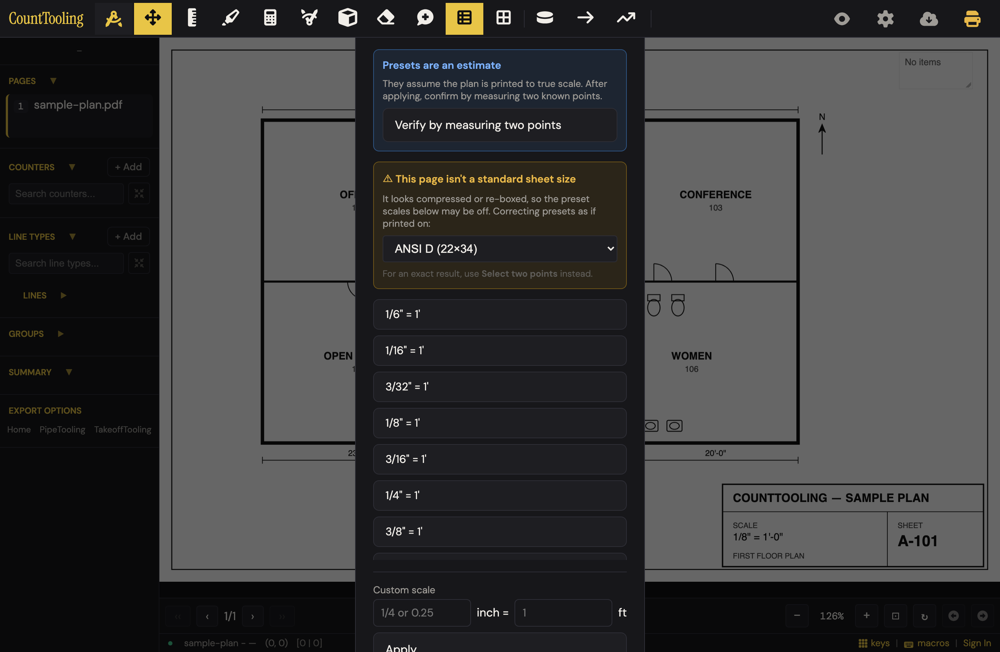
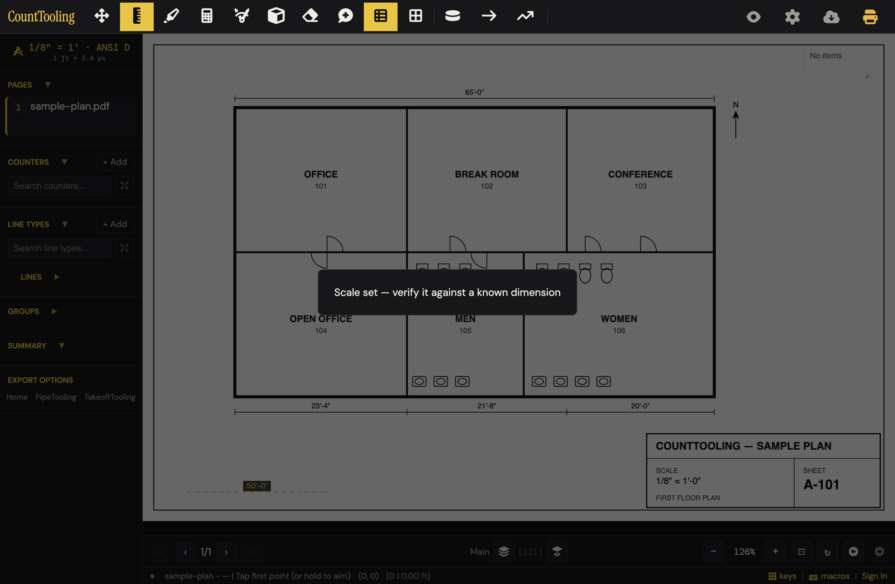
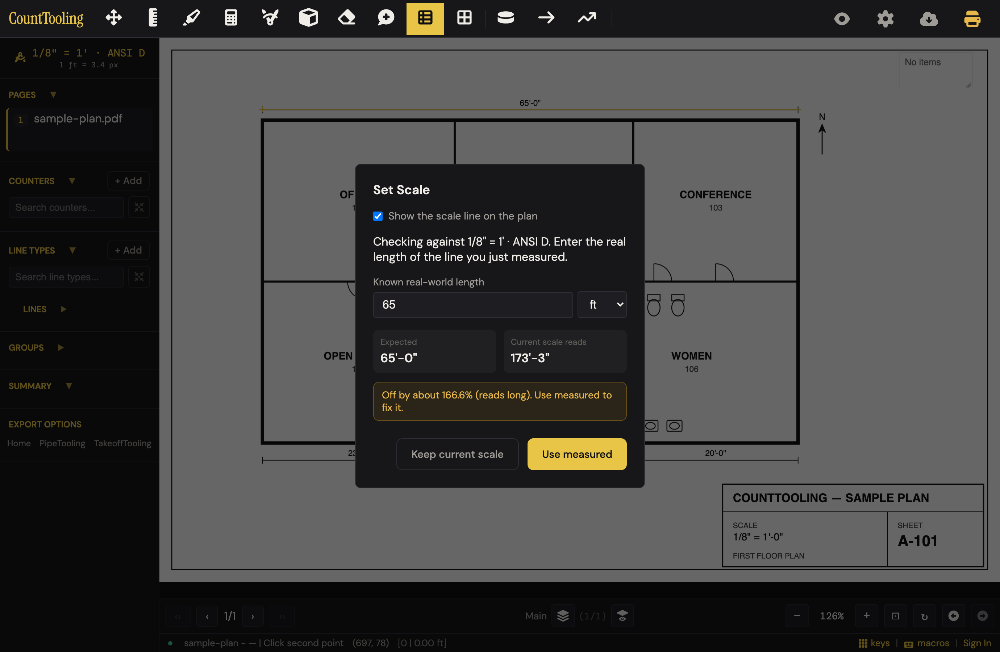
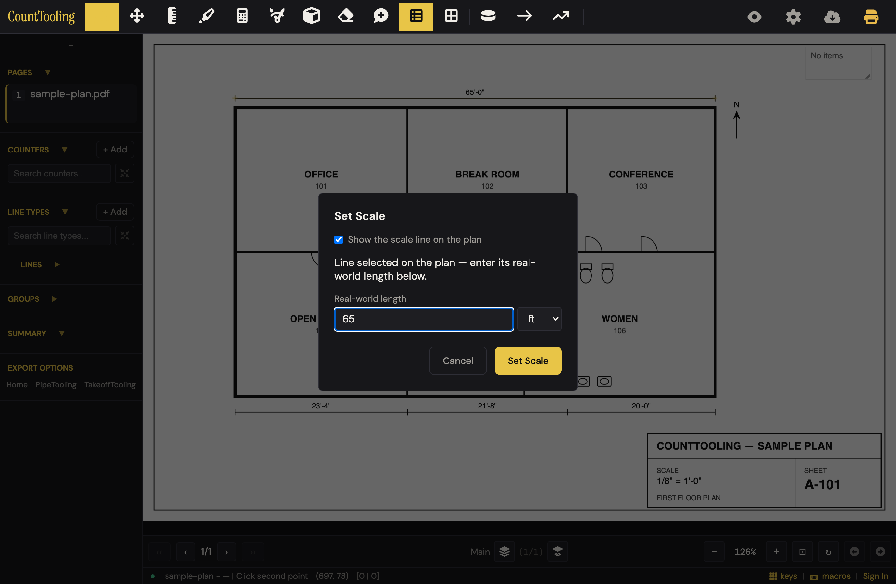
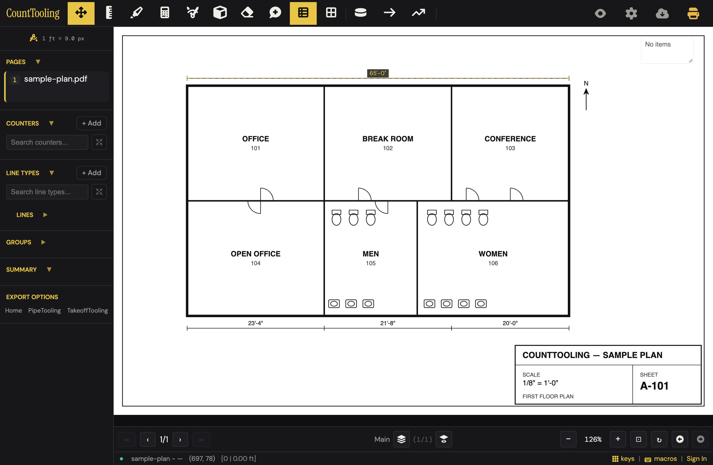
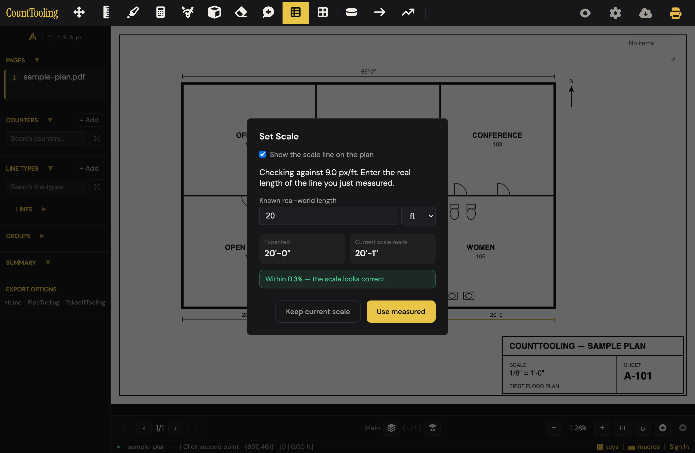

# J3 — Calibrate a sheet: two-point / preset / custom + trust machinery

Personas: P E H · Status: ● walked 2026-08-02 (desktop 1380×900 + mobile 375×812, headless Chromium, samples/sample-plan.pdf)

> Seeded from the Phase-1 cross-index workflow (2026-08-02). Phase 2 walk done —
> route corrected below, friction/proposals/demo filled, 8 screenshots in img/.
> Re-walked 2026-08-09 (naive attempt + variants + viewer stub); corrections and
> answers folded in below — route wording fixes are marked *(re-walk)*.

## Entry points

- **header** — #setScale toolbar button (title 'Set Scale'; dynamic content — icon-only header state, classes scale-unset/scale-set; ARCHITECTURE says 'Hidden in header once scale is set') (click)
- **sidebar** — #setScaleSidebar 'Set Scale' button (label becomes scale readout e.g. '1/4" = 1'' + '1 ft = 18.0 px' when set) (click)
- **sidebar** — #sidebarScaleDisplay scale readout (desktop-only section; title 'Click to set scale'; onclick proxies to #setScale; only clickable once a scale exists) (click)
- **hotkey** — S — Set Scale (hotkeys.js: viewerAllowed true, so works in view-link mode too) (keypress)
- **right-click** — Move tool button -> #toolContextMenu item 'Set / edit scale…' (toast 'Open a plan first.' when no pages) (right-click then click)
- **right-click** — Measure tool button -> #toolContextMenu item 'Set / edit scale…' (same shared item) (right-click then click)
- **modal** — #toolingScaleCheckModal 'Set scale' button (#toolingScaleCheckGoSet) — pre-export no-scale check in the Copy to PipeTooling flow hands off into this journey (click)
- **modal** — #setScaleFirstModal toast ('Set Scale [icon] first to use Quick Line/Measure.') — a nudge toward the journey, auto-hides after 3s, no button of its own (none (auto-shown when using Quick Line/Polyline/Measure with no scale))
- **modal** — Scale Zone create/edit reuses the same #scaleModal in zone mode (scaleZoneBtn draw-complete; canvas right-click #ctxEditScaleZone 'Edit scale') — cross-journey link into the same modal, applies to scaleZones[].scale not page.scale (varies)

## Current route (walked 2026-08-02)

The modal opens on the **presets** tab, so the real-world happy path is preset-first, not the guides' two-point-first.

**Preset route (2 actions + verify; 2 decisions):**

1. Press S or click the Set Scale pen icon — modal opens on 'Architectural & Engineering'. On the (non-standard) sample sheet the yellow warning is up with the correction dropdown pre-set to its best guess, 'ANSI D (22×34)'. *(Decision 1: accept the guessed sheet correction, pick another sheet, or 'Non-standard — don't correct' — last of 17 options.)* 
2. Click the title-block preset ('1/8" = 1''). One click applies-and-closes; toast 'Scale set — verify it against a known dimension' (full-screen, dims + blocks the canvas ~2s); dashed reference bar ('50'-0"') appears bottom-left; sidebar badge shows '1/8" = 1' · ANSI D — 1 ft = 3.4 px'. 
3. Verify (the toast asks you to): sidebar badge → 'Verify by measuring two points' → click both ends of a printed dimension → enter its length → Check. *(Decision 2: 'Keep current scale' vs 'Use measured'.)* On the sample plan the guessed ANSI-D correction is **wrong by 2.65×** — the check reads 'Expected 65'-0" / Current scale reads 173'-3" / Off by about 166.6% (reads long). Use measured to fix it.' One click on 'Use measured' fixes it. 

**Two-point route (documented 8 steps — 7 verified, 1 wall):**

1. S / Set Scale button — opens on presets, so the guides' route costs a tab click every time.
2. Click 'Select two points' tab — **WALL at laptop heights:** with the sheet warning present the card is 1109px tall; at 900px viewport it clips top (−104px) *and* bottom, there is no scroll (the 85vh/overflow rule is mobile-only), and the tab row sits off-screen above the viewport — mouse, wheel, PageUp all dead; the header (z-index 250) also outranks the modal overlay (200). Only recovery: browser zoom-out. Walked past it via a scripted click.
3. Click 'Select on PDF' — modal hides; footer prompts **'Click first point'** *(re-walk: the 'Tap first point (or hold to aim)' wording belongs to the Measure tool; the two-point pick says 'Click first/second point'. On touch the press-and-hold aim loupe works here too and commits the point on release.)*
4. Click both ends of the 65'-0" dimension line — footer advances to 'Click second point'; the modal reopens itself after the second click with 'Line selected on the plan — enter its real-world length below.' (Taps are debounced 400ms — a fast double-click registers once.) 
5. Type 65 (placeholder 'e.g. 5.75 or 5'9'; unit dropdown ft/in/m/cm/yd).
6. Click 'Set Scale' — applies (pixelsPerUnit 9.0, refLine stamped on the sheet), no toast for two-point.
7. Sidebar badge now reads **'1 ft = 9.0 px'** — pixels, no trade label (two-point scales get label:null). The header pen button disappears; the badge/S/right-click 'Set / edit scale…' are the ways back in. 
8. Verify: badge → 'Verify by measuring two points' → both ends of the 20'-0" dimension → 20 → Check → green 'Within 0.3% — the scale looks correct.' → 'Keep current scale'. *(re-walk: landed 'Within 0.9%' — the verdict tracks click precision; anything under 1% goes green.)* 

**Custom route (3 actions + 1 trap):** fraction field ('1/4 or 0.25') = 1/8, **feet field must be typed too** — its '1' is a placeholder, not a default; Apply with it empty scolds 'Enter a valid fraction and feet'. Custom is **also silently sheet-corrected**: result label '1/8" = 1 ft · ANSI D', pixelsPerUnit 3.375 (same 2.65× wrong on this sheet).

## Naive attempt

(2026-08-09, fresh eyes, no docs.) Eye went straight to the yellow pen icon — first tool in the header — and one click opened the scale panel already on presets. Title block says 1/8" = 1'-0", so I clicked the '1/8" = 1'' preset without registering that the yellow warning had pre-picked 'ANSI D (22×34)'. Sanity-check with Measure on the printed 65'-0" overall: **'Distance: 173'-1"'** — the silent correction had scaled everything 2.67× long. Recovery cost: the header pen had vanished (it hides once a scale exists), so I hunted, found the new sidebar chip, reopened, scrolled the 17-option dropdown to 'Non-standard — don't correct' (last entry), re-clicked the preset, re-measured: 64'-11". ~9 actions including one wrong turn that only a measure catches — plus two clicks silently eaten by the 2-second full-screen 'Scale set — verify it…' toast. The trust cues (warning box, '· ANSI D' label suffix, verify toast) were all present and all skippable.

## Evidence

- **Telemetry visibility:** None of the 7 instrumented events fires on this journey's core actions — features/scale.js contains no logUserEvent call, so two-point/preset/custom apply, sheet correction, verify check, and Use-measured are all telemetry-blind. session_start and project_open fire before the journey (app open / project load); project_save fires only indirectly when the scale change is autosaved as project data. line_added, counter_marker_added, export_canvas, export_pdf do not fire on this route.
- **Guide coverage:** [setting-the-scale.md](/guides/setting-the-scale/) — The three calibration methods (two-point steps, architectural/engineering presets, custom fraction/decimal), per-page-ness ('Scale is per page'), yellow sidebar badge tip, 'measure something before you trust a takeoff' tip, links to scale zones and measuring runs; [verifying-your-scale.md](/guides/verifying-your-scale/) — The whole trust machinery: presets-are-an-assumption framing, automatic sheet-size warning + picker + corrected-label suffix ('· ARCH D'), Verify-by-measuring flow with % error (green under 1%) and Keep current scale / Use measured, the on-sheet synthetic scale bar and its 'show the scale line on the plan' toggle, the exact-half-size ARCH D->ARCH B blind spot, two-point-is-immune rule of thumb; [how-to-do-a-pdf-takeoff.md](/guides/how-to-do-a-pdf-takeoff/) — Step 2 'Set the scale' — the three methods in one paragraph, pointer to scale zones and to verifying-your-scale for presets; [working-faster-with-the-keyboard.md](/guides/working-faster-with-the-keyboard/) — S = Set Scale in the shortcut table; Move and Measure right-click offering 'Set / edit scale' ('the fastest way back to a page's scale once it's set'); [scale-zones-and-multiply-zones.md](/guides/scale-zones-and-multiply-zones/) — The modal reuse for zone scale ('the same way you'd set the page scale'), which is what per-page vs per-zone scale means in practice; [measuring-runs-lines-and-polylines.md](/guides/measuring-runs-lines-and-polylines/) — Scale as prerequisite ('Once the scale is set…'); Measure tool respecting zone scale; [sharing-and-view-links.md](/guides/sharing-and-view-links/) — One bullet: viewers can run Set Scale on an uncalibrated sheet and it shares back to the project with an owner notice; [takeoff-on-a-tablet.md](/guides/takeoff-on-a-tablet/) — One line: view-link viewers 'can even set a page scale that shares back to the project'; [hvac-takeoff.md](/guides/hvac-takeoff/) — 'Set the page scale first' link as a prerequisite for room boxes
- **Specs:** scale.spec.js (preset + custom-fraction apply; two-point flow incl. placeholder and inline value+unit; degenerate identical-points rejection; Escape clears SCALE tool state; refLine stored for two-point, absent for preset; showScaleRefLine checkbox flag), tool-context-menu.spec.js (Move + Measure right-click 'Set / edit scale…' opens the modal; viewer gate), viewer-scale.spec.js (S opens modal for viewers; temp-scale fallback + '· temp' label; share-back success/failure; owner notice modal + re-appearance), geometry.test.js (analyzeSheet standard/non-standard/orientation/half-size-ambiguity; sheetCorrectionFactor; scaleCheckDelta unit tests), keyboard-map.spec.js (S listed in the keyboard map)
- **Modals:** `scaleModal`, `setScaleFirstModal`, `toolingScaleCheckModal`, `viewerScaleNoticeModal`
- **Hotkeys:** S — open Set Scale (viewer-allowed), Escape — exits the two-point pick / clears TOOL.SCALE state and check mode, D — Measure (adjacent: triggers the set-scale-first toast when no scale), Shift+←/→ — marked-page navigation (yellow badges include scaled sheets)
- **Features touched:** Per-page scale (two-point, presets, or custom), Sheet-size correction for compressed PDFs, Verify-your-scale check mode, Synthetic scale bar, Right-click tool settings, Marked-page badges & navigation, Copy to PipeTooling

## Guide gaps (doc-derived)

- Set-scale-first toasts are undocumented — no guide mentions that Quick Line / Polyline / Measure show 'Set Scale [icon] first to use X.' when the page has no scale
- The 'Show the scale line on the plan' checkbox in the modal is never introduced in setting-the-scale.md; verifying-your-scale.md mentions the toggle only parenthetically, and the two-point refLine drawn on the sheet is not documented at all
- Custom scale's second input (the feet denominator, #scaleCustomFeet) is undocumented — the guide describes only 'a fraction like 1/4 or a decimal like 0.25'
- The post-apply toast 'Scale set — verify it against a known dimension' after every preset/custom apply is not in any guide
- Verify's no-scale guard ('Set a scale first, then verify it' toast) is undocumented
- The Set Scale button's dynamic states (header icon-only/hidden when set, sidebar readout '1 ft = X px', clickable #sidebarScaleDisplay) are undocumented
- The pre-export 'Check scale before exporting' modal (pixel-lengths warning with Export anyway / Set scale) is in FEATURES.md's Copy to PipeTooling bullet but reports-and-exports.md never mentions it
- The yellow-vs-green delta wording in check mode ('Off by about X% (reads long/short). Use measured to fix it.') — guide documents only the green <1% case
- Viewer-scale details (temp local fallback, '· temp' label, per-token localStorage, owner must-clear notice modal) get one sentence in two guides; the temp/owner-notice machinery is guide-invisible
- Guides never say which tab the modal opens on (presets tab is the default active tab in index.html while both scale guides lead with two-point)
- Escape behavior during the two-point pick (clears scale tool state) is undocumented in guides

## Terminology on screen (recorded, not judged)

- Tab label 'Select two points' vs guide heading 'Set scale from two points' vs button 'Select on PDF' — three names for one flow
- Tab label 'Architectural & Engineering' (guides split them as two preset families)
- 'Presets are an estimate' / 'They assume the plan is printed to true scale. After applying, confirm by measuring two known points.' (blue advisory)
- '⚠ This page isn't a standard sheet size' / 'It looks compressed or re-boxed, so the preset scales below may be off. Correcting presets as if printed on:' (yellow warning)
- Picker option 'Non-standard — don't correct'
- Check tiles 'Expected' / 'Current scale reads'; buttons 'Check', 'Use measured', Cancel relabeled to 'Keep current scale' after a check
- Result strings 'Within X% — the scale looks correct.' / 'Off by about X% (reads long|short). Use measured to fix it.'
- Checkbox 'Show the scale line on the plan' — docs call the drawn thing a 'scale bar' / 'dashed reference bar'
- Toast 'Scale set — verify it against a known dimension'
- Toast 'Set a scale first, then verify it'
- Blocked-tool toast 'Set Scale [icon] first to use Quick Line.'
- Pixels readout '1 ft = 18.0 px' on buttons/sidebar (raw px exposed to estimators); suffix '· temp' with tooltip 'Temporary scale — only on this device'
- Corrected-scale label suffix '· ARCH D' style sheet-name stamp
- Context-menu item 'Set / edit scale…'; fallback toast 'Open a plan first.'
- Default #scaleInfo text 'You selected a line spanning 0 pdf-pts.' ('pdf-pts' is developer units on screen)
- Two-point info 'Click Select on PDF, then click two points on the drawing to define a scale line.' / 'Line selected on the plan — enter its real-world length below.'
- Length placeholder 'e.g. 5.75 or 5'9'; custom placeholders '1/4 or 0.25'
- Pre-export modal 'Check scale before exporting' with 'Export anyway' / 'Set scale'
- *(re-walk additions:)* Footer prompts 'Click first point' / 'Click second point' (two-point + verify picks) vs Measure's 'Tap first point (or hold to aim)' — same gesture, third wording
- Toast 'Set Scale [icon] first to use Polyline.' (Polyline has its own call site after all)
- Check-mode error toast 'Enter a valid length'
- Too-short toasts 'Scale line too short — pick two points further apart' / 'Line too short — pick two points further apart' (two nearly-identical strings in features/scale.js:196,374)
- Viewer share-back failure toast 'Couldn't share the scale — it applies only on this device for now'

## Open questions for the Phase-2 walk

- Which tab actually shows on first open of a scale-less page — and does the guide's two-point-first route require an extra tab click every time? **→ Walked: opens on 'Architectural & Engineering' (presets) every time; two-point always costs a tab click — and at 900px viewport that tab sits at y = −41px, unreachable (see friction #2).**
- ARCHITECTURE says the header Set Scale button is 'Hidden in header once scale is set' — is it hidden, restyled, or both? **→ Walked: genuinely hidden — computed `display:none` with class `scale-set`; clicking is impossible. Ways back in: sidebar chip, S, right-click 'Set / edit scale…'.**
- Does the two-point pick use the aim loupe on tablet-touch? **→ Walked (375×812, synthetic TouchEvents): yes — press-and-hold in the two-point pick sets `state.aiming` and shows #aimLoupe; release commits point A. Modal itself is 85vh and scrolls on mobile (no desktop-style clipping).**
- Set-scale-first toast for Polyline? **→ Walked: Polyline shows its own 'Set Scale [icon] first to use Polyline.' toast; tool stays NONE.**
- Sheet-size warning edge states? **→ Code (geometry.js analyzeSheet): orientation is normalized via long/short-edge compare, so a sheet standard in either orientation is 'standard' — no warning. Walked: choosing 'Non-standard — don't correct' zeroes the correction; preset then applies uncorrected (9 px/ft, label '1/8" = 1''). The choice is NOT remembered — reopen re-guesses ANSI D.**
- Can toasts collide? **→ Code: one #airboardToastText element; showToast clears the pending timer and replaces the text — last toast wins, no stacking. setScaleFirstModal is a separate 3s overlay but its trigger (no scale) and the post-apply toast (scale just set) are mutually exclusive in practice.**
- Does 'Use measured' visibly stamp a refLine immediately, and does the synthetic bar disappear? **→ Walked: yes — the dashed yellow line + '65'-0"' tag appear on the measured dimension the moment you click 'Use measured', and the synthetic 50' bar vanishes (refLine now lives in page.scale.refLine).**
- Synthetic bar on rotated pages / in exports? **→ Code: both refLine and the synthetic bar draw only in the live annotation layer (app.js ~1582/1617); renderAnnotationsToContext (the export path) has no refLine branch — live-view only, never prints. Rotated-page placement still unwalked.**
- Does scale alone flip the badge yellow and count for Shift+arrow nav? **→ Walked (test-2pages.pdf): badge YES (`badge-scale-set` on the page number); Shift+←/→ NO — getMarkedPageIndices filters on pageHasAnyAnnotations only, so a scale-only page is skipped. Badge promises more than the nav delivers.**
- Degenerate check-mode inputs? **→ Walked: 'abc' and '0' both toast 'Enter a valid length' (full-screen, 2s); tiles stay '—'. Too-short wording (from code, unwalked): 'Scale line too short — pick two points further apart' (set) / 'Line too short — pick two points further apart' (verify).**
- Viewer flow live behavior? **→ Walked locally with a stubbed view link (get-view-project fulfilled by a Playwright route; all supabase requests aborted): S opens the modal for viewers; presets apply with the same ANSI-D correction trap; share-back failure toasts 'Couldn't share the scale — it applies only on this device for now' and the badge gains '· temp' (scale.temp=true). Share-back SUCCESS and the owner's #viewerScaleNoticeModal remain cloud-gated — not walked.**
- Escape during two-point pick vs check mode? **→ Walked: one press, total exit in both — tool cleared, points discarded, modal closed, nothing reopens. With the check panel open, Escape closes the modal and keeps the current scale (the panel's display state is left 'block' inside the hidden modal — cosmetic only).**

## Friction findings

| # | severity | what happens | why it hurts | verdict |
|---|----------|--------------|--------------|---------|
| 1 | blocker | The sheet-correction dropdown pre-selects its best guess (ANSI D here), so the naive click on the title-block preset silently applies a ×0.375 correction: '1/8" = 1' · ANSI D', 3.4 px/ft — the printed 65'-0" wall measures **173'-1"**. 'Non-standard — don't correct' is the last of 17 options, and the choice isn't remembered on reopen. | On a true-scale non-standard sheet, one honest click makes every length 2.67× long. All the trust cues (warning box, label suffix, verify toast) are present — and all skippable. A wrong scale ruins the whole bid.  | CONFIRMED — re-driven live: warning up on the raw sample plan, ANSI_D pre-selected, 17 options with 'Non-standard — don't correct' last, preset apply → pixelsPerUnit 3.375 / correctionFactor 0.375 (1/0.375 = 2.667×), reopen re-guesses ANSI_D. One caveat: on a genuinely compressed ANSI-D print the guess is the *right* default — the blocker is the silence, not the correction. |
| 2 | blocker | At 1380×900 the freshly-opened modal (presets + warning) is 1109px tall with no desktop scroll: title/tab row clipped at y=−104, Apply/Cancel below the fold, and the 'Select two points' tab (y=−41) is unreachable — mouse, wheel, even Playwright's auto-scroll fail. Only recovery is browser zoom-out. | The guides' primary route ('set scale from two points') cannot be clicked into on a normal laptop. The 85vh + overflow-y rule exists but is mobile-only.  | CONFIRMED — re-driven live: card 1109px, top −104.5, tab row top −41.5, computed overflow-y `visible` / max-height `none` (the 85vh rule is inside `@media (max-width: 768px)`, styles.css:219), card and document both unscrollable, Playwright click timed out. Note the wall needs the sheet warning present — i.e. exactly the pages where finding 1 is also live. |
| 3 | stumble | Every toast (`airboardToastModal`) is a full-screen `.modal-overlay` that dims the app and swallows ALL clicks for ~2s — including 'Scale set — verify it against a known dimension', which appears exactly when you'd click the plan to verify. Clicks land on the overlay and vanish with zero feedback. | The app tells you to verify, then blocks you from verifying; users double- and triple-click a dead canvas and lose confidence in the tool (walked: two verify picks silently eaten).  | CONFIRMED — re-driven live: during the toast `elementFromPoint` at canvas center returns `airboardToastText` (overlay is `position:fixed; inset:0; z-index:200`, styles.css:475); two physical clicks during the toast never reached the canvas; toast auto-hides at ~2s. |
| 4 | papercut | No-plan gating is inconsistent: right-click 'Set / edit scale…' toasts 'Open a plan first.', but S opens the modal anyway; clicking a preset with zero pages toasts **'Scale set — verify it against a known dimension'** (nothing was set); 'Select on PDF' arms 'Click first point' over an empty canvas. | False success message; the same action refuses or 'succeeds' depending on which of six entrances you used. | DOWNGRADED stumble→papercut — all three inconsistencies re-driven live and real (S opens modal with 0 pages; preset click falsely toasts with pages.length 0; Select on PDF arms TOOL.SCALE; right-click refuses). But the state requires no plan open: nothing exists to corrupt, no scale is stored, recovery is instant. A 2s misleading toast in an idle app is an annoyance, not lost time. |
| 5 | papercut | Custom scale: the feet field's '1' is a placeholder, not a default — fraction alone + Apply scolds 'Enter a valid fraction and feet'. | The 99% case is 'X inches = 1 foot'; the error is for a field most users reasonably think is filled. | CONFIRMED — re-driven live: value '', placeholder '1', fraction-only Apply toasts 'Enter a valid fraction and feet'. |
| 6 | papercut | Custom scale is silently sheet-corrected too (walked: '1/8" = 1 ft · ANSI D', 3.375 px/ft) — but the correction explainer sits in the yellow box above the presets, far from the Custom section; also the label unit flips ('1 ft' vs the presets' '1''). | A user typing an exact custom fraction believes they're being exact; the correction contradicts that without saying so nearby. | CONFIRMED — re-driven live: custom 1/8 + 1 → pixelsPerUnit 3.375, label '1/8" = 1 ft · ANSI D', correctionFactor 0.375. |
| 7 | papercut | After a two-point set or 'Use measured', the badge reads only '1 ft = 9.0 px' (label:null) — the trade fraction disappears. | Pixels-per-foot is software language; an estimator can't glance the sidebar and confirm 'this sheet is ⅛-scale'. | CONFIRMED — re-driven live: two-point apply stores `label: null` (features/scale.js:197); badge falls back to the px readout. |
| 8 | papercut | Escape anywhere in the pick/verify flow is a one-press total exit: modal gone, points gone, no way back but reopening. Scale is untouched (good) but nothing says what happened. | A stray Escape mid-pick costs the whole modal trip; silent discard reads as a glitch. | CONFIRMED — re-driven live: after point A committed, one Escape clears tool + point, no modal, no toast. Borderline working-as-intended (Escape = cancel is platform convention); it stays a papercut only because the discard is silent mid-pick. |
| 9 | papercut | A scale-only page gets the yellow `badge-scale-set` page number, but Shift+←/→ 'marked page' navigation skips it (marks = annotations only). | The badge and the nav disagree about what 'marked' means. | CONFIRMED — re-driven live (test-2pages.pdf): page 2 badge class `badge badge-scale-set page-num-badge-editable`, yet Shift+ArrowRight leaves currentPage at 0 (`pageHasAnyAnnotations`, annotation-model.js:98, has no scale branch). |

## Proposals

- **rework** — When a sheet correction (or non-standard sheet) is in play, preset apply should flow straight into the two-click verify on the plan ('Click both ends of any printed dimension') instead of a toast. spiritPass: **yes** — (1) fewer: collapses apply → find badge → reopen → Verify (4 surfaces) into one continuous gesture; (2) trade language: 'check it against a printed dimension'; (3) removes: the post-apply toast, the silent 2.67× outcome, and the need to ever discover the Verify button; (4) findable: it happens to you — zero discovery required. [verified — with one condition: the verify hand-off must be escapable (Esc/skip keeps the applied scale), otherwise it *adds* mandatory clicks when the guess is right and fails test 1. Scoped correctly to correction-in-play pages only; the standard-sheet happy path is untouched.]
- **rework** — Give the desktop modal the mobile treatment: max-height ~85vh, overflow-y auto, tab row sticky. spiritPass: **yes** — (1) fewer: restores the documented 2-click two-point route at laptop heights; (2) no wording change; (3) removes: the browser-zoom workaround and a dead tab row; (4) findable: the tabs become visible again. [verified — reproduced the wall mechanically; the fix is one existing rule (styles.css:219) lifted out of its mobile media query plus a sticky tab row.]
- **polish** — Make toasts non-blocking: corner strip with `pointer-events:none` (or click-through dismiss). spiritPass: **yes** — (1) fewer: no forced 2s pause after every apply; (2) same words; (3) removes: a hidden modal state and the swallowed-click mystery; (4) findable: n/a, it stops hiding things. [verified — overlay interception reproduced; budget is real (deletes the toast's modal-overlay behavior app-wide).]
- **polish** — Keep the trade label on two-point scales: snap to the nearest standard fraction and show '≈ 1/8" = 1'' with the px readout secondary. spiritPass: **no** — fails (3): the budget is rhetorical (a 'mental conversion' — nothing on screen is removed, and snap logic + an approximation glyph are added) and it can mislead: a two-point result on a compressed or off-scale sheet snaps to a fraction the sheet genuinely isn't, dressing measured ground truth up as a standard scale it doesn't match. [rejected: fails the simplicity budget and manufactures false reassurance; the finding itself (badge speaks px) stands — cover it in verifying-your-scale.md as 'two-point badges show the measured line, not a preset name'.]
- **polish** — One gate for every no-plan entrance: S / header / menu all say 'Open a plan first.' (and never toast 'Scale set' with zero pages). spiritPass: **yes** — (1) fewer dead ends; (2) wording already exists and is trade-plain; (3) removes: a false success state and an armed pick mode over nothing; (4) findable: consistent everywhere. [verified — all three inconsistencies reproduced live; the fix reuses the existing gate from features/tool-context-menu.js:57. Finding downgraded to papercut, so this is low-priority polish, but it's real.]
- **polish** — Custom feet field defaults to a real '1' (value, not placeholder). spiritPass: **yes** — (1) one fewer required input in the dominant case; (2) n/a; (3) removes: the 'Enter a valid fraction and feet' scold; (4) n/a. [verified — reproduced the scold; one-line change, removes an error path.]
- **keep** — One-click preset apply-and-close, presets tab first. Two actions from plan to scale is the right floor; do not add a confirmation step. spiritPass: **yes** (it IS the happy path). [verified]
- **keep** — The whole verify machinery: 'Expected' vs 'Current scale reads', plain verdicts ('Off by about 166.2% (reads long). Use measured to fix it.' / green 'Within 0.9% — the scale looks correct.'), one-click 'Use measured', and the dashed reference line it stamps. This is the trust story and it already speaks estimator. spiritPass: **yes**. [verified — the 166% catch reproduced end-to-end in the walk; this machinery is the reason finding 1 is recoverable at all.]
- **keep** — Set-scale-first toasts on Measure / Quick Line / Polyline: right guardrail, right wording, auto-hides. spiritPass: **yes**. [verified]
- **teach** — The correction concept ('printed on ANSI D') is real estimator life (half-size sets), but no guide shows the wrong-guess case; add the 173'-vs-65' worked example and the 'Non-standard — don't correct' escape to verifying-your-scale.md. spiritPass: **no as software** (adds nothing, removes nothing in-app) — hence teach. [verified — honest teach; the wrong-guess case is guide-invisible today.]

## Guide actions

*(Phase 5)*

## Demo moment

With the wrong preset still applied, click 'Verify by measuring two points', click both ends of the printed 65'-0" dimension, type 65: **'Expected 65'-0" / Current scale reads 173'-1" / Off by about 166.2% (reads long). Use measured to fix it.'** One click on 'Use measured' and the plan now carries a dashed yellow 65'-0" reference line pinned exactly where you clicked, the badge flips to 9.0 px/ft, and the too-short synthetic bar disappears. Ten seconds from busted to proven — the app catches the exact mistake that ruins bids, names the size of the error in plain English, and repairs it with the measurement you just made.  

## Walk notes

**Not walked (and why):**

- Viewer share-back SUCCESS + the owner's must-clear #viewerScaleNoticeModal — cloud-gated. The share-back POST goes to `https://…supabase.co/functions/v1/set-view-scale`; with cloud traffic blocked the app shows the exact wall: toast **'Couldn't share the scale — it applies only on this device for now'** and the badge suffix '· temp'. (Viewer entry itself WAS walked via a locally-stubbed get-view-project route; no cloud touched.)
- Too-short-line toast — wording confirmed from features/scale.js:196/374, not triggered live (needs a sub-1-pdf-pt pick).
- Synthetic-bar placement on rotated pages; refLine survival through rotate-90.
- Pre-export 'Check scale before exporting' handoff (#toolingScaleCheckModal) — belongs to the hand-off-to-pricing journey.
- Real-tablet touch precision — loupe behavior verified with synthetic TouchEvents at 375×812 only.

**Environment quirks:**

- Headless Chromium + local static server on port 4103; PDF loaded via #pdfInput DataTransfer (build-screenshots.js recipe). All supabase requests aborted in the viewer run.
- Playwright cannot click the off-screen two-point tab at 900px viewport either — its auto-scroll fails because the overlay has no scrollable ancestor (that IS the friction-#2 wall, reproduced mechanically).
- Two prior-walk claims corrected in place *(re-walk markers)*: two-point footer wording ('Click first point', not 'Tap…hold to aim'), and the green-verdict percentage varies with click precision (0.3%–0.9% observed).

**Duplicate-surface moments observed:**

- Six entrances to one modal — header pen (only while unset), sidebar chip #sidebarScaleDisplay (only once set), #setScaleSidebar, hotkey S, right-click 'Set / edit scale…', pre-export 'Set scale' — with *different* no-plan gates: the menu item refuses ('Open a plan first.'), S proceeds and even fake-succeeds.
- Three pick-two-points interactions — two-point SET ('Click first point'), VERIFY check (same footer prompt, different math), Measure tool ('Tap first point (or hold to aim)') — one gesture, three wordings, three outcomes.
- Two toast overlays — #airboardToastModal (2s) vs #setScaleFirstModal (3s, inline icon) — both full-screen click-blockers with different lifetimes.
- The scale readout renders twice — #sidebarScaleDisplay chip and the #setScaleSidebar button label — same string, two surfaces.

**Screenshot index (all pre-existing shots re-verified against this walk):**

- 01 — modal as it opens at 1380×900, title/tabs clipped off the top (friction #2)
- 02 — post-apply toast dims + blocks the plan; 50' synthetic bar visibly short (friction #3)
- 03 — two-point length entry after the picks
- 04 — applied two-point scale; yellow refLine hugging the 65' dimension (demo)
- 05 — green 'Within 0.3% — the scale looks correct.' verdict
- 06 — the check catching the ANSI-D correction: Expected 65' vs reads 173' (friction #1 / demo)
- 07 — 'Set Scale first to use Measure.' guardrail toast
- 08 — mobile 375×812: modal at 85vh, scrollable (no desktop-style wall)

## Verification (2026-08-02)

Adversarial re-drive, independent of the walker: headless Chromium at 1380×900 on port 4303
(build-screenshots.js recipe — local static server, PDF via #pdfInput, all non-local/supabase
requests aborted), plus source reads of features/scale.js, geometry.js, annotation-model.js,
styles.css, hotkeys.js, tool-context-menu.js. **All 9 findings re-driven live; all reproduce.**
8 confirmed at severity, 1 downgraded (#4 stumble→papercut), 0 killed. One proposal rejected
(fraction-snap on two-point badges — fails the simplicity budget and can mislead).

What was reproduced, with the numbers:

- **#1**: fresh S-open on samples/sample-plan.pdf → warning shown, `scaleSheetSelect` = ANSI_D,
  17 options, last = 'Non-standard — don't correct'; 1/8" preset → `{pixelsPerUnit: 3.375,
  correctionFactor: 0.375, label: '1/8" = 1\' · ANSI D'}` (1/0.375 = 2.667×, matching 65'→~173');
  reopen re-guesses ANSI_D (refreshSheetWarning resets sel.value every presets-tab show).
- **#2**: modal card rect height 1109px, top −104.5; tab row top −41.5; computed overflow-y
  `visible`, max-height `none` (the 85vh rule lives only inside `@media (max-width:768px)`,
  styles.css:219); `card.scrollTop = 200` sticks at 0; document not scrollable; Playwright's
  own click on the 'Select two points' tab times out.
- **#3**: with the post-apply toast up, `document.elementFromPoint(690,450)` returns
  `airboardToastText` (`.modal-overlay` is `fixed; inset:0; z-index:200`); two physical
  mouse clicks during the toast never reached the annotation canvas; toast clears at ~2s.
- **#4**: zero-page state — S opens the modal; preset click toasts 'Scale set — verify it
  against a known dimension' with `pages.length === 0`; 'Select on PDF' arms TOOL.SCALE;
  right-click 'Set / edit scale…' correctly refuses 'Open a plan first.'.
- **#5/#6**: feet value '' + placeholder '1' → scold toast reproduced; custom 1/8+1 →
  3.375 px/ft, '1/8" = 1 ft · ANSI D'.
- **#7**: two-point apply stores `label: null` (features/scale.js:197).
- **#8**: Escape after point A — tool cleared, point discarded, no modal, no toast, silent.
- **#9**: test-2pages.pdf, scale-only page 2 — badge class gains `badge-scale-set`, but
  Shift+ArrowRight leaves currentPage at 0 (annotation-model.js:98 has no scale branch).

Things the walker missed or under-stated:

- **build-screenshots.js's own comment is stale**: the 'sheet-warning' shot stubs
  `getPageSheetAnalysis` "because the synthetic sample plan is a standard sheet, so the real
  detector would stay silent" — false. 921.6×597.6 pt has aspect 1.542, within analyzeSheet's
  0.02 aspect tolerance of ANSI B/D (1.545); the real detector fires on the raw sample plan
  (that is exactly how the walk hit finding #1). The stub is harmless but the comment misleads
  the next maintainer.
- **Findings #1 and #2 compound**: the modal only overgrows 900px *because* the sheet warning
  is showing — so the pages where the correction trap is live are the same pages where the
  two-point escape hatch (the immune method, per the guides) is unreachable. Fixing #2 is
  also partial mitigation for #1.
- **Fairness note on #1**: on a genuinely compressed standard-sheet print the pre-selected
  guess is the correct default and saves the user. The defect is the silent apply + the
  buried opt-out + no memory of the choice — not the existence of the correction.
- Walker's severity calls were otherwise accurate; nothing was manufactured. The 173'-1"
  vs my computed 173'-4" delta is click-precision noise on the same 2.667× factor.
