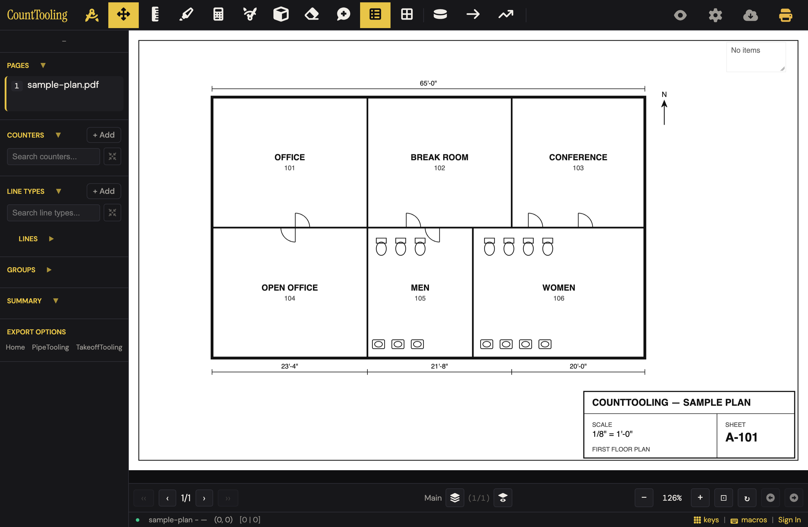
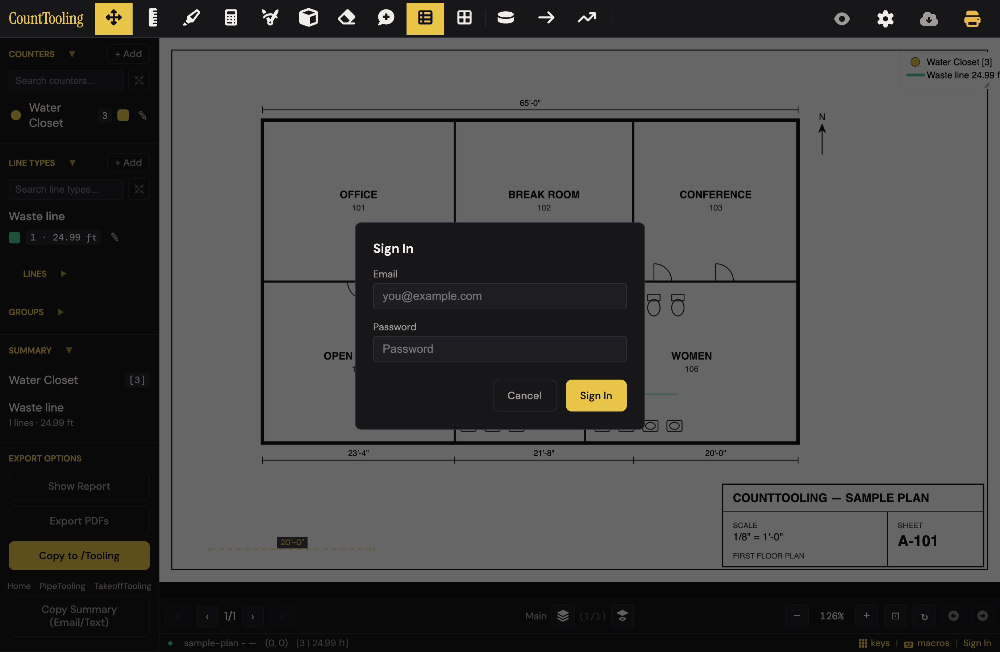
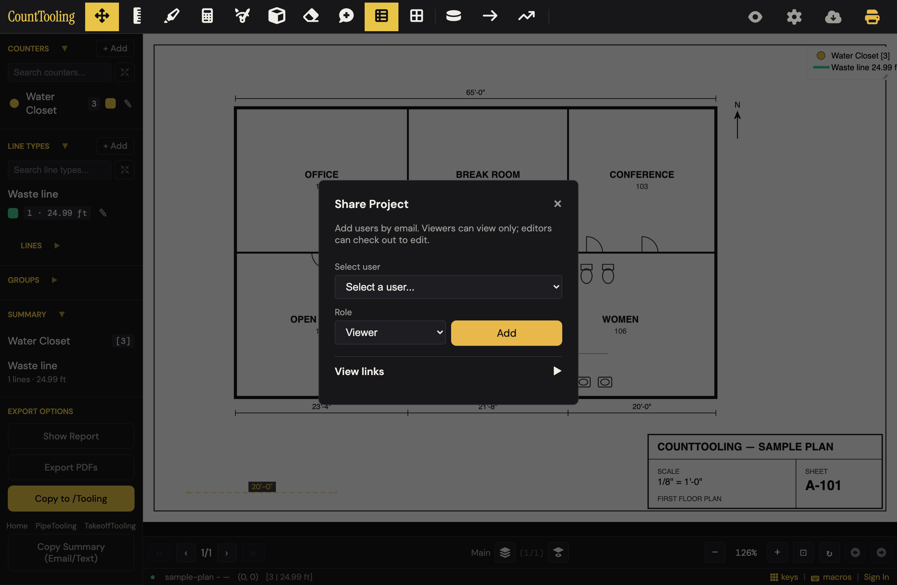
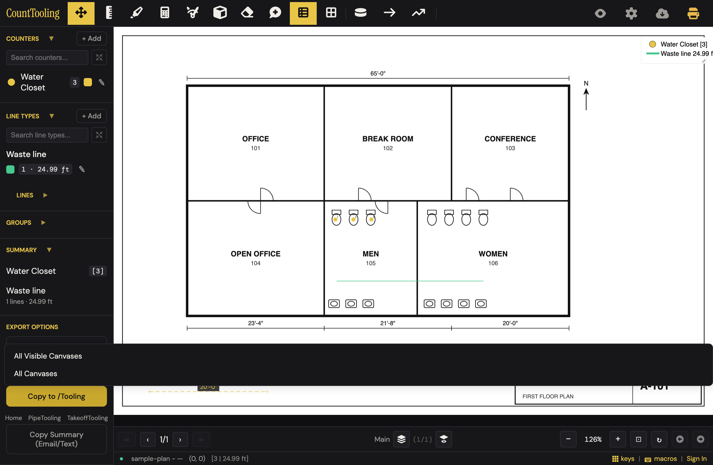
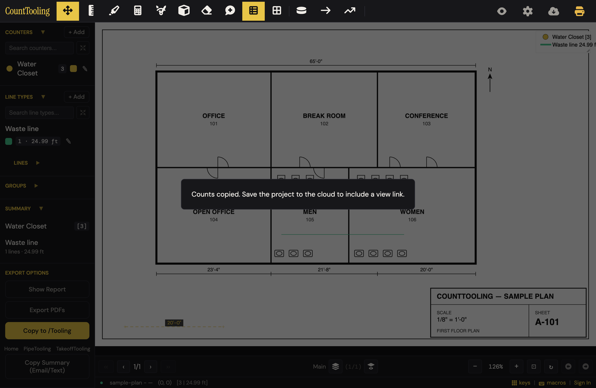
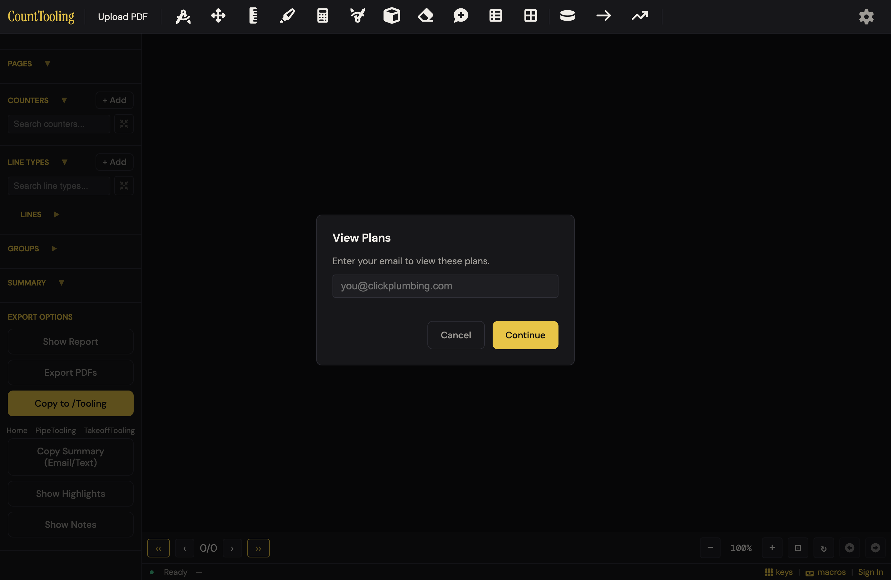
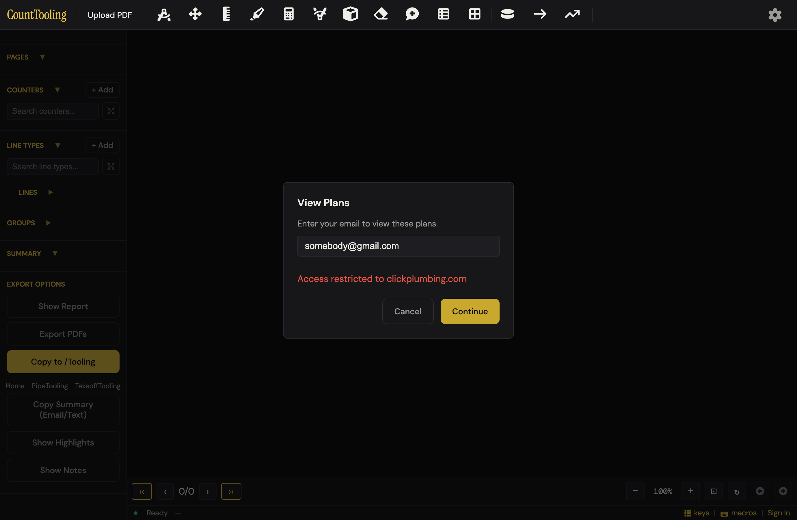
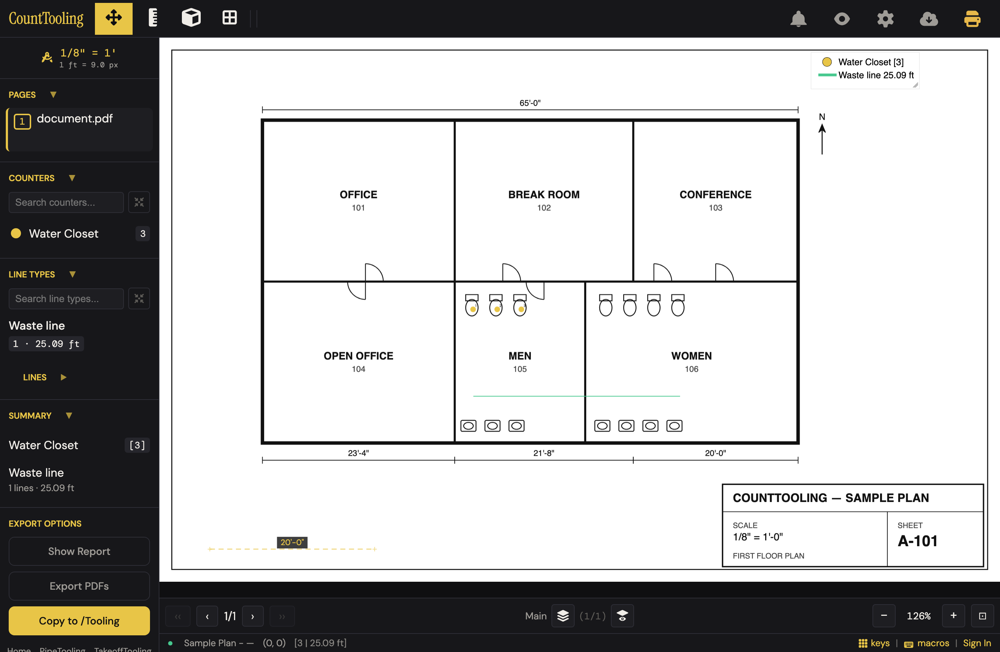

# J13 — Roles, checkout/turn-in, one editor at a time

Personas: T · Status: ● walked 2026-08-02, re-verified 2026-08-09 (every signed-out surface; cloud-session steps recorded as walls, not walked)

> Seeded from the Phase-1 cross-index workflow (2026-08-02). Phase-2 walk done 2026-08-02
> on the real app served locally (port 4113), production config, all cloud requests blocked
> at the network layer; the view-link Edge Function was stubbed per the view-only.spec.js
> recipe. No cloud session existed at any point, so the signed-in half of this journey is
> documented as walls (exact on-screen text) rather than walked.

## Entry points

- **header** — #headerShareBtn 'Share' button — code binds it to copyOrCreateViewLinkToClipboard (copies view-link URL), while the guide says it opens the Share dialog (click). **Walk update:** on desktop this button never renders — `styles.css` hides it unconditionally (`.header #headerShareBtn { display: none; }`); it only appears ≤768px with `.in-view-mode` (signed-in mobile viewer)
- **sidebar** — #sidebarLogoShare share icon — opens the Share Project modal (App.openShareProjectModal) (click). **Walk update:** the whole `.sidebar-logo-icons` strip is mobile-only CSS; hidden on desktop
- **modal** — Project Settings -> 'Share' (#settingsShareProject) — opens the Share Project modal (click)
- **burger** — Mobile burger 'Share' item — routes to #sidebarLogoShare (editor) or #headerShareBtn copy-link (signed-in viewer) (tap)
- **header** — #headerEditStatusBanner edit-status banner buttons: '[Check out to Edit]' / '[Turn In]' / '[Edit session expired — Re-check out]' / 'Unsaved|Save' (click)
- **sidebar** — #sidebarCheckoutBanner — mirror of the header banner (same handleEditStatusBannerClick, features/turn-in.js) (click)
- **modal** — Project Settings checkout section: 'Check out Project' (#settingsCheckOut), 'Turn In Project' (#settingsCheckIn), 'Force turn-in (admin)' (#settingsForceCheckIn) (click)
- **modal** — Save Status modal expired panel: 'Re-check out and save' (#saveStatusExpiredRecheckout) (click)
- **modal** — Checkout-expired recovery modal buttons: 'Re-check out and save' / 'Export local backup' / 'Discard local edits and reload' / 'Cancel' — opened by expiry routing or the expired banner (click)
- **modal** — Load Project modal per-row 'Who has access' panels + invite (admin 'Advanced' toggle #loadProjectAdvancedToggle; invite-to-project Edge Function) (click)
- **modal** — Save-before-load prompt (#saveBeforeLoadModal) — interposed by openLoadProjectModalOrPromptSave when local work is unsaved (click)
- **modal** — Admin Manage Projects modal 'Force turn-in' (features/manage-projects.js, force_check_in_project RPC) — the admin-side origin of the turned-in-by-another-user toast users see (click)
- **status bar** — Realtime availability toast 'Project is now available. You can check out to edit.' (save-engine.js:901) — passive entry that prompts the waiting user's checkout (none (toast))
- **sidebar** — *(found in walk)* 'Copy to /Tooling' (#forPipeTooling) — the one share-adjacent action that works signed-out; appends a view link only when signed in with a cloud project, otherwise explains why in a toast (click)

## Current route (walked 2026-08-02)

**Signed-out estimator trying to share — 2 steps to the wall, 0 decisions:**

1. Load the plan. There is no Share control anywhere signed-out: the header Share button is CSS-hidden on desktop, the sidebar share icon is mobile-only, and Project Settings -> Share requires a signed-in session with a cloud project. The only cloud-scented chrome is the gear (tooltip "Project Settings") and a small "Sign In" link at the far right of the bottom status bar. 
2. Click the gear -> **the wall**: a bare Sign In modal ("Sign In / Email / Password / Cancel / Sign In"). No create-account, no forgot-password, no "accounts are set up by your admin" hint. The status-bar "Sign In" link lands on the identical modal. Empty submit shows "Email and password required". Escape closes it cleanly. 

Everything in the Phase-1 route from "open the Share dialog" onward (add person, pick Viewer/Editor, teammate loads, [Check out to Edit], [Turn In], availability toast) sits behind that wall — recorded under Walk notes as not-walked. The Share Project modal shell was force-opened via DOM only to record its copy: "Add users by email. Viewers can view only; editors can check out to edit." with a collapsed "View links ▶" section. 

**What a signed-out user CAN do that touches sharing — 2 steps, 1 decision (which canvases):**

3. Sidebar EXPORT OPTIONS -> "Copy to /Tooling" -> a scope chooser. **Re-walk correction (2026-08-09):** on a one-page plan the chooser offers "All Visible Canvases" / "All Canvases" — "This Canvas Only" is hidden whenever `state.pages.length <= 1` (app.js updateUI), so on the sample plan the two remaining options do the same thing. Pick either; counts copy to the clipboard and a toast explains the missing link in plain language: "Counts copied. Save the project to the cloud to include a view link."  

**Recipient side, /app/?t=&lt;token&gt; (view link) — 2 steps, 1 decision:**

4. The email gate: "View Plans — Enter your email to view these plans." One field, Cancel / Continue. Empty submit: "Enter your email". Wrong domain (server-rejected): "Access restricted to clickplumbing.com" in red, modal stays up for another try.  
5. Continue with an allowed email -> the full live takeoff opens read-only in seconds: tallies in the sidebar, legend on the plan, Hide-marks toggle, Show Report / Export PDFs / Copy to /Tooling all available. Nothing on screen says "view only" — edit tools are simply absent — and the status bar still offers "Sign In". 

## Naive attempt

Signed out with the sample plan loaded, hunting for "share with my co-estimator": scanned the header — tools only, nothing named Share. Clicked the one management-looking icon, the gear ("Project Settings") — got a bare Sign In modal instead of settings (action 2). Closed it, spotted the tiny "Sign In" in the status bar (same modal). Under EXPORT OPTIONS, clicked "PipeTooling" expecting to send counts — it is an external site link, not the copy button sitting directly above it. Gave up on sharing after ~5 actions: signed out, no path leads to a share, and nothing says why or how to get an account.

*Re-walked 2026-08-09, same outcome in 3 actions:* header scan found nothing named Share (the only management-looking controls are the eye, gear, export-cloud, and printer icons); gear ("Project Settings") -> Sign In wall; the Export dropdown holds only "Export PDF / Import Canvas". A signed-out estimator cannot discover that sharing exists.

## Friction findings

| # | severity | what happens | why it hurts | verdict |
|---|----------|--------------|--------------|---------|
| 1 | stumble | Signed-out desktop has zero Share affordance; the doorway is a gear whose tooltip says "Project Settings" but which opens a Sign In modal | The label promises settings and delivers an auth wall; a new estimator concludes the app has no sharing | CONFIRMED — reproduced live (port 4313): zero visible Share controls (headerShareBtn/sidebarLogoShare/settingsShareProject all hidden), gear title "Project Settings" opens #authModal, settingsModal stays closed (app.js:3820) |
| 2 | stumble | The Sign In wall is a dead end: Email/Password/Cancel only — no create-account path, no "ask your admin" hint (accounts are admin-created) | The second estimator of this journey's pair literally cannot self-serve; they email around or give up | CONFIRMED — reproduced live: modal text is exactly "Sign In Email Password Cancel Sign In"; markup (app/index.html:1919-1941) has no other path; dev-bypass hidden |
| 3 | stumble | Cancel or Escape on the "View Plans" email gate dumps the recipient into the empty signed-out editor ("Upload PDF", page 0/0) with no way back except browser reload | The shared link now looks broken; a GC or inspector won't know reloading restores the gate | CONFIRMED — reproduced live: Escape → gate gone, pages 0/0, "Upload PDF" visible; reload restores the gate; code path is `done(null)` → `if (!email) return;` (features/view-only.js:186-190) |
| 4 | papercut | An anonymous view-link viewer using Copy to /Tooling gets "Counts copied. Sign in to include a view link." — but signing in cannot help a view-only session (features/output.js checks `!state.supabaseSession?.user` before `state.loadedViaViewLink`, so the accurate "View-only sessions cannot create a share link." branch is unreachable for signed-out viewers) | Tells an outsider to do something that won't work; the correct message already exists one branch lower | CONFIRMED — reproduced live in a stubbed anonymous viewer (loadedViaViewLink=true, no session user, currentProjectId set): toast is verbatim "Counts copied. Sign in to include a view link."; branch order re-read at features/output.js:80-86; and canExportViewLink() requires `!state.loadedViaViewLink` (output.js:38-42), so signing in genuinely cannot produce a link here — the message is factually wrong, not just mis-ordered |
| 5 | papercut | Viewer session shows nothing that says "view only": no banner, tools silently absent, status bar offers "Sign In", and the Pages list shows "document.pdf" while the status bar says "Sample Plan" | Recipients poke at the canvas wondering if it's broken rather than knowing it's read-only | CONFIRMED — reproduced live: #headerEditStatusBanner empty (gated on `state.supabaseSession?.user`, app.js:2182), no "view only"/"viewing only" text anywhere in body, status bar "Sample Plan … Sign In", Pages list "1 document.pdf" |
| 6 | papercut | Duplicate surface in EXPORT OPTIONS: the "Copy to /Tooling" button sits directly above external links "PipeTooling / TakeoffTooling"; the link is the eye-catcher and opens another website | First-time users (and this walker) click the product name, not the verb | CONFIRMED (structure) — live block reads "… Copy to /Tooling \| Home \| PipeTooling \| TakeoffTooling \| Copy Summary (Email/Text)"; the adjacency is real. The "eye-catcher" claim is the walker's own misclick, plausible but single-subject — papercut is the right ceiling |
| 7 | papercut | Save Status bell is visible in an anonymous viewer session and opens "CANVAS \| Not signed in to cloud … Verbose mode / Copy logs / Export logs" | Engineering log console shown to an outside viewer who cannot save anything | CONFIRMED — reproduced live: #saveStatusBtnHeader visible in the anonymous viewer; clicking it opens "Save Status × CANVAS \| Not signed in to cloud … Verbose mode Copy logs Export logs"; expired-recovery elements present in DOM, hidden |
| 8 | papercut | Export dropdown differs by state with no explanation: signed-out editor sees "Export PDF / Import Canvas", anonymous viewer sees "Export Canvas / Export Both" (Export PDF absent, Export Canvas present; re-verified 2026-08-09 scoped to #exportDropdownMenu — the sidebar's separate "Export PDFs" button exists in both states) | Same control, different menus; "Canvas" is software language either way | CONFIRMED — reproduced live in both states, computed-style per item: signed-out shows Export PDF + Import Canvas (Export Canvas/Both hidden); anonymous viewer shows Export Canvas + Export Both (Export PDF/Import Canvas hidden) — exact complement, as claimed |
| 9 | papercut | On a one-page plan, "Copy to /Tooling" (and "Copy Summary") still opens a scope chooser — but "This Canvas Only" is hidden (`pages.length <= 1`), leaving "All Visible Canvases" / "All Canvases", two options that produce identical output | A decision with no consequence, in engine vocabulary ("Canvases"), on the one share-adjacent action a signed-out user has; the header's Download-page button already skips its menu in exactly this case (features/output.js) | CONFIRMED — reproduced live (1 page, 1 canvas): chooser opens with "This Canvas Only" display:none (app.js:2394-2396), two visible options; picking one copies identical content; the skip pattern cited really exists at features/output.js:416-417 (`if (!multiPage && canvases.length <= 1)`) |

## Proposals

- **keep** — Copy to /Tooling's signed-out fallback: counts still copy and the toast says exactly why there's no link ("Save the project to the cloud to include a view link."). Spirit: (1) zero extra steps on the happy path; (2) plain trade language; (3) removes the need to understand view links before copying counts; (4) found it with no guide. spiritPass: true [verified — toast and clipboard payload reproduced verbatim on port 4313]
- **keep** — The view-link email gate: one field, one button, "Enter your email to view these plans." Domain rejection re-shows the modal with the reason instead of silently looping. Spirit: (1) one decision; (2) trade language; (3) no accounts to create for recipients; (4) an inspector who never saw the app gets through in seconds. spiritPass: true [verified — gate copy, empty-submit "Enter your email", and 403 → "Access restricted to clickplumbing.com" with modal still up, all reproduced]
- **keep** — One wall, not three: gear, status-bar Sign In, and every gated action all funnel to the same single auth modal — no competing sign-in surfaces. Spirit: (1) one path; (2) n/a; (3) removes duplicate auth UIs; (4) findable. spiritPass: true [verified — gear and #statusBarAuth both land on #authModal live; gated actions route via authBtn.click() in code]
- **polish** — Reorder the toast branches in features/output.js so a view-link session (signed in or not) gets "View-only sessions cannot create a share link." instead of "Sign in to include a view link." (check `state.loadedViaViewLink` before `!state.supabaseSession?.user`). Spirit: (1) removes a wrong decision (a pointless sign-in attempt); (2) both messages are already trade-plain; (3) removes a false instruction, adds nothing; (4) the message is the surface. spiritPass: true [verified — false message reproduced live; canExportViewLink() confirms sign-in cannot help a view-link session; both strings already exist, so the fix is a pure branch swap]
- **polish** — Add one line to the Sign In modal: "Accounts are set up by your office admin." Spirit: (1) ends the dead end in one read; (2) trade language; (3) removes the guess-who-to-ask loop, adds no control; (4) it's on the wall itself, the only place a stuck user is looking. spiritPass: true [verified — the dead end is real (modal reproduced with zero self-serve paths); budget note: this ADDS a sentence, but what it makes unnecessary (the off-app who-do-I-ask hunt) is concrete; one static line, no control, passes]
- **polish** — Cancel/Escape on the View Plans gate should re-offer the gate (or leave a "This link needs an email — reload to try again" screen) instead of dropping into the empty editor. Spirit: (1) removes a dead end from the recipient's happy path; (2) trade language; (3) removes a broken-looking state, no new chrome; (4) recipients recover without knowing anything. spiritPass: true [verified — broken state reproduced (Escape → empty editor, reload restores gate). Caveat for implementation: an unconditional re-offer makes Cancel un-cancelable; the static "reload to try again" variant avoids that loop]
- **polish** — Show the existing "Viewing only" edit-status banner in view-link sessions too (it already exists for signed-in viewers; anonymous viewers currently get nothing). Spirit: (1) prevents the poke-the-canvas confusion; (2) "Viewing only" is trade-plain; (3) reuses an existing banner, adds no new surface; (4) it's in the header, unmissable. spiritPass: true [verified — reuse claim checked: the "Viewing only" branch exists at app.js:2238 but the banner is gated on `state.supabaseSession?.user` (app.js:2182), so anonymous viewers are excluded exactly as claimed; genuine reuse, not new chrome]
- **polish** — Skip the Copy to /Tooling and Copy Summary scope chooser when the project has one page and one canvas — copy immediately, exactly as the header Download-page button already does (`if (!multiPage && canvases.length <= 1)` in features/output.js). Spirit: (1) removes one click and one meaningless decision from the happy path; (2) removes "Canvases" vocabulary from a flow plumbers hit constantly; (3) removes a menu in the common case, reusing an existing code pattern; (4) the button just works — nothing to find. spiritPass: true [verified — two-equivalent-options chooser reproduced live; the cited skip precedent is real (features/output.js:416-417)]
- **hide** — Hide the Save Status bell in anonymous view-link sessions ("CANVAS | Not signed in to cloud", Copy/Export logs serves no viewer). Spirit: (1) one less mystery icon; (2) removes software language ("Verbose mode", "logs") from outsiders' view; (3) pure removal; (4) n/a — removal needs no finding. spiritPass: true [verified — bell + log console reproduced in the anonymous viewer; nothing in that modal serves a viewer (no save activity possible, expired-recovery panel hidden); pure removal]
- **teach** — Signed-out Share discoverability: don't add a disabled Share button to the signed-out header. The 7 daily users stay signed in; the fix is the guide saying plainly "Sharing starts after you sign in — the Share dialog lives in Project Settings and the sidebar share icon (phone)." A dead button fails the simplicity budget (adds chrome for a rare state) even though it would aid findability. spiritPass: false (fails 3), hence teach [verified — correct self-application of the spirit test; a dead button for a state the 7 daily users never sit in fails the budget; teach is right]
- **teach** — The guide's "Share button in the header" desktop claim is wrong today (button is CSS-hidden on desktop, mobile-viewer-only as a copy-link). Either the guide or the CSS is stale; until product decides, the guide should describe the two real desktop openers (Project Settings -> Share; phone: sidebar share icon). spiritPass: true (doc fix removes a wrong instruction) [verified — styles.css:58 hides #headerShareBtn unconditionally; :138-139 re-show it only ≤768px with .in-view-mode; live signed-out desktop confirms it never renders]

## Demo moment

Paste a `?t=` view link into any browser — no account, no install: type your email, hit Continue, and inside ~5 seconds the full live takeoff is on screen, counts tallied in the sidebar, legend on the plan, ready to print or copy counts out. The whole recipient experience is one text field. (Experienced via the stubbed Edge Function; timing is local-network.)

## Evidence

- **Telemetry visibility:** Partially visible. project_open fires when the invited teammate loads the shared project (non-viewer only, app.js logProjectOpenEvent); project_save fires (throttled per project) on saves during the checked-out session and on the save-before-load 'Save now'; session_start fires once per browser session at sign-in. The journey's own verbs are blind: invite/role-change/remove, checkout, turn-in, force turn-in, keep-alive, expiry, auto-recheckout, and recovery emit none of the 7 events — they are traceable only in the Save Status log (pushSaveEvent, e.g. turn_in_ok), which is not user-activity telemetry. line_added/counter_marker_added fire only if the editor draws; export_canvas/export_pdf do not fire on this route.
- **Guide coverage:** [sharing-and-view-links.md](/guides/sharing-and-view-links/) — The journey's primary guide: Share dialog from header Share button or Project Settings -> Share, add people by email, Viewer/Editor roles, 'any project member can add people', role change/removal; check-out/turn-in concept, ~30-min inactivity expiry, admin force turn-in aside, 'anyone waiting is notified' when the project frees up; [how-your-work-is-saved.md](/guides/how-your-work-is-saved/) — Expiry recovery path: app first tries to quietly re-check-out; if it can't, a recovery dialog offers re-check out and save / export local work / discard — 'nothing is lost silently'; [admin-handbook.md](/guides/admin-handbook/) — Force turn-in from Manage Projects (admin escape hatch when someone left holding the lock), notes checkout self-expires after ~30 minutes; [browser-based-vs-desktop-takeoff.md](/guides/browser-based-vs-desktop-takeoff/) — One-line positioning mention: projects live in one place with roles and check-out so two people can't overwrite each other
- **Specs:** share-links.spec.js (people list render, role change/remove RPC args, invite-to-project post + server-error surfacing), copy-project.spec.js (#saveBeforeLoadModal messages, Cancel/discard paths), save-project.spec.js (three-tier checkout-expiry preflight on manual save), manage-projects.spec.js (admin force turn-in flow, cloud-gated), save-engine.test.js (unit: keep-alive skip ladder, expiry routing, contained recovery throw, markProjectDirty holder-only checkout refresh), load-project.spec.js (admin Advanced access-panel toggle wiring), view-only.spec.js (viewer-session gating adjacent to this journey)
- **Modals:** `shareProjectModal`, `checkoutExpiredRecoveryModal`, `saveBeforeLoadModal`, `settingsModal`, `saveStatusModal`, `manageProjectsModal`, `loadProjectModal`
- **Hotkeys:** —
- **Features touched:** Project sharing (viewer/editor roles), Check-out / turn-in (one editor at a time), Admin toolkit, Auto-save every 5 seconds + local backups, Save Status bell

## Guide gaps (doc-derived)

- Guide says the header Share button opens the Share dialog, but code binds #headerShareBtn to copy a view link; the modal actually opens from the sidebar share icon or Project Settings -> Share — no guide documents this split. **Walk confirms it's worse:** the header button is CSS-hidden on desktop entirely
- Banner states and wording are undocumented: '[Check out to Edit]', '[Turn In]', '<email> is editing', 'Viewing only', 'Unsaved/Save', '[Edit session expired — Re-check out]'
- The save-before-load prompt ('You have unsaved changes. Save before loading another project?' with Cancel / Don't Save / Save now) appears in no guide
- Keep-alive mechanics are undocumented beyond 'the lock holds while you're active' — constants.js pins 10-min keepalive, 5-min near-expiry, 2-min refresh debounce, 60s soft grace
- Silent auto-recheckout limits (3 per project, 5s min gap, 30-min cooldown — AUTO_RECHECKOUT_* in constants.js) are undocumented; guide only says 'quietly re-check-out'
- The availability notification is described ('anyone waiting is notified') but no guide shows it is a toast, its wording, or that it requires the realtime subscription to be live
- What force turn-in looks like from the losing editor's side (toast 'Project was turned in by another user. Unsaved edits may have been lost - check Save status (bell).') is undocumented
- Project Settings checkout section ('Project is available. Check out to edit.' / 'You have this project checked out.' / Turn In Project / Check out Project buttons) is undocumented
- The Load Project modal's per-row 'Who has access' invite panels behind the admin Advanced toggle are undocumented
- The promoted-to-editor toast ('You have been promoted to editor. You can now check out to edit.') and access-revoked toast ('You no longer have access to this project.') are undocumented

## Terminology on screen (recorded, not judged)

- 'Turn In' / 'Turn In Project' (app's word for releasing the lock; specs and RPCs say check_in_project — 'check in' never appears on screen)
- '[Check out to Edit]' and 'Check out Project' (checkout as the edit-gate verb)
- 'Force turn-in (admin)' (button in Project Settings) vs 'Force turn-in' (Manage Projects); toast says 'Project force turned in.'
- 'Edit session expired' (modal title) / '[Edit session expired — Re-check out]' (banner) / 'Re-check out and save' (recovery + Save Status buttons)
- 'Viewer' / 'Editor' (role select options in the Share dialog); '<email> is editing' and 'Viewing only' (banner states)
- 'You have this project checked out.' / 'Project is available. Check out to edit.' (Project Settings status)
- 'Don't Save' / 'Save now' (saveBeforeLoadModal buttons)
- 'Export local backup' and 'Discard local edits and reload' (recovery modal)
- 'Project is now available. You can check out to edit.' (availability toast)
- 'Project was turned in by another user. Unsaved edits may have been lost - check Save status (bell).' (forced/other-user turn-in toast)
- 'Your edit session expired while idle. Check out again to keep editing.' (CHECKOUT_EXPIRED_TOAST_MSG)
- *(walk additions, software-language quotes)* 'Copy to /Tooling' (product-family shorthand a first-timer won't parse); 'Export Canvas' / 'Import Canvas' / 'This Canvas Only' / 'All Visible Canvases' / 'All Canvases' ("canvas" is engine vocabulary); Save Status modal in a viewer session: 'CANVAS | Not signed in to cloud', 'Verbose mode', 'Copy logs', 'Export logs'; 'Name / Upload / Save Project to Cloud' (triple-verb button label)

## Open questions for the Phase-2 walk

- Does clicking the header Share button really only copy a view link (code) rather than open the Share dialog (guide)? What a desktop user actually experiences, and what toast/feedback the copy shows -> **answered (partially):** a desktop user experiences nothing — `styles.css` hides #headerShareBtn unconditionally on desktop; it renders only ≤768px with `.in-view-mode` (signed-in mobile viewer), where it copies. The copy toast ('View link copied to clipboard', per code) not walked — needs a session
- Empty states of the Share dialog: what the people picker shows when there are no invitable users, and what error surfaces when inviting an email the server rejects -> **partial:** static shell recorded (placeholder 'Select a user...', collapsed 'View links ▶'; the 'No one else has access yet.' / 'No view links yet.' strings render only after RPCs). Live empty states walk-blocked (RPCs need a session)
- Can a Viewer-role member actually add people ('any project member can add people' per guide) or does the RPC deny it? -> walk-blocked (needs two cloud accounts)
- When exactly the availability toast arrives — only while the waiting user has the project open with realtime connected? What happens across the reconnect backoff (1s/3s/10s/30s)? -> walk-blocked (needs realtime session)
- Live behavior at the ~30-min expiry: is silent auto-recheckout observable (Save Status log), and under what conditions the recovery modal opens versus only the expired banner appearing -> walk-blocked
- Force turn-in as seen by the losing editor: does the toast + expired-attention state land immediately via realtime or only on the next save/keep-alive attempt? -> walk-blocked
- Mobile variant: where the edit-status banner and Turn In live on a phone (burger header), and whether banner text truncates -> not walked (journey's Mobile field: no); CSS review shows the desktop share/checkout chrome swaps to the burger + `.sidebar-logo-icons` strip ≤768px
- Save-before-load 'Save now' when the project is checked out by someone else — what error path the prompt takes -> walk-blocked
- Whether checkout via Project Settings vs the banner differ in feedback (turn-in.js shows 'Project is checked out by <email>' on denial — same in both?) -> walk-blocked
- Timing feel of keep-alive vs the 30-min expiry during a real idle-and-return cycle (soft grace 60s, near-expiry 5 min) -> walk-blocked
- *(new, from walk)* Does the signed-in Project Settings modal show 'Share' before the project is saved to the cloud (state.currentProjectId gate suggests no — sharing requires a saved project first)? -> **answered (code-confirmed, 2026-08-09):** yes — `#settingsShareProject` renders only when `SUPABASE_ENABLED && state.currentProjectId && state.supabaseSession?.user && !state.loadedViaViewLink` (app.js:2268), and `openShareProjectModal()` itself early-returns without `state.currentProjectId` (features/share-links.js:41). The share flow really is Save-to-cloud -> Share, two walls deep from signed-out. Live signed-in confirmation still walk-blocked

## Guide actions

*(Phase 5)*

## Walk notes

**Not walked (cloud-session gated) — with the exact wall a signed-out user sees:**

- Share dialog live (people list, add/role/remove, view-link create/list/revoke) — wall: the openers don't exist signed-out; the generic wall is the Sign In modal: heading "Sign In", fields "Email"/"Password", buttons "Cancel"/"Sign In"; empty submit -> "Email and password required"
- Project Settings modal itself (desktop, signed out) — gear click routes to the Sign In modal instead (app.js #settingsGearBtn handler)
- Save/Load Project, checkout ('Check out Project'), turn-in ('[Turn In]'), edit-status + checkout banners, availability toast, expiry/recovery modals, force turn-in, save-before-load prompt — all require a signed-in session with a cloud project; none render signed-out (verified via computed-style probe: headerShareBtn/copyViewLinkBtn/sidebarLogoShare/saveProjectBtn/loadProjectBtn/headerEditStatusBanner/sidebarCheckoutBanner all hidden)
- Copy-view-link toast 'View link copied to clipboard' — needs a session + saved project
- Dev bypass 'Sign in as test user' (#authDevBypass) — did not render (requires DEV_AUTH_EMAIL/PASSWORD in config, absent here); never clicked

**Environment quirks:**

- Repo served statically on 127.0.0.1:4113; Playwright chromium; production config.js present but every non-127.0.0.1 request aborted at the route layer. Notable: a signed-out boot makes **zero** cloud requests (vendored supabase-js, no stored session) — the signed-out walk is byte-identical to production behavior
- View-link walk used the proven view-only.spec.js stub: `**/functions/v1/get-view-project` fulfilled locally (including a 403 `domain_restricted` variant to exercise the real rejection UI); the "signed URL" was the same-origin sample PDF. No token, project, or user ever existed in the cloud
- The Share Project modal screenshot (03) was force-opened via `App.showModal` purely to record static copy — it is NOT reachable signed-out
- Clipboard verified via granted clipboard permissions: signed-out copy produced `Water Closet\t3\t1\nft of Waste line\t24.99\t1` with no link line

**Duplicate-surface moments:**

- "Copy to /Tooling" button vs the "PipeTooling / TakeoffTooling" external links stacked in the same EXPORT OPTIONS block — the product-name link reads as the action and opens another website
- "Copy to /Tooling" vs "Copy Summary (Email/Text)" — two adjacent copy verbs in the same block, each opening its own identical scope chooser ("All Visible Canvases / All Canvases" on a one-page plan); a first-timer cannot tell which copy the other estimator needs
- Gear tooltip "Project Settings" vs status-bar "Sign In" — two entries, same auth modal, but only one is labeled for what it does signed-out
- Export dropdown by state: signed-out editor "Export PDF / Import Canvas" vs anonymous viewer "Export Canvas / Export Both" — same control, different menus, no explanation
- Guide-vs-code: header Share button (copy link) vs sidebar share icon / Settings -> Share (dialog) — and on desktop the header button doesn't exist at all

**Re-verification pass (2026-08-09, same rig: 127.0.0.1:4113, production config, all non-local requests aborted, view-link Edge Function stubbed):**

- Confirmed live: gear -> Sign In wall; auth modal is Email/Password/Cancel/Sign In only, empty submit -> "Email and password required", Escape closes; dev-bypass "Sign in as test user" present in DOM but hidden, never clicked
- Confirmed live: gate copy "View Plans — Enter your email to view these plans.", empty submit -> "Enter your email", 403 domain stub -> "Access restricted to clickplumbing.com" with the modal re-offered; Escape on the gate drops to the empty signed-out editor (pages 0/0, "Upload PDF") — finding #3 stands
- Confirmed live in the anonymous viewer: status bar "Sample Plan" vs Pages list "document.pdf" (finding #5); no edit-status banner renders (`#headerEditStatusBanner` empty/hidden); toast "Counts copied. Sign in to include a view link." (finding #4 — branch order in features/output.js:80-86 re-read, unchanged); export dropdown scoped to `#exportDropdownMenu` = "Export Canvas / Export Both" (finding #8); Save Status bell opens with "Canvas | Not signed in to cloud", Copy logs / Export logs (finding #7 — the "Edit session expired" recovery panel is in the modal's DOM but hidden in this state)
- Signed-out clipboard re-verified: `Water Closet\t3\t1\nft of Waste line\t24.99\t1`, no link line; toast "Counts copied. Save the project to the cloud to include a view link."
- New (finding #9): the Copy to /Tooling and Copy Summary scope choosers hide "This Canvas Only" on one-page plans (app.js updateUI `pages.length <= 1`), leaving two equivalent options
- Share modal copy re-confirmed from markup (app/index.html:2222): "Add users by email. Viewers can view only; editors can check out to edit."

**Screenshot index:**

| file | moment |
|------|--------|
| img/share-and-collaborate-01.png | Signed-out app: no Share surface anywhere; "Sign In" tucked in the status bar |
| img/share-and-collaborate-02.png | Friction: gear labeled "Project Settings" opens the bare Sign In wall |
| img/share-and-collaborate-03.png | Share Project modal shell (DOM-forced): roles copy + collapsed View links |
| img/share-and-collaborate-04.png | Graceful wall: Copy to /Tooling signed-out toast |
| img/share-and-collaborate-05.png | Recipient email gate ("View Plans") |
| img/share-and-collaborate-06.png | Error path: "Access restricted to clickplumbing.com", modal re-offers |
| img/share-and-collaborate-07.png | Demo moment: full read-only takeoff from a link, no account |
| img/share-and-collaborate-08.png | Friction: viewer told to "Sign in to include a view link" (can't help) |
| img/share-and-collaborate-09.png | Friction: one-page plan still gets the two-option scope chooser ("All Visible Canvases" / "All Canvases" — identical output) |

## Verification (2026-08-09)

Adversarial re-drive by a separate verifier, independent rig: repo served statically on **127.0.0.1:4313**, Playwright chromium, production config.js, every non-127.0.0.1 request aborted at the context route layer, `get-view-project` Edge Function stubbed locally (200 payload + 403 `domain_restricted` variant). No cloud contact at any point. Method: re-drove three sessions — (A) signed-out editor with the sample plan loaded via `#pdfInput`, (B) view-link boot at `/app/?t=<token>` for the gate/cancel/domain-reject paths, (C) anonymous viewer session (localStorage-pre-allowed email) — and cross-checked every code citation against source.

**Result: 9/9 findings CONFIRMED at the walker's severities (0 downgraded, 0 killed); 11/11 proposals [verified].** Reproduced first-hand: the gear→Sign In wall and its bare modal (#1, #2), Escape-on-gate→empty editor with reload restoring the gate (#3), the false "Sign in to include a view link." toast in an anonymous viewer (#4), the banner-less viewer chrome with "Sample Plan"/"document.pdf" mismatch (#5), the EXPORT OPTIONS adjacency (#6, structure only — the eye-catcher claim is single-subject), the viewer-visible Save Status log console (#7), the exact complementary export menus by state (#8), and the two-equivalent-option scope chooser on a one-page plan (#9). All code line citations check out: app.js:3820 (gear→authBtn), features/output.js:80-86 (branch order) and :38-42 (canExportViewLink requires `!loadedViaViewLink` — so #4's message is not just mis-ordered but unfixable by signing in), features/view-only.js:186-190 (cancel→bare return), app.js:2394-2396 (scope-option hiding), app.js:2182/2238 (banner gate vs "Viewing only" branch), features/output.js:416-417 (download-page skip precedent), styles.css:58/138-139 (headerShareBtn hiding).

Things the walker missed or under-stated (none rise to a new finding):

- The signed-out **Export dropdown still offers "Import Canvas"** to a user who has never exported one — same software-language family as finding #8; folded into #8 rather than counted separately.
- Proposal caveat recorded inline: making Cancel on the email gate *re-offer the gate unconditionally* would create an uncancelable loop; the proposal's static-screen variant is the safe form.
- Finding #4 is slightly stronger than written: even a viewer who *does* sign in from the view-link session can never get a link (`canExportViewLink` requires `!loadedViaViewLink`), so the toast's instruction is impossible to satisfy, not merely unhelpful.
- The walker's restraint held up: no manufactured findings detected; the three keeps are genuinely good flows as reproduced, and the one self-failed spirit test (dead Share button → teach) is the correct call.

## Stage-5 cloud-interior walk addendum (2026-08-31)

Scoped live walk (dev-auth test account, single account — contention untested):

- **Save & Open → cloud project + auto-checkout → Turn In releases the lock**
  (`checkedOutBy` cleared, `canCheckOut` true) — the single-editor lifecycle works;
  the Project Settings **Bid review** row is present.
- **NEW stumble/blocker-grade — hidden-tab save stall**: `performSaveProjectToCloud`
  awaits `tick()` = `requestAnimationFrame`, and rAF never fires in a hidden tab —
  a user who clicks Save & Open (or any manual save) and immediately switches tabs
  has the save stall INDEFINITELY with no error; it resumes only when the tab is
  re-fronted. Reproduced live (save hung >3 min hidden, completed on visibility).
  Closing the browser while backgrounded loses a save the user believed was in
  flight. Fix candidate: `tick()` falls back to `setTimeout` when
  `document.hidden` (one line in save-engine.js). The T1-01 local backup limits
  the damage but the cloud save is the one the user asked for.
- **Not walked** (needs a second account): checkout contention, force turn-in from
  the other side, the waiting-notification, multi-user Share roles.
