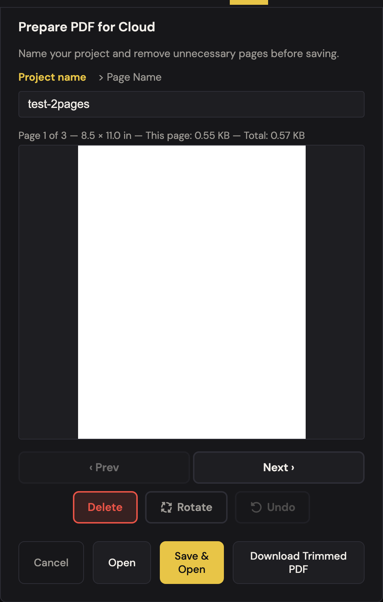
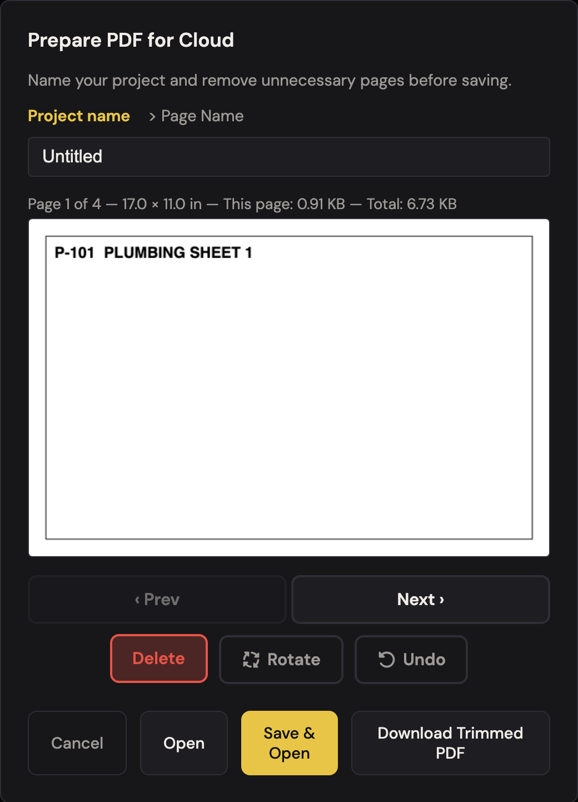
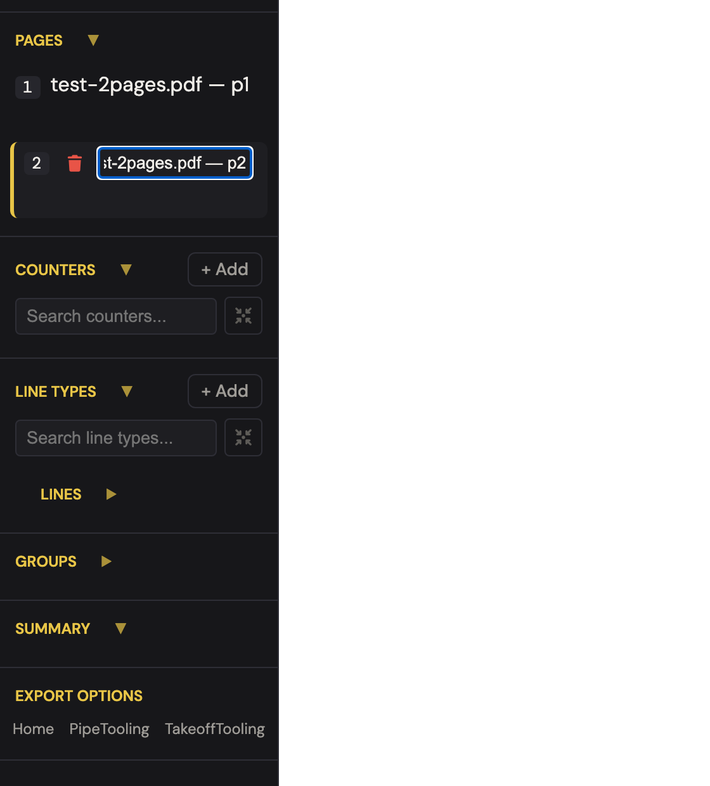
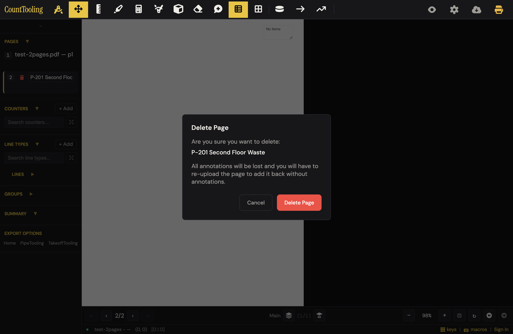
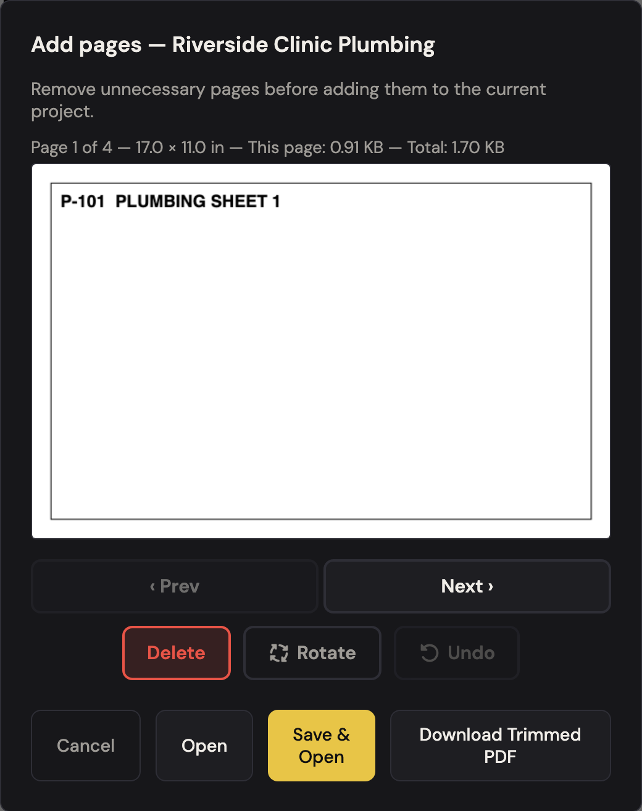
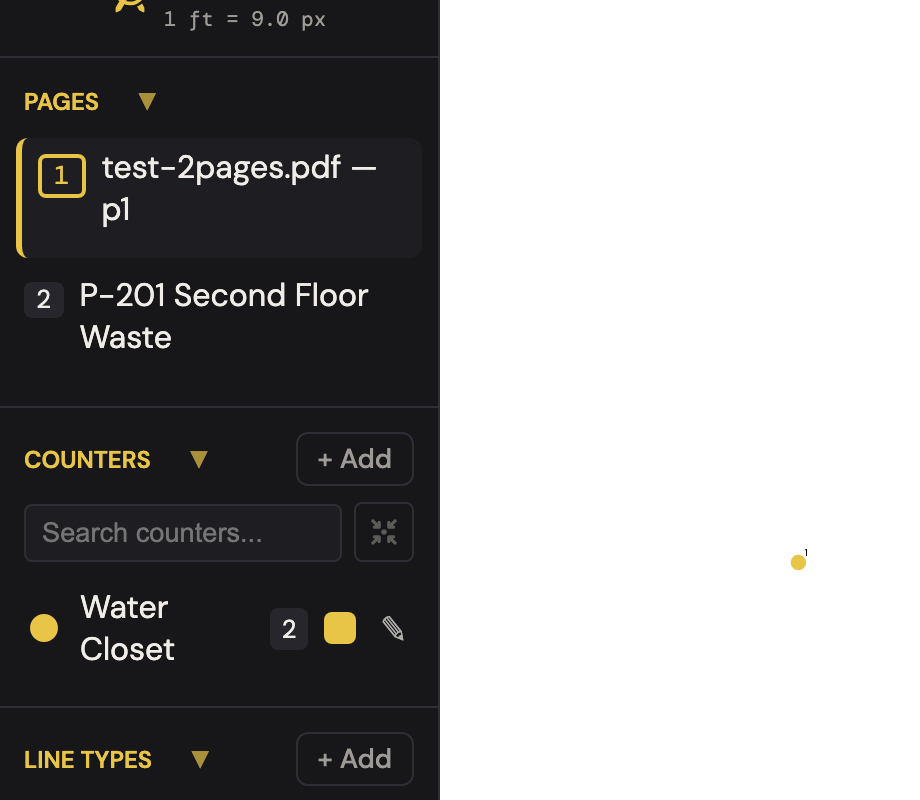
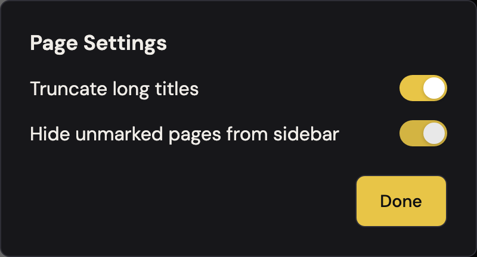
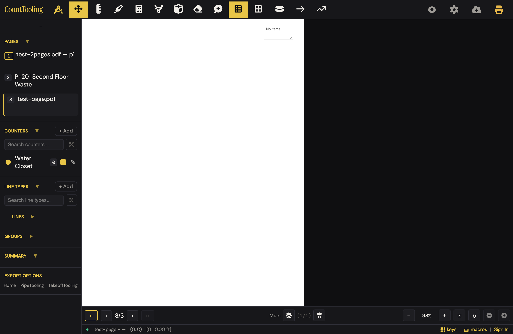

# J2 — A 200-sheet combined set → just my sheets, named my way

Personas: P E H · Status: ● walked 2026-08-02 (headless Chromium 1380×900, signed-out local; cloud legs blocked — see Walk notes) · re-walked 2026-08-20 after the Prepare-PDF grid rebuild — see the Addendum at the end

> Seeded from the Phase-1 cross-index workflow (2026-08-02). Walked in Phase 2 with
> test-2pages.pdf + test-page.pdf (multi-file merge) and a synthetic 24-sheet
> mixed-discipline set built with the app's own PDFLib.

## Entry points

- **header** — Upload PDF button (#uploadPdf -> #pdfInput) (click)
- **sidebar** — Upload PDF button (#uploadPdfSidebar -> #pdfInput) (click)
- **modal** — Project Settings > 'Add additional PDF pages' (#settingsAddAdditionalPages) — sets append flag, opens file picker, routes to Prepare PDF in append mode (click)
- **header** — Export dropdown button doubles as upload trigger when 0 pages loaded (import-mode shield, app.js ~3583) (click)
- **modal** — 'Choose PDF...' in canvas-only-needs-PDF modal (#canvasOnlyNeedsPdfChoose) and its banner twin (#canvasOnlyNeedsPdfBannerChoose) (click)
- **modal** — Prepare PDF modal auto-opens after a fresh first upload (pdf-intake handoff to App.openPreparePdfModal) (automatic after file pick)
- **sidebar** — 'Pages' section heading (#pagesSectionTitle) opens Page Settings modal (truncate titles / hide unmarked) (click)
- **sidebar** — Page row name -> rename via App.startRename; also the page-number badge (.page-num-badge-editable) (double-click / double-tap on name; single click on badge)
- **status bar** — Marked-page nav buttons ‹‹ / ›› (#prevMarkedPage / #nextMarkedPage) flanking the page arrows (click)
- **hotkey** — Shift+Left / Shift+Right — previous / next marked page (keypress)
- **hotkey** — R — rotate current page (post-commit, on canvas) (keypress)
- **modal** — Inside Prepare PDF: '> Page Name' tab renames the previewed page; 'Project name' tab renames the project (click tab, type)

## Current route (walked 2026-08-02) — 13 steps, 5 decision points

1. Open the app and click 'Upload PDF' (header button, sidebar 'Upload PDF to start', or — at 0 pages — the export-dropdown icon, which retitles itself 'Upload PDF to start')
2. In the file picker, select one or more plan PDFs; multiple files merge into a single set, in order (verified: test-2pages.pdf + test-page.pdf → 3 pages, first file's name becomes the project name). The 50 MB per-file cap fires only in cloud-enabled builds
3. **Signed-in only:** the Prepare PDF dialog ('Prepare PDF for Cloud') opens after the pick (unless a cloud project matches the PDF's hash — then the Load Annotations chooser appears instead). **Signed-out, the dialog never appears** — all pages open straight into the app and trimming falls back to per-page deletion from the sidebar (step 10). 
4. Walk the set with '‹ Prev / Next ›'; click 'Delete' on each sheet you don't need. 'Undo' restores the last deletion (but leaves the preview on a different sheet, so you don't see what came back). Delete disables on the last remaining sheet — an empty set is unreachable. One click per unwanted sheet: trimming the 24-sheet synthetic set to its 4 plumbing sheets took 20 Delete clicks (~80 ms each). 
5. Click 'Rotate' to turn a sideways sheet 90° at a time — the dims readout flips (8.5 × 11.0 in → 11.0 × 8.5 in) as live feedback
6. Type the project name in the name field ('Project name' tab)
7. Switch to the '> Page Name' tab to rename the sheet currently previewed; walk Next and retype for each sheet (one at a time — kept sheets otherwise keep labels like 'combined-24.pdf — p21')
8. Optionally click 'Download Trimmed PDF' — saves the cut-down set locally as '<Project_Name>.pdf' (verified: Riverside_Clinic_Plumbing.pdf)
9. Click 'Open' to commit locally, or 'Save & Open' to also save to cloud (cloud leg not walked). Both buttons show signed-out too. Committed set verified: trimmed pages, custom labels, and rotation all carried into the app. **Cancel or Escape here silently throws away the entire upload and every trim/rename decision — you land on an empty app**
10. Rename any sheet later: click its page-number badge (hover tooltip 'Click to rename or delete') → inline input + trash icon; Enter commits. **Double-clicking the sheet name — the other documented affordance — is dead on desktop:** the row click re-renders the list synchronously and the double-click never lands. 
11. Delete a sheet later: same badge click → trash icon → plain-language confirm ('All annotations will be lost...'); the only remaining page cannot be deleted ('Cannot delete the only page.') 
12. When an addendum arrives mid-bid: clicking 'Upload PDF' again appends the new pages silently — no 'choose to add its pages' step exists — **and renames the open project to the new file's name** (verified: 'Riverside Clinic Plumbing' became 'test-page'). The append-mode Prepare route (Project Settings > 'Add additional PDF pages', dialog titled 'Add pages — <project>') is signed-in only: signed-out, the settings gear opens the Sign In modal 
13. Navigate a big set: sidebar badges (yellow page number = scale set, yellow outline = has marks — unlabeled in-app), ‹‹ / ›› or Shift+Left/Right between marked sheets (correctly disabled when no other sheet has marks), and 'Pages' heading → Page Settings for 'Truncate long titles' (head…tail ellipsis, full name on hover) and 'Hide unmarked pages from sidebar' (hidden pages verified still reachable with plain arrow keys)  

Decision points: which sheets to keep · rotate or not · project + sheet names · Open vs Save & Open vs Download · Page Settings toggles.

## Naive attempt

Booted signed-out, uploaded test-2pages.pdf from the only visible prompt ('Upload PDF to start' — 1 click, obvious). No Prepare dialog; both pages just appeared. To drop/rename a sheet: right-clicked the page row (nothing), double-clicked the name (nothing — it just navigated), then noticed the hover tooltip on the page-number badge ('Click to rename or delete') → badge click opened inline rename + trash. Renamed with Enter, hit the trash, got a clear confirm modal. Uploaded a second PDF from the same button — it appended silently (good, but no 'Added 1 page' feedback, and — found later — it renames the project). Goal reached unaided in ~8 actions with 2 wrong turns; rename discovery hinged entirely on a hover tooltip a tablet user would never see.

## Evidence

- **Telemetry visibility:** Fires on this route: session_start (once per browser session at auth/app open); project_save when the user commits via 'Save & Open' (performSaveProjectToCloud -> save-engine -> maybeLogProjectSaveEvent, deduped per project per interval) and again on later saves after an append; project_open only when the journey starts from an existing cloud project (the addendum/append leg), not on a fresh upload. Does not fire: line_added, counter_marker_added, export_canvas, export_pdf. Blind spots: every journey-specific action is uninstrumented — pages deleted/rotated/kept in Prepare PDF, Download Trimmed PDF, plain 'Open' (no-save commit), page renames, append-pages usage, page-settings toggles, and marked-page navigation leave no telemetry.
- **Guide coverage:** [preparing-a-plan-set.md](/guides/preparing-a-plan-set/) — The primary guide (order 1.5, Getting started): upload entry points, 50 MB cap, multi-file merge-in-order, Prepare PDF keep/delete + Prev/Next walk + Rotate + rename (project/page) + Save & Open + Download Trimmed PDF, addenda ('add its pages'), sidebar badges (yellow number = scale set, yellow outline = has marks), ‹‹/›› and Shift+arrows marked navigation, Pages-heading > title truncation + hide unmarked pages; [how-to-do-a-pdf-takeoff.md](/guides/how-to-do-a-pdf-takeoff/) — Brief Prepare PDF step in the end-to-end takeoff walkthrough (rotate, delete, Save & Open) with the same screenshot; links onward to preparing-a-plan-set for trimming/renaming/addenda; [working-faster-with-the-keyboard.md](/guides/working-faster-with-the-keyboard/) — Hotkey table rows: 'R — Rotate page' and 'Left/Right — Previous / next page (Shift jumps between marked pages)'
- **Specs:** prepare-pdf.spec.js (open via registry, next/prev/rotate/delete, commit, state.pages reflects trim), pdf-upload.spec.js (robust upload: tus resume store smoke; size-cap/append NOT covered here), add-pdf-pages-canvas-jump.spec.js (Project Settings append path; annotations stay on correct pages), pages-list.spec.js (rows, title start/end truncation, scale/annotation badges, click-to-navigate), page-settings.spec.js (truncate + hide-unmarked toggles persist to state/localStorage), delete-page.spec.js (page deletion from the Pages list), upload-then-save.spec.js (upload -> settings -> save-project flow)
- **Modals:** `preparePdfModal`, `pageSettingsModal`, `settingsModal`, `loadAnnotationsModal`, `canvasOnlyNeedsPdfModal`
- **Hotkeys:** Shift+Left — previous marked page (bespoke row in hotkeys.js), Shift+Right — next marked page (bespoke row), R — rotate page (runner rotatePage, viewerAllowed), Left/Right — previous/next page (context for the Shift variant)
- **Features touched:** PDF upload (multi-file, up to 50 MB), Prepare PDF (keep/drop, reorder, rotate pages), Append pages, Page renaming + title truncation, Marked-page badges & navigation

## Guide gaps (doc-derived)

- The plain 'Open' button (#preparePdfDone — commit without cloud save) is never mentioned; guides only name Save & Open and Download Trimmed PDF
- The Prepare PDF 'Undo' button (restores the last deleted page) is undocumented
- Page reordering: FEATURES.md claims 'keep/drop, reorder, rotate' but no guide documents reordering and no reorder control exists in the modal markup or features/prepare-pdf.js
- The actual append entry point in code (Project Settings > 'Add additional PDF pages') is undocumented; the guide instead says 'click Upload PDF again ... choose to add its pages', and no guide shows what that choice looks like
- 50 MB cap error behavior undocumented: per-file alert wording and the post-merge failure ('... MB. Maximum is 50 MB. No pages were added.')
- The export-dropdown button acting as an upload trigger when no pages are loaded is undocumented
- The canvas-only recovery path ('This project has annotations but no PDF' modal + banner, 'Choose PDF...') is undocumented in guides
- How to rename from the Pages list is not spelled out (double-click/double-tap the name, or click the page-number badge); guide only says 'You can rename later from the Pages list too'
- The append-mode variant of the dialog (title 'Add pages — <project>', project-name row hidden) is undocumented
- hashing/load-annotations prompt on re-upload ('This PDF doesn't match the project...' confirm) is undocumented

## Terminology on screen (recorded, not judged)

- Modal title 'Prepare PDF for Cloud' (fresh-upload mode) — cloud framing on what the guides call just 'Prepare PDF'
- Append-mode title 'Add pages — <project name>' with description 'Remove unnecessary pages before adding them to the current project.'
- Fresh-mode description 'Name your project and remove unnecessary pages before saving.'
- Name tabs 'Project name' and '> Page Name' (literal '>' glyph, inconsistent capitalization)
- Buttons 'Open' vs 'Save & Open' (line-broken 'Save & Open') vs 'Download Trimmed PDF' vs 'Cancel'
- 'Delete' (drops the previewed page — trade might say 'remove sheet')
- Project Settings row 'Add additional PDF pages'
- Header/sidebar 'Upload PDF'; guide also calls one entry 'the cloud button [[upload]]'
- Page Settings modal: 'Truncate long titles', 'Hide unmarked pages from sidebar' (title attr: 'Unmarked pages remain accessible via arrow keys')
- Marked-nav tooltips 'Previous marked page' / 'Next marked page' on ‹‹ / ›› glyph buttons
- Guide badge language: 'a yellow page number means the scale is set, and a yellow outline means the sheet has marks' (badges are unlabeled in-app)
- 'Sheet' (guides) vs 'Page' (all in-app labels)

## Open questions for the Phase-2 walk

- Does any page-reorder control exist in the live Prepare PDF modal (drag in preview?), or is the FEATURES.md 'reorder' claim wrong? -> **Answered: no reorder control exists anywhere in the live modal; the FEATURES.md claim is wrong.**
- What actually happens when clicking Upload PDF while a project with pages is open? -> **Answered (walked): pages merge silently — no 'choose to add its pages' step, no Prepare dialog — and the project is renamed to the new file's name (friction #1). The guide's described choice does not exist.**
- When are 'Open' vs 'Save & Open' shown/enabled (signed-out vs signed-in, SUPABASE disabled)? Does the modal appear at all in pure-local mode? -> **Answered: both buttons are always present and enabled (kept ≥ 1), even signed-out. But the modal itself only auto-opens for signed-in users (gate in pdf-intake.js requires supabaseSession.user), so signed-out/pure-local users never meet it on upload.**
- The per-file 50 MB check gated on App.SUPABASE_ENABLED — no cap local-only, append cap unconditional? -> **Answered from code: per-file alert fires only when SUPABASE_ENABLED (true in production config); a truly config-less build has no per-file cap. The append/commit paths cap unconditionally via assertPdfWithinLimit ('...exceeds the 50 MB cloud-storage limit').**
- Empty-set edge: delete every page in Prepare PDF? -> **Answered (walked): unreachable — Delete disables once one sheet remains, so the disabled-Save&Open state can't be reached by deleting.**
- With 'Hide unmarked pages' on, do arrows behave as promised, and what do ‹‹/›› do at zero marks? -> **Answered (walked): plain ArrowRight still reaches the hidden sheet (0→1 verified); ‹‹/›› are disabled whenever no other sheet has marks, and Shift+arrows are a no-op then.**
- Mobile/tablet variant -> not walked (journey scoped Mobile: no).
- Timing on a real ~50 MB 200-sheet set -> partially answered with a synthetic 24-sheet set: modal opens instantly (~40 ms), Delete responds ~80 ms/click; real 50 MB scans remain unmeasured (no such fixture offline).
- Rename affordances for view-link sessions vs editors -> walk-blocked: needs a cloud view-link session (forbidden in this walk). Code shows pages-list gates rename/delete on `showEdit` (editors only).
- Where the load-annotations hash-match prompt appears -> walk-blocked: requires a signed-in session plus a cloud project with matching pdf_hash.
- What the guide's 'cloud button [[upload]]' resolves to -> **Answered: the header icon button #uploadPdf (title 'Upload PDF') — the cloud-with-arrow glyph left of the print icon; same #pdfInput as the sidebar button.**

## Friction findings

| # | severity | what happens | why it hurts | verdict |
|---|----------|--------------|--------------|---------|
| 1 | blocker | Uploading an addendum with a project open silently renames the project to the new file's name ('Riverside Clinic Plumbing' → 'test-page'; pdf-intake.js sets currentProjectName from the picked file whenever pendingCanvasLoad is unset, even mid-project). The guide explicitly tells users to do exactly this ('click Upload PDF again ... choose to add its pages'). | The user follows the book, gets no feedback, and their bid is now named after the addendum file; a signed-in user's next save would push the wrong name to the cloud project.  | CONFIRMED — independently reproduced (port 4302); worse than stated: rename also fires with `currentProjectId` set (open cloud project), the intake path calls `markProjectDirty()`, and `performAutoSave` (save-engine.js:2469) reads `currentProjectName` — so autosave pushes the wrong name with **no** manual save. The guard comment at pdf-intake.js:357-361 shows clobbering the name was already understood as a bug to avoid; the guard only suppresses the prompts. |
| 2 | stumble | Double-click / double-tap rename on a sheet row never works: the first click navigates and synchronously re-renders the Pages list, so the second click lands on a fresh DOM node and the gesture is lost (verified on both active and inactive rows). | One of the two documented rename affordances is dead; users who try the natural gesture conclude sheets can't be renamed. The working path (number-badge click) is advertised only by a hover tooltip. | CONFIRMED — reproduced deterministically on active and inactive rows; badge-click rename works (control check passed). Mechanism verified in code: row `onclick` → `fitZoom()` → `updateUI()` → `renderPagesList()` rebuilds via `innerHTML=''`, destroying the node holding the dblclick listener and the double-tap timer closure — active rows included, since the onclick runs unconditionally. |
| 3 | stumble | Signed-out (and any user before first sign-in), the Prepare PDF dialog never appears — a fresh upload dumps all 200 sheets straight into the app. Trimming falls back to sidebar per-page delete with a confirm modal per sheet. | The journey's headline feature is invisible until you have a cloud account, though trimming is a purely local operation; the title 'Prepare PDF for Cloud' reinforces the accidental coupling. | CONFIRMED — reproduced: signed-out fresh upload never shows the modal (`#preparePdfModal` not visible, pages open directly). Gate verified at pdf-intake.js:361 (`supabaseSession?.user` required). Severity right: the 7 daily (signed-in) users never hit this; it hits trial/new users. |
| 4 | stumble | Escape or Cancel in the fresh-upload Prepare dialog silently discards the whole upload and every delete/rotate/rename decision; the app returns to its empty state. | One stray Escape 150 sheets into a trim walk means re-picking the file and starting over; there is no 'are you sure' and nothing to recover. | CONFIRMED — reproduced via the exact fresh-upload handoff (state cleared before the modal opens, per pdf-intake.js:266-275); after a delete + page rename, Escape left pages=0, buffer=null, no confirm, no dialog. Escape branch verified at app.js:5836 → `closePreparePdfModal()`. |
| 5 | stumble | Trimming is strictly one-sheet-at-a-time: no thumbnail overview, no range or keep-only selection. 24→4 sheets = 20 Delete clicks; a 200-sheet set to a 15-sheet P-set ≈ 185 clicks plus watching each preview render. | The exact persona this journey serves (combined-set estimator) gets the most clicks; fatigue leads to 'just keep everything', which defeats the feature and bloats the 50 MB cloud budget. | CONFIRMED — code-verified (not re-clicked): features/prepare-pdf.js exposes only Prev/Next/Delete/Undo/Rotate; no grid, range, or keep-only control exists in the modal markup or handlers. Click arithmetic checks out. |
| 6 | papercut | Prepare's 'Undo' restores the deleted sheet into the kept list but leaves the preview on a different sheet, so nothing visibly changes except a counter. | User can't confirm what came back without walking Prev/Next to hunt for it. | CONFIRMED — reproduced: deleted sheet #1, moved to another page, Undo → counter went 'Page 2 of 3' → 'Page 3 of 4'; preview stayed on the same sheet, restored sheet never shown. Code: the undo handler deliberately re-adjusts `preparePdfCurrentIdx` to keep the current sheet in view. |
| 7 | papercut | A corrupt/unreadable PDF upload does nothing at all — no dialog, no toast, page count stays 0 (console-only error). | 'I clicked and nothing happened' with no clue whether the file, the browser, or the app is at fault. | CONFIRMED — reproduced with a text file renamed .pdf: no dialog, no toast, no modal, pages=0. Even quieter than stated (my run captured zero console errors — it dies as an unhandled promise rejection). Cause: `handleFreshUpload` has no try/catch around `getPdfDocument`, while `handleAppendPages` does alert on the same failure — the asymmetry proves the fresh path's silence is an oversight, not a policy. |
| 8 | papercut | Appending a second PDF gives no confirmation of what happened (no 'Added 1 sheet'); the new sheets just appear at the bottom of the list. | On a long sidebar the user may not see anything change and upload twice. | CONFIRMED — reproduced: no visible toast after append; no `showToast` call exists anywhere in the fresh-upload/append intake path. |
| 9 | papercut | Badge meanings (yellow number = scale set, yellow outline = has marks) are explained only in a guide; in-app the badges carry no tooltip or legend. | The navigation payoff of marked-sheet badges is invisible to anyone who hasn't read the guide. | CONFIRMED — reproduced: a scale-set badge's only `title` is 'Click to rename or delete' (the rename affordance), so the one tooltip that exists actively points away from the badge's meaning. |

## Proposals

- **rework — Appending while a project is open must never rename the project.** Keep the name, append the pages, and toast 'Added 2 sheets to Riverside Clinic Plumbing'. Spirit: (1) fewer steps — kills the silent fix-it-later rename; (2) trade language — names the job, says 'sheets'; (3) removes the entire failure mode and the need to document it; (4) findable — it's the same Upload PDF button users already press. spiritPass: true [verified — spirit test passes on all four; this is really a bug fix, not a rework: the guard comment at pdf-intake.js:357-361 already states name-clobbering must not happen, and the fix is guarding line 347 the same way]
- **rework — Make sheet rename land on the first natural gesture.** Either fix the re-render swallow so double-click works, or drop the dead dblclick binding and put a visible pencil on the row hover/press. Spirit: (1) one gesture instead of tooltip-hunting; (2) no new words needed; (3) removes a broken affordance and a guide sentence explaining the badge trick; (4) findable — double-click-to-rename is the convention plumbers know from file explorers. spiritPass: true [verified — prefer the first variant (fix the swallow, e.g. skip the fitZoom/re-render when the clicked row is already active, or defer the rebuild past the dblclick window); it repairs the existing affordance with zero new UI. The pencil variant invents UI and should only be the fallback]
- **rework — Sheet-grid trim.** In Prepare PDF, show the set as a thumbnail grid with tap-to-keep/drop (X on each tile), keeping the single-sheet preview for zoom-in; 200 sheets becomes one scan-and-tap pass. Spirit: (1) ~185 clicks → ~15 taps for the persona set; (2) 'Keep just your sheets' framing; (3) removes the Prev/Next walk and most Delete clicks; (4) a grid of sheet thumbnails is self-explaining. spiritPass: true [verified — passes all four, and the pain is code-confirmed (only Prev/Next/Delete exist). Flag: this is the one proposal that adds a new UI surface and the largest build in the set; the simplicity budget is real (removes the sheet-by-sheet walk) but it must replace the walk as the default view, not sit beside it as a second mode]
- **polish — Open Prepare PDF for signed-out fresh uploads too, retitled 'Trim your set'** (trimming is local; only Save & Open needs an account). Spirit: (1) same steps, available to everyone; (2) drops the software phrase 'for Cloud'; (3) removes the per-sheet trash+confirm fallback as the only signed-out path; (4) it appears by itself after upload — nothing to find. spiritPass: true [verified — with one honest caveat on (1): it inserts a dialog into the signed-out no-trim upload path that today goes straight to the canvas (one extra 'Open' click). That is exactly the signed-in status quo, so it buys consistency; acceptable, but say so]
- **polish — Confirm before discarding trim work.** Cancel/Escape in Prepare with any deletes/renames made should ask 'Throw away this upload and your trimming?'. Spirit: (1) one extra click only on the destructive path; (2) plain words; (3) removes redoing an entire trim walk; (4) confirmation appears on its own. spiritPass: true [verified — the 'only when deletes/renames were made' condition is what keeps (1) intact; an unconditional confirm would fail it]
- **polish — Say something when nothing happens.** Unreadable file → 'That file didn't open as a PDF. Try re-exporting it.'; successful append → 'Added 1 sheet'. Spirit: (1) zero added steps; (2) plain words; (3) removes silent-failure guesswork and double uploads; (4) feedback finds the user. spiritPass: true [verified — the append path already alerts on unreadable files (pdf-intake.js:90); this just brings the fresh path to parity plus the toast]
- **polish — Undo in Prepare should jump the preview to the restored sheet.** Spirit: (1) removes a Prev/Next hunt; (2) no words at all; (3) makes the counter-only feedback unnecessary; (4) automatic. spiritPass: true [verified — one-line change: set preparePdfCurrentIdx to the restored index instead of preserving the current one]
- **teach — Badge legend.** Title-attribute tooltips on the badges ('Scale set', 'Has marks') plus one line in the guide; no new UI. The full in-app legend idea fails the simplicity budget (adds chrome to every row). spiritPass: false (as UI change) — hence teach [verified as teach — correct call rejecting the in-app legend. One wrinkle the tooltip idea must solve: the badge's title attribute is already taken by 'Click to rename or delete' (reproduced), so the meaning tooltip either merges with it or lands elsewhere]
- **keep — The badge-click edit mode itself** (rename + trash in one spot, Enter commits) is fast and tidy once discovered; pair it with the rename fix above rather than replacing it. spiritPass: true [verified — badge click reproduced opening inline rename + trash]
- **keep — Delete-page confirm modal**: plain language, names the sheet, states the consequence ('you will have to re-upload the page'). spiritPass: true [verified — modal exists per code + delete-page.spec.js + walk screenshot]
- **keep — Multi-file merge-in-order on upload** — several PDFs become one set with zero extra decisions. spiritPass: true [verified — merge path confirmed in pdf-intake.js and by the walk]
- **keep — Marked-sheet navigation** (‹‹/›› + Shift+arrows, disabled when nothing qualifies) and **Hide unmarked pages** (hidden sheets verified still reachable by arrow keys — the tooltip promise holds). spiritPass: true [verified — walk evidence + pages-list/page-settings specs; not re-driven]
- **keep — Rotate feedback** — the dims readout flipping (8.5 × 11.0 → 11.0 × 8.5) confirms the turn without re-reading the preview. spiritPass: true [verified — dims readout confirmed in renderPreparePdfPreview (features/prepare-pdf.js:53-66)]

## Guide actions

*(Phase 5)*

## Walk notes

**Not walked (cloud-gated), with exact wall text:**
- Prepare PDF auto-open on fresh upload — signed-out it simply never appears (no wall shown; the app opens all pages directly). The dialog was exercised via the same `App.openPreparePdfModal(...)` handoff the signed-in path runs, including the state-clearing that precedes it.
- 'Save & Open' commit — triggers `performSaveProjectToCloud`; not clicked. Signed-out it would toast a save failure; the local 'Open' path was walked instead.
- Project Settings > 'Add additional PDF pages' (append-mode Prepare) — signed-out, clicking the settings gear opens the Sign In modal reading exactly: "Sign In / Email / Password / Cancel / Sign In". The append-mode dialog chrome was verified via a local `{ mode: 'append' }` open: title 'Add pages — Riverside Clinic Plumbing', description 'Remove unnecessary pages before adding them to the current project.', project-name row hidden.
- Load Annotations hash-match prompt, 'PDF doesn't match the project' confirm, viewer (view-link) rename gating — all require live Supabase; not walked.
- Real 50 MB / 200-sheet performance; the 50 MB alert wording was taken from code, not triggered.
- Mobile pass skipped per journey scope (Mobile: no).

**Environment quirks:**
- Walk ran against a local static server (port 4102) with all non-localhost traffic aborted; `SUPABASE_ENABLED` is true (production config.js) but no session existed, matching a real signed-out visitor.
- The 24-sheet combined set was synthesized in-browser with the app's bundled PDFLib (6 disciplines × 4 ARCH-D sheets) — tiny file sizes, so KB readouts in shots are unrealistically small.
- Playwright dblclick reproduces the dead double-click rename deterministically; the re-render happens synchronously inside the first click's handler (pages-list row onclick → fitZoom → updateUI → renderPagesList).

**Screenshot index:**
- img/trim-and-organize-a-bid-set-01.png — badge-click edit mode: inline rename + trash (the hidden rename affordance)
- img/trim-and-organize-a-bid-set-02.png — Delete Page confirm modal (plain language; keep)
- img/trim-and-organize-a-bid-set-03.png — 'Prepare PDF for Cloud' fresh-upload dialog, 3-page merged set
- img/trim-and-organize-a-bid-set-04.png — demo moment: 24-sheet set trimmed to 'Page 1 of 4' / P-101 PLUMBING SHEET 1
- img/trim-and-organize-a-bid-set-05.png — sidebar badges: yellow outlined number (scale + marks) vs plain badge
- img/trim-and-organize-a-bid-set-06.png — Page Settings modal, both toggles
- img/trim-and-organize-a-bid-set-07.png — friction #1: status bar shows project renamed to 'test-page' after appending an addendum
- img/trim-and-organize-a-bid-set-08.png — append-mode dialog 'Add pages — Riverside Clinic Plumbing'

## Demo moment

Drop a 24-sheet combined set on the app, and in the Prepare dialog just tap Delete down the stack — the preview flips C-101, A-102, S-103... and about ten seconds later the label reads 'Page 1 of 4' over **P-101 PLUMBING SHEET 1**: the whole civil/arch/struct/mech/elec pile is gone and only your plumbing sheets remain. One more click ('Download Trimmed PDF') hands you a clean P-set file already named after the job. 

## Verification (2026-08-02)

Adversarial re-drive of the real app, independent of the walker's session: local static server on port 4302 serving the repo root, headless Chromium (Playwright) at 1380×900, all non-localhost traffic aborted (signed-out, no cloud), test-2pages.pdf / test-page.pdf / a deliberately corrupt fake .pdf as fixtures. 9 automated checks; 8 of the 9 friction findings were re-driven end-to-end in the app and every one reproduced first try (#5 was verified from the modal's code and markup instead — only Prev/Next/Delete/Undo/Rotate controls exist, no bulk path). Result: **9 CONFIRMED, 0 downgraded, 0 killed.** No finding is manufactured; each is deterministic, not timing- or fixture-dependent.

What the re-drive established beyond the walk:

- **Finding 1 is worse than written.** The rename fires even with `currentProjectId` set (an open cloud project — reproduced with a stubbed id), the intake path marks the project dirty, and `performAutoSave` (save-engine.js:2469) sends `state.currentProjectName` — so for a signed-in user the wrong name reaches the cloud via **autosave, with no manual save at all**. And the guard comment at pdf-intake.js:357-361 explicitly names "clobber the project name" as the thing to avoid; the guard suppresses the prompts but not the line-347 rename. Blocker stands; the fix is a one-line guard the code already argues for.
- **Finding 2's mechanism is airtight:** row `onclick` → `fitZoom()` → synchronous `updateUI()` → `renderPagesList()` `innerHTML=''` rebuild destroys both the dblclick listener's node and the double-tap timer closure. Reproduced on active and inactive rows; badge-click rename verified working as the control.
- **Finding 7 is quieter than written:** my run captured zero console errors — the fresh-upload path has no try/catch, so the failure is an unhandled promise rejection. The append path alerts on the identical failure (pdf-intake.js:90), proving the silence is an oversight, not a policy.
- **Finding 9 has a twist:** the badge's `title` attribute is not empty — it says 'Click to rename or delete', so the only tooltip present points at a different feature than the badge's color coding. The teach proposal's tooltip must merge with or relocate around it.

Things the walker missed (minor, no new findings warranted): the Escape-discard (finding 4) also swallows page renames typed in the '> Page Name' tab, not just deletes/rotates — reproduced; worth covering in the discard-confirm wording. All proposal spirit-test claims were re-scored independently; two carry caveats now recorded inline (the signed-out Prepare dialog adds one click to the no-trim upload path; the thumbnail grid must replace, not accompany, the sheet-walk).

## Addendum — 2026-08-20 grid rebuild walk

Drift-patrol re-walk (the `_NEXT.md` standing practice) after the 2026-08-20 f5 batch
rebuilt this journey's core surface: commit `470875c` "thumbnail-grid trim replaces the
one-sheet-at-a-time walk" (Tier-2 #26) landed via `claude/f5-prepare-pdf-trim-grid`, and
`9630191` fixed the dead double-click rename (Tier-2 #27). Walk base: this lane's
worktree forked from post-Ghost main, so the tree walked is `claude/f5-journey-batch-integration`
**merged over the Ghost/Stamp lineage** — i.e. what merged main will look like; the
merge was clean in app code (doc-TOC/sw-hash conflicts only) and the served
`features/prepare-pdf.js` was curl-verified to contain the grid before any walking.
Ghost/Stamp itself never intruded on this journey — it is a canvas tool, the Prepare
modal is untouched by it, and no Ghost surface appeared anywhere in the trim/organize
flow (its only adjacency is an Escape-ladder toast special-case that requires a Ghost
gesture to be in flight). Environment: headless Chromium 1380×900 against a local
static server (port 4910), all non-localhost traffic aborted, signed-out; fixtures
test-2pages.pdf plus synthetic 40-sheet and 200-sheet combined sets built with the
vendored pdf-lib (6 disciplines, ARCH-D landscape). The signed-in fresh-upload leg was
exercised via the same `App.openPreparePdfModal(...)` + state-clearing handoff
`promptLoadAnnotations` runs (unchanged in pdf-intake.js); the append leg via the real
`setPendingAddAdditionalPages` dispatcher with a stubbed `currentProjectId`.

### The new route (walked) — 13 steps, 6 decision points

The step count barely moves; the *click volume inside step 3* is where the journey
changed. The old route spent one Delete click plus one preview render per unwanted sheet;
the new route trims any set in a handful of taps on a grid that shows everything at once.

1. Open the app and click 'Upload PDF' (all five entry points unchanged; multi-file
   merge-in-order unchanged)
2. **Signed-in only** (gate unchanged — see finding 3): the Prepare dialog opens **on a
   thumbnail grid of every sheet** — title still 'Prepare PDF for Cloud', new description
   'Name your project, then tap the pages you do not need before saving', toolbar
   'Keep all / Drop all / Invert / Undo', live '40 of 40 kept' counter, and an inline
   hint ('Tap a sheet to keep or drop it · Shift-click toggles a range · 🔍 opens the
   sheet'). Thumbs rasterise lazily (IntersectionObserver): ~7 visible tiles render
   first, the rest on scroll. Modal opened in **21 ms on 40 sheets, 31 ms on 200** — the
   old open-time eager per-page byte-size loop (200 pdf-lib builds on open) is gone
3. Trim in one pass: tap a tile to drop it (red border, dimmed thumb, 'Dropped' ribbon),
   tap again to restore; shift-click paints the anchor click's state across a range;
   'Drop all' + tap the keepers is the keep-few route. **Measured: 40 → 6 plumbing
   sheets in 4 clicks** (drop-ranges route) **and 200 → the 15-sheet P-set in 3 clicks
   (~0.3 s): Drop all → click P-101 → shift-click P-115.** The old walk took 20 clicks
   for 24→4 and projected ~185 for 200→15
4. Slip? Undo is **one press per user action** — a bulk Drop all undoes in a single
   press (kept-set snapshots, cap 200), and Ctrl/Cmd+Z is captured by the modal (verified
   it does not leak into the app's annotation undo behind the overlay)
5. Rotate: ⟳ on the tile re-renders that thumb in place, or rotate inside the zoom view
   where the dims readout still flips (17.0 × 11.0 in → 11.0 × 17.0 in) — both verified,
   rotation carries into the committed pages
6. 🔍 on a tile opens the single-sheet **zoom view** (the old preview, demoted from
   default to inspection tool): it walks ALL sheets kept and dropped with Prev/Next or
   arrow keys, the label appends '— DROPPED' on dropped sheets, the old 'Delete' button
   became a **Drop/Restore toggle** (same undo stack), and '⊞ All sheets' returns to the
   grid. Per-sheet byte size now computes lazily for the sheet being viewed
7. Type the project name ('Project name' tab, unchanged)
8. Rename a sheet: zoom it → '> Page Name' tab → type; the tile caption updates on blur.
   Per-sheet rename cost is unchanged from the old route (one visit per sheet)
9. Optionally 'Download Trimmed PDF' (unchanged)
10. 'Open' or 'Save & Open' — **all three commit/export buttons disable at 0 kept**, so
    Drop-all-then-commit is unreachable (verified). Commit of the 200→15 trim built the
    trimmed PDF in ~276 ms; committed set verified: 6/15 pages, custom label, rotation,
    project name all carried into the app. Escape/Cancel here still discards silently
    (finding 4)
11. Rename later from the sidebar: **double-click the sheet name now works** (fixed by
    `9630191`; verified live on both active and inactive rows) — the badge-click path
    remains as the second affordance
12. Append an addendum: 'Add pages — <project>' opens the same grid (verified: 40 tiles,
    name row hidden, new copy 'Tap the pages you do not need before adding them...');
    Drop all + 2 taps + Open appended exactly 2 sheets, **kept the project name** and
    toasted 'Added 2 sheets to Riverside Clinic Plumbing' (findings 1 and 8 fixes both
    re-verified end-to-end)
13. Big-set navigation post-commit (badges, ‹‹/››, Page Settings) — unchanged, not
    re-walked

Decision points: which sheets to keep · **trim strategy (taps vs shift-ranges vs
Drop-all-and-keep vs Invert — new)** · rotate or not · project + sheet names ·
Open vs Save & Open vs Download · Page Settings toggles.

**Click arithmetic, old vs new (the journey's headline):** 200-sheet set → 15-sheet
P-set was ~185 Delete clicks plus ~185 preview renders; it is now **3 clicks and no
renders you have to wait for**. The 24→4 demo case (20 clicks) is now 3–5 clicks.

### Per-finding status (all 9 re-driven or re-verified in code)

| # | was | status 2026-08-20 |
|---|-----|-------------------|
| 1 | blocker — append silently renames the project | **RESOLVED** (shortlist #8, merged 2026-08-10) — re-verified: append kept the name and toasted; the fresh-upload rename now guards on `startPageIdx === 0 && !currentProjectId` (pdf-intake.js) |
| 2 | stumble — double-click sheet rename dead | **RESOLVED by this batch** (`9630191`, 2026-08-20) — re-driven: dblclick opens the rename input on active AND inactive rows |
| 3 | stumble — signed-out never sees Prepare | **PERSISTS** — re-driven: signed-out fresh 40-sheet upload opens all pages directly, no modal; the `supabaseSession?.user` gate in pdf-intake.js is unchanged. B15 still queued, and it stings more now: signed-out users also miss the grid |
| 4 | stumble — Escape/Cancel silently discards the upload | **PERSISTS** — re-driven: Drop all → Escape → pages 0, buffer null, no confirm (app.js Escape ladder → `closePreparePdfModal`). New sharpener for B15: see new finding N4 |
| 5 | stumble — one-sheet-at-a-time trim, ~185 clicks | **RESOLVED by this batch** (`470875c`, Tier-2 #26) — the grid **replaced** the sheet-walk as the default view, exactly as the proposal's flag demanded; measured 3 clicks for the 200→15 case |
| 6 | papercut — Undo restores a sheet invisibly | **RESOLVED by this batch** — undo un-dims the tile in place before your eyes; bulk actions undo in one press; the zoom view marks dropped sheets '— DROPPED' |
| 7 | papercut — corrupt PDF fresh upload fails silently | **PERSISTS** — re-driven: text file renamed .pdf → no dialog, no toast, pages 0, unhandled `InvalidPDFException`; fresh path still has no try/catch (append path still alerts). B2 still queued |
| 8 | papercut — append gives no feedback | **RESOLVED** (T1-08 + the parity toast on the append-mode commit) — re-verified: 'Added 2 sheets to Riverside Clinic Plumbing' |
| 9 | papercut — badge meanings unexplained in-app | **PERSISTS** — pages-list.js badge `title` is still only 'Click to rename or delete'. G6 still queued |

### New findings (grid-specific, adversarial pass)

| # | severity | what happens | why it hurts | verdict |
|---|----------|--------------|--------------|---------|
| N1 | papercut | The shift-click range anchor survives bulk actions: click a tile (anchor set to its resulting state), press 'Keep all', then shift-click another tile — the range paints **drop** across both, from an anchor whose own sheet is visibly kept again (reproduced: 5..10 all dropped after Keep all). The anchor also survives Undo. | A shift-click made right after a bulk reset silently drops a range the user never painted; the anchor tile's on-screen state contradicts what the paint does. One-press Undo recovers, which is what keeps this a papercut. | CONFIRMED — reproduced deterministically; `preparePdfRangeAnchor` is cleared only on open, not by Keep all / Drop all / Invert / Undo (features/prepare-pdf.js) |
| N2 | papercut | Keep/drop is mouse-only in the grid: tiles are divs with `tabIndex` −1 and no role, so Tab reaches only each tile's ⟳/🔍 buttons — a keyboard user cannot toggle a sheet in the grid (and there is no aria state for 'Dropped'). | The journey's new headline surface is invisible to keyboard and assistive-tech users; their only trim path is the zoom-view walk, which is the old click-per-sheet economy. | CONFIRMED — inspected live DOM (`cellTabIndex: -1`, no role); arrow keys work in the zoom view only, by design |
| N3 | papercut | In grid view the '> Page Name' tab silently edits the invisible 'current' sheet — sheet 1 on open, or whichever sheet was last zoomed. The only feedback is that one tile's caption updates on blur. | A user who types a sheet name while looking at the grid renames a sheet they never chose; nothing on screen says which sheet the field is bound to until after the fact. | CONFIRMED — reproduced: on a fresh grid the field showed sheet 1's label and typing renamed tile 1; the intended flow (zoom → rename) works, this is the unguarded shortcut next to it |
| N4 | papercut | Escape in the **zoom view** closes the whole modal — with finding 4's silent discard — instead of stepping back to the grid. | 'Zoom in to check one sheet, press Escape to back out' is the natural gesture; it now costs the entire trim session in one keystroke. Sharpens B15's confirm-before-discard case (and B15's fix should also make Escape-in-zoom mean '⊞ All sheets'). | CONFIRMED — reproduced: Escape from the zoom view left `#preparePdfModal` closed, pages 0, buffer null; the modal's key handler deliberately leaves Escape to app.js's ladder |

Adversarial checks that did NOT stumble (all reproduced clean, zero console/page errors
across every run): rapid 11× tap-toggling one tile (state consistent, odd count = dropped,
one undo per toggle); shift-range across already-dropped sheets (paint semantics are
idempotent — no double-toggle flicker — and one Undo reverts the whole paint exactly);
Drop all then commit (Open, Download, AND Save & Open all disabled at '0 of N kept');
one-press undo after a bulk drop; drop-all-but-one then Invert (exact complement, 39/40
kept); Ctrl/Cmd+Z captured by the modal; rotate from the grid (thumb re-renders in place,
`renderedRot` tracks) and from the zoom view (dims flip), both surviving commit;
**close-then-reopen re-renders every thumb** (the previously-fixed blank-thumbs bug stayed
fixed — pixel-identical stats first open vs reopen on the 40-sheet set); append-mode grid
parity. Performance holds at 200 sheets: open 31 ms, lazy thumbs (~30 rendered in the
first second, rest on scroll), trim 3 clicks in ~0.3 s, commit ~276 ms on the tiny
synthetic fixture (real 50 MB scans still unmeasured — no such fixture offline).

### Dossier body sections this addendum supersedes

- Current-route step 4 (the Delete-walk) and step 9's 'Delete disables on the last
  remaining sheet': the empty set is now *reachable* in the grid (Drop all) but
  *uncommittable* (all three buttons disable) — a better shape than the old guard.
- Friction findings 1, 2, 5, 6, 8 — resolved per the table above.
- Proposals 'rework — Sheet-grid trim' (shipped as specified, including the
  replace-not-accompany flag), 'rework — Appending... must never rename' (shipped),
  'rework — Make sheet rename land on the first natural gesture' (shipped, first
  variant), 'polish — Say something when nothing happens' (append half shipped; the
  corrupt-PDF half of B2 is still open), 'polish — Undo should jump the preview to the
  restored sheet' (obsoleted by the grid — the tile un-dims in place).
- Terminology rows for the old descriptions; current copy is 'Name your project, then
  tap the pages you do not need before saving.' / 'Tap the pages you do not need before
  adding them to the current project.' plus toolbar words 'Keep all / Drop all / Invert /
  Undo', tile ribbon 'Dropped', button 'Drop'/'Restore', and '⊞ All sheets'. 'Prepare
  PDF for Cloud' still stands (B15's retitle is unshipped).
- Guide coverage: preparing-a-plan-set.md was rewritten for the grid in the same batch
  (`00ec18d`), so the guide-vs-app drift window here is closed.

### Demo moment (refreshed — the grid changes the sell)

Drop a 200-sheet combined set on the app. The Prepare dialog opens as a wall of sheet
thumbnails — your whole bid set on one screen. Click **Drop all**, click **P-101**,
shift-click **P-115**: the counter reads **'15 of 200 kept'** — three clicks, under a
second, and every dropped sheet is sitting right there, dimmed, one tap from coming
back. Click Open and the P-set *is* the project. The old demo needed ten seconds of
Delete-Delete-Delete; the new one is done before you finish the sentence.
